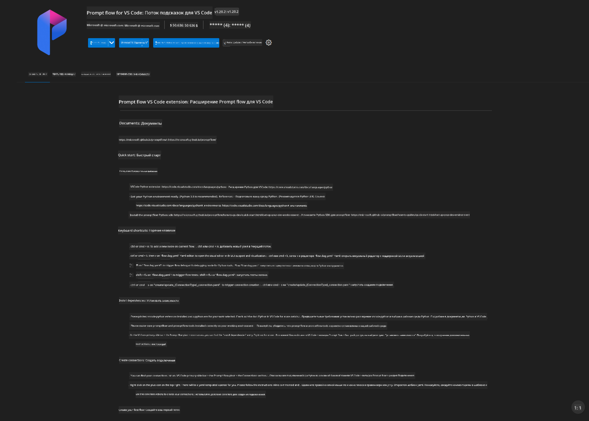
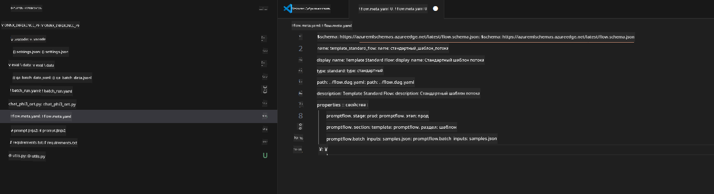
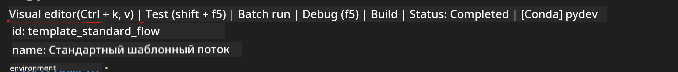
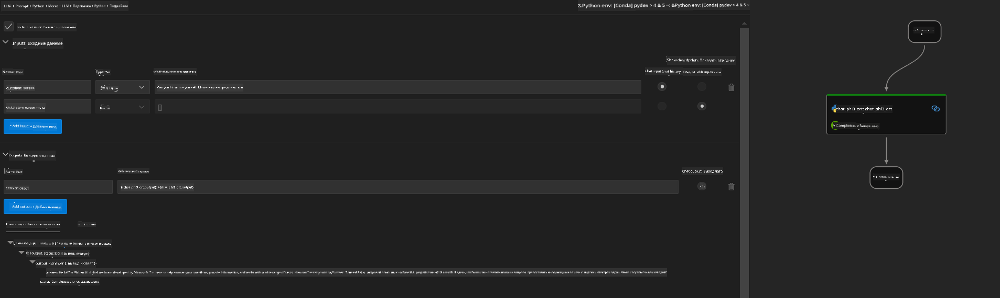

<!--
CO_OP_TRANSLATOR_METADATA:
{
  "original_hash": "92e7dac1e5af0dd7c94170fdaf6860fe",
  "translation_date": "2025-05-07T13:58:58+00:00",
  "source_file": "md/02.Application/01.TextAndChat/Phi3/UsingPromptFlowWithONNX.md",
  "language_code": "ru"
}
-->
# Использование Windows GPU для создания решения Prompt flow с Phi-3.5-Instruct ONNX

В этом документе приведён пример использования PromptFlow с ONNX (Open Neural Network Exchange) для разработки AI-приложений на основе моделей Phi-3.

PromptFlow — это набор инструментов для разработки, который упрощает полный цикл создания AI-приложений на базе LLM (Large Language Model) — от идеи и прототипирования до тестирования и оценки.

Интегрируя PromptFlow с ONNX, разработчики могут:

- Оптимизировать производительность модели: использовать ONNX для эффективного вывода и развертывания моделей.
- Упростить разработку: применять PromptFlow для управления рабочим процессом и автоматизации рутинных задач.
- Улучшить сотрудничество: обеспечить удобную совместную работу команды через единое окружение для разработки.

**Prompt flow** — это набор инструментов, упрощающий полный цикл создания AI-приложений на базе LLM — от идеи, прототипирования, тестирования и оценки до развёртывания в продакшен и мониторинга. Он значительно облегчает prompt engineering и позволяет создавать LLM-приложения с качеством, готовым для производства.

Prompt flow может подключаться к OpenAI, Azure OpenAI Service и настраиваемым моделям (Huggingface, локальные LLM/SLM). Мы планируем развернуть квантизированную ONNX-модель Phi-3.5 в локальных приложениях. Prompt flow поможет нам лучше спланировать бизнес и реализовать локальные решения на основе Phi-3.5. В этом примере мы объединим ONNX Runtime GenAI Library для создания решения Prompt flow на базе Windows GPU.

## **Установка**

### **ONNX Runtime GenAI для Windows GPU**

Прочитайте руководство по установке ONNX Runtime GenAI для Windows GPU [нажмите здесь](./ORTWindowGPUGuideline.md)

### **Настройка Prompt flow в VSCode**

1. Установите расширение Prompt flow для VS Code



2. После установки расширения Prompt flow для VS Code нажмите на него и выберите **Installation dependencies**, следуя этому руководству, установите Prompt flow SDK в вашем окружении


3. Скачайте [пример кода](../../../../../../code/09.UpdateSamples/Aug/pf/onnx_inference_pf) и откройте его в VS Code



4. Откройте **flow.dag.yaml** и выберите ваше Python-окружение


   Откройте **chat_phi3_ort.py** и укажите путь к вашей модели Phi-3.5-instruct ONNX


5. Запустите prompt flow для тестирования

Откройте **flow.dag.yaml**, нажмите визуальный редактор



после этого запустите выполнение для теста



1. Вы также можете запускать пакетные команды в терминале для получения дополнительных результатов


```bash

pf run create --file batch_run.yaml --stream --name 'Your eval qa name'    

```

Результаты можно просмотреть в вашем браузере по умолчанию


**Отказ от ответственности**:  
Этот документ был переведен с помощью сервиса автоматического перевода [Co-op Translator](https://github.com/Azure/co-op-translator). Несмотря на наши усилия по обеспечению точности, имейте в виду, что автоматические переводы могут содержать ошибки или неточности. Оригинальный документ на его исходном языке следует считать авторитетным источником. Для получения критически важной информации рекомендуется обращаться к профессиональному переводу, выполненному человеком. Мы не несем ответственности за любые недоразумения или неправильные толкования, возникшие в результате использования данного перевода.