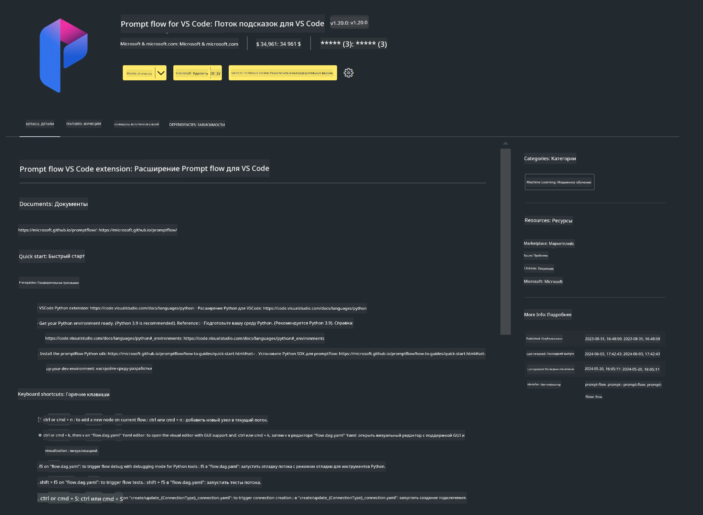

<!--
CO_OP_TRANSLATOR_METADATA:
{
  "original_hash": "a4ef39027902e82f2c33d568d2a2259a",
  "translation_date": "2025-05-07T13:51:36+00:00",
  "source_file": "md/02.Application/02.Code/Phi3/VSCodeExt/HOL/AIPC/01.Installations.md",
  "language_code": "ru"
}
-->
# **Лабораторная работа 0 - Установка**

При входе в лабораторную работу необходимо настроить соответствующую среду:

### **1. Python 3.11+**

Рекомендуется использовать miniforge для настройки вашей среды Python.

Для настройки miniforge обратитесь к [https://github.com/conda-forge/miniforge](https://github.com/conda-forge/miniforge)

После настройки miniforge выполните следующую команду в Power Shell

```bash

conda create -n pyenv python==3.11.8 -y

conda activate pyenv

```

### **2. Установка Prompt flow SDK**

В Лабораторной работе 1 мы используем Prompt flow, поэтому необходимо настроить Prompt flow SDK.

```bash

pip install promptflow --upgrade

```

Вы можете проверить promptflow sdk с помощью этой команды

```bash

pf --version

```

### **3. Установка расширения Prompt flow для Visual Studio Code**



### **4. Библиотека ускорения Intel NPU**

Новые процессоры Intel поддерживают NPU. Если вы хотите использовать NPU для локального запуска LLMs / SLMs, можно воспользоваться ***Intel NPU Acceleration Library***. Подробнее можно узнать по ссылке [https://github.com/microsoft/PhiCookBook/blob/main/md/01.Introduction/03/AIPC_Inference.md](https://github.com/microsoft/PhiCookBook/blob/main/md/01.Introduction/03/AIPC_Inference.md).

Установите Intel NPU Acceleration Library в bash

```bash

pip install intel-npu-acceleration-library

```

***Note***: Обратите внимание, что эта библиотека поддерживает transformers версии ***4.40.2***, пожалуйста, убедитесь в версии.

### **5. Другие библиотеки Python**

Создайте файл requirements.txt и добавьте в него следующий контент

```txt

notebook
numpy 
scipy 
scikit-learn 
matplotlib 
pandas 
pillow 
graphviz

```

### **6. Установка NVM**

Установите nvm в Powershell

```bash

winget install -e --id CoreyButler.NVMforWindows

```

Установите nodejs версии 18.20

```bash

nvm install 18.20.0

nvm use 18.20.0

```

### **7. Установка поддержки разработки для Visual Studio Code**

```bash

npm install --global yo generator-code

```

Поздравляем! Вы успешно настроили SDK. Далее переходите к практическим шагам.

**Отказ от ответственности**:  
Этот документ был переведен с использованием сервиса машинного перевода [Co-op Translator](https://github.com/Azure/co-op-translator). Несмотря на наши усилия по обеспечению точности, просим учитывать, что автоматический перевод может содержать ошибки или неточности. Оригинальный документ на исходном языке следует считать авторитетным источником. Для критически важной информации рекомендуется обратиться к профессиональному переводу, выполненному человеком. Мы не несем ответственности за любые недоразумения или неправильные толкования, возникшие в результате использования данного перевода.