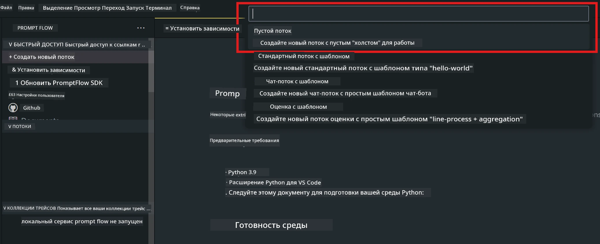
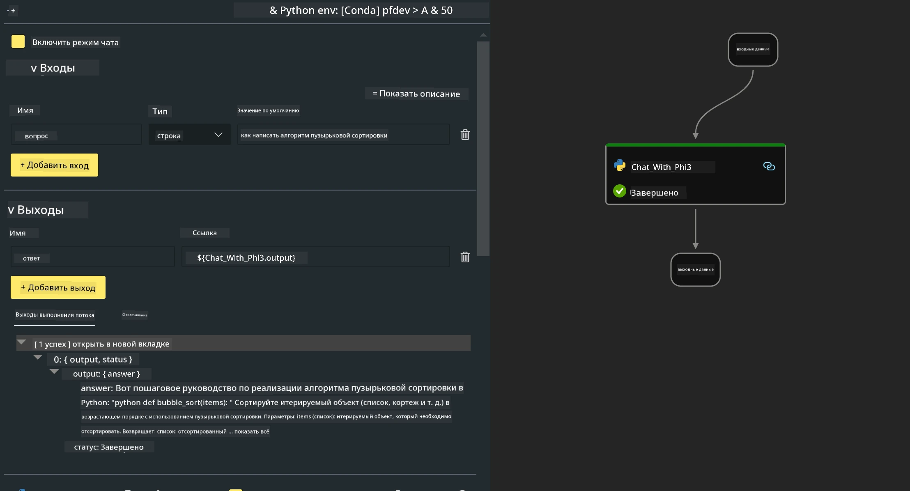

<!--
CO_OP_TRANSLATOR_METADATA:
{
  "original_hash": "bc29f7fe7fc16bed6932733eac8c81b8",
  "translation_date": "2025-07-17T03:54:18+00:00",
  "source_file": "md/02.Application/02.Code/Phi3/VSCodeExt/HOL/AIPC/02.PromptflowWithNPU.md",
  "language_code": "ru"
}
-->
# **Лабораторная работа 2 - Запуск Prompt flow с Phi-3-mini на AIPC**

## **Что такое Prompt flow**

Prompt flow — это набор инструментов для разработки, созданный для упрощения полного цикла создания AI-приложений на базе LLM: от идеи, прототипирования, тестирования и оценки до развертывания в продакшн и мониторинга. Он значительно облегчает работу с prompt-инжинирингом и позволяет создавать LLM-приложения с качеством, готовым к промышленному использованию.

С помощью prompt flow вы сможете:

- Создавать потоки, которые связывают LLM, промпты, Python-код и другие инструменты в единую исполняемую цепочку.

- Отлаживать и улучшать ваши потоки, особенно взаимодействие с LLM, без лишних сложностей.

- Оценивать ваши потоки, рассчитывать метрики качества и производительности на больших наборах данных.

- Интегрировать тестирование и оценку в вашу CI/CD систему для обеспечения качества потока.

- Развёртывать ваши потоки на выбранной платформе или легко интегрировать их в код вашего приложения.

- (Опционально, но настоятельно рекомендуется) Работать в команде, используя облачную версию Prompt flow в Azure AI.

## **Что такое AIPC**

AI PC — это компьютер с CPU, GPU и NPU, каждый из которых обладает специфическими возможностями для ускорения AI-задач. NPU (нейронный процессор) — специализированный ускоритель, который обрабатывает задачи искусственного интеллекта и машинного обучения прямо на вашем ПК, без необходимости отправлять данные в облако. GPU и CPU тоже могут выполнять эти задачи, но NPU особенно эффективен для энергоэффективных AI-вычислений. AI PC представляет собой фундаментальный сдвиг в работе наших компьютеров. Это не решение для ранее не существовавшей проблемы, а значительное улучшение для повседневного использования ПК.

Как это работает? В отличие от генеративного AI и огромных больших языковых моделей (LLM), обученных на огромных объемах публичных данных, AI, работающий на вашем ПК, становится доступнее практически на всех уровнях. Концепция проще для понимания, а поскольку модель обучена на ваших данных и не требует доступа к облаку, преимущества становятся более очевидными и привлекательными для широкой аудитории.

В ближайшем будущем AI PC будет включать персональных ассистентов и небольшие AI-модели, работающие непосредственно на вашем ПК, используя ваши данные для персональных, приватных и более безопасных AI-улучшений в повседневных задачах — ведение протоколов встреч, организация фэнтези-футбольной лиги, автоматизация улучшений фото- и видеоредактирования или составление идеального маршрута для семейной встречи с учётом времени прибытия и отъезда всех участников.

## **Создание потоков генерации кода на AIPC**

***Note*** ：Если вы ещё не завершили установку окружения, пожалуйста, посетите [Lab 0 - Installations](./01.Installations.md)

1. Откройте расширение Prompt flow в Visual Studio Code и создайте пустой проект потока



2. Добавьте параметры Inputs и Outputs, а также добавьте Python-код как новый поток



Вы можете использовать эту структуру (flow.dag.yaml) для построения вашего потока

```yaml

inputs:
  question:
    type: string
    default: how to write Bubble Algorithm
outputs:
  answer:
    type: string
    reference: ${Chat_With_Phi3.output}
nodes:
- name: Chat_With_Phi3
  type: python
  source:
    type: code
    path: Chat_With_Phi3.py
  inputs:
    question: ${inputs.question}


```

3. Добавьте код в ***Chat_With_Phi3.py***

```python


from promptflow.core import tool

# import torch
from transformers import AutoTokenizer, pipeline,TextStreamer
import intel_npu_acceleration_library as npu_lib

import warnings

import asyncio
import platform

class Phi3CodeAgent:
    
    model = None
    tokenizer = None
    text_streamer = None
    
    model_id = "microsoft/Phi-3-mini-4k-instruct"

    @staticmethod
    def init_phi3():
        
        if Phi3CodeAgent.model is None or Phi3CodeAgent.tokenizer is None or Phi3CodeAgent.text_streamer is None:
            Phi3CodeAgent.model = npu_lib.NPUModelForCausalLM.from_pretrained(
                                    Phi3CodeAgent.model_id,
                                    torch_dtype="auto",
                                    dtype=npu_lib.int4,
                                    trust_remote_code=True
                                )
            Phi3CodeAgent.tokenizer = AutoTokenizer.from_pretrained(Phi3CodeAgent.model_id)
            Phi3CodeAgent.text_streamer = TextStreamer(Phi3CodeAgent.tokenizer, skip_prompt=True)

    

    @staticmethod
    def chat_with_phi3(prompt):
        
        Phi3CodeAgent.init_phi3()

        messages = "<|system|>You are a AI Python coding assistant. Please help me to generate code in Python.The answer only genertated Python code, but any comments and instructions do not need to be generated<|end|><|user|>" + prompt +"<|end|><|assistant|>"


        generation_args = {
            "max_new_tokens": 1024,
            "return_full_text": False,
            "temperature": 0.3,
            "do_sample": False,
            "streamer": Phi3CodeAgent.text_streamer,
        }

        pipe = pipeline(
            "text-generation",
            model=Phi3CodeAgent.model,
            tokenizer=Phi3CodeAgent.tokenizer,
            # **generation_args
        )

        result = ''

        with warnings.catch_warnings():
            warnings.simplefilter("ignore")
            response = pipe(messages, **generation_args)
            result =response[0]['generated_text']
            return result


@tool
def my_python_tool(question: str) -> str:
    if platform.system() == 'Windows':
        asyncio.set_event_loop_policy(asyncio.WindowsSelectorEventLoopPolicy())
    return Phi3CodeAgent.chat_with_phi3(question)


```

4. Вы можете протестировать поток через Debug или Run, чтобы проверить корректность генерации кода


5. Запустите поток как API для разработки в терминале

```

pf flow serve --source ./ --port 8080 --host localhost   

```

Вы можете протестировать его в Postman / Thunder Client

### **Note**

1. Первый запуск занимает много времени. Рекомендуется скачать модель phi-3 через Hugging face CLI.

2. Учитывая ограниченные вычислительные возможности Intel NPU, рекомендуется использовать Phi-3-mini-4k-instruct.

3. Мы используем Intel NPU Acceleration для квантизации с преобразованием в INT4, но если вы перезапускаете сервис, необходимо удалить папки cache и nc_workshop.

## **Ресурсы**

1. Изучить Promptflow [https://microsoft.github.io/promptflow/](https://microsoft.github.io/promptflow/)

2. Изучить Intel NPU Acceleration [https://github.com/intel/intel-npu-acceleration-library](https://github.com/intel/intel-npu-acceleration-library)

3. Пример кода, скачать [Local NPU Agent Sample Code](../../../../../../../../../code/07.Lab/01/AIPC)

**Отказ от ответственности**:  
Этот документ был переведен с помощью сервиса автоматического перевода [Co-op Translator](https://github.com/Azure/co-op-translator). Несмотря на наши усилия по обеспечению точности, просим учитывать, что автоматический перевод может содержать ошибки или неточности. Оригинальный документ на его исходном языке следует считать авторитетным источником. Для получения критически важной информации рекомендуется обращаться к профессиональному переводу, выполненному человеком. Мы не несем ответственности за любые недоразумения или неправильные толкования, возникшие в результате использования данного перевода.