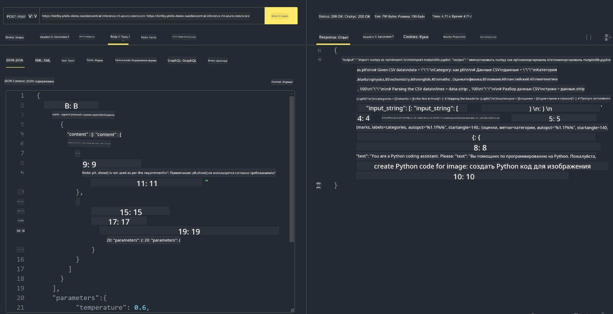

<!--
CO_OP_TRANSLATOR_METADATA:
{
  "original_hash": "20cb4e6ac1686248e8be913ccf6c2bc2",
  "translation_date": "2025-07-17T04:03:56+00:00",
  "source_file": "md/02.Application/02.Code/Phi3/VSCodeExt/HOL/AIPC/03.DeployPhi3VisionOnAzure.md",
  "language_code": "ru"
}
-->
# **Лабораторная работа 3 – Развертывание Phi-3-vision в Azure Machine Learning Service**

Мы используем NPU для выполнения промышленного развертывания локального кода, а затем хотим добавить возможность интеграции PHI-3-VISION, чтобы преобразовывать изображения в код.

В этом руководстве мы быстро создадим сервис Model As Service Phi-3 Vision в Azure Machine Learning Service.

***Note***: Phi-3 Vision требует вычислительных ресурсов для более быстрой генерации контента. Для этого нам нужна облачная вычислительная мощность.


### **1. Создание Azure Machine Learning Service**

Необходимо создать Azure Machine Learning Service в портале Azure. Если хотите узнать, как это сделать, посетите эту ссылку [https://learn.microsoft.com/azure/machine-learning/quickstart-create-resources?view=azureml-api-2](https://learn.microsoft.com/azure/machine-learning/quickstart-create-resources?view=azureml-api-2)


### **2. Выбор Phi-3 Vision в Azure Machine Learning Service**


### **3. Развертывание Phi-3-Vision в Azure**


### **4. Тестирование Endpoint в Postman**





***Note***

1. Передаваемые параметры должны включать Authorization, azureml-model-deployment и Content-Type. Их можно получить, проверив информацию о развертывании.

2. Для передачи параметров Phi-3-Vision необходимо передать ссылку на изображение. Обратитесь к методу GPT-4-Vision для передачи параметров, например

```json

{
  "input_data":{
    "input_string":[
      {
        "role":"user",
        "content":[ 
          {
            "type": "text",
            "text": "You are a Python coding assistant.Please create Python code for image "
          },
          {
              "type": "image_url",
              "image_url": {
                "url": "https://ajaytech.co/wp-content/uploads/2019/09/index.png"
              }
          }
        ]
      }
    ],
    "parameters":{
          "temperature": 0.6,
          "top_p": 0.9,
          "do_sample": false,
          "max_new_tokens": 2048
    }
  }
}

```

3. Вызовите **/score** с помощью метода Post

**Поздравляем**! Вы успешно завершили быстрое развертывание PHI-3-VISION и попробовали, как с помощью изображений генерировать код. Далее мы можем создавать приложения, сочетая NPU и облачные технологии.

**Отказ от ответственности**:  
Этот документ был переведен с помощью сервиса автоматического перевода [Co-op Translator](https://github.com/Azure/co-op-translator). Несмотря на наши усилия по обеспечению точности, просим учитывать, что автоматический перевод может содержать ошибки или неточности. Оригинальный документ на его исходном языке следует считать авторитетным источником. Для получения критически важной информации рекомендуется обращаться к профессиональному переводу, выполненному человеком. Мы не несем ответственности за любые недоразумения или неправильные толкования, возникшие в результате использования данного перевода.