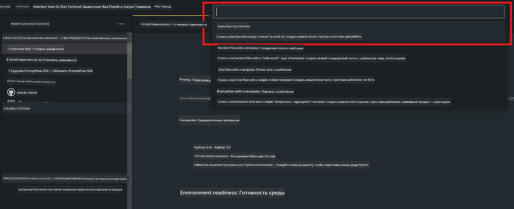
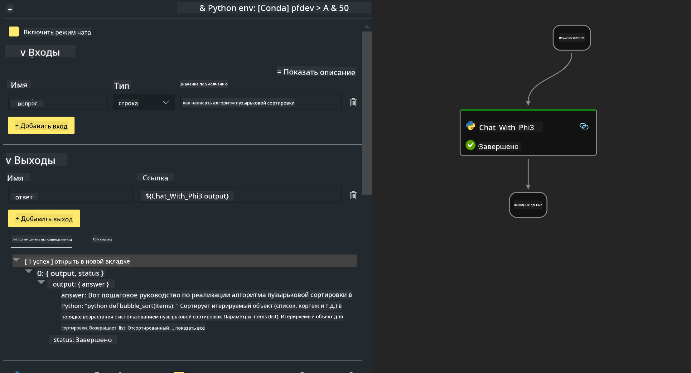

<!--
CO_OP_TRANSLATOR_METADATA:
{
  "original_hash": "3dbbf568625b1ee04b354c2dc81d3248",
  "translation_date": "2025-05-07T13:53:10+00:00",
  "source_file": "md/02.Application/02.Code/Phi3/VSCodeExt/HOL/Apple/02.PromptflowWithMLX.md",
  "language_code": "ru"
}
-->
# **Лабораторная работа 2 - Запуск Prompt flow с Phi-3-mini в AIPC**

## **Что такое Prompt flow**

Prompt flow — это набор инструментов для разработки, предназначенный для упрощения полного цикла создания AI-приложений на базе LLM — от идеи, прототипирования, тестирования, оценки до развертывания в продакшн и мониторинга. Он значительно облегчает создание prompt’ов и позволяет строить приложения с LLM промышленного уровня.

С помощью Prompt flow вы сможете:

- Создавать потоки, связывающие LLM, prompt’ы, Python-код и другие инструменты в едином исполняемом рабочем процессе.

- Отлаживать и улучшать ваши потоки, особенно взаимодействие с LLM, с легкостью.

- Оценивать потоки, рассчитывать метрики качества и производительности на больших наборах данных.

- Интегрировать тестирование и оценку в вашу CI/CD систему для обеспечения качества потока.

- Разворачивать потоки на выбранной платформе обслуживания или легко интегрировать в код вашего приложения.

- (Опционально, но настоятельно рекомендуется) Работать в команде, используя облачную версию Prompt flow в Azure AI.


## **Создание потоков генерации кода на Apple Silicon**

***Note*** ：Если вы еще не установили окружение, пожалуйста, посетите [Lab 0 - Installations](./01.Installations.md)

1. Откройте расширение Prompt flow в Visual Studio Code и создайте пустой проект потока



2. Добавьте параметры Inputs и Outputs и добавьте Python-код как новый поток




Вы можете использовать эту структуру (flow.dag.yaml) для построения вашего потока

```yaml

inputs:
  prompt:
    type: string
    default: Write python code for Fibonacci serie. Please use markdown as output
outputs:
  result:
    type: string
    reference: ${gen_code_by_phi3.output}
nodes:
- name: gen_code_by_phi3
  type: python
  source:
    type: code
    path: gen_code_by_phi3.py
  inputs:
    prompt: ${inputs.prompt}


```

3. Квантификация phi-3-mini

Мы хотим лучше запускать SLM на локальных устройствах. Обычно мы квантифицируем модель (INT4, FP16, FP32)


```bash

python -m mlx_lm.convert --hf-path microsoft/Phi-3-mini-4k-instruct

```

**Note:** папка по умолчанию — mlx_model

4. Добавьте код в ***Chat_With_Phi3.py***


```python


from promptflow import tool

from mlx_lm import load, generate


# The inputs section will change based on the arguments of the tool function, after you save the code
# Adding type to arguments and return value will help the system show the types properly
# Please update the function name/signature per need
@tool
def my_python_tool(prompt: str) -> str:

    model_id = './mlx_model_phi3_mini'

    model, tokenizer = load(model_id)

    # <|user|>\nWrite python code for Fibonacci serie. Please use markdown as output<|end|>\n<|assistant|>

    response = generate(model, tokenizer, prompt="<|user|>\n" + prompt  + "<|end|>\n<|assistant|>", max_tokens=2048, verbose=True)

    return response


```

4. Вы можете протестировать поток через Debug или Run, чтобы проверить, правильно ли работает генерация кода


5. Запустите поток как API для разработки в терминале

```

pf flow serve --source ./ --port 8080 --host localhost   

```

Вы можете протестировать его в Postman / Thunder Client


### **Note**

1. Первый запуск занимает много времени. Рекомендуется скачать модель phi-3 через Hugging face CLI.

2. Учитывая ограниченную вычислительную мощность Intel NPU, рекомендуется использовать Phi-3-mini-4k-instruct

3. Мы используем Intel NPU Acceleration для квантификации в INT4, но при повторном запуске сервиса необходимо удалить папки cache и nc_workshop.


## **Ресурсы**

1. Изучение Promptflow [https://microsoft.github.io/promptflow/](https://microsoft.github.io/promptflow/)

2. Изучение Intel NPU Acceleration [https://github.com/intel/intel-npu-acceleration-library](https://github.com/intel/intel-npu-acceleration-library)

3. Пример кода, скачать [Local NPU Agent Sample Code](../../../../../../../../../code/07.Lab/01/AIPC/local-npu-agent)

**Отказ от ответственности**:  
Этот документ был переведен с использованием сервиса автоматического перевода [Co-op Translator](https://github.com/Azure/co-op-translator). Несмотря на наши усилия по обеспечению точности, имейте в виду, что автоматический перевод может содержать ошибки или неточности. Оригинальный документ на его исходном языке следует считать авторитетным источником. Для критически важной информации рекомендуется профессиональный перевод человеком. Мы не несем ответственности за любые недоразумения или неправильные толкования, возникшие в результате использования данного перевода.