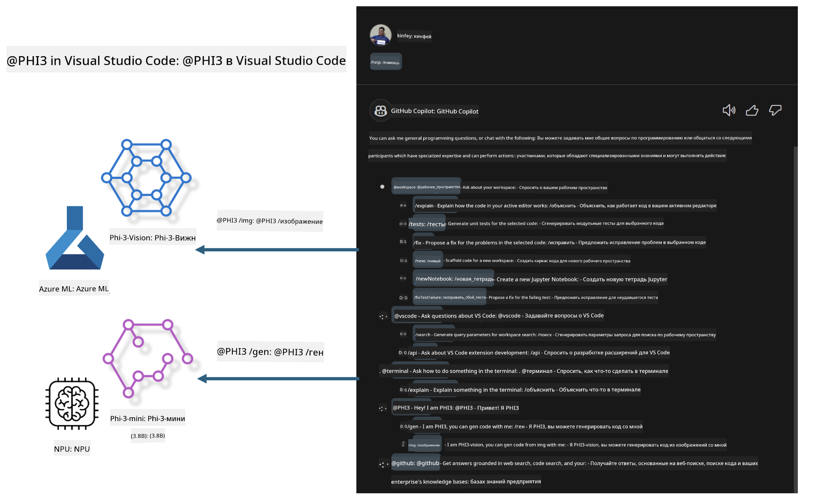

<!--
CO_OP_TRANSLATOR_METADATA:
{
  "original_hash": "00b7a699de8ac405fa821f4c0f7fc0ab",
  "translation_date": "2025-07-17T03:33:12+00:00",
  "source_file": "md/02.Application/02.Code/Phi3/VSCodeExt/README.md",
  "language_code": "ru"
}
-->
# **Создайте собственный чат GitHub Copilot для Visual Studio Code с семейством Microsoft Phi-3**

Вы уже использовали агент рабочего пространства в GitHub Copilot Chat? Хотите создать собственного агента для вашей команды? Этот практический курс поможет объединить открытые модели для создания корпоративного бизнес-агента по работе с кодом.

## **Основы**

### **Почему стоит выбрать Microsoft Phi-3**

Phi-3 — это семейство моделей, включающее phi-3-mini, phi-3-small и phi-3-medium, которые отличаются параметрами обучения для генерации текста, диалогов и кода. Также есть phi-3-vision, основанная на Vision. Эти модели подходят для предприятий и команд, желающих создавать офлайн-решения с генеративным ИИ.

Рекомендуется ознакомиться с этой ссылкой [https://github.com/microsoft/PhiCookBook/blob/main/md/01.Introduction/01/01.PhiFamily.md](https://github.com/microsoft/PhiCookBook/blob/main/md/01.Introduction/01/01.PhiFamily.md)

### **Microsoft GitHub Copilot Chat**

Расширение GitHub Copilot Chat предоставляет интерфейс чата, который позволяет взаимодействовать с GitHub Copilot и получать ответы на вопросы, связанные с программированием, прямо в VS Code, без необходимости искать документацию или просматривать форумы.

Copilot Chat может использовать подсветку синтаксиса, отступы и другие элементы форматирования для улучшения читаемости ответов. В зависимости от типа вопроса, результат может содержать ссылки на контекст, который Copilot использовал для генерации ответа, например, исходные файлы или документацию, а также кнопки для доступа к функциям VS Code.

- Copilot Chat интегрируется в ваш рабочий процесс и помогает там, где это нужно:

- Начинайте чат прямо из редактора или терминала, чтобы получить помощь во время кодирования

- Используйте окно чата, чтобы иметь AI-ассистента под рукой в любое время

- Запускайте Quick Chat для быстрого вопроса и возвращайтесь к работе

GitHub Copilot Chat можно использовать в различных сценариях, например:

- Ответы на вопросы по программированию и оптимальным способам решения задач

- Объяснение чужого кода и предложения по улучшению

- Предложение исправлений кода

- Генерация юнит-тестов

- Создание документации к коду

Рекомендуется ознакомиться с этой ссылкой [https://code.visualstudio.com/docs/copilot/copilot-chat](https://code.visualstudio.com/docs/copilot/copilot-chat?WT.mc_id=aiml-137032-kinfeylo)

### **Microsoft GitHub Copilot Chat @workspace**

Использование **@workspace** в Copilot Chat позволяет задавать вопросы по всему вашему коду. В зависимости от вопроса, Copilot умно находит нужные файлы и символы, которые затем вставляет в ответ в виде ссылок и примеров кода.

Для ответа на ваш вопрос **@workspace** просматривает те же источники, что и разработчик при навигации по коду в VS Code:

- Все файлы в рабочем пространстве, кроме тех, что игнорируются файлом .gitignore

- Структуру каталогов с вложенными папками и файлами

- Индекс поиска кода GitHub, если рабочее пространство — это репозиторий GitHub, индексируемый поиском кода

- Символы и определения в рабочем пространстве

- Текущий выделенный текст или видимый текст в активном редакторе

Примечание: .gitignore игнорируется, если у вас открыт файл или выделен текст внутри игнорируемого файла.

Рекомендуется ознакомиться с этой ссылкой [[https://code.visualstudio.com/docs/copilot/copilot-chat](https://code.visualstudio.com/docs/copilot/workspace-context?WT.mc_id=aiml-137032-kinfeylo)]

## **Подробнее о лабораторной работе**

GitHub Copilot значительно повысил эффективность программирования в компаниях, и каждая организация хочет настроить функции Copilot под свои нужды. Многие предприятия создают собственные расширения, похожие на GitHub Copilot, на основе своих бизнес-сценариев и открытых моделей. Для компаний такие кастомные расширения проще контролировать, но это может повлиять на пользовательский опыт. Ведь GitHub Copilot обладает более мощными возможностями для работы с общими сценариями и профессиональными задачами. Если удастся сохранить единый опыт использования, то лучше создавать собственное расширение. GitHub Copilot Chat предоставляет API для расширения возможностей чата в корпоративных решениях. Поддержание единого опыта и наличие кастомных функций — залог лучшего пользовательского опыта.

В этой лабораторной работе используется модель Phi-3 в сочетании с локальным NPU и гибридом Azure для создания кастомного агента в GitHub Copilot Chat ***@PHI3***, который помогает разработчикам генерировать код ***(@PHI3 /gen)*** и создавать код на основе изображений ***(@PHI3 /img)***.

### ***Примечание:***

В данный момент лабораторная работа реализована на AIPC с процессорами Intel и Apple Silicon. В дальнейшем планируется обновление для версии Qualcomm NPU.

## **Лабораторные работы**

| Название | Описание | AIPC | Apple |
| ------------ | ----------- | -------- |-------- |
| Lab0 - Установка (✅) | Настройка и установка необходимых сред и инструментов | [Перейти](./HOL/AIPC/01.Installations.md) | [Перейти](./HOL/Apple/01.Installations.md) |
| Lab1 - Запуск Prompt flow с Phi-3-mini (✅) | Использование локального NPU с AIPC / Apple Silicon для генерации кода через Phi-3-mini | [Перейти](./HOL/AIPC/02.PromptflowWithNPU.md) | [Перейти](./HOL/Apple/02.PromptflowWithMLX.md) |
| Lab2 - Развертывание Phi-3-vision в Azure Machine Learning Service (✅) | Генерация кода с помощью развертывания модели Phi-3-vision из каталога Azure Machine Learning Service | [Перейти](./HOL/AIPC/03.DeployPhi3VisionOnAzure.md) | [Перейти](./HOL/Apple/03.DeployPhi3VisionOnAzure.md) |
| Lab3 - Создание агента @phi-3 в GitHub Copilot Chat (✅) | Создание кастомного агента Phi-3 в GitHub Copilot Chat для генерации кода, графов, RAG и др. | [Перейти](./HOL/AIPC/04.CreatePhi3AgentInVSCode.md) | [Перейти](./HOL/Apple/04.CreatePhi3AgentInVSCode.md) |
| Пример кода (✅) | Скачать пример кода | [Перейти](../../../../../../../code/07.Lab/01/AIPC) | [Перейти](../../../../../../../code/07.Lab/01/Apple) |

## **Ресурсы**

1. Phi-3 Cookbook [https://github.com/microsoft/Phi-3CookBook](https://github.com/microsoft/Phi-3CookBook)

2. Подробнее о GitHub Copilot [https://learn.microsoft.com/training/paths/copilot/](https://learn.microsoft.com/training/paths/copilot/?WT.mc_id=aiml-137032-kinfeylo)

3. Подробнее о GitHub Copilot Chat [https://learn.microsoft.com/training/paths/accelerate-app-development-using-github-copilot/](https://learn.microsoft.com/training/paths/accelerate-app-development-using-github-copilot/?WT.mc_id=aiml-137032-kinfeylo)

4. Подробнее о GitHub Copilot Chat API [https://code.visualstudio.com/api/extension-guides/chat](https://code.visualstudio.com/api/extension-guides/chat?WT.mc_id=aiml-137032-kinfeylo)

5. Подробнее о Azure AI Foundry [https://learn.microsoft.com/training/paths/create-custom-copilots-ai-studio/](https://learn.microsoft.com/training/paths/create-custom-copilots-ai-studio/?WT.mc_id=aiml-137032-kinfeylo)

6. Подробнее о каталоге моделей Azure AI Foundry [https://learn.microsoft.com/azure/ai-studio/how-to/model-catalog-overview](https://learn.microsoft.com/azure/ai-studio/how-to/model-catalog-overview)

**Отказ от ответственности**:  
Этот документ был переведен с помощью сервиса автоматического перевода [Co-op Translator](https://github.com/Azure/co-op-translator). Несмотря на наши усилия по обеспечению точности, просим учитывать, что автоматический перевод может содержать ошибки или неточности. Оригинальный документ на его исходном языке следует считать авторитетным источником. Для получения критически важной информации рекомендуется обращаться к профессиональному переводу, выполненному человеком. Мы не несем ответственности за любые недоразумения или неправильные толкования, возникшие в результате использования данного перевода.