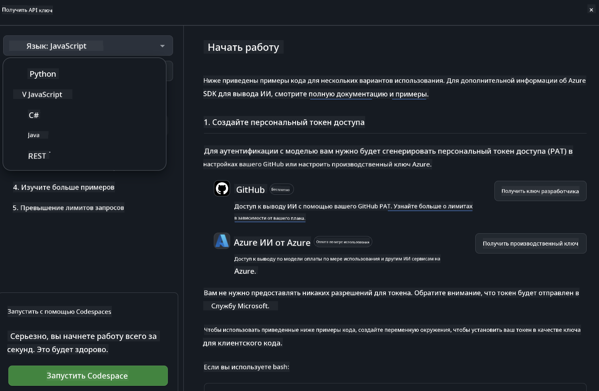

<!--
CO_OP_TRANSLATOR_METADATA:
{
  "original_hash": "5113634b77370af6790f9697d5d7de90",
  "translation_date": "2025-05-07T13:07:56+00:00",
  "source_file": "md/02.QuickStart/GitHubModel_QuickStart.md",
  "language_code": "ru"
}
-->
## GitHub Models - Ограниченная публичная бета

Добро пожаловать в [GitHub Models](https://github.com/marketplace/models)! Мы подготовили всё необходимое, чтобы вы могли исследовать AI-модели, размещённые на Azure AI.


Для получения дополнительной информации о доступных моделях на GitHub Models посетите [GitHub Model Marketplace](https://github.com/marketplace/models)

## Доступные модели

Каждая модель имеет собственную площадку для тестирования и пример кода


### Модели Phi-3 в каталоге GitHub Models

[Phi-3-Medium-128k-Instruct](https://github.com/marketplace/models/azureml/Phi-3-medium-128k-instruct)

[Phi-3-medium-4k-instruct](https://github.com/marketplace/models/azureml/Phi-3-medium-4k-instruct)

[Phi-3-mini-128k-instruct](https://github.com/marketplace/models/azureml/Phi-3-mini-128k-instruct)

[Phi-3-mini-4k-instruct](https://github.com/marketplace/models/azureml/Phi-3-mini-4k-instruct)

[Phi-3-small-128k-instruct](https://github.com/marketplace/models/azureml/Phi-3-small-128k-instruct)

[Phi-3-small-8k-instruct](https://github.com/marketplace/models/azureml/Phi-3-small-8k-instruct)

## Начало работы

Есть несколько простых примеров, которые вы можете сразу запустить. Их можно найти в папке samples. Если хотите сразу перейти к любимому языку программирования, примеры доступны на следующих языках:

- Python
- JavaScript
- cURL

Также есть специальная среда Codespaces для запуска примеров и моделей.



## Пример кода

Ниже приведены примеры кода для нескольких сценариев использования. Для дополнительной информации об Azure AI Inference SDK смотрите полную документацию и примеры.

## Настройка

1. Создайте персональный токен доступа  
Вам не нужно давать токену никаких прав. Обратите внимание, что токен будет отправлен в сервис Microsoft.

Чтобы использовать приведённые ниже примеры кода, создайте переменную окружения и установите в ней ваш токен как ключ для клиентского кода.

Если вы используете bash:  
```
export GITHUB_TOKEN="<your-github-token-goes-here>"
```  
Если вы используете powershell:  

```
$Env:GITHUB_TOKEN="<your-github-token-goes-here>"
```  

Если вы используете командную строку Windows:  

```
set GITHUB_TOKEN=<your-github-token-goes-here>
```

## Пример на Python

### Установка зависимостей  
Установите Azure AI Inference SDK с помощью pip (требуется Python версии 3.8 и выше):

```
pip install azure-ai-inference
```  
### Запуск базового примера кода

Этот пример показывает базовый вызов API для завершения чата. Используется endpoint GitHub AI model inference и ваш GitHub токен. Вызов синхронный.

```
import os
from azure.ai.inference import ChatCompletionsClient
from azure.ai.inference.models import SystemMessage, UserMessage
from azure.core.credentials import AzureKeyCredential

endpoint = "https://models.inference.ai.azure.com"
# Replace Model_Name 
model_name = "Phi-3-small-8k-instruct"
token = os.environ["GITHUB_TOKEN"]

client = ChatCompletionsClient(
    endpoint=endpoint,
    credential=AzureKeyCredential(token),
)

response = client.complete(
    messages=[
        SystemMessage(content="You are a helpful assistant."),
        UserMessage(content="What is the capital of France?"),
    ],
    model=model_name,
    temperature=1.,
    max_tokens=1000,
    top_p=1.
)

print(response.choices[0].message.content)
```

### Запуск многошагового диалога

В этом примере демонстрируется многошаговый диалог с API завершения чата. При использовании модели для чат-приложения вам нужно будет управлять историей диалога и отправлять модели последние сообщения.

```
import os
from azure.ai.inference import ChatCompletionsClient
from azure.ai.inference.models import AssistantMessage, SystemMessage, UserMessage
from azure.core.credentials import AzureKeyCredential

token = os.environ["GITHUB_TOKEN"]
endpoint = "https://models.inference.ai.azure.com"
# Replace Model_Name
model_name = "Phi-3-small-8k-instruct"

client = ChatCompletionsClient(
    endpoint=endpoint,
    credential=AzureKeyCredential(token),
)

messages = [
    SystemMessage(content="You are a helpful assistant."),
    UserMessage(content="What is the capital of France?"),
    AssistantMessage(content="The capital of France is Paris."),
    UserMessage(content="What about Spain?"),
]

response = client.complete(messages=messages, model=model_name)

print(response.choices[0].message.content)
```

### Потоковый вывод

Для лучшего пользовательского опыта рекомендуется потоково выводить ответ модели, чтобы первый токен появлялся как можно раньше и не приходилось ждать весь ответ целиком.

```
import os
from azure.ai.inference import ChatCompletionsClient
from azure.ai.inference.models import SystemMessage, UserMessage
from azure.core.credentials import AzureKeyCredential

token = os.environ["GITHUB_TOKEN"]
endpoint = "https://models.inference.ai.azure.com"
# Replace Model_Name
model_name = "Phi-3-small-8k-instruct"

client = ChatCompletionsClient(
    endpoint=endpoint,
    credential=AzureKeyCredential(token),
)

response = client.complete(
    stream=True,
    messages=[
        SystemMessage(content="You are a helpful assistant."),
        UserMessage(content="Give me 5 good reasons why I should exercise every day."),
    ],
    model=model_name,
)

for update in response:
    if update.choices:
        print(update.choices[0].delta.content or "", end="")

client.close()
```

## JavaScript

### Установка зависимостей

Установите Node.js.

Скопируйте следующие строки и сохраните их в файл package.json в вашей папке.

```
{
  "type": "module",
  "dependencies": {
    "@azure-rest/ai-inference": "latest",
    "@azure/core-auth": "latest",
    "@azure/core-sse": "latest"
  }
}
```

Примечание: @azure/core-sse требуется только при потоковой передаче ответов завершения чата.

Откройте терминал в этой папке и выполните npm install.

Для каждого из приведённых ниже примеров скопируйте содержимое в файл sample.js и запустите node sample.js.

### Запуск базового примера кода

Этот пример демонстрирует базовый вызов API для завершения чата. Используется endpoint GitHub AI model inference и ваш GitHub токен. Вызов синхронный.

```
import ModelClient from "@azure-rest/ai-inference";
import { AzureKeyCredential } from "@azure/core-auth";

const token = process.env["GITHUB_TOKEN"];
const endpoint = "https://models.inference.ai.azure.com";
// Update your modelname
const modelName = "Phi-3-small-8k-instruct";

export async function main() {

  const client = new ModelClient(endpoint, new AzureKeyCredential(token));

  const response = await client.path("/chat/completions").post({
    body: {
      messages: [
        { role:"system", content: "You are a helpful assistant." },
        { role:"user", content: "What is the capital of France?" }
      ],
      model: modelName,
      temperature: 1.,
      max_tokens: 1000,
      top_p: 1.
    }
  });

  if (response.status !== "200") {
    throw response.body.error;
  }
  console.log(response.body.choices[0].message.content);
}

main().catch((err) => {
  console.error("The sample encountered an error:", err);
});
```

### Запуск многошагового диалога

В этом примере показан многошаговый диалог с API завершения чата. При использовании модели для чат-приложения нужно управлять историей и отправлять последние сообщения модели.

```
import ModelClient from "@azure-rest/ai-inference";
import { AzureKeyCredential } from "@azure/core-auth";

const token = process.env["GITHUB_TOKEN"];
const endpoint = "https://models.inference.ai.azure.com";
// Update your modelname
const modelName = "Phi-3-small-8k-instruct";

export async function main() {

  const client = new ModelClient(endpoint, new AzureKeyCredential(token));

  const response = await client.path("/chat/completions").post({
    body: {
      messages: [
        { role: "system", content: "You are a helpful assistant." },
        { role: "user", content: "What is the capital of France?" },
        { role: "assistant", content: "The capital of France is Paris." },
        { role: "user", content: "What about Spain?" },
      ],
      model: modelName,
    }
  });

  if (response.status !== "200") {
    throw response.body.error;
  }

  for (const choice of response.body.choices) {
    console.log(choice.message.content);
  }
}

main().catch((err) => {
  console.error("The sample encountered an error:", err);
});
```

### Потоковый вывод

Для лучшего пользовательского опыта рекомендуется потоково выводить ответ модели, чтобы первый токен появлялся как можно раньше и не пришлось ждать весь ответ целиком.

```
import ModelClient from "@azure-rest/ai-inference";
import { AzureKeyCredential } from "@azure/core-auth";
import { createSseStream } from "@azure/core-sse";

const token = process.env["GITHUB_TOKEN"];
const endpoint = "https://models.inference.ai.azure.com";
// Update your modelname
const modelName = "Phi-3-small-8k-instruct";

export async function main() {

  const client = new ModelClient(endpoint, new AzureKeyCredential(token));

  const response = await client.path("/chat/completions").post({
    body: {
      messages: [
        { role: "system", content: "You are a helpful assistant." },
        { role: "user", content: "Give me 5 good reasons why I should exercise every day." },
      ],
      model: modelName,
      stream: true
    }
  }).asNodeStream();

  const stream = response.body;
  if (!stream) {
    throw new Error("The response stream is undefined");
  }

  if (response.status !== "200") {
    stream.destroy();
    throw new Error(`Failed to get chat completions, http operation failed with ${response.status} code`);
  }

  const sseStream = createSseStream(stream);

  for await (const event of sseStream) {
    if (event.data === "[DONE]") {
      return;
    }
    for (const choice of (JSON.parse(event.data)).choices) {
        process.stdout.write(choice.delta?.content ?? ``);
    }
  }
}

main().catch((err) => {
  console.error("The sample encountered an error:", err);
});
```

## REST

### Запуск базового примера кода

Вставьте следующий код в оболочку:

```
curl -X POST "https://models.inference.ai.azure.com/chat/completions" \
    -H "Content-Type: application/json" \
    -H "Authorization: Bearer $GITHUB_TOKEN" \
    -d '{
        "messages": [
            {
                "role": "system",
                "content": "You are a helpful assistant."
            },
            {
                "role": "user",
                "content": "What is the capital of France?"
            }
        ],
        "model": "Phi-3-small-8k-instruct"
    }'
```  
### Запуск многошагового диалога

Вызовите API завершения чата и передайте историю диалога:

```
curl -X POST "https://models.inference.ai.azure.com/chat/completions" \
    -H "Content-Type: application/json" \
    -H "Authorization: Bearer $GITHUB_TOKEN" \
    -d '{
        "messages": [
            {
                "role": "system",
                "content": "You are a helpful assistant."
            },
            {
                "role": "user",
                "content": "What is the capital of France?"
            },
            {
                "role": "assistant",
                "content": "The capital of France is Paris."
            },
            {
                "role": "user",
                "content": "What about Spain?"
            }
        ],
        "model": "Phi-3-small-8k-instruct"
    }'
```  
### Потоковый вывод

Пример вызова endpoint с потоковой передачей ответа.

```
curl -X POST "https://models.inference.ai.azure.com/chat/completions" \
    -H "Content-Type: application/json" \
    -H "Authorization: Bearer $GITHUB_TOKEN" \
    -d '{
        "messages": [
            {
                "role": "system",
                "content": "You are a helpful assistant."
            },
            {
                "role": "user",
                "content": "Give me 5 good reasons why I should exercise every day."
            }
        ],
        "stream": true,
        "model": "Phi-3-small-8k-instruct"
    }'
```

## Бесплатное использование и ограничения скорости для GitHub Models


[Ограничения скорости для площадки и бесплатного API](https://docs.github.com/en/github-models/prototyping-with-ai-models#rate-limits) предназначены для того, чтобы вы могли экспериментировать с моделями и создавать прототипы AI-приложений. Для использования за пределами этих лимитов и масштабирования приложения необходимо выделить ресурсы из Azure аккаунта и аутентифицироваться через него, а не через персональный токен GitHub. В остальном менять код не нужно. По этой ссылке вы можете узнать, как выйти за пределы бесплатного тарифа в Azure AI.

### Важные замечания

Помните, что при работе с моделью вы экспериментируете с ИИ, поэтому возможны ошибки в содержании.

Функция имеет различные ограничения (включая количество запросов в минуту, в день, токены на запрос и параллельные запросы) и не предназначена для использования в продакшене.

GitHub Models использует Azure AI Content Safety. Эти фильтры нельзя отключить в рамках работы с GitHub Models. Если вы решите использовать модели через платный сервис, настройте фильтры контента в соответствии с вашими требованиями.

Этот сервис работает на условиях предварительного релиза GitHub.

**Отказ от ответственности**:  
Этот документ был переведен с помощью сервиса автоматического перевода [Co-op Translator](https://github.com/Azure/co-op-translator). Несмотря на наши усилия по обеспечению точности, просим учитывать, что автоматические переводы могут содержать ошибки или неточности. Оригинальный документ на его исходном языке следует считать авторитетным источником. Для получения критически важной информации рекомендуется обращаться к профессиональному переводу, выполненному человеком. Мы не несем ответственности за любые недоразумения или неправильные толкования, возникшие в результате использования данного перевода.