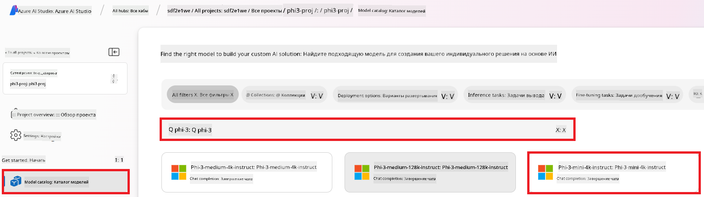

<!--
CO_OP_TRANSLATOR_METADATA:
{
  "original_hash": "c1559c5af6caccf6f623fd43a6b3a9a3",
  "translation_date": "2025-07-17T05:55:17+00:00",
  "source_file": "md/03.FineTuning/FineTuning_AIFoundry.md",
  "language_code": "ru"
}
-->
# Тонкая настройка Phi-3 с помощью Azure AI Foundry

Давайте рассмотрим, как выполнить тонкую настройку языковой модели Phi-3 Mini от Microsoft с помощью Azure AI Foundry. Тонкая настройка позволяет адаптировать Phi-3 Mini под конкретные задачи, делая модель более мощной и контекстно ориентированной.

## Важные моменты

- **Возможности:** Какие модели можно тонко настраивать? Какие задачи можно решать с помощью базовой модели после настройки?
- **Стоимость:** Какова модель ценообразования для тонкой настройки?
- **Настраиваемость:** Насколько можно изменить базовую модель и каким образом?
- **Удобство:** Как происходит процесс тонкой настройки — нужно ли писать собственный код? Нужно ли предоставлять собственные вычислительные ресурсы?
- **Безопасность:** Тонко настроенные модели могут нести риски безопасности — есть ли механизмы защиты от непреднамеренного вреда?


## Подготовка к тонкой настройке

### Требования

> [!NOTE]
> Для моделей семейства Phi-3 предложение по тонкой настройке с оплатой по факту доступно только для хабов, созданных в регионе **East US 2**.

- Подписка Azure. Если у вас нет подписки, создайте [платный аккаунт Azure](https://azure.microsoft.com/pricing/purchase-options/pay-as-you-go), чтобы начать.

- Проект в [AI Foundry](https://ai.azure.com?WT.mc_id=aiml-138114-kinfeylo).
- Для доступа к операциям в Azure AI Foundry используется управление доступом на основе ролей Azure (Azure RBAC). Чтобы выполнить шаги из этой статьи, ваша учетная запись должна иметь роль __Azure AI Developer__ в группе ресурсов.

### Регистрация провайдера подписки

Проверьте, что подписка зарегистрирована для провайдера ресурсов `Microsoft.Network`.

1. Войдите в [портал Azure](https://portal.azure.com).
2. Выберите **Subscriptions** в левом меню.
3. Выберите нужную подписку.
4. В левом меню выберите **AI project settings** > **Resource providers**.
5. Убедитесь, что в списке провайдеров ресурсов есть **Microsoft.Network**. Если нет — добавьте его.

### Подготовка данных

Подготовьте тренировочные и валидационные данные для тонкой настройки модели. Ваши тренировочные и валидационные наборы должны содержать примеры входных и выходных данных, отражающие желаемое поведение модели.

Убедитесь, что все тренировочные примеры соответствуют ожидаемому формату для инференса. Для эффективной тонкой настройки обеспечьте сбалансированность и разнообразие данных.

Это включает поддержание баланса данных, включение различных сценариев и периодическое обновление тренировочных данных для соответствия реальным ожиданиям, что в итоге приводит к более точным и сбалансированным ответам модели.

Разные типы моделей требуют разного формата тренировочных данных.

### Chat Completion

Тренировочные и валидационные данные **должны** быть в формате JSON Lines (JSONL). Для `Phi-3-mini-128k-instruct` набор данных для тонкой настройки должен быть оформлен в формате диалогов, используемом API Chat completions.

### Пример формата файла

```json
    {"messages": [{"role": "system", "content": "You are an Xbox customer support agent whose primary goal is to help users with issues they are experiencing with their Xbox devices. You are friendly and concise. You only provide factual answers to queries, and do not provide answers that are not related to Xbox."}, {"role": "user", "content": "Is Xbox better than PlayStation?"}, {"role": "assistant", "content": "I apologize, but I cannot provide personal opinions. My primary job is to assist you with any issues related to your Xbox device. Do you have any Xbox-related issues that need addressing?"}]}
    {"messages": [{"role": "system", "content": "You are an Xbox customer support agent whose primary goal is to help users with issues they are experiencing with their Xbox devices. You are friendly and concise. You only provide factual answers to queries, and do not provide answers that are not related to Xbox."}, {"role": "user", "content": "Can I play PC games on my Xbox?"}, {"role": "assistant", "content": "While Xbox consoles don't natively support PC games, they can play an array of Xbox games, many of which are also available on PC. Can I assist you with finding games compatible with your Xbox device?"}]}
    {"messages": [{"role": "system", "content": "You are an Xbox customer support agent whose primary goal is to help users with issues they are experiencing with their Xbox devices. You are friendly and concise. You only provide factual answers to queries, and do not provide answers that are not related to Xbox."}, {"role": "user", "content": "I'm having trouble connecting my Xbox to the Wi-Fi."}, {"role": "assistant", "content": "No worries, let's go through the network settings on your Xbox. Can you please tell me what happens when you try to connect it to the Wi-Fi?"}]}
```

Поддерживаемый тип файла — JSON Lines. Файлы загружаются в хранилище по умолчанию и становятся доступными в вашем проекте.

## Тонкая настройка Phi-3 с помощью Azure AI Foundry

Azure AI Foundry позволяет адаптировать крупные языковые модели под ваши собственные данные с помощью процесса, известного как тонкая настройка. Тонкая настройка дает значительные преимущества, позволяя настраивать и оптимизировать модель для конкретных задач и приложений. Это улучшает производительность, снижает затраты, уменьшает задержки и обеспечивает более точные результаты.


### Создание нового проекта

1. Войдите в [Azure AI Foundry](https://ai.azure.com).

2. Нажмите **+New project** для создания нового проекта в Azure AI Foundry.

    

3. Выполните следующие действия:

    - Укажите уникальное имя **Hub name**.
    - Выберите **Hub** для использования (создайте новый, если нужно).

    

4. Для создания нового хаба выполните следующие шаги:

    - Введите уникальное имя **Hub name**.
    - Выберите вашу подписку Azure (**Subscription**).
    - Выберите группу ресурсов (**Resource group**) (создайте новую, если нужно).
    - Выберите регион (**Location**).
    - Выберите подключение к Azure AI Services (создайте новое, если нужно).
    - Для подключения Azure AI Search выберите **Skip connecting**.

    

5. Нажмите **Next**.
6. Нажмите **Create a project**.

### Подготовка данных

Перед тонкой настройкой соберите или создайте набор данных, релевантный вашей задаче, например, инструкции для чата, пары вопрос-ответ или другие текстовые данные. Очистите и предобработайте данные, удалив шум, обработав пропущенные значения и токенизировав текст.

### Тонкая настройка моделей Phi-3 в Azure AI Foundry

> [!NOTE]
> Тонкая настройка моделей Phi-3 в настоящее время поддерживается только для проектов, расположенных в регионе East US 2.

1. Выберите **Model catalog** в левой панели.

2. Введите *phi-3* в строку поиска и выберите нужную модель phi-3.

    

3. Нажмите **Fine-tune**.

    

4. Введите имя для **Fine-tuned model name**.

    

5. Нажмите **Next**.

6. Выполните следующие действия:

    - Выберите тип задачи (**task type**) — **Chat completion**.
    - Выберите тренировочные данные (**Training data**). Их можно загрузить через Azure AI Foundry или из локального окружения.

    

7. Нажмите **Next**.

8. Загрузите валидационные данные (**Validation data**) или выберите **Automatic split of training data**.

    

9. Нажмите **Next**.

10. Выполните следующие действия:

    - Выберите множитель размера батча (**Batch size multiplier**).
    - Выберите скорость обучения (**Learning rate**).
    - Выберите количество эпох (**Epochs**).

    

11. Нажмите **Submit** для запуска процесса тонкой настройки.

    

12. После завершения тонкой настройки статус модели изменится на **Completed**, как показано на изображении ниже. Теперь вы можете развернуть модель и использовать её в собственном приложении, в playground или в prompt flow. Подробнее см. [Как развернуть семейство малых языковых моделей Phi-3 с помощью Azure AI Foundry](https://learn.microsoft.com/azure/ai-studio/how-to/deploy-models-phi-3?tabs=phi-3-5&pivots=programming-language-python).

    

> [!NOTE]
> Для более подробной информации о тонкой настройке Phi-3 посетите страницу [Fine-tune Phi-3 models in Azure AI Foundry](https://learn.microsoft.com/azure/ai-studio/how-to/fine-tune-phi-3?tabs=phi-3-mini).

## Удаление тонко настроенных моделей

Вы можете удалить тонко настроенную модель из списка моделей для тонкой настройки в [Azure AI Foundry](https://ai.azure.com) или со страницы с деталями модели. Выберите модель для удаления на странице тонкой настройки и нажмите кнопку Delete.

> [!NOTE]
> Нельзя удалить пользовательскую модель, если у неё есть активное развертывание. Сначала удалите развертывание модели, затем можно удалить саму модель.

## Стоимость и квоты

### Стоимость и квоты для моделей Phi-3, тонко настроенных как сервис

Модели Phi, тонко настроенные как сервис, предоставляются Microsoft и интегрированы с Azure AI Foundry для использования. Цены можно узнать при [развертывании](https://learn.microsoft.com/azure/ai-studio/how-to/deploy-models-phi-3?tabs=phi-3-5&pivots=programming-language-python) или тонкой настройке моделей во вкладке Pricing and terms в мастере развертывания.

## Фильтрация контента

Модели, развернутые как сервис с оплатой по факту, защищены системой Azure AI Content Safety. При развертывании на конечных точках в реальном времени вы можете отключить эту функцию. При включенной защите и запрос, и ответ проходят через ансамбль классификационных моделей, направленных на обнаружение и предотвращение вывода вредоносного контента. Система фильтрации контента выявляет и реагирует на определённые категории потенциально опасного контента как во входных запросах, так и в ответах. Подробнее о [Azure AI Content Safety](https://learn.microsoft.com/azure/ai-studio/concepts/content-filtering).

**Конфигурация тонкой настройки**

Гиперпараметры: задайте такие параметры, как скорость обучения, размер батча и количество эпох.

**Функция потерь**

Выберите подходящую функцию потерь для вашей задачи (например, кросс-энтропия).

**Оптимизатор**

Выберите оптимизатор (например, Adam) для обновления градиентов во время обучения.

**Процесс тонкой настройки**

- Загрузка предобученной модели: загрузите контрольную точку Phi-3 Mini.
- Добавление пользовательских слоев: добавьте слои, специфичные для задачи (например, классификационную голову для инструкций чата).

**Обучение модели**

Тонко настройте модель на подготовленном наборе данных. Следите за ходом обучения и при необходимости корректируйте гиперпараметры.

**Оценка и валидация**

Валидационный набор: разделите данные на тренировочные и валидационные.

**Оценка производительности**

Используйте метрики, такие как точность, F1-score или perplexity, для оценки качества модели.

## Сохранение тонко настроенной модели

**Контрольная точка**

Сохраните контрольную точку тонко настроенной модели для дальнейшего использования.

## Развертывание

- Разверните модель как веб-сервис в Azure AI Foundry.
- Проверьте конечную точку, отправив тестовые запросы для проверки работоспособности.

## Итерации и улучшения

Итерации: если результаты не удовлетворяют, повторите процесс, изменяя гиперпараметры, добавляя данные или увеличивая количество эпох.

## Мониторинг и доработка

Постоянно отслеживайте поведение модели и при необходимости вносите корректировки.

## Настройка и расширение

Пользовательские задачи: Phi-3 Mini можно тонко настраивать для различных задач помимо инструкций для чата. Исследуйте другие варианты использования!
Эксперименты: пробуйте разные архитектуры, комбинации слоев и методы для улучшения производительности.

> [!NOTE]
> Тонкая настройка — это итеративный процесс. Экспериментируйте, учитесь и адаптируйте модель, чтобы добиться лучших результатов для вашей конкретной задачи!

**Отказ от ответственности**:  
Этот документ был переведен с помощью сервиса автоматического перевода [Co-op Translator](https://github.com/Azure/co-op-translator). Несмотря на наши усилия по обеспечению точности, просим учитывать, что автоматический перевод может содержать ошибки или неточности. Оригинальный документ на его исходном языке следует считать авторитетным источником. Для получения критически важной информации рекомендуется обращаться к профессиональному переводу, выполненному человеком. Мы не несем ответственности за любые недоразумения или неправильные толкования, возникшие в результате использования данного перевода.