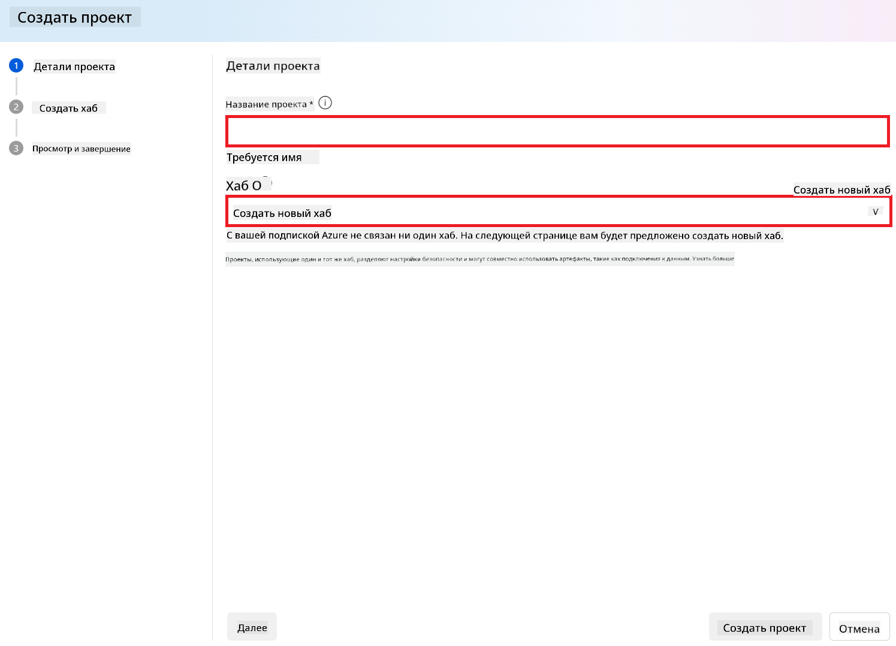
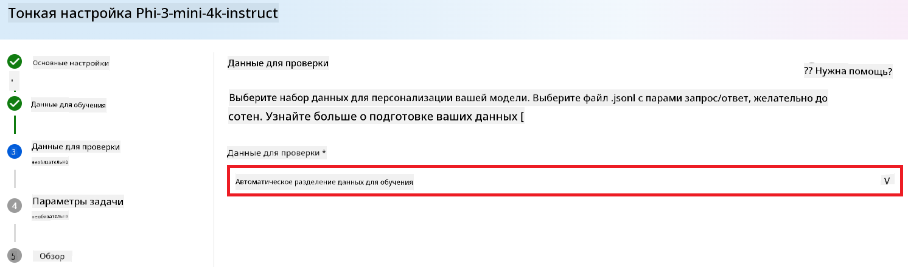
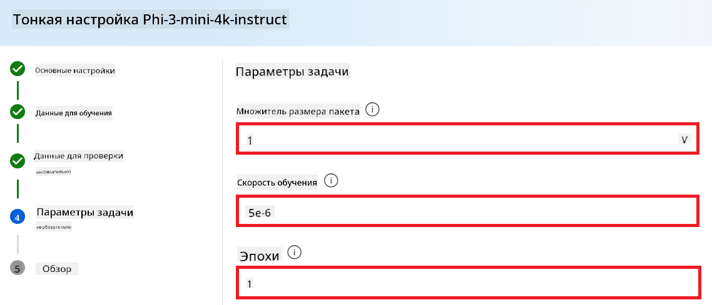
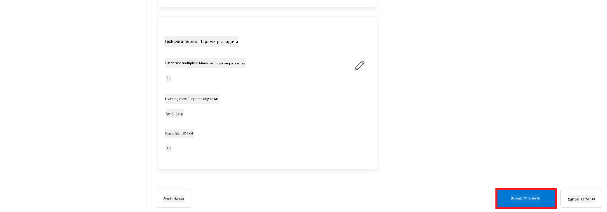

<!--
CO_OP_TRANSLATOR_METADATA:
{
  "original_hash": "c1559c5af6caccf6f623fd43a6b3a9a3",
  "translation_date": "2025-05-07T13:11:35+00:00",
  "source_file": "md/03.FineTuning/FineTuning_AIFoundry.md",
  "language_code": "ru"
}
-->
# Тонкая настройка Phi-3 с помощью Azure AI Foundry

Давайте рассмотрим, как выполнить тонкую настройку языковой модели Microsoft Phi-3 Mini с использованием Azure AI Foundry. Тонкая настройка позволяет адаптировать Phi-3 Mini под конкретные задачи, делая модель более мощной и контекстно осведомлённой.

## Важные моменты

- **Возможности:** Какие модели можно тонко настраивать? Какие задачи можно решать с помощью базовой модели после настройки?
- **Стоимость:** Как устроена модель ценообразования для тонкой настройки?
- **Настраиваемость:** Насколько можно изменять базовую модель и каким образом?
- **Удобство:** Как происходит процесс тонкой настройки — нужно ли писать собственный код? Нужно ли предоставлять свои вычислительные ресурсы?
- **Безопасность:** Тонко настроенные модели могут иметь риски безопасности — есть ли механизмы защиты от непреднамеренного вреда?


## Подготовка к тонкой настройке

### Необходимые условия

> [!NOTE]
> Для моделей семейства Phi-3 возможность тонкой настройки по модели pay-as-you-go доступна только для хабов, созданных в регионе **East US 2**.

- Подписка Azure. Если у вас нет подписки Azure, создайте [платный аккаунт Azure](https://azure.microsoft.com/pricing/purchase-options/pay-as-you-go) для начала работы.

- Проект [AI Foundry](https://ai.azure.com?WT.mc_id=aiml-138114-kinfeylo).
- Для управления доступом в Azure AI Foundry используется ролевой доступ Azure (Azure RBAC). Чтобы выполнить шаги из этой статьи, ваша учетная запись должна иметь роль __Azure AI Developer__ на уровне группы ресурсов.

### Регистрация провайдера подписки

Проверьте, что ваша подписка зарегистрирована для провайдера ресурсов `Microsoft.Network`.

1. Войдите в [портал Azure](https://portal.azure.com).
1. В меню слева выберите **Subscriptions**.
1. Выберите подписку, которую планируете использовать.
1. В меню слева выберите **AI project settings** > **Resource providers**.
1. Убедитесь, что в списке провайдеров ресурсов есть **Microsoft.Network**. Если нет — добавьте его.

### Подготовка данных

Подготовьте данные для обучения и валидации для тонкой настройки модели. Ваши обучающие и валидационные наборы должны содержать примеры входных и выходных данных, отражающие желаемое поведение модели.

Убедитесь, что все обучающие примеры соответствуют ожидаемому формату для инференса. Для эффективной тонкой настройки обеспечьте сбалансированный и разнообразный набор данных.

Это включает поддержание баланса данных, включение различных сценариев и периодическое уточнение обучающих данных, чтобы они соответствовали реальным ожиданиям, что в итоге приводит к более точным и сбалансированным ответам модели.

Разные типы моделей требуют разного формата обучающих данных.

### Chat Completion

Данные для обучения и валидации **должны** быть отформатированы в формате JSON Lines (JSONL). Для `Phi-3-mini-128k-instruct` набор данных для тонкой настройки должен быть оформлен в формате диалогов, используемом API Chat completions.

### Пример формата файла

```json
    {"messages": [{"role": "system", "content": "You are an Xbox customer support agent whose primary goal is to help users with issues they are experiencing with their Xbox devices. You are friendly and concise. You only provide factual answers to queries, and do not provide answers that are not related to Xbox."}, {"role": "user", "content": "Is Xbox better than PlayStation?"}, {"role": "assistant", "content": "I apologize, but I cannot provide personal opinions. My primary job is to assist you with any issues related to your Xbox device. Do you have any Xbox-related issues that need addressing?"}]}
    {"messages": [{"role": "system", "content": "You are an Xbox customer support agent whose primary goal is to help users with issues they are experiencing with their Xbox devices. You are friendly and concise. You only provide factual answers to queries, and do not provide answers that are not related to Xbox."}, {"role": "user", "content": "Can I play PC games on my Xbox?"}, {"role": "assistant", "content": "While Xbox consoles don't natively support PC games, they can play an array of Xbox games, many of which are also available on PC. Can I assist you with finding games compatible with your Xbox device?"}]}
    {"messages": [{"role": "system", "content": "You are an Xbox customer support agent whose primary goal is to help users with issues they are experiencing with their Xbox devices. You are friendly and concise. You only provide factual answers to queries, and do not provide answers that are not related to Xbox."}, {"role": "user", "content": "I'm having trouble connecting my Xbox to the Wi-Fi."}, {"role": "assistant", "content": "No worries, let's go through the network settings on your Xbox. Can you please tell me what happens when you try to connect it to the Wi-Fi?"}]}
```

Поддерживаемый тип файла — JSON Lines. Файлы загружаются в хранилище по умолчанию и становятся доступны в вашем проекте.

## Тонкая настройка Phi-3 с Azure AI Foundry

Azure AI Foundry позволяет адаптировать большие языковые модели под ваши собственные данные с помощью процесса, известного как тонкая настройка. Тонкая настройка дает значительные преимущества, позволяя кастомизировать и оптимизировать модель для конкретных задач и приложений. Это ведет к улучшению производительности, экономии затрат, снижению задержек и получению более точных результатов.


### Создание нового проекта

1. Войдите в [Azure AI Foundry](https://ai.azure.com).

1. Нажмите **+New project** для создания нового проекта в Azure AI Foundry.

    

1. Выполните следующие действия:

    - Укажите уникальное имя проекта **Hub name**.
    - Выберите **Hub** для использования (создайте новый, если нужно).

    

1. Чтобы создать новый хаб, выполните следующие шаги:

    - Введите уникальное имя **Hub name**.
    - Выберите вашу подписку Azure **Subscription**.
    - Выберите группу ресурсов **Resource group** (создайте новую, если необходимо).
    - Выберите регион **Location** для размещения.
    - Выберите **Connect Azure AI Services** (создайте новое подключение, если нужно).
    - Для **Connect Azure AI Search** выберите **Skip connecting**.

    

1. Нажмите **Next**.
1. Нажмите **Create a project**.

### Подготовка данных

Перед тонкой настройкой соберите или создайте набор данных, соответствующий вашей задаче, например, инструкции для чата, пары вопрос-ответ или другие релевантные тексты. Очистите и предобработайте данные, удалив шум, обработав пропущенные значения и токенизировав текст.

### Тонкая настройка моделей Phi-3 в Azure AI Foundry

> [!NOTE]
> Тонкая настройка моделей Phi-3 в настоящее время поддерживается только для проектов, расположенных в регионе East US 2.

1. Выберите **Model catalog** в левой панели.

1. Введите *phi-3* в поле поиска и выберите нужную модель phi-3.

    

1. Нажмите **Fine-tune**.

    

1. Введите имя для **Fine-tuned model name**.

    

1. Нажмите **Next**.

1. Выполните следующие шаги:

    - Выберите тип задачи **task type** — **Chat completion**.
    - Выберите **Training data** для использования. Вы можете загрузить данные через Azure AI Foundry или из локальной среды.

    

1. Нажмите **Next**.

1. Загрузите **Validation data** или выберите **Automatic split of training data**.

    

1. Нажмите **Next**.

1. Выполните следующие настройки:

    - Выберите множитель размера батча **Batch size multiplier**.
    - Выберите скорость обучения **Learning rate**.
    - Укажите количество эпох **Epochs**.

    

1. Нажмите **Submit** для запуска процесса тонкой настройки.

    

1. После завершения тонкой настройки статус модели изменится на **Completed**, как показано на изображении ниже. Теперь вы можете развернуть модель и использовать её в своем приложении, в playground или в prompt flow. Подробнее смотрите в разделе [Как развернуть модели семейства Phi-3 с помощью Azure AI Foundry](https://learn.microsoft.com/azure/ai-studio/how-to/deploy-models-phi-3?tabs=phi-3-5&pivots=programming-language-python).

    

> [!NOTE]
> Для более подробной информации по тонкой настройке Phi-3 посетите [Fine-tune Phi-3 models in Azure AI Foundry](https://learn.microsoft.com/azure/ai-studio/how-to/fine-tune-phi-3?tabs=phi-3-mini).

## Удаление тонко настроенных моделей

Вы можете удалить тонко настроенную модель из списка моделей для тонкой настройки в [Azure AI Foundry](https://ai.azure.com) или со страницы с деталями модели. Выберите модель для удаления на странице тонкой настройки, затем нажмите кнопку Delete для удаления.

> [!NOTE]
> Невозможно удалить пользовательскую модель, если для неё существует развертывание. Сначала удалите развертывание модели, затем можно удалить саму модель.

## Стоимость и квоты

### Стоимость и квоты для моделей Phi-3, тонко настроенных как сервис

Модели Phi, тонко настроенные как сервис, предоставляются Microsoft и интегрированы с Azure AI Foundry. Цены можно узнать при [развертывании](https://learn.microsoft.com/azure/ai-studio/how-to/deploy-models-phi-3?tabs=phi-3-5&pivots=programming-language-python) или тонкой настройке моделей на вкладке Pricing and terms в мастере развертывания.

## Фильтрация контента

Модели, развернутые как сервис по модели pay-as-you-go, защищены Azure AI Content Safety. При развертывании на конечных точках в реальном времени вы можете отключить эту функцию. При включенной Azure AI Content Safety и запрос, и ответ проходят через ансамбль моделей классификации, направленных на обнаружение и предотвращение вывода вредоносного контента. Система фильтрации контента обнаруживает и принимает меры по отношению к определённым категориям потенциально вредоносного контента как во входных запросах, так и в ответах. Подробнее о [Azure AI Content Safety](https://learn.microsoft.com/azure/ai-studio/concepts/content-filtering).

**Конфигурация тонкой настройки**

Гиперпараметры: Определите гиперпараметры, такие как скорость обучения, размер батча и количество эпох обучения.

**Функция потерь**

Выберите подходящую функцию потерь для вашей задачи (например, кросс-энтропию).

**Оптимизатор**

Выберите оптимизатор (например, Adam) для обновления градиентов во время обучения.

**Процесс тонкой настройки**

- Загрузка предобученной модели: загрузите контрольную точку Phi-3 Mini.
- Добавление пользовательских слоев: добавьте слои, специфичные для задачи (например, классификационную голову для инструкций чата).

**Обучение модели**

Выполните тонкую настройку модели на подготовленном наборе данных. Отслеживайте прогресс обучения и при необходимости корректируйте гиперпараметры.

**Оценка и валидация**

Валидационный набор: разделите данные на обучающий и валидационный наборы.

**Оценка производительности**

Используйте метрики, такие как точность, F1-мера или перплексия, для оценки качества модели.

## Сохранение тонко настроенной модели

**Контрольная точка**

Сохраните контрольную точку тонко настроенной модели для последующего использования.

## Развертывание

- Развертывание как веб-сервис: разверните тонко настроенную модель как веб-сервис в Azure AI Foundry.
- Тестирование конечной точки: отправьте тестовые запросы на развернутую конечную точку, чтобы проверить её работу.

## Итерации и улучшения

Итерации: если результаты вас не устраивают, повторите процесс, изменяя гиперпараметры, добавляя данные или увеличивая количество эпох тонкой настройки.

## Мониторинг и доработка

Постоянно следите за поведением модели и при необходимости вносите улучшения.

## Кастомизация и расширение

Пользовательские задачи: Phi-3 Mini можно тонко настраивать для различных задач помимо инструкций для чата. Изучайте другие варианты применения!

Эксперименты: пробуйте разные архитектуры, комбинации слоев и техники для улучшения производительности.

> [!NOTE]
> Тонкая настройка — это итеративный процесс. Экспериментируйте, учитесь и адаптируйте модель, чтобы добиться лучших результатов для вашей конкретной задачи!

**Отказ от ответственности**:  
Этот документ был переведен с помощью сервиса автоматического перевода [Co-op Translator](https://github.com/Azure/co-op-translator). Несмотря на наши усилия обеспечить точность, пожалуйста, имейте в виду, что автоматический перевод может содержать ошибки или неточности. Оригинальный документ на исходном языке следует считать авторитетным источником. Для получения критически важной информации рекомендуется использовать профессиональный перевод, выполненный человеком. Мы не несем ответственности за любые недоразумения или неправильные толкования, возникшие в результате использования данного перевода.