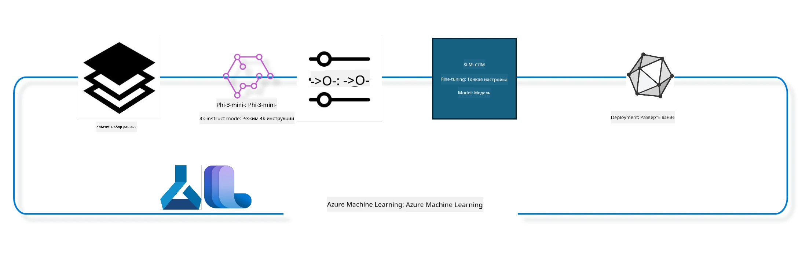

<!--
CO_OP_TRANSLATOR_METADATA:
{
  "original_hash": "944949f040e61b2ea25b3460f7394fd4",
  "translation_date": "2025-07-17T06:57:31+00:00",
  "source_file": "md/03.FineTuning/FineTuning_MLSDK.md",
  "language_code": "ru"
}
-->
## Как использовать компоненты chat-completion из системного реестра Azure ML для дообучения модели

В этом примере мы проведём дообучение модели Phi-3-mini-4k-instruct для завершения диалога между двумя людьми, используя датасет ultrachat_200k.



Пример покажет, как выполнить дообучение с помощью Azure ML SDK и Python, а затем развернуть дообученную модель на онлайн-эндпоинте для инференса в реальном времени.

### Данные для обучения

Мы будем использовать датасет ultrachat_200k. Это сильно отфильтрованная версия датасета UltraChat, которая использовалась для обучения Zephyr-7B-β — передовой чат-модели с 7 миллиардами параметров.

### Модель

Для демонстрации дообучения модели для задачи chat-completion мы возьмём Phi-3-mini-4k-instruct. Если вы открыли этот ноутбук из карточки конкретной модели, не забудьте заменить имя модели на нужное.

### Задачи

- Выбрать модель для дообучения.
- Выбрать и изучить данные для обучения.
- Настроить задачу дообучения.
- Запустить задачу дообучения.
- Проанализировать метрики обучения и оценки.
- Зарегистрировать дообученную модель.
- Развернуть дообученную модель для инференса в реальном времени.
- Очистить ресурсы.

## 1. Подготовка окружения

- Установить зависимости
- Подключиться к AzureML Workspace. Подробнее в разделе настройки аутентификации SDK. Замените <WORKSPACE_NAME>, <RESOURCE_GROUP> и <SUBSCRIPTION_ID> ниже.
- Подключиться к системному реестру azureml
- Задать необязательное имя эксперимента
- Проверить или создать вычислительный кластер.

> [!NOTE]
> Требуется один узел с GPU, который может содержать несколько видеокарт. Например, в узле Standard_NC24rs_v3 установлено 4 GPU NVIDIA V100, а в Standard_NC12s_v3 — 2 GPU NVIDIA V100. Подробности смотрите в документации. Количество GPU на узел задаётся параметром gpus_per_node ниже. Правильная настройка этого параметра обеспечит использование всех GPU на узле. Рекомендуемые SKU для GPU-компьютеров можно найти здесь и здесь.

### Библиотеки Python

Установите зависимости, выполнив следующую ячейку. Этот шаг обязателен при работе в новом окружении.

```bash
pip install azure-ai-ml
pip install azure-identity
pip install datasets==2.9.0
pip install mlflow
pip install azureml-mlflow
```

### Взаимодействие с Azure ML

1. Этот Python-скрипт используется для взаимодействия с сервисом Azure Machine Learning (Azure ML). Вот что он делает:

    - Импортирует необходимые модули из пакетов azure.ai.ml, azure.identity и azure.ai.ml.entities, а также модуль time.

    - Пытается аутентифицироваться с помощью DefaultAzureCredential(), который упрощает процесс аутентификации для приложений, работающих в облаке Azure. Если это не удаётся, используется InteractiveBrowserCredential() с интерактивным входом.

    - Затем пытается создать экземпляр MLClient через метод from_config, который читает конфигурацию из файла config.json. Если это не удаётся, создаёт MLClient вручную, передавая subscription_id, resource_group_name и workspace_name.

    - Создаёт ещё один экземпляр MLClient для системного реестра Azure ML с именем "azureml". В этом реестре хранятся модели, пайплайны дообучения и окружения.

    - Устанавливает имя эксперимента experiment_name в "chat_completion_Phi-3-mini-4k-instruct".

    - Генерирует уникальную временную метку, преобразуя текущее время (в секундах с начала эпохи) в целое число и затем в строку. Эта метка используется для создания уникальных имён и версий.

    ```python
    # Import necessary modules from Azure ML and Azure Identity
    from azure.ai.ml import MLClient
    from azure.identity import (
        DefaultAzureCredential,
        InteractiveBrowserCredential,
    )
    from azure.ai.ml.entities import AmlCompute
    import time  # Import time module
    
    # Try to authenticate using DefaultAzureCredential
    try:
        credential = DefaultAzureCredential()
        credential.get_token("https://management.azure.com/.default")
    except Exception as ex:  # If DefaultAzureCredential fails, use InteractiveBrowserCredential
        credential = InteractiveBrowserCredential()
    
    # Try to create an MLClient instance using the default config file
    try:
        workspace_ml_client = MLClient.from_config(credential=credential)
    except:  # If that fails, create an MLClient instance by manually providing the details
        workspace_ml_client = MLClient(
            credential,
            subscription_id="<SUBSCRIPTION_ID>",
            resource_group_name="<RESOURCE_GROUP>",
            workspace_name="<WORKSPACE_NAME>",
        )
    
    # Create another MLClient instance for the Azure ML registry named "azureml"
    # This registry is where models, fine-tuning pipelines, and environments are stored
    registry_ml_client = MLClient(credential, registry_name="azureml")
    
    # Set the experiment name
    experiment_name = "chat_completion_Phi-3-mini-4k-instruct"
    
    # Generate a unique timestamp that can be used for names and versions that need to be unique
    timestamp = str(int(time.time()))
    ```

## 2. Выбор базовой модели для дообучения

1. Phi-3-mini-4k-instruct — это лёгкая, современная открытая модель с 3.8 миллиардами параметров, построенная на датасетах, использованных для Phi-2. Модель относится к семейству Phi-3, а версия Mini доступна в двух вариантах: 4K и 128K — это длина контекста (в токенах), которую модель поддерживает. Для использования модели под нашу задачу её нужно дообучить. Вы можете просмотреть эти модели в Каталоге моделей AzureML Studio, отфильтровав по задаче chat-completion. В этом примере используется Phi-3-mini-4k-instruct. Если вы открыли этот ноутбук для другой модели, замените имя и версию модели соответственно.

    > [!NOTE]
    > Свойство model id модели будет передано в задачу дообучения. Его также можно найти в поле Asset ID на странице с деталями модели в Каталоге моделей AzureML Studio.

2. Этот Python-скрипт взаимодействует с сервисом Azure Machine Learning (Azure ML). Вот что он делает:

    - Устанавливает model_name в "Phi-3-mini-4k-instruct".

    - Использует метод get объекта models реестра registry_ml_client, чтобы получить последнюю версию модели с указанным именем из системного реестра Azure ML. Метод get вызывается с двумя аргументами: имя модели и метка, указывающая на получение последней версии.

    - Выводит в консоль сообщение с именем, версией и id модели, которая будет использоваться для дообучения. Метод format строки вставляет имя, версию и id модели из свойств объекта foundation_model.

    ```python
    # Set the model name
    model_name = "Phi-3-mini-4k-instruct"
    
    # Get the latest version of the model from the Azure ML registry
    foundation_model = registry_ml_client.models.get(model_name, label="latest")
    
    # Print the model name, version, and id
    # This information is useful for tracking and debugging
    print(
        "\n\nUsing model name: {0}, version: {1}, id: {2} for fine tuning".format(
            foundation_model.name, foundation_model.version, foundation_model.id
        )
    )
    ```

## 3. Создание вычислительного кластера для задачи

Задача дообучения работает ТОЛЬКО с GPU-компьютерами. Размер кластера зависит от размера модели, и часто бывает сложно подобрать подходящий. В этой ячейке мы помогаем выбрать правильный кластер.

> [!NOTE]
> Перечисленные ниже вычислительные ресурсы работают с оптимальной конфигурацией. Любые изменения могут привести к ошибке Cuda Out Of Memory. В таких случаях попробуйте увеличить размер кластера.

> [!NOTE]
> При выборе compute_cluster_size убедитесь, что выбранный кластер доступен в вашей группе ресурсов. Если нужный кластер недоступен, можно подать запрос на получение доступа к вычислительным ресурсам.

### Проверка поддержки дообучения моделью

1. Этот Python-скрипт взаимодействует с моделью Azure Machine Learning (Azure ML). Вот что он делает:

    - Импортирует модуль ast, который предоставляет функции для обработки деревьев абстрактного синтаксиса Python.

    - Проверяет, есть ли у объекта foundation_model (модель в Azure ML) тег finetune_compute_allow_list. Теги в Azure ML — это пары ключ-значение, которые можно использовать для фильтрации и сортировки моделей.

    - Если тег finetune_compute_allow_list присутствует, с помощью ast.literal_eval безопасно преобразует строковое значение тега в список Python. Этот список присваивается переменной computes_allow_list. Затем выводит сообщение о том, что вычислительный ресурс следует выбрать из этого списка.

    - Если тег отсутствует, устанавливает computes_allow_list в None и выводит сообщение, что тег finetune_compute_allow_list не найден среди тегов модели.

    - В итоге скрипт проверяет наличие определённого тега в метаданных модели, преобразует его значение в список при наличии и информирует пользователя.

    ```python
    # Import the ast module, which provides functions to process trees of the Python abstract syntax grammar
    import ast
    
    # Check if the 'finetune_compute_allow_list' tag is present in the model's tags
    if "finetune_compute_allow_list" in foundation_model.tags:
        # If the tag is present, use ast.literal_eval to safely parse the tag's value (a string) into a Python list
        computes_allow_list = ast.literal_eval(
            foundation_model.tags["finetune_compute_allow_list"]
        )  # convert string to python list
        # Print a message indicating that a compute should be created from the list
        print(f"Please create a compute from the above list - {computes_allow_list}")
    else:
        # If the tag is not present, set computes_allow_list to None
        computes_allow_list = None
        # Print a message indicating that the 'finetune_compute_allow_list' tag is not part of the model's tags
        print("`finetune_compute_allow_list` is not part of model tags")
    ```

### Проверка вычислительного инстанса

1. Этот Python-скрипт взаимодействует с сервисом Azure Machine Learning (Azure ML) и выполняет несколько проверок вычислительного инстанса. Вот что он делает:

    - Пытается получить вычислительный инстанс с именем из переменной compute_cluster в рабочем пространстве Azure ML. Если состояние provisioning инстанса — "failed", выбрасывает ошибку ValueError.

    - Проверяет, что computes_allow_list не равен None. Если это так, приводит все размеры вычислительных ресурсов в списке к нижнему регистру и проверяет, есть ли размер текущего инстанса в этом списке. Если нет — выбрасывает ValueError.

    - Если computes_allow_list равен None, проверяет, не входит ли размер инстанса в список неподдерживаемых размеров GPU VM. Если входит — выбрасывает ValueError.

    - Получает список всех доступных размеров вычислительных ресурсов в рабочем пространстве. Перебирает их и, если имя совпадает с размером текущего инстанса, получает количество GPU для этого размера и устанавливает флаг gpu_count_found в True.

    - Если gpu_count_found равен True, выводит количество GPU в инстансе. Если False — выбрасывает ValueError.

    - В итоге скрипт проверяет состояние provisioning, размер инстанса относительно разрешённого списка или списка запретов, а также количество GPU.

    ```python
    # Print the exception message
    print(e)
    # Raise a ValueError if the compute size is not available in the workspace
    raise ValueError(
        f"WARNING! Compute size {compute_cluster_size} not available in workspace"
    )
    
    # Retrieve the compute instance from the Azure ML workspace
    compute = workspace_ml_client.compute.get(compute_cluster)
    # Check if the provisioning state of the compute instance is "failed"
    if compute.provisioning_state.lower() == "failed":
        # Raise a ValueError if the provisioning state is "failed"
        raise ValueError(
            f"Provisioning failed, Compute '{compute_cluster}' is in failed state. "
            f"please try creating a different compute"
        )
    
    # Check if computes_allow_list is not None
    if computes_allow_list is not None:
        # Convert all compute sizes in computes_allow_list to lowercase
        computes_allow_list_lower_case = [x.lower() for x in computes_allow_list]
        # Check if the size of the compute instance is in computes_allow_list_lower_case
        if compute.size.lower() not in computes_allow_list_lower_case:
            # Raise a ValueError if the size of the compute instance is not in computes_allow_list_lower_case
            raise ValueError(
                f"VM size {compute.size} is not in the allow-listed computes for finetuning"
            )
    else:
        # Define a list of unsupported GPU VM sizes
        unsupported_gpu_vm_list = [
            "standard_nc6",
            "standard_nc12",
            "standard_nc24",
            "standard_nc24r",
        ]
        # Check if the size of the compute instance is in unsupported_gpu_vm_list
        if compute.size.lower() in unsupported_gpu_vm_list:
            # Raise a ValueError if the size of the compute instance is in unsupported_gpu_vm_list
            raise ValueError(
                f"VM size {compute.size} is currently not supported for finetuning"
            )
    
    # Initialize a flag to check if the number of GPUs in the compute instance has been found
    gpu_count_found = False
    # Retrieve a list of all available compute sizes in the workspace
    workspace_compute_sku_list = workspace_ml_client.compute.list_sizes()
    available_sku_sizes = []
    # Iterate over the list of available compute sizes
    for compute_sku in workspace_compute_sku_list:
        available_sku_sizes.append(compute_sku.name)
        # Check if the name of the compute size matches the size of the compute instance
        if compute_sku.name.lower() == compute.size.lower():
            # If it does, retrieve the number of GPUs for that compute size and set gpu_count_found to True
            gpus_per_node = compute_sku.gpus
            gpu_count_found = True
    # If gpu_count_found is True, print the number of GPUs in the compute instance
    if gpu_count_found:
        print(f"Number of GPU's in compute {compute.size}: {gpus_per_node}")
    else:
        # If gpu_count_found is False, raise a ValueError
        raise ValueError(
            f"Number of GPU's in compute {compute.size} not found. Available skus are: {available_sku_sizes}."
            f"This should not happen. Please check the selected compute cluster: {compute_cluster} and try again."
        )
    ```

## 4. Выбор датасета для дообучения модели

1. Мы используем датасет ultrachat_200k. Датасет разделён на четыре части, подходящие для Supervised fine-tuning (sft) и Generation ranking (gen). Количество примеров в каждой части показано ниже:

    ```bash
    train_sft test_sft  train_gen  test_gen
    207865  23110  256032  28304
    ```

1. Следующие ячейки показывают базовую подготовку данных для дообучения:

### Визуализация нескольких строк данных

Мы хотим, чтобы пример выполнялся быстро, поэтому сохраняем файлы train_sft и test_sft, содержащие 5% уже отфильтрованных строк. Это значит, что точность дообученной модели будет ниже, и её не стоит использовать в реальных задачах.
Скрипт download-dataset.py используется для загрузки датасета ultrachat_200k и преобразования его в формат, пригодный для компонента пайплайна дообучения. Поскольку датасет большой, здесь используется только его часть.

1. Запуск скрипта ниже скачивает только 5% данных. Этот параметр можно увеличить, изменив значение dataset_split_pc на нужный процент.

    > [!NOTE]
    > Некоторые языковые модели используют разные языковые коды, поэтому названия столбцов в датасете должны соответствовать этим кодам.

1. Пример того, как должны выглядеть данные:
Датасет chat-completion хранится в формате parquet, где каждая запись имеет следующую структуру:

    - Это JSON-документ (JavaScript Object Notation) — популярный формат обмена данными. Это не исполняемый код, а способ хранения и передачи данных. Вот его структура:

    - "prompt": строка, представляющая задачу или вопрос, заданный AI-ассистенту.

    - "messages": массив объектов. Каждый объект — это сообщение в диалоге между пользователем и AI-ассистентом. У каждого сообщения два ключа:

    - "content": строка с содержимым сообщения.
    - "role": строка, указывающая роль отправителя сообщения — "user" или "assistant".
    - "prompt_id": строка с уникальным идентификатором запроса.

1. В этом конкретном JSON-документе представлен диалог, где пользователь просит AI-ассистента создать главного героя для антиутопической истории. Ассистент отвечает, затем пользователь просит больше деталей, и ассистент соглашается их предоставить. Весь диалог связан с конкретным prompt_id.

    ```python
    {
        // The task or question posed to an AI assistant
        "prompt": "Create a fully-developed protagonist who is challenged to survive within a dystopian society under the rule of a tyrant. ...",
        
        // An array of objects, each representing a message in a conversation between a user and an AI assistant
        "messages":[
            {
                // The content of the user's message
                "content": "Create a fully-developed protagonist who is challenged to survive within a dystopian society under the rule of a tyrant. ...",
                // The role of the entity that sent the message
                "role": "user"
            },
            {
                // The content of the assistant's message
                "content": "Name: Ava\n\n Ava was just 16 years old when the world as she knew it came crashing down. The government had collapsed, leaving behind a chaotic and lawless society. ...",
                // The role of the entity that sent the message
                "role": "assistant"
            },
            {
                // The content of the user's message
                "content": "Wow, Ava's story is so intense and inspiring! Can you provide me with more details.  ...",
                // The role of the entity that sent the message
                "role": "user"
            }, 
            {
                // The content of the assistant's message
                "content": "Certainly! ....",
                // The role of the entity that sent the message
                "role": "assistant"
            }
        ],
        
        // A unique identifier for the prompt
        "prompt_id": "d938b65dfe31f05f80eb8572964c6673eddbd68eff3db6bd234d7f1e3b86c2af"
    }
    ```

### Загрузка данных

1. Этот Python-скрипт используется для загрузки датасета с помощью вспомогательного скрипта download-dataset.py. Вот что он делает:

    - Импортирует модуль os, который предоставляет переносимые функции для работы с операционной системой.

    - С помощью os.system запускает скрипт download-dataset.py в командной строке с аргументами: датасет HuggingFaceH4/ultrachat_200k, директория для загрузки ultrachat_200k_dataset и процент разделения датасета 5. Функция os.system возвращает код завершения команды, который сохраняется в переменную exit_status.

    - Проверяет, что exit_status не равен 0. В Unix-подобных системах код 0 означает успешное выполнение, любое другое число — ошибку. Если exit_status не 0, выбрасывает исключение с сообщением об ошибке загрузки датасета.

    - В итоге скрипт запускает команду для загрузки датасета и выбрасывает исключение при ошибке.

    ```python
    # Import the os module, which provides a way of using operating system dependent functionality
    import os
    
    # Use the os.system function to run the download-dataset.py script in the shell with specific command-line arguments
    # The arguments specify the dataset to download (HuggingFaceH4/ultrachat_200k), the directory to download it to (ultrachat_200k_dataset), and the percentage of the dataset to split (5)
    # The os.system function returns the exit status of the command it executed; this status is stored in the exit_status variable
    exit_status = os.system(
        "python ./download-dataset.py --dataset HuggingFaceH4/ultrachat_200k --download_dir ultrachat_200k_dataset --dataset_split_pc 5"
    )
    
    # Check if exit_status is not 0
    # In Unix-like operating systems, an exit status of 0 usually indicates that a command has succeeded, while any other number indicates an error
    # If exit_status is not 0, raise an Exception with a message indicating that there was an error downloading the dataset
    if exit_status != 0:
        raise Exception("Error downloading dataset")
    ```

### Загрузка данных в DataFrame

1. Этот Python-скрипт загружает файл формата JSON Lines в pandas DataFrame и выводит первые 5 строк. Вот что он делает:

    - Импортирует библиотеку pandas — мощный инструмент для обработки и анализа данных.

    - Устанавливает максимальную ширину столбцов для отображения pandas в 0, что означает полное отображение текста без усечения.

    - С помощью функции pd.read_json загружает файл train_sft.jsonl из директории ultrachat_200k_dataset в DataFrame. Параметр lines=True указывает, что файл в формате JSON Lines, где каждая строка — отдельный JSON-объект.
- Он использует метод head для отображения первых 5 строк DataFrame. Если в DataFrame меньше 5 строк, будут показаны все строки.

- В итоге, этот скрипт загружает файл в формате JSON Lines в DataFrame и отображает первые 5 строк с полным текстом столбцов.

```python
    # Import the pandas library, which is a powerful data manipulation and analysis library
    import pandas as pd
    
    # Set the maximum column width for pandas' display options to 0
    # This means that the full text of each column will be displayed without truncation when the DataFrame is printed
    pd.set_option("display.max_colwidth", 0)
    
    # Use the pd.read_json function to load the train_sft.jsonl file from the ultrachat_200k_dataset directory into a DataFrame
    # The lines=True argument indicates that the file is in JSON Lines format, where each line is a separate JSON object
    df = pd.read_json("./ultrachat_200k_dataset/train_sft.jsonl", lines=True)
    
    # Use the head method to display the first 5 rows of the DataFrame
    # If the DataFrame has less than 5 rows, it will display all of them
    df.head()
    ```

## 5. Отправка задачи дообучения с использованием модели и данных в качестве входных данных

Создайте задачу, которая использует компонент pipeline для chat-completion. Узнайте больше обо всех параметрах, поддерживаемых для дообучения.

### Определение параметров дообучения

1. Параметры дообучения можно разделить на 2 категории — параметры обучения и параметры оптимизации.

1. Параметры обучения определяют аспекты обучения, такие как:

    - Оптимизатор, планировщик обучения
    - Метрика для оптимизации дообучения
    - Количество шагов обучения, размер батча и так далее
    - Параметры оптимизации помогают эффективно использовать память GPU и вычислительные ресурсы.

1. Ниже приведены некоторые параметры, относящиеся к этой категории. Параметры оптимизации отличаются для каждой модели и поставляются вместе с моделью для обработки этих различий.

    - Включение deepspeed и LoRA
    - Включение обучения с смешанной точностью
    - Включение обучения на нескольких узлах


> [!NOTE]
> Контролируемое дообучение может привести к потере выравнивания или катастрофическому забыванию. Рекомендуется проверять эту проблему и запускать этап выравнивания после дообучения.

### Параметры дообучения

1. Этот Python-скрипт настраивает параметры для дообучения модели машинного обучения. Вот что он делает:

    - Устанавливает стандартные параметры обучения, такие как количество эпох, размеры батчей для обучения и оценки, скорость обучения и тип планировщика скорости обучения.

    - Устанавливает стандартные параметры оптимизации, такие как применение Layer-wise Relevance Propagation (LoRa) и DeepSpeed, а также этап DeepSpeed.

    - Объединяет параметры обучения и оптимизации в один словарь finetune_parameters.

    - Проверяет, есть ли у foundation_model какие-либо параметры по умолчанию, специфичные для модели. Если есть, выводит предупреждение и обновляет словарь finetune_parameters этими параметрами. Для преобразования строкового представления параметров в словарь используется функция ast.literal_eval.

    - Выводит окончательный набор параметров дообучения, которые будут использованы при запуске.

    - В итоге, скрипт настраивает и отображает параметры дообучения модели с возможностью переопределения стандартных параметров параметрами, специфичными для модели.

    ```python
    # Set up default training parameters such as the number of training epochs, batch sizes for training and evaluation, learning rate, and learning rate scheduler type
    training_parameters = dict(
        num_train_epochs=3,
        per_device_train_batch_size=1,
        per_device_eval_batch_size=1,
        learning_rate=5e-6,
        lr_scheduler_type="cosine",
    )
    
    # Set up default optimization parameters such as whether to apply Layer-wise Relevance Propagation (LoRa) and DeepSpeed, and the DeepSpeed stage
    optimization_parameters = dict(
        apply_lora="true",
        apply_deepspeed="true",
        deepspeed_stage=2,
    )
    
    # Combine the training and optimization parameters into a single dictionary called finetune_parameters
    finetune_parameters = {**training_parameters, **optimization_parameters}
    
    # Check if the foundation_model has any model-specific default parameters
    # If it does, print a warning message and update the finetune_parameters dictionary with these model-specific defaults
    # The ast.literal_eval function is used to convert the model-specific defaults from a string to a Python dictionary
    if "model_specific_defaults" in foundation_model.tags:
        print("Warning! Model specific defaults exist. The defaults could be overridden.")
        finetune_parameters.update(
            ast.literal_eval(  # convert string to python dict
                foundation_model.tags["model_specific_defaults"]
            )
        )
    
    # Print the final set of fine-tuning parameters that will be used for the run
    print(
        f"The following finetune parameters are going to be set for the run: {finetune_parameters}"
    )
    ```

### Тренировочный Pipeline

1. Этот Python-скрипт определяет функцию для генерации отображаемого имени тренировочного pipeline и затем вызывает эту функцию для генерации и вывода имени. Вот что он делает:

1. Определена функция get_pipeline_display_name, которая формирует отображаемое имя на основе различных параметров, связанных с тренировочным pipeline.

1. Внутри функции вычисляется общий размер батча, умножая размер батча на устройство, количество шагов накопления градиента, количество GPU на узел и количество узлов, используемых для дообучения.

1. Получаются другие параметры, такие как тип планировщика скорости обучения, используется ли DeepSpeed, этап DeepSpeed, применяется ли LoRa, ограничение на количество сохраняемых контрольных точек модели и максимальная длина последовательности.

1. Формируется строка, включающая все эти параметры, разделённые дефисами. Если используется DeepSpeed или LoRa, в строку добавляется "ds" с указанием этапа DeepSpeed или "lora" соответственно. Если нет, добавляются "nods" или "nolora".

1. Функция возвращает эту строку, которая служит отображаемым именем тренировочного pipeline.

1. После определения функция вызывается для генерации имени, которое затем выводится.

1. В итоге, скрипт генерирует отображаемое имя для тренировочного pipeline на основе различных параметров и выводит его.

    ```python
    # Define a function to generate a display name for the training pipeline
    def get_pipeline_display_name():
        # Calculate the total batch size by multiplying the per-device batch size, the number of gradient accumulation steps, the number of GPUs per node, and the number of nodes used for fine-tuning
        batch_size = (
            int(finetune_parameters.get("per_device_train_batch_size", 1))
            * int(finetune_parameters.get("gradient_accumulation_steps", 1))
            * int(gpus_per_node)
            * int(finetune_parameters.get("num_nodes_finetune", 1))
        )
        # Retrieve the learning rate scheduler type
        scheduler = finetune_parameters.get("lr_scheduler_type", "linear")
        # Retrieve whether DeepSpeed is applied
        deepspeed = finetune_parameters.get("apply_deepspeed", "false")
        # Retrieve the DeepSpeed stage
        ds_stage = finetune_parameters.get("deepspeed_stage", "2")
        # If DeepSpeed is applied, include "ds" followed by the DeepSpeed stage in the display name; if not, include "nods"
        if deepspeed == "true":
            ds_string = f"ds{ds_stage}"
        else:
            ds_string = "nods"
        # Retrieve whether Layer-wise Relevance Propagation (LoRa) is applied
        lora = finetune_parameters.get("apply_lora", "false")
        # If LoRa is applied, include "lora" in the display name; if not, include "nolora"
        if lora == "true":
            lora_string = "lora"
        else:
            lora_string = "nolora"
        # Retrieve the limit on the number of model checkpoints to keep
        save_limit = finetune_parameters.get("save_total_limit", -1)
        # Retrieve the maximum sequence length
        seq_len = finetune_parameters.get("max_seq_length", -1)
        # Construct the display name by concatenating all these parameters, separated by hyphens
        return (
            model_name
            + "-"
            + "ultrachat"
            + "-"
            + f"bs{batch_size}"
            + "-"
            + f"{scheduler}"
            + "-"
            + ds_string
            + "-"
            + lora_string
            + f"-save_limit{save_limit}"
            + f"-seqlen{seq_len}"
        )
    
    # Call the function to generate the display name
    pipeline_display_name = get_pipeline_display_name()
    # Print the display name
    print(f"Display name used for the run: {pipeline_display_name}")
    ```

### Конфигурация Pipeline

Этот Python-скрипт определяет и настраивает pipeline машинного обучения с использованием Azure Machine Learning SDK. Вот что он делает:

1. Импортирует необходимые модули из Azure AI ML SDK.

1. Получает компонент pipeline с именем "chat_completion_pipeline" из реестра.

1. Определяет задачу pipeline с помощью декоратора `@pipeline` и функции `create_pipeline`. Имя pipeline устанавливается в `pipeline_display_name`.

1. Внутри функции `create_pipeline` инициализирует полученный компонент pipeline с различными параметрами, включая путь к модели, вычислительные кластеры для разных этапов, разделы датасета для обучения и тестирования, количество GPU для дообучения и другие параметры дообучения.

1. Связывает вывод задачи дообучения с выводом задачи pipeline. Это делается для удобной регистрации дообученной модели, что необходимо для развертывания модели на онлайн или пакетной конечной точке.

1. Создаёт экземпляр pipeline, вызывая функцию `create_pipeline`.

1. Устанавливает параметр `force_rerun` pipeline в `True`, что означает, что кэшированные результаты предыдущих задач использоваться не будут.

1. Устанавливает параметр `continue_on_step_failure` pipeline в `False`, что означает, что pipeline остановится при сбое любого шага.

1. В итоге, скрипт определяет и настраивает pipeline машинного обучения для задачи chat completion с использованием Azure Machine Learning SDK.

    ```python
    # Import necessary modules from the Azure AI ML SDK
    from azure.ai.ml.dsl import pipeline
    from azure.ai.ml import Input
    
    # Fetch the pipeline component named "chat_completion_pipeline" from the registry
    pipeline_component_func = registry_ml_client.components.get(
        name="chat_completion_pipeline", label="latest"
    )
    
    # Define the pipeline job using the @pipeline decorator and the function create_pipeline
    # The name of the pipeline is set to pipeline_display_name
    @pipeline(name=pipeline_display_name)
    def create_pipeline():
        # Initialize the fetched pipeline component with various parameters
        # These include the model path, compute clusters for different stages, dataset splits for training and testing, the number of GPUs to use for fine-tuning, and other fine-tuning parameters
        chat_completion_pipeline = pipeline_component_func(
            mlflow_model_path=foundation_model.id,
            compute_model_import=compute_cluster,
            compute_preprocess=compute_cluster,
            compute_finetune=compute_cluster,
            compute_model_evaluation=compute_cluster,
            # Map the dataset splits to parameters
            train_file_path=Input(
                type="uri_file", path="./ultrachat_200k_dataset/train_sft.jsonl"
            ),
            test_file_path=Input(
                type="uri_file", path="./ultrachat_200k_dataset/test_sft.jsonl"
            ),
            # Training settings
            number_of_gpu_to_use_finetuning=gpus_per_node,  # Set to the number of GPUs available in the compute
            **finetune_parameters
        )
        return {
            # Map the output of the fine tuning job to the output of pipeline job
            # This is done so that we can easily register the fine tuned model
            # Registering the model is required to deploy the model to an online or batch endpoint
            "trained_model": chat_completion_pipeline.outputs.mlflow_model_folder
        }
    
    # Create an instance of the pipeline by calling the create_pipeline function
    pipeline_object = create_pipeline()
    
    # Don't use cached results from previous jobs
    pipeline_object.settings.force_rerun = True
    
    # Set continue on step failure to False
    # This means that the pipeline will stop if any step fails
    pipeline_object.settings.continue_on_step_failure = False
    ```

### Отправка задачи

1. Этот Python-скрипт отправляет задачу pipeline машинного обучения в рабочее пространство Azure Machine Learning и затем ожидает завершения задачи. Вот что он делает:

    - Вызывает метод create_or_update объекта jobs в workspace_ml_client для отправки задачи pipeline. Запускаемый pipeline указывается через pipeline_object, а эксперимент, под которым запускается задача, — через experiment_name.

    - Затем вызывает метод stream объекта jobs в workspace_ml_client, чтобы дождаться завершения задачи pipeline. Задача, за которой ведётся ожидание, указывается через атрибут name объекта pipeline_job.

    - В итоге, скрипт отправляет задачу pipeline машинного обучения в рабочее пространство Azure Machine Learning и ожидает её завершения.

    ```python
    # Submit the pipeline job to the Azure Machine Learning workspace
    # The pipeline to be run is specified by pipeline_object
    # The experiment under which the job is run is specified by experiment_name
    pipeline_job = workspace_ml_client.jobs.create_or_update(
        pipeline_object, experiment_name=experiment_name
    )
    
    # Wait for the pipeline job to complete
    # The job to wait for is specified by the name attribute of the pipeline_job object
    workspace_ml_client.jobs.stream(pipeline_job.name)
    ```

## 6. Регистрация дообученной модели в рабочем пространстве

Мы зарегистрируем модель, полученную в результате задачи дообучения. Это позволит отслеживать происхождение между дообученной моделью и задачей дообучения. Задача дообучения, в свою очередь, отслеживает происхождение базовой модели, данных и кода обучения.

### Регистрация ML-модели

1. Этот Python-скрипт регистрирует модель машинного обучения, обученную в pipeline Azure Machine Learning. Вот что он делает:

    - Импортирует необходимые модули из Azure AI ML SDK.

    - Проверяет, доступен ли вывод trained_model из задачи pipeline, вызывая метод get объекта jobs в workspace_ml_client и обращаясь к атрибуту outputs.

    - Формирует путь к обученной модели, форматируя строку с именем задачи pipeline и именем вывода ("trained_model").

    - Определяет имя для дообученной модели, добавляя суффикс "-ultrachat-200k" к исходному имени модели и заменяя все слэши на дефисы.

    - Готовится к регистрации модели, создавая объект Model с различными параметрами, включая путь к модели, тип модели (MLflow model), имя и версию модели, а также описание модели.

    - Регистрирует модель, вызывая метод create_or_update объекта models в workspace_ml_client с объектом Model в качестве аргумента.

    - Выводит зарегистрированную модель.

1. В итоге, скрипт регистрирует модель машинного обучения, обученную в pipeline Azure Machine Learning.

    ```python
    # Import necessary modules from the Azure AI ML SDK
    from azure.ai.ml.entities import Model
    from azure.ai.ml.constants import AssetTypes
    
    # Check if the `trained_model` output is available from the pipeline job
    print("pipeline job outputs: ", workspace_ml_client.jobs.get(pipeline_job.name).outputs)
    
    # Construct a path to the trained model by formatting a string with the name of the pipeline job and the name of the output ("trained_model")
    model_path_from_job = "azureml://jobs/{0}/outputs/{1}".format(
        pipeline_job.name, "trained_model"
    )
    
    # Define a name for the fine-tuned model by appending "-ultrachat-200k" to the original model name and replacing any slashes with hyphens
    finetuned_model_name = model_name + "-ultrachat-200k"
    finetuned_model_name = finetuned_model_name.replace("/", "-")
    
    print("path to register model: ", model_path_from_job)
    
    # Prepare to register the model by creating a Model object with various parameters
    # These include the path to the model, the type of the model (MLflow model), the name and version of the model, and a description of the model
    prepare_to_register_model = Model(
        path=model_path_from_job,
        type=AssetTypes.MLFLOW_MODEL,
        name=finetuned_model_name,
        version=timestamp,  # Use timestamp as version to avoid version conflict
        description=model_name + " fine tuned model for ultrachat 200k chat-completion",
    )
    
    print("prepare to register model: \n", prepare_to_register_model)
    
    # Register the model by calling the create_or_update method of the models object in the workspace_ml_client with the Model object as the argument
    registered_model = workspace_ml_client.models.create_or_update(
        prepare_to_register_model
    )
    
    # Print the registered model
    print("registered model: \n", registered_model)
    ```

## 7. Развёртывание дообученной модели на онлайн-конечной точке

Онлайн-конечные точки предоставляют надёжный REST API, который можно использовать для интеграции с приложениями, нуждающимися в использовании модели.

### Управление конечной точкой

1. Этот Python-скрипт создаёт управляемую онлайн-конечную точку в Azure Machine Learning для зарегистрированной модели. Вот что он делает:

    - Импортирует необходимые модули из Azure AI ML SDK.

    - Определяет уникальное имя для онлайн-конечной точки, добавляя временную метку к строке "ultrachat-completion-".

    - Готовится к созданию онлайн-конечной точки, создавая объект ManagedOnlineEndpoint с различными параметрами, включая имя конечной точки, описание и режим аутентификации ("key").

    - Создаёт онлайн-конечную точку, вызывая метод begin_create_or_update объекта workspace_ml_client с объектом ManagedOnlineEndpoint в качестве аргумента. Затем ожидает завершения операции создания, вызывая метод wait.

1. В итоге, скрипт создаёт управляемую онлайн-конечную точку в Azure Machine Learning для зарегистрированной модели.

    ```python
    # Import necessary modules from the Azure AI ML SDK
    from azure.ai.ml.entities import (
        ManagedOnlineEndpoint,
        ManagedOnlineDeployment,
        ProbeSettings,
        OnlineRequestSettings,
    )
    
    # Define a unique name for the online endpoint by appending a timestamp to the string "ultrachat-completion-"
    online_endpoint_name = "ultrachat-completion-" + timestamp
    
    # Prepare to create the online endpoint by creating a ManagedOnlineEndpoint object with various parameters
    # These include the name of the endpoint, a description of the endpoint, and the authentication mode ("key")
    endpoint = ManagedOnlineEndpoint(
        name=online_endpoint_name,
        description="Online endpoint for "
        + registered_model.name
        + ", fine tuned model for ultrachat-200k-chat-completion",
        auth_mode="key",
    )
    
    # Create the online endpoint by calling the begin_create_or_update method of the workspace_ml_client with the ManagedOnlineEndpoint object as the argument
    # Then wait for the creation operation to complete by calling the wait method
    workspace_ml_client.begin_create_or_update(endpoint).wait()
    ```

> [!NOTE]
> Здесь вы можете найти список SKU, поддерживаемых для развертывания — [Managed online endpoints SKU list](https://learn.microsoft.com/azure/machine-learning/reference-managed-online-endpoints-vm-sku-list)

### Развёртывание ML-модели

1. Этот Python-скрипт развёртывает зарегистрированную модель машинного обучения на управляемой онлайн-конечной точке в Azure Machine Learning. Вот что он делает:

    - Импортирует модуль ast, который предоставляет функции для обработки деревьев абстрактного синтаксиса Python.

    - Устанавливает тип инстанса для развертывания как "Standard_NC6s_v3".

    - Проверяет, присутствует ли тег inference_compute_allow_list в foundation_model. Если да, преобразует значение тега из строки в список Python и присваивает его переменной inference_computes_allow_list. Если нет, устанавливает inference_computes_allow_list в None.

    - Проверяет, входит ли указанный тип инстанса в список разрешённых. Если нет, выводит сообщение с просьбой выбрать тип инстанса из разрешённого списка.

    - Готовится к созданию развертывания, создавая объект ManagedOnlineDeployment с различными параметрами, включая имя развертывания, имя конечной точки, ID модели, тип и количество инстансов, настройки проверки живости и настройки запросов.

    - Создаёт развертывание, вызывая метод begin_create_or_update объекта workspace_ml_client с объектом ManagedOnlineDeployment в качестве аргумента. Затем ожидает завершения операции создания, вызывая метод wait.

    - Устанавливает трафик конечной точки так, чтобы 100% трафика направлялось на развертывание с именем "demo".

    - Обновляет конечную точку, вызывая метод begin_create_or_update объекта workspace_ml_client с объектом endpoint в качестве аргумента. Затем ожидает завершения операции обновления, вызывая метод result.

1. В итоге, скрипт развёртывает зарегистрированную модель машинного обучения на управляемой онлайн-конечной точке в Azure Machine Learning.

    ```python
    # Import the ast module, which provides functions to process trees of the Python abstract syntax grammar
    import ast
    
    # Set the instance type for the deployment
    instance_type = "Standard_NC6s_v3"
    
    # Check if the `inference_compute_allow_list` tag is present in the foundation model
    if "inference_compute_allow_list" in foundation_model.tags:
        # If it is, convert the tag value from a string to a Python list and assign it to `inference_computes_allow_list`
        inference_computes_allow_list = ast.literal_eval(
            foundation_model.tags["inference_compute_allow_list"]
        )
        print(f"Please create a compute from the above list - {computes_allow_list}")
    else:
        # If it's not, set `inference_computes_allow_list` to `None`
        inference_computes_allow_list = None
        print("`inference_compute_allow_list` is not part of model tags")
    
    # Check if the specified instance type is in the allow list
    if (
        inference_computes_allow_list is not None
        and instance_type not in inference_computes_allow_list
    ):
        print(
            f"`instance_type` is not in the allow listed compute. Please select a value from {inference_computes_allow_list}"
        )
    
    # Prepare to create the deployment by creating a `ManagedOnlineDeployment` object with various parameters
    demo_deployment = ManagedOnlineDeployment(
        name="demo",
        endpoint_name=online_endpoint_name,
        model=registered_model.id,
        instance_type=instance_type,
        instance_count=1,
        liveness_probe=ProbeSettings(initial_delay=600),
        request_settings=OnlineRequestSettings(request_timeout_ms=90000),
    )
    
    # Create the deployment by calling the `begin_create_or_update` method of the `workspace_ml_client` with the `ManagedOnlineDeployment` object as the argument
    # Then wait for the creation operation to complete by calling the `wait` method
    workspace_ml_client.online_deployments.begin_create_or_update(demo_deployment).wait()
    
    # Set the traffic of the endpoint to direct 100% of the traffic to the "demo" deployment
    endpoint.traffic = {"demo": 100}
    
    # Update the endpoint by calling the `begin_create_or_update` method of the `workspace_ml_client` with the `endpoint` object as the argument
    # Then wait for the update operation to complete by calling the `result` method
    workspace_ml_client.begin_create_or_update(endpoint).result()
    ```

## 8. Тестирование конечной точки на примерах данных

Мы возьмём несколько примеров из тестового набора данных и отправим их на онлайн-конечную точку для инференса. Затем отобразим предсказанные метки вместе с истинными метками.

### Чтение результатов

1. Этот Python-скрипт читает файл в формате JSON Lines в pandas DataFrame, берёт случайную выборку и сбрасывает индекс. Вот что он делает:

    - Считывает файл ./ultrachat_200k_dataset/test_gen.jsonl в pandas DataFrame. Функция read_json используется с аргументом lines=True, так как файл в формате JSON Lines, где каждая строка — отдельный JSON-объект.

    - Берёт случайную выборку из 1 строки DataFrame. Функция sample используется с аргументом n=1 для указания количества случайных строк.

    - Сбрасывает индекс DataFrame. Функция reset_index используется с аргументом drop=True, чтобы удалить старый индекс и заменить его новым с целочисленными значениями по умолчанию.

    - Отображает первые 2 строки DataFrame с помощью функции head с аргументом 2. Однако, поскольку после выборки в DataFrame только одна строка, будет показана только она.

1. В итоге, скрипт читает файл JSON Lines в pandas DataFrame, берёт случайную выборку из 1 строки, сбрасывает индекс и отображает первую строку.

    ```python
    # Import pandas library
    import pandas as pd
    
    # Read the JSON Lines file './ultrachat_200k_dataset/test_gen.jsonl' into a pandas DataFrame
    # The 'lines=True' argument indicates that the file is in JSON Lines format, where each line is a separate JSON object
    test_df = pd.read_json("./ultrachat_200k_dataset/test_gen.jsonl", lines=True)
    
    # Take a random sample of 1 row from the DataFrame
    # The 'n=1' argument specifies the number of random rows to select
    test_df = test_df.sample(n=1)
    
    # Reset the index of the DataFrame
    # The 'drop=True' argument indicates that the original index should be dropped and replaced with a new index of default integer values
    # The 'inplace=True' argument indicates that the DataFrame should be modified in place (without creating a new object)
    test_df.reset_index(drop=True, inplace=True)
    
    # Display the first 2 rows of the DataFrame
    # However, since the DataFrame only contains one row after the sampling, this will only display that one row
    test_df.head(2)
    ```

### Создание JSON-объекта

1. Этот Python-скрипт создаёт JSON-объект с определёнными параметрами и сохраняет его в файл. Вот что он делает:

    - Импортирует модуль json, который предоставляет функции для работы с JSON-данными.

    - Создаёт словарь parameters с ключами и значениями, представляющими параметры для модели машинного обучения. Ключи — "temperature", "top_p", "do_sample" и "max_new_tokens", а соответствующие значения — 0.6, 0.9, True и 200.

    - Создаёт другой словарь test_json с двумя ключами: "input_data" и "params". Значение "input_data" — это другой словарь с ключами "input_string" и "parameters". Значение "input_string" — список, содержащий первое сообщение из DataFrame test_df. Значение "parameters" — словарь parameters, созданный ранее. Значение "params" — пустой словарь.
- Открывает файл с именем sample_score.json

```python
    # Import the json module, which provides functions to work with JSON data
    import json
    
    # Create a dictionary `parameters` with keys and values that represent parameters for a machine learning model
    # The keys are "temperature", "top_p", "do_sample", and "max_new_tokens", and their corresponding values are 0.6, 0.9, True, and 200 respectively
    parameters = {
        "temperature": 0.6,
        "top_p": 0.9,
        "do_sample": True,
        "max_new_tokens": 200,
    }
    
    # Create another dictionary `test_json` with two keys: "input_data" and "params"
    # The value of "input_data" is another dictionary with keys "input_string" and "parameters"
    # The value of "input_string" is a list containing the first message from the `test_df` DataFrame
    # The value of "parameters" is the `parameters` dictionary created earlier
    # The value of "params" is an empty dictionary
    test_json = {
        "input_data": {
            "input_string": [test_df["messages"][0]],
            "parameters": parameters,
        },
        "params": {},
    }
    
    # Open a file named `sample_score.json` in the `./ultrachat_200k_dataset` directory in write mode
    with open("./ultrachat_200k_dataset/sample_score.json", "w") as f:
        # Write the `test_json` dictionary to the file in JSON format using the `json.dump` function
        json.dump(test_json, f)
    ```

### Вызов конечной точки

1. Этот скрипт на Python вызывает онлайн-конечную точку в Azure Machine Learning для оценки JSON-файла. Вот что он делает:

    - Вызывает метод invoke у свойства online_endpoints объекта workspace_ml_client. Этот метод используется для отправки запроса к онлайн-конечной точке и получения ответа.

    - Указывает имя конечной точки и развертывания с помощью аргументов endpoint_name и deployment_name. В данном случае имя конечной точки хранится в переменной online_endpoint_name, а имя развертывания — "demo".

    - Указывает путь к JSON-файлу для оценки с помощью аргумента request_file. В данном случае файл находится по пути ./ultrachat_200k_dataset/sample_score.json.

    - Сохраняет ответ от конечной точки в переменную response.

    - Выводит необработанный ответ.

1. В итоге, этот скрипт вызывает онлайн-конечную точку в Azure Machine Learning для оценки JSON-файла и выводит полученный ответ.

```python
    # Invoke the online endpoint in Azure Machine Learning to score the `sample_score.json` file
    # The `invoke` method of the `online_endpoints` property of the `workspace_ml_client` object is used to send a request to an online endpoint and get a response
    # The `endpoint_name` argument specifies the name of the endpoint, which is stored in the `online_endpoint_name` variable
    # The `deployment_name` argument specifies the name of the deployment, which is "demo"
    # The `request_file` argument specifies the path to the JSON file to be scored, which is `./ultrachat_200k_dataset/sample_score.json`
    response = workspace_ml_client.online_endpoints.invoke(
        endpoint_name=online_endpoint_name,
        deployment_name="demo",
        request_file="./ultrachat_200k_dataset/sample_score.json",
    )
    
    # Print the raw response from the endpoint
    print("raw response: \n", response, "\n")
    ```

## 9. Удаление онлайн-конечной точки

1. Не забудьте удалить онлайн-конечную точку, иначе будет продолжать начисляться плата за вычислительные ресурсы, используемые конечной точкой. Эта строка кода на Python удаляет онлайн-конечную точку в Azure Machine Learning. Вот что она делает:

    - Вызывает метод begin_delete у свойства online_endpoints объекта workspace_ml_client. Этот метод запускает процесс удаления онлайн-конечной точки.

    - Указывает имя конечной точки для удаления с помощью аргумента name. В данном случае имя конечной точки хранится в переменной online_endpoint_name.

    - Вызывает метод wait, чтобы дождаться завершения операции удаления. Это блокирующая операция, то есть скрипт не продолжит работу, пока удаление не завершится.

    - В итоге, эта строка кода запускает удаление онлайн-конечной точки в Azure Machine Learning и ожидает завершения операции.

```python
    # Delete the online endpoint in Azure Machine Learning
    # The `begin_delete` method of the `online_endpoints` property of the `workspace_ml_client` object is used to start the deletion of an online endpoint
    # The `name` argument specifies the name of the endpoint to be deleted, which is stored in the `online_endpoint_name` variable
    # The `wait` method is called to wait for the deletion operation to complete. This is a blocking operation, meaning that it will prevent the script from continuing until the deletion is finished
    workspace_ml_client.online_endpoints.begin_delete(name=online_endpoint_name).wait()
    ```

**Отказ от ответственности**:  
Этот документ был переведен с помощью сервиса автоматического перевода [Co-op Translator](https://github.com/Azure/co-op-translator). Несмотря на наши усилия по обеспечению точности, просим учитывать, что автоматический перевод может содержать ошибки или неточности. Оригинальный документ на его исходном языке следует считать авторитетным источником. Для получения критически важной информации рекомендуется обращаться к профессиональному переводу, выполненному человеком. Мы не несем ответственности за любые недоразумения или неправильные толкования, возникшие в результате использования данного перевода.