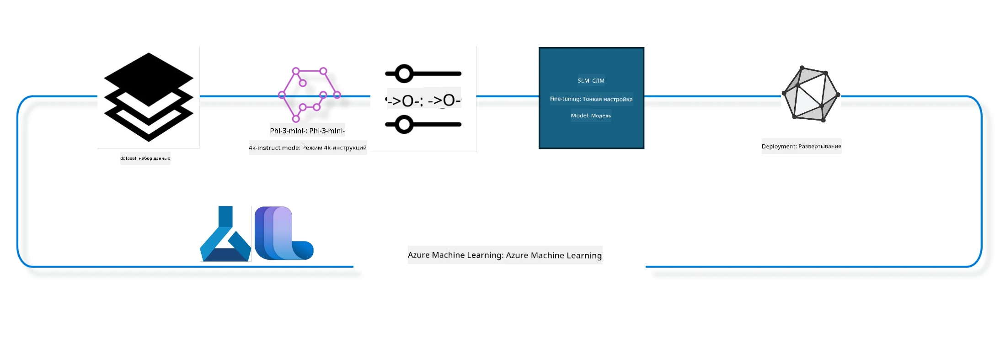

## Как использовать компоненты chat-completion из системного реестра Azure ML для дообучения модели

В этом примере мы проведём дообучение модели Phi-3-mini-4k-instruct для завершения разговора между двумя людьми с использованием набора данных ultrachat_200k.



Пример покажет, как выполнить дообучение с помощью Azure ML SDK и Python, а затем развернуть дообученную модель на онлайн-эндпоинте для вывода в реальном времени.

### Данные для обучения

Мы будем использовать набор данных ultrachat_200k. Это сильно отфильтрованная версия набора UltraChat, которая использовалась для обучения Zephyr-7B-β — передовой модели чата с 7 миллиардами параметров.

### Модель

Мы используем модель Phi-3-mini-4k-instruct, чтобы показать, как пользователь может дообучить модель для задачи chat-completion. Если вы открыли эту записную книжку из карточки конкретной модели, не забудьте заменить имя модели на соответствующее.

### Задачи

- Выбрать модель для дообучения.
- Выбрать и изучить данные для обучения.
- Настроить задачу дообучения.
- Запустить задачу дообучения.
- Просмотреть метрики обучения и оценки.
- Зарегистрировать дообученную модель.
- Развернуть дообученную модель для вывода в реальном времени.
- Очистить ресурсы.

## 1. Настройка необходимых компонентов

- Установить зависимости
- Подключиться к рабочей области AzureML. Подробнее смотрите в настройке аутентификации SDK. Замените <WORKSPACE_NAME>, <RESOURCE_GROUP> и <SUBSCRIPTION_ID> ниже.
- Подключиться к системному реестру azureml
- Установить необязательное имя эксперимента
- Проверить или создать вычислительный ресурс.

> [!NOTE]
> Требуется один узел с GPU, который может содержать несколько видеокарт. Например, на одном узле Standard_NC24rs_v3 находятся 4 NVIDIA V100 GPUs, а в Standard_NC12s_v3 — 2 NVIDIA V100 GPUs. Смотрите документацию для этой информации. Количество видеокарт на узел задаётся параметром gpus_per_node ниже. Правильная настройка гарантирует использование всех GPU в узле. Рекомендуемые SKU вычислительных ресурсов с GPU можно найти здесь и здесь.

### Библиотеки Python

Установите зависимости, выполнив следующую ячейку. Этот шаг обязателен при запуске в новой среде.

```bash
pip install azure-ai-ml
pip install azure-identity
pip install datasets==2.9.0
pip install mlflow
pip install azureml-mlflow
```

### Взаимодействие с Azure ML

1. Этот Python-скрипт используется для взаимодействия с сервисом Azure Machine Learning (Azure ML). Вот разбор того, что он делает:

    - Импортирует необходимые модули из пакетов azure.ai.ml, azure.identity и azure.ai.ml.entities. Также импортируется модуль time.

    - Пытается аутентифицироваться с помощью DefaultAzureCredential(), который упрощает запуск приложений в облаке Azure. Если это не удаётся, используется InteractiveBrowserCredential() с интерактивным входом.

    - Затем пытается создать экземпляр MLClient с помощью метода from_config, который читает настройки из файла config.json. Если это не удаётся, создаёт MLClient вручную, передавая subscription_id, resource_group_name и workspace_name.

    - Создаёт ещё один MLClient для системного реестра Azure ML с именем "azureml", где хранятся модели, пайплайны дообучения и окружения.

    - Устанавливает имя эксперимента в "chat_completion_Phi-3-mini-4k-instruct".

    - Генерирует уникальную временную метку, преобразуя текущее время (в секундах с эпохи, как число с плавающей точкой) в целое число, затем в строку. Эта метка используется для создания уникальных имён и версий.

    ```python
    # Импорт необходимых модулей из Azure ML и Azure Identity
    from azure.ai.ml import MLClient
    from azure.identity import (
        DefaultAzureCredential,
        InteractiveBrowserCredential,
    )
    from azure.ai.ml.entities import AmlCompute
    import time  # Импорт модуля time
    
    # Попытка аутентификации с использованием DefaultAzureCredential
    try:
        credential = DefaultAzureCredential()
        credential.get_token("https://management.azure.com/.default")
    except Exception as ex:  # Если DefaultAzureCredential не удаётся, использовать InteractiveBrowserCredential
        credential = InteractiveBrowserCredential()
    
    # Попытка создать экземпляр MLClient с использованием файла конфигурации по умолчанию
    try:
        workspace_ml_client = MLClient.from_config(credential=credential)
    except:  # Если это не удаётся, создать экземпляр MLClient, вручную предоставив детали
        workspace_ml_client = MLClient(
            credential,
            subscription_id="<SUBSCRIPTION_ID>",
            resource_group_name="<RESOURCE_GROUP>",
            workspace_name="<WORKSPACE_NAME>",
        )
    
    # Создать другой экземпляр MLClient для реестра Azure ML с именем "azureml"
    # В этом реестре хранятся модели, пайплайны дообучения и окружения
    registry_ml_client = MLClient(credential, registry_name="azureml")
    
    # Установить имя эксперимента
    experiment_name = "chat_completion_Phi-3-mini-4k-instruct"
    
    # Сгенерировать уникальную метку времени, которую можно использовать для имён и версий, требующих уникальности
    timestamp = str(int(time.time()))
    ```

## 2. Выбор базовой модели для дообучения

1. Phi-3-mini-4k-instruct — лёгкая современная модель с 3.8 миллиардами параметров, основанная на наборах данных, использованных для Phi-2. Модель относится к семейству Phi-3, и версия Mini выпускается в вариантах 4K и 128K — это длина контекста (в токенах), которую она поддерживает. Для использования модели под нашу задачу необходимо её дообучить. Вы можете просматривать эти модели в Каталоге моделей в AzureML Studio, отфильтровав по задаче chat-completion. В этом примере используется модель Phi-3-mini-4k-instruct. Если вы открыли этот блокнот для другой модели, замените имя и версию модели соответственно.

> [!NOTE]
> Свойство model id модели. Оно будет передано в задачу дообучения. Также доступно как поле Asset ID на странице сведений о модели в Каталоге моделей AzureML Studio.

2. Этот Python-скрипт взаимодействует с сервисом Azure Machine Learning (Azure ML). Вот разбор того, что он делает:

    - Устанавливает модель model_name в "Phi-3-mini-4k-instruct".

    - Использует метод get объекта registry_ml_client.models, чтобы получить последнюю версию модели с указанным именем из системного реестра Azure ML. При вызове get передаются два аргумента: имя модели и метка, указывающая, что нужна последняя версия.

    - Выводит в консоль сообщение с именем, версией и id модели, которая будет использоваться для дообучения. Метод format строки используется для подстановки этих значений из свойств объекта foundation_model.

    ```python
    # Установить имя модели
    model_name = "Phi-3-mini-4k-instruct"
    
    # Получить последнюю версию модели из реестра Azure ML
    foundation_model = registry_ml_client.models.get(model_name, label="latest")
    
    # Вывести имя модели, версию и идентификатор
    # Эта информация полезна для отслеживания и отладки
    print(
        "\n\nUsing model name: {0}, version: {1}, id: {2} for fine tuning".format(
            foundation_model.name, foundation_model.version, foundation_model.id
        )
    )
    ```

## 3. Создание вычислительного ресурса для задачи

Задача дообучения РАБОТАЕТ ТОЛЬКО с вычислительными ресурсами с GPU. Размер ресурса зависит от размера модели, и зачастую бывает сложно выбрать правильный ресурс. В этой ячейке мы помогаем пользователю выбрать подходящий ресурс.

> [!NOTE]
> Ниже указанные вычислительные ресурсы оптимально настроены. Изменение конфигурации может привести к ошибке "Cuda Out Of Memory". В таких случаях попробуйте увеличить размер вычислительного ресурса.

> [!NOTE]
> При выборе compute_cluster_size учитывайте, что вычислительный ресурс доступен в вашей группе ресурсов. Если нужный ресурс недоступен, можно запросить доступ.

### Проверка поддержки модели для дообучения

1. Этот Python-скрипт взаимодействует с моделью Azure Machine Learning (Azure ML). Вот разбор его работы:

    - Импортирует модуль ast, который предоставляет функции для обработки дерева абстрактного синтаксиса Python.

    - Проверяет, содержит ли объект foundation_model (представляющий модель в Azure ML) тег finetune_compute_allow_list. Теги в Azure ML — это пары ключ-значение, которые можно создавать и использовать для фильтрации и сортировки моделей.

    - Если тег finetune_compute_allow_list присутствует, он анализируется с помощью ast.literal_eval, преобразуя строковое значение в список Python. Этот список присваивается переменной computes_allow_list. Выводится сообщение о том, что следует создать compute-ресурс из списка.

    - Если тег отсутствует, переменной computes_allow_list присваивается None, и выводится сообщение, что тег finetune_compute_allow_list не входит в теги модели.

    - В итоге скрипт проверяет наличие конкретного тега в метаданных модели, преобразует его значение в список, если он есть, и сообщает пользователю.

    ```python
    # Импортируйте модуль ast, который предоставляет функции для обработки деревьев абстрактного синтаксиса Python
    import ast
    
    # Проверьте, присутствует ли тег 'finetune_compute_allow_list' в тегах модели
    if "finetune_compute_allow_list" in foundation_model.tags:
        # Если тег присутствует, используйте ast.literal_eval для безопасного разбора значения тега (строки) в список Python
        computes_allow_list = ast.literal_eval(
            foundation_model.tags["finetune_compute_allow_list"]
        )  # преобразовать строку в список Python
        # Выведите сообщение, указывающее, что вычисление должно быть создано из списка
        print(f"Please create a compute from the above list - {computes_allow_list}")
    else:
        # Если тег отсутствует, установите computes_allow_list в None
        computes_allow_list = None
        # Выведите сообщение, указывающее, что тег 'finetune_compute_allow_list' не является частью тегов модели
        print("`finetune_compute_allow_list` is not part of model tags")
    ```

### Проверка вычислительного ресурса

1. Этот Python-скрипт взаимодействует с сервисом Azure Machine Learning (Azure ML) и выполняет несколько проверок на вычислительном ресурсе. Вот разбор его работы:

    - Пытается получить вычислительный ресурс с именем compute_cluster из рабочей области Azure ML. Если статус provisioning ресурса "failed", вызывается ошибка ValueError.

    - Проверяет, что computes_allow_list не None. Если так, приводит все размеры compute ресурсов в списке к нижнему регистру и проверяет, входит ли размер текущего ресурса в этот список. Если нет — выбрасывает ValueError.

    - Если computes_allow_list равно None, проверяет размер ресурса на соответствие списку неподдерживаемых GPU VM. Если размер входит, тоже вызывается ValueError.

    - Получает список всех доступных размеров вычислительных ресурсов в рабочей области. Перебирает этот список, и если имя совпадает с размером текущего ресурса, получает количество GPU для этого размера и ставит флаг gpu_count_found в True.

    - Если gpu_count_found равен True, выводит количество GPU в ресурсе. Если False — вызывается ValueError.

    - В целом скрипт осуществляет проверки состояния ресурса, размера относительно списка разрешённых или запрещённых, а также наличия GPU.

    ```python
    # Вывести сообщение об исключении
    print(e)
    # Выбросить ValueError, если размер вычислительных ресурсов недоступен в рабочем пространстве
    raise ValueError(
        f"WARNING! Compute size {compute_cluster_size} not available in workspace"
    )
    
    # Получить экземпляр вычислительного ресурса из рабочего пространства Azure ML
    compute = workspace_ml_client.compute.get(compute_cluster)
    # Проверить, находится ли состояние предоставления вычислительного экземпляра в состоянии "failed"
    if compute.provisioning_state.lower() == "failed":
        # Выбросить ValueError, если состояние предоставления равно "failed"
        raise ValueError(
            f"Provisioning failed, Compute '{compute_cluster}' is in failed state. "
            f"please try creating a different compute"
        )
    
    # Проверить, что computes_allow_list не равен None
    if computes_allow_list is not None:
        # Преобразовать все размеры вычислительных ресурсов в computes_allow_list в нижний регистр
        computes_allow_list_lower_case = [x.lower() for x in computes_allow_list]
        # Проверить, находится ли размер вычислительного экземпляра в computes_allow_list_lower_case
        if compute.size.lower() not in computes_allow_list_lower_case:
            # Выбросить ValueError, если размер вычислительного экземпляра отсутствует в computes_allow_list_lower_case
            raise ValueError(
                f"VM size {compute.size} is not in the allow-listed computes for finetuning"
            )
    else:
        # Определить список неподдерживаемых размеров GPU VM
        unsupported_gpu_vm_list = [
            "standard_nc6",
            "standard_nc12",
            "standard_nc24",
            "standard_nc24r",
        ]
        # Проверить, находится ли размер вычислительного экземпляра в unsupported_gpu_vm_list
        if compute.size.lower() in unsupported_gpu_vm_list:
            # Выбросить ValueError, если размер вычислительного экземпляра присутствует в unsupported_gpu_vm_list
            raise ValueError(
                f"VM size {compute.size} is currently not supported for finetuning"
            )
    
    # Инициализировать флаг для проверки, найдено ли количество GPU в вычислительном экземпляре
    gpu_count_found = False
    # Получить список всех доступных размеров вычислительных ресурсов в рабочем пространстве
    workspace_compute_sku_list = workspace_ml_client.compute.list_sizes()
    available_sku_sizes = []
    # Итерация по списку доступных размеров вычислительных ресурсов
    for compute_sku in workspace_compute_sku_list:
        available_sku_sizes.append(compute_sku.name)
        # Проверить, совпадает ли имя размера вычислительного ресурса с размером вычислительного экземпляра
        if compute_sku.name.lower() == compute.size.lower():
            # Если да, получить количество GPU для этого размера вычислительных ресурсов и установить gpu_count_found в True
            gpus_per_node = compute_sku.gpus
            gpu_count_found = True
    # Если gpu_count_found равно True, вывести количество GPU в вычислительном экземпляре
    if gpu_count_found:
        print(f"Number of GPU's in compute {compute.size}: {gpus_per_node}")
    else:
        # Если gpu_count_found равно False, выбросить ValueError
        raise ValueError(
            f"Number of GPU's in compute {compute.size} not found. Available skus are: {available_sku_sizes}."
            f"This should not happen. Please check the selected compute cluster: {compute_cluster} and try again."
        )
    ```

## 4. Выбор набора данных для дообучения модели

1. Мы используем набор данных ultrachat_200k. Набор данных разбит на четыре части, подходящие для контролируемого дообучения (supervised fine-tuning, sft). Ранжирование генераций (gen). Количество примеров на каждую часть показано ниже:

    ```bash
    train_sft test_sft  train_gen  test_gen
    207865  23110  256032  28304
    ```

1. Следующие несколько ячеек показывают базовую подготовку данных для дообучения:

### Визуализация некоторых строк данных

Мы хотим, чтобы этот пример работал быстро, поэтому сохраняем файлы train_sft и test_sft, содержащие 5% уже отобранных строк. Это значит, что дообученная модель будет менее точной, и её не следует использовать в реальных задачах.
Скрипт download-dataset.py используется чтобы скачать набор ultrachat_200k и преобразовать его в формат, совместимый с компонентами пайплайна для дообучения. Поскольку набор данных большой, здесь показана только часть.

1. Запуск скрипта ниже скачивает только 5% данных. Этот процент можно увеличить, изменив параметр dataset_split_pc на нужное значение.

> [!NOTE]
> В некоторых языковых моделях присутствуют разные коды языков, поэтому имена колонок в наборе данных должны соответствовать.

1. Пример того, как должны выглядеть данные:
Датасет chat-completion хранится в формате parquet, каждая запись имеет следующую схему:

    - Это JSON (JavaScript Object Notation) документ — популярный формат обмена данными. Это не исполняемый код, а формат для хранения и передачи данных. Вот его структура:

    - "prompt": ключ, содержащий строку с задачей или вопросом, заданным AI-ассистенту.

    - "messages": ключ, содержащий массив объектов. Каждый объект представляет сообщение в диалоге между пользователем и AI-ассистентом. Каждый объект сообщения имеет два ключа:

    - "content": содержит строку с содержимым сообщения.
    - "role": содержит строку с ролью отправителя — "user" или "assistant".
    - "prompt_id": строка с уникальным идентификатором запроса.

1. В этом конкретном JSON-документе представлен диалог, где пользователь просит AI ассистента создать главного героя для дистопической истории. Ассистент отвечает, затем пользователь спрашивает детали, и ассистент соглашается их предоставить. Весь разговор связан с конкретным prompt_id.

    ```python
    {
        // The task or question posed to an AI assistant
        "prompt": "Create a fully-developed protagonist who is challenged to survive within a dystopian society under the rule of a tyrant. ...",
        
        // An array of objects, each representing a message in a conversation between a user and an AI assistant
        "messages":[
            {
                // The content of the user's message
                "content": "Create a fully-developed protagonist who is challenged to survive within a dystopian society under the rule of a tyrant. ...",
                // The role of the entity that sent the message
                "role": "user"
            },
            {
                // The content of the assistant's message
                "content": "Name: Ava\n\n Ava was just 16 years old when the world as she knew it came crashing down. The government had collapsed, leaving behind a chaotic and lawless society. ...",
                // The role of the entity that sent the message
                "role": "assistant"
            },
            {
                // The content of the user's message
                "content": "Wow, Ava's story is so intense and inspiring! Can you provide me with more details.  ...",
                // The role of the entity that sent the message
                "role": "user"
            }, 
            {
                // The content of the assistant's message
                "content": "Certainly! ....",
                // The role of the entity that sent the message
                "role": "assistant"
            }
        ],
        
        // A unique identifier for the prompt
        "prompt_id": "d938b65dfe31f05f80eb8572964c6673eddbd68eff3db6bd234d7f1e3b86c2af"
    }
    ```

### Загрузка данных

1. Этот Python-скрипт используется для загрузки набора данных с помощью вспомогательного скрипта download-dataset.py. Вот его действия:

    - Импортирует модуль os, который обеспечивает доступ к функциям операционной системы.

    - С помощью os.system запускает скрипт download-dataset.py в командной оболочке с параметрами: набор HuggingFaceH4/ultrachat_200k, каталог загрузки ultrachat_200k_dataset и процент разделения данных 5. Функция os.system возвращает статус выполнения команды, его сохраняют в переменную exit_status.

    - Проверяет, что exit_status не равен 0. В операционных системах Unix статус 0 означает успешное выполнение команды, другое значение — ошибка. Если exit_status не 0, генерируется исключение Exception с сообщением об ошибке загрузки.

    - Таким образом, скрипт запускает команду для загрузки набора данных и генерирует исключение при ошибке.

    ```python
    # Импортируйте модуль os, который предоставляет способ использования функциональности, зависящей от операционной системы
    import os
    
    # Используйте функцию os.system для запуска скрипта download-dataset.py в оболочке с определёнными аргументами командной строки
    # Аргументы указывают набор данных для загрузки (HuggingFaceH4/ultrachat_200k), каталог для загрузки (ultrachat_200k_dataset) и процент разбиения набора данных (5)
    # Функция os.system возвращает код завершения выполненной команды; этот код сохраняется в переменной exit_status
    exit_status = os.system(
        "python ./download-dataset.py --dataset HuggingFaceH4/ultrachat_200k --download_dir ultrachat_200k_dataset --dataset_split_pc 5"
    )
    
    # Проверьте, что exit_status не равен 0
    # В системах типа Unix код завершения 0 обычно означает успешное выполнение команды, а любое другое число указывает на ошибку
    # Если exit_status не равен 0, вызовите исключение Exception с сообщением, указывающим, что возникла ошибка при загрузке набора данных
    if exit_status != 0:
        raise Exception("Error downloading dataset")
    ```

### Загрузка данных в DataFrame
1. Этот скрипт на Python загружает файл в формате JSON Lines в DataFrame библиотеки pandas и отображает первые 5 строк. Вот разбор его работы:

    - Он импортирует библиотеку pandas, которая является мощной библиотекой для обработки и анализа данных.

    - Он устанавливает максимальную ширину столбца в настройках отображения pandas равной 0. Это означает, что полный текст каждого столбца будет отображаться без усечения при выводе DataFrame.

    - Он использует функцию pd.read_json для загрузки файла train_sft.jsonl из директории ultrachat_200k_dataset в DataFrame. Аргумент lines=True указывает, что файл имеет формат JSON Lines, где каждая строка является отдельным JSON-объектом.

    - Он использует метод head для отображения первых 5 строк DataFrame. Если строк меньше 5, то будут отображены все.

    - В итоге, этот скрипт загружает файл JSON Lines в DataFrame и отображает первые 5 строк с полным текстом столбцов.
    
    ```python
    # Импортируйте библиотеку pandas, которая является мощной библиотекой для обработки и анализа данных
    import pandas as pd
    
    # Установите максимальную ширину столбца в параметрах отображения pandas равной 0
    # Это означает, что полный текст каждого столбца будет отображаться без усечения при выводе DataFrame
    pd.set_option("display.max_colwidth", 0)
    
    # Используйте функцию pd.read_json для загрузки файла train_sft.jsonl из каталога ultrachat_200k_dataset в DataFrame
    # Аргумент lines=True указывает, что файл находится в формате JSON Lines, где каждая строка является отдельным JSON-объектом
    df = pd.read_json("./ultrachat_200k_dataset/train_sft.jsonl", lines=True)
    
    # Используйте метод head для отображения первых 5 строк DataFrame
    # Если в DataFrame меньше 5 строк, будут отображены все из них
    df.head()
    ```

## 5. Отправка задачи тонкой настройки с использованием модели и данных в качестве входных данных

Создайте задачу, которая использует компонент pipeline для chat-completion. Узнайте больше о всех параметрах, поддерживаемых для тонкой настройки.

### Определение параметров тонкой настройки

1. Параметры тонкой настройки можно разделить на 2 категории – параметры обучения и параметры оптимизации.

1. Параметры обучения определяют аспекты обучения, такие как -

    - Оптимизатор, планировщик для использования
    - Метрика для оптимизации тонкой настройки
    - Количество шагов обучения, размер батча и так далее
    - Параметры оптимизации помогают оптимизировать использование памяти GPU и эффективно использовать вычислительные ресурсы.

1. Ниже приведены некоторые параметры, относящиеся к этой категории. Параметры оптимизации различаются для каждой модели и упакованы с моделью для обработки этих вариаций.

    - Включение deepspeed и LoRA
    - Включение обучения с смешанной точностью
    - Включение обучения на нескольких узлах

> [!NOTE]
> Обучение с учителем может привести к потере выравнивания или катастрофическому забыванию. Рекомендуется проверять эту проблему и запускать этап выравнивания после тонкой настройки.

### Параметры тонкой настройки

1. Этот скрипт на Python настраивает параметры для тонкой настройки модели машинного обучения. Вот его разбор:

    - Он задаёт параметры обучения по умолчанию, такие как количество эпох, размеры батчей для обучения и оценки, скорость обучения и тип планировщика скорости обучения.

    - Он задаёт параметры оптимизации по умолчанию, такие как применение Layer-wise Relevance Propagation (LoRa) и DeepSpeed, а также этап DeepSpeed.

    - Он объединяет параметры обучения и оптимизации в один словарь с названием finetune_parameters.

    - Он проверяет, есть ли у foundation_model какие-либо параметры по умолчанию, специфичные для модели. Если да, то выводит предупреждение и обновляет словарь finetune_parameters этими параметрами. Функция ast.literal_eval используется для преобразования строкового представления параметров в словарь Python.

    - Он выводит окончательный набор параметров тонкой настройки, которые будут использоваться в запуске.

    - В итоге, этот скрипт задаёт и выводит параметры для тонкой настройки модели машинного обучения с возможностью переопределения параметров модели по умолчанию.

    ```python
    # Установите параметры обучения по умолчанию, такие как количество эпох обучения, размер батча для обучения и оценки, скорость обучения и тип планировщика скорости обучения
    training_parameters = dict(
        num_train_epochs=3,
        per_device_train_batch_size=1,
        per_device_eval_batch_size=1,
        learning_rate=5e-6,
        lr_scheduler_type="cosine",
    )
    
    # Установите параметры оптимизации по умолчанию, такие как применение Layer-wise Relevance Propagation (LoRa) и DeepSpeed, а также стадия DeepSpeed
    optimization_parameters = dict(
        apply_lora="true",
        apply_deepspeed="true",
        deepspeed_stage=2,
    )
    
    # Объедините параметры обучения и оптимизации в один словарь с названием finetune_parameters
    finetune_parameters = {**training_parameters, **optimization_parameters}
    
    # Проверьте, есть ли у foundation_model какие-либо параметры по умолчанию, специфичные для модели
    # Если есть, выведите предупреждающее сообщение и обновите словарь finetune_parameters этими параметрами модели по умолчанию
    # Функция ast.literal_eval используется для преобразования параметров модели из строки в словарь Python
    if "model_specific_defaults" in foundation_model.tags:
        print("Warning! Model specific defaults exist. The defaults could be overridden.")
        finetune_parameters.update(
            ast.literal_eval(  # преобразовать строку в словарь Python
                foundation_model.tags["model_specific_defaults"]
            )
        )
    
    # Выведите окончательный набор параметров дообучения, которые будут использоваться для запуска
    print(
        f"The following finetune parameters are going to be set for the run: {finetune_parameters}"
    )
    ```

### Pipeline обучения

1. Этот скрипт на Python определяет функцию для генерации отображаемого имени для пайплайна обучения модели машинного обучения, а затем вызывает эту функцию для генерации и вывода отображаемого имени. Вот что он делает:

1. Определена функция get_pipeline_display_name, которая генерирует отображаемое имя на основе различных параметров, связанных с пайплайном обучения.

1. Внутри функции вычисляется общий размер батча, умножая размер батча на устройство, количество шагов накопления градиента, количество GPU на узел и количество узлов, используемых для тонкой настройки.

1. Получаются различные другие параметры, такие как тип планировщика скорости обучения, применение DeepSpeed, этап DeepSpeed, применение Layer-wise Relevance Propagation (LoRa), ограничение на количество сохраняемых контрольных точек модели и максимальная длина последовательности.

1. Формируется строка, включающая все эти параметры, разделённые дефисами. Если применяется DeepSpeed или LoRa, то в строку добавляются "ds" с этапом DeepSpeed, или "lora" соответственно. Если нет, добавляются "nods" или "nolora" соответственно.

1. Функция возвращает эту строку, которая служит отображаемым именем пайплайна обучения.

1. После определения функция вызывается, чтобы сгенерировать отображаемое имя, которое затем выводится.

1. В итоге, этот скрипт генерирует и выводит отображаемое имя пайплайна обучения модели машинного обучения на основе различных параметров.

    ```python
    # Определите функцию для генерации отображаемого имени для обучающего конвейера
    def get_pipeline_display_name():
        # Рассчитайте общий размер пакета, умножив размер пакета на устройство, количество шагов накопления градиента, количество GPU на узел и количество узлов, используемых для дообучения
        batch_size = (
            int(finetune_parameters.get("per_device_train_batch_size", 1))
            * int(finetune_parameters.get("gradient_accumulation_steps", 1))
            * int(gpus_per_node)
            * int(finetune_parameters.get("num_nodes_finetune", 1))
        )
        # Получите тип планировщика скорости обучения
        scheduler = finetune_parameters.get("lr_scheduler_type", "linear")
        # Получите информацию о применении DeepSpeed
        deepspeed = finetune_parameters.get("apply_deepspeed", "false")
        # Получите этап DeepSpeed
        ds_stage = finetune_parameters.get("deepspeed_stage", "2")
        # Если DeepSpeed применён, включите "ds" с этапом DeepSpeed в отображаемое имя; если нет, включите "nods"
        if deepspeed == "true":
            ds_string = f"ds{ds_stage}"
        else:
            ds_string = "nods"
        # Получите информацию о применении послойного распределения релевантности (LoRa)
        lora = finetune_parameters.get("apply_lora", "false")
        # Если LoRa применён, включите "lora" в отображаемое имя; если нет, включите "nolora"
        if lora == "true":
            lora_string = "lora"
        else:
            lora_string = "nolora"
        # Получите ограничение на количество сохраняемых контрольных точек модели
        save_limit = finetune_parameters.get("save_total_limit", -1)
        # Получите максимальную длину последовательности
        seq_len = finetune_parameters.get("max_seq_length", -1)
        # Сформируйте отображаемое имя, объединив все эти параметры, разделённые дефисами
        return (
            model_name
            + "-"
            + "ultrachat"
            + "-"
            + f"bs{batch_size}"
            + "-"
            + f"{scheduler}"
            + "-"
            + ds_string
            + "-"
            + lora_string
            + f"-save_limit{save_limit}"
            + f"-seqlen{seq_len}"
        )
    
    # Вызовите функцию для генерации отображаемого имени
    pipeline_display_name = get_pipeline_display_name()
    # Выведите отображаемое имя на экран
    print(f"Display name used for the run: {pipeline_display_name}")
    ```

### Конфигурация пайплайна

Этот скрипт на Python определяет и настраивает пайплайн машинного обучения с использованием Azure Machine Learning SDK. Вот разбор его работы:

1. Импортируются необходимые модули из Azure AI ML SDK.

1. Получается компонент пайплайна с именем "chat_completion_pipeline" из реестра.

1. Определяется задача пайплайна с использованием декоратора `@pipeline` и функции `create_pipeline`. Имя пайплайна задаётся переменной `pipeline_display_name`.

1. Внутри функции `create_pipeline` инициализируется полученный компонент пайплайна с различными параметрами, включая путь к модели, кластеры вычислений для разных этапов, разбиения набора данных для обучения и теста, количество GPU для тонкой настройки и другие параметры тонкой настройки.

1. Выход тонкой настройки сопоставляется с выходом пайплайна. Это делается для удобной регистрации модели, что необходимо для развертывания модели в онлайн или пакетной точке доступа.

1. Создаётся экземпляр пайплайна вызовом функции `create_pipeline`.

1. Устанавливается настройка `force_rerun` пайплайна в `True`, что означает, что кэшированные результаты прошлых задач использоваться не будут.

1. Устанавливается настройка `continue_on_step_failure` пайплайна в `False`, что означает, что пайплайн остановится при ошибке любого шага.

1. В итоге, этот скрипт определяет и настраивает пайплайн машинного обучения для задачи chat completion с использованием Azure Machine Learning SDK.

    ```python
    # Импорт необходимых модулей из Azure AI ML SDK
    from azure.ai.ml.dsl import pipeline
    from azure.ai.ml import Input
    
    # Получить компонент конвейера с именем "chat_completion_pipeline" из реестра
    pipeline_component_func = registry_ml_client.components.get(
        name="chat_completion_pipeline", label="latest"
    )
    
    # Определить задание конвейера с помощью декоратора @pipeline и функции create_pipeline
    # Имя конвейера установлено в pipeline_display_name
    @pipeline(name=pipeline_display_name)
    def create_pipeline():
        # Инициализировать полученный компонент конвейера с различными параметрами
        # Это включает путь к модели, вычислительные кластеры для разных этапов, разделы набора данных для обучения и тестирования, количество GPU для дообучения и другие параметры дообучения
        chat_completion_pipeline = pipeline_component_func(
            mlflow_model_path=foundation_model.id,
            compute_model_import=compute_cluster,
            compute_preprocess=compute_cluster,
            compute_finetune=compute_cluster,
            compute_model_evaluation=compute_cluster,
            # Соотнести разделы набора данных с параметрами
            train_file_path=Input(
                type="uri_file", path="./ultrachat_200k_dataset/train_sft.jsonl"
            ),
            test_file_path=Input(
                type="uri_file", path="./ultrachat_200k_dataset/test_sft.jsonl"
            ),
            # Настройки обучения
            number_of_gpu_to_use_finetuning=gpus_per_node,  # Установлено в количество доступных GPU на вычислительном кластере
            **finetune_parameters
        )
        return {
            # Соотнести вывод задания дообучения с выводом задания конвейера
            # Это сделано для удобной регистрации дообученной модели
            # Регистрация модели требуется для развертывания модели на онлайн или пакетной конечной точке
            "trained_model": chat_completion_pipeline.outputs.mlflow_model_folder
        }
    
    # Создать экземпляр конвейера, вызвав функцию create_pipeline
    pipeline_object = create_pipeline()
    
    # Не использовать кешированные результаты из предыдущих заданий
    pipeline_object.settings.force_rerun = True
    
    # Установить продолжение при ошибке шага в False
    # Это означает, что конвейер остановится, если какой-либо шаг завершится с ошибкой
    pipeline_object.settings.continue_on_step_failure = False
    ```

### Отправка задачи

1. Этот скрипт на Python отправляет задачу пайплайна машинного обучения в рабочую область Azure Machine Learning и затем ожидает завершения задачи. Вот что он делает:

    - Он вызывает метод create_or_update объекта jobs в workspace_ml_client для отправки задачи пайплайна. Пайплайн задаётся переменной pipeline_object, а эксперимент, в рамках которого выполняется задача, задаётся переменной experiment_name.

    - Затем он вызывает метод stream объекта jobs в workspace_ml_client для ожидания завершения задачи пайплайна. Задача, для которой идёт ожидание, задаётся по имени из атрибута name объекта pipeline_job.

    - В итоге, этот скрипт отправляет задачу пайплайна машинного обучения в Azure Machine Learning и ждёт её выполнения.

    ```python
    # Отправить задание конвейера в рабочее пространство Azure Machine Learning
    # Конвейер, который будет запущен, указан в pipeline_object
    # Эксперимент, под которым запускается задание, указан в experiment_name
    pipeline_job = workspace_ml_client.jobs.create_or_update(
        pipeline_object, experiment_name=experiment_name
    )
    
    # Ожидать завершения задания конвейера
    # Задание для ожидания указано в атрибуте name объекта pipeline_job
    workspace_ml_client.jobs.stream(pipeline_job.name)
    ```

## 6. Регистрация модели после тонкой настройки в рабочей области

Мы зарегистрируем модель, полученную на выходе задачи тонкой настройки. Это позволит отслеживать происхождение между моделью после тонкой настройки и самой задачей тонкой настройки. Задача тонкой настройки, в свою очередь, отслеживает происхождение фундаментальной модели, данных и кода обучения.

### Регистрация модели ML

1. Этот скрипт на Python регистрирует модель машинного обучения, обученную в пайплайне Azure Machine Learning. Вот что он делает:

    - Импортирует необходимые модули из Azure AI ML SDK.

    - Проверяет, доступен ли выход trained_model из задачи пайплайна, вызывая метод get объекта jobs в workspace_ml_client и обращаясь к атрибуту outputs.

    - Формирует путь к обученной модели, форматируя строку с именем задачи пайплайна и именем выхода ("trained_model").

    - Определяет имя для модели после тонкой настройки, добавляя "-ultrachat-200k" к оригинальному имени модели и заменяя все слэши на дефисы.

    - Готовится к регистрации модели, создавая объект Model с разными параметрами, включая путь к модели, тип модели (MLflow), имя и версию модели, а также описание модели.

    - Регистрирует модель, вызывая метод create_or_update объекта models в workspace_ml_client с объектом Model в качестве аргумента.

    - Выводит зарегистрированную модель.

1. В итоге, этот скрипт регистрирует модель машинного обучения, обученную в пайплайне Azure Machine Learning.
    
    ```python
    # Импортировать необходимые модули из Azure AI ML SDK
    from azure.ai.ml.entities import Model
    from azure.ai.ml.constants import AssetTypes
    
    # Проверить, доступен ли вывод `trained_model` из задания конвейера
    print("pipeline job outputs: ", workspace_ml_client.jobs.get(pipeline_job.name).outputs)
    
    # Построить путь к обученной модели, отформатировав строку с именем задания конвейера и именем вывода ("trained_model")
    model_path_from_job = "azureml://jobs/{0}/outputs/{1}".format(
        pipeline_job.name, "trained_model"
    )
    
    # Определить имя для дообученной модели, добавив "-ultrachat-200k" к исходному имени модели и заменив все слэши на дефисы
    finetuned_model_name = model_name + "-ultrachat-200k"
    finetuned_model_name = finetuned_model_name.replace("/", "-")
    
    print("path to register model: ", model_path_from_job)
    
    # Подготовиться к регистрации модели, создав объект Model с различными параметрами
    # Это включает путь к модели, тип модели (модель MLflow), имя и версию модели, а также описание модели
    prepare_to_register_model = Model(
        path=model_path_from_job,
        type=AssetTypes.MLFLOW_MODEL,
        name=finetuned_model_name,
        version=timestamp,  # Использовать метку времени в качестве версии, чтобы избежать конфликта версий
        description=model_name + " fine tuned model for ultrachat 200k chat-completion",
    )
    
    print("prepare to register model: \n", prepare_to_register_model)
    
    # Зарегистрировать модель, вызвав метод create_or_update объекта models в workspace_ml_client с объектом Model в качестве аргумента
    registered_model = workspace_ml_client.models.create_or_update(
        prepare_to_register_model
    )
    
    # Вывести зарегистрированную модель на печать
    print("registered model: \n", registered_model)
    ```

## 7. Развёртывание модели после тонкой настройки на онлайн-конечную точку

Онлайн-конечные точки предоставляют надёжный REST API, которым можно пользоваться для интеграции с приложениями, которые должны использовать модель.

### Управление конечной точкой

1. Этот скрипт на Python создаёт управляемую онлайн-конечную точку в Azure Machine Learning для зарегистрированной модели. Вот что он делает:

    - Импортирует необходимые модули из Azure AI ML SDK.

    - Определяет уникальное имя для онлайн-конечной точки, добавляя метку времени к строке "ultrachat-completion-".

    - Готовится к созданию онлайн-конечной точки, создавая объект ManagedOnlineEndpoint с параметрами, включая имя конечной точки, описание конечной точки и режим аутентификации ("key").

    - Создаёт онлайн-конечную точку, вызывая метод begin_create_or_update объекта workspace_ml_client с объектом ManagedOnlineEndpoint, затем ждёт окончания операции, вызывая метод wait.

1. В итоге, этот скрипт создаёт управляемую онлайн-конечную точку в Azure Machine Learning для зарегистрированной модели.

    ```python
    # Импортируйте необходимые модули из SDK Azure AI ML
    from azure.ai.ml.entities import (
        ManagedOnlineEndpoint,
        ManagedOnlineDeployment,
        ProbeSettings,
        OnlineRequestSettings,
    )
    
    # Определите уникальное имя для онлайн эндпоинта, добавив метку времени к строке "ultrachat-completion-"
    online_endpoint_name = "ultrachat-completion-" + timestamp
    
    # Подготовьтесь к созданию онлайн эндпоинта, создав объект ManagedOnlineEndpoint с различными параметрами
    # К ним относятся имя эндпоинта, описание эндпоинта и режим аутентификации ("key")
    endpoint = ManagedOnlineEndpoint(
        name=online_endpoint_name,
        description="Online endpoint for "
        + registered_model.name
        + ", fine tuned model for ultrachat-200k-chat-completion",
        auth_mode="key",
    )
    
    # Создайте онлайн эндпоинт, вызвав метод begin_create_or_update объекта workspace_ml_client с ManagedOnlineEndpoint в качестве аргумента
    # Затем дождитесь завершения операции создания, вызвав метод wait
    workspace_ml_client.begin_create_or_update(endpoint).wait()
    ```

> [!NOTE]
> Здесь можно найти список поддерживаемых SKU для развёртывания - [Managed online endpoints SKU list](https://learn.microsoft.com/azure/machine-learning/reference-managed-online-endpoints-vm-sku-list)

### Развёртывание модели ML

1. Этот скрипт на Python развёртывает зарегистрированную модель машинного обучения на управляемой онлайн-конечной точке в Azure Machine Learning. Вот что он делает:

    - Импортирует модуль ast, который предоставляет функции для обработки деревьев грамматики абстрактного синтаксиса Python.

    - Устанавливает тип экземпляра для развёртывания равным "Standard_NC6s_v3".

    - Проверяет, есть ли тег inference_compute_allow_list в фундаментальной модели. Если есть, конвертирует строковое значение тега в список Python и присваивает inference_computes_allow_list. Если нет, присваивает None.

    - Проверяет, входит ли указанный тип экземпляра в список разрешённых. Если нет, выводит сообщение с просьбой выбрать тип из разрешённого списка.

    - Готовится к созданию развёртывания, создавая объект ManagedOnlineDeployment с параметрами, включая имя развёртывания, название конечной точки, ID модели, тип и количество экземпляров, настройки проверки живости и настройки запросов.

    - Создаёт развёртывание, вызывая метод begin_create_or_update объекта workspace_ml_client с объектом ManagedOnlineDeployment, затем ждёт завершения операции методом wait.

    - Устанавливает трафик конечной точки, направляя 100% трафика на развёртывание "demo".

    - Обновляет конечную точку, вызывая метод begin_create_or_update объекта workspace_ml_client с обновлённым объектом конечной точки, затем ждёт завершения операции методом result.

1. В итоге, этот скрипт развёртывает зарегистрированную модель машинного обучения на управляемой онлайн-конечной точке в Azure Machine Learning.

    ```python
    # Импортируйте модуль ast, который предоставляет функции для обработки деревьев абстрактного синтаксического анализа Python
    import ast
    
    # Установите тип экземпляра для развертывания
    instance_type = "Standard_NC6s_v3"
    
    # Проверьте, присутствует ли тег `inference_compute_allow_list` в базовой модели
    if "inference_compute_allow_list" in foundation_model.tags:
        # Если да, преобразуйте значение тега из строки в список Python и присвойте его `inference_computes_allow_list`
        inference_computes_allow_list = ast.literal_eval(
            foundation_model.tags["inference_compute_allow_list"]
        )
        print(f"Please create a compute from the above list - {computes_allow_list}")
    else:
        # Если нет, установите `inference_computes_allow_list` в `None`
        inference_computes_allow_list = None
        print("`inference_compute_allow_list` is not part of model tags")
    
    # Проверьте, находится ли указанный тип экземпляра в списке разрешенных
    if (
        inference_computes_allow_list is not None
        and instance_type not in inference_computes_allow_list
    ):
        print(
            f"`instance_type` is not in the allow listed compute. Please select a value from {inference_computes_allow_list}"
        )
    
    # Подготовьтесь к созданию развертывания, создав объект `ManagedOnlineDeployment` с различными параметрами
    demo_deployment = ManagedOnlineDeployment(
        name="demo",
        endpoint_name=online_endpoint_name,
        model=registered_model.id,
        instance_type=instance_type,
        instance_count=1,
        liveness_probe=ProbeSettings(initial_delay=600),
        request_settings=OnlineRequestSettings(request_timeout_ms=90000),
    )
    
    # Создайте развертывание, вызвав метод `begin_create_or_update` клиента `workspace_ml_client` с объектом `ManagedOnlineDeployment` в качестве аргумента
    # Затем дождитесь завершения операции создания, вызвав метод `wait`
    workspace_ml_client.online_deployments.begin_create_or_update(demo_deployment).wait()
    
    # Установите трафик конечной точки так, чтобы 100% трафика направлялось на развертывание "demo"
    endpoint.traffic = {"demo": 100}
    
    # Обновите конечную точку, вызвав метод `begin_create_or_update` клиента `workspace_ml_client` с объектом `endpoint` в качестве аргумента
    # Затем дождитесь завершения операции обновления, вызвав метод `result`
    workspace_ml_client.begin_create_or_update(endpoint).result()
    ```

## 8. Тестирование конечной точки с примерами данных

Мы возьмём некоторые примеры из тестового набора данных и отправим их в онлайн-конечную точку для вывода предсказаний. Затем отобразим полученные метки вместе с истинными метками.

### Чтение результатов

1. Этот скрипт на Python читает файл в формате JSON Lines в pandas DataFrame, берёт случайную выборку и сбрасывает индексы. Вот что он делает:

    - Читает файл ./ultrachat_200k_dataset/test_gen.jsonl в pandas DataFrame. Функция read_json используется с аргументом lines=True, потому что файл в формате JSON Lines, где каждая строка — отдельный JSON-объект.

    - Берёт случайную выборку из 1 строки DataFrame. Функция sample используется с параметром n=1 для выбора одного случайного ряда.

    - Сбрасывает индекс DataFrame. Функция reset_index с аргументом drop=True удаляет старый индекс и заменяет его новым с целочисленными значениями по умолчанию.

    - Отображает первые 2 строки DataFrame с помощью функции head(2). Однако так как после выборки в DataFrame всего одна строка, будет показана только она.

1. В итоге, этот скрипт читает файл JSON Lines в pandas DataFrame, выбирает одну случайную строку, сбрасывает индекс и отображает первую строку.
    
    ```python
    # Импорт библиотеки pandas
    import pandas as pd
    
    # Считать файл в формате JSON Lines './ultrachat_200k_dataset/test_gen.jsonl' в DataFrame pandas
    # Аргумент 'lines=True' указывает, что файл в формате JSON Lines, где каждая строка является отдельным JSON-объектом
    test_df = pd.read_json("./ultrachat_200k_dataset/test_gen.jsonl", lines=True)
    
    # Взять случайную выборку из 1 строки из DataFrame
    # Аргумент 'n=1' указывает количество случайных строк для выбора
    test_df = test_df.sample(n=1)
    
    # Сбросить индекс DataFrame
    # Аргумент 'drop=True' указывает, что исходный индекс должен быть удалён и заменён новым индексом с целочисленными значениями по умолчанию
    # Аргумент 'inplace=True' указывает, что DataFrame должен быть изменён на месте (без создания нового объекта)
    test_df.reset_index(drop=True, inplace=True)
    
    # Отобразить первые 2 строки DataFrame
    # Однако, поскольку DataFrame содержит только одну строку после выборки, будет отображена только эта одна строка
    test_df.head(2)
    ```

### Создание JSON объекта
1. Этот скрипт на Python создает объект JSON с определенными параметрами и сохраняет его в файл. Вот разбор того, что он делает:

    - Импортирует модуль json, который предоставляет функции для работы с данными JSON.

    - Создает словарь parameters с ключами и значениями, которые представляют параметры для модели машинного обучения. Ключи — "temperature", "top_p", "do_sample" и "max_new_tokens", а их соответствующие значения — 0.6, 0.9, True и 200 соответственно.

    - Создает другой словарь test_json с двумя ключами: "input_data" и "params". Значение "input_data" — это другой словарь с ключами "input_string" и "parameters". Значение "input_string" — это список, содержащий первое сообщение из DataFrame test_df. Значение "parameters" — это ранее созданный словарь parameters. Значение "params" — пустой словарь.

    - Открывает файл с именем sample_score.json
    
    ```python
    # Импортировать модуль json, который предоставляет функции для работы с данными в формате JSON
    import json
    
    # Создать словарь `parameters` с ключами и значениями, представляющими параметры для модели машинного обучения
    # Ключи это "temperature", "top_p", "do_sample" и "max_new_tokens", а соответствующие значения 0.6, 0.9, True и 200 соответственно
    parameters = {
        "temperature": 0.6,
        "top_p": 0.9,
        "do_sample": True,
        "max_new_tokens": 200,
    }
    
    # Создать другой словарь `test_json` с двумя ключами: "input_data" и "params"
    # Значение "input_data" — это другой словарь с ключами "input_string" и "parameters"
    # Значение "input_string" — это список, содержащий первое сообщение из DataFrame `test_df`
    # Значение "parameters" — это ранее созданный словарь `parameters`
    # Значение "params" — пустой словарь
    test_json = {
        "input_data": {
            "input_string": [test_df["messages"][0]],
            "parameters": parameters,
        },
        "params": {},
    }
    
    # Открыть файл с именем `sample_score.json` в каталоге `./ultrachat_200k_dataset` в режиме записи
    with open("./ultrachat_200k_dataset/sample_score.json", "w") as f:
        # Записать словарь `test_json` в файл в формате JSON, используя функцию `json.dump`
        json.dump(test_json, f)
    ```

### Вызов конечной точки

1. Этот скрипт на Python вызывает онлайн-конечную точку в Azure Machine Learning для оценки файла JSON. Вот разбор того, что он делает:

    - Вызывает метод invoke у свойства online_endpoints объекта workspace_ml_client. Этот метод используется для отправки запроса к онлайн-конечной точке и получения ответа.

    - Указывает имя конечной точки и развертывания с помощью аргументов endpoint_name и deployment_name. В данном случае имя конечной точки хранится в переменной online_endpoint_name, а имя развертывания — "demo".

    - Указывает путь к JSON-файлу для оценки с помощью аргумента request_file. В данном случае файл — ./ultrachat_200k_dataset/sample_score.json.

    - Сохраняет ответ от конечной точки в переменную response.

    - Выводит необработанный ответ.

1. В общем, этот скрипт вызывает онлайн-конечную точку в Azure Machine Learning для оценки JSON-файла и выводит ответ.

    ```python
    # Вызовите онлайн-конечную точку в Azure Machine Learning для оценки файла `sample_score.json`
    # Метод `invoke` свойства `online_endpoints` объекта `workspace_ml_client` используется для отправки запроса к онлайн-конечной точке и получения ответа
    # Аргумент `endpoint_name` указывает имя конечной точки, которое хранится в переменной `online_endpoint_name`
    # Аргумент `deployment_name` указывает имя развертывания, которое равно "demo"
    # Аргумент `request_file` указывает путь к JSON-файлу для оценки, который находится по адресу `./ultrachat_200k_dataset/sample_score.json`
    response = workspace_ml_client.online_endpoints.invoke(
        endpoint_name=online_endpoint_name,
        deployment_name="demo",
        request_file="./ultrachat_200k_dataset/sample_score.json",
    )
    
    # Вывести необработанный ответ от конечной точки
    print("raw response: \n", response, "\n")
    ```

## 9. Удаление онлайн-конечной точки

1. Не забудьте удалить онлайн-конечную точку, иначе вы продолжите платить за используемые этим конечным пунктом вычислительные ресурсы. Эта строка кода на Python удаляет онлайн-конечную точку в Azure Machine Learning. Вот разбор того, что она делает:

    - Вызывает метод begin_delete у свойства online_endpoints объекта workspace_ml_client. Этот метод используется для начала удаления онлайн-конечной точки.

    - Указывает имя конечной точки для удаления с помощью аргумента name. В данном случае имя конечной точки хранится в переменной online_endpoint_name.

    - Вызывает метод wait, чтобы дождаться завершения операции удаления. Это блокирующая операция, то есть она не позволяет скрипту продолжить выполнение, пока удаление не завершится.

    - В итоге эта строка кода начинает удаление онлайн-конечной точки в Azure Machine Learning и ждет завершения операции.

    ```python
    # Удалить онлайн-эндпоинт в Azure Machine Learning
    # Метод `begin_delete` свойства `online_endpoints` объекта `workspace_ml_client` используется для начала удаления онлайн-эндпоинта
    # Аргумент `name` указывает имя эндпоинта для удаления, которое хранится в переменной `online_endpoint_name`
    # Вызывается метод `wait`, чтобы ожидать завершения операции удаления. Это блокирующая операция, что означает, что скрипт не продолжится, пока удаление не завершится
    workspace_ml_client.online_endpoints.begin_delete(name=online_endpoint_name).wait()
    ```

---

<!-- CO-OP TRANSLATOR DISCLAIMER START -->
**Отказ от ответственности**:  
Данный документ был переведён с помощью сервиса автоматического перевода [Co-op Translator](https://github.com/Azure/co-op-translator). Несмотря на наши усилия по обеспечению точности, имейте в виду, что автоматические переводы могут содержать ошибки или неточности. Оригинальный документ на его родном языке следует считать авторитетным источником. Для критически важной информации рекомендуется обращаться к профессиональному человеческому переводу. Мы не несём ответственности за любые недоразумения или неправильные толкования, возникшие в результате использования данного перевода.
<!-- CO-OP TRANSLATOR DISCLAIMER END -->