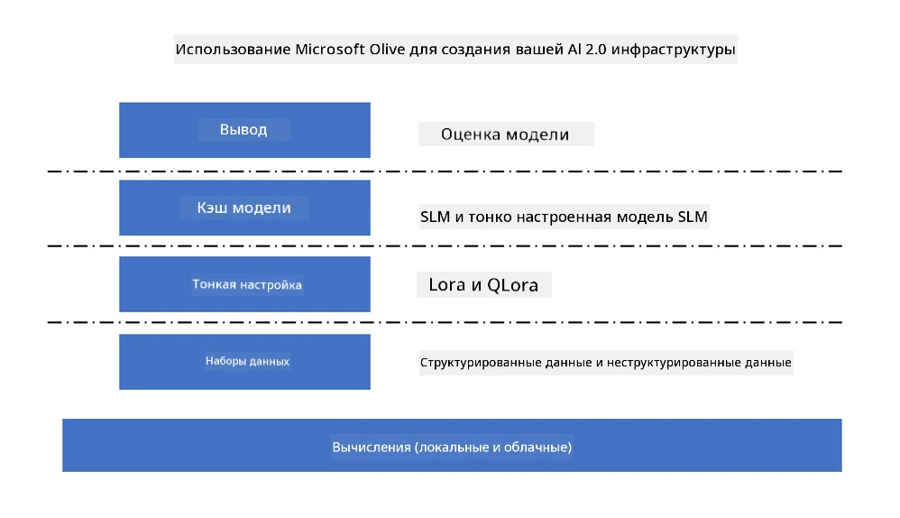
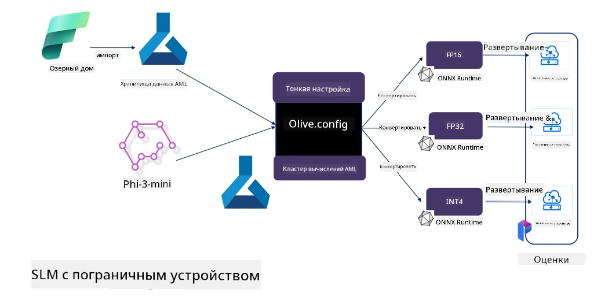

# **Тонкая настройка Phi-3 с Microsoft Olive**

[Olive](https://github.com/microsoft/OLive?WT.mc_id=aiml-138114-kinfeylo) — это удобный инструмент для оптимизации моделей с учётом аппаратных особенностей, который объединяет передовые методы сжатия, оптимизации и компиляции моделей.

Он создан для упрощения процесса оптимизации моделей машинного обучения, обеспечивая максимально эффективное использование конкретных аппаратных архитектур.

Будь то облачные приложения или устройства на периферии, Olive позволяет легко и эффективно оптимизировать ваши модели.

## Основные возможности:
- Olive собирает и автоматизирует методы оптимизации для нужных аппаратных платформ.
- Нет универсального метода оптимизации для всех случаев, поэтому Olive поддерживает расширяемость, позволяя экспертам внедрять свои инновационные решения.

## Снижение затрат на разработку:
- Разработчикам часто приходится осваивать и использовать несколько инструментов от разных производителей аппаратного обеспечения для подготовки и оптимизации обученных моделей к развертыванию.
- Olive упрощает этот процесс, автоматизируя методы оптимизации под нужное оборудование.

## Готовое решение для сквозной оптимизации:

Комбинируя и настраивая интегрированные методы, Olive предлагает единое решение для сквозной оптимизации.
При этом учитываются ограничения по точности и задержкам при оптимизации моделей.

## Использование Microsoft Olive для тонкой настройки

Microsoft Olive — это очень простой в использовании инструмент с открытым исходным кодом для оптимизации моделей, который охватывает как тонкую настройку, так и референсные решения в области генеративного искусственного интеллекта. Он требует лишь простой настройки, а в сочетании с открытыми малыми языковыми моделями и соответствующими средами выполнения (AzureML / локальный GPU, CPU, DirectML) позволяет автоматически оптимизировать модель, выполнить тонкую настройку или референс, а также подобрать лучшую модель для развертывания в облаке или на периферийных устройствах. Это даёт возможность компаниям создавать собственные отраслевые вертикальные модели как локально, так и в облаке.



## Тонкая настройка Phi-3 с Microsoft Olive



## Пример кода и пример использования Phi-3 Olive
В этом примере вы используете Olive для:

- Тонкой настройки адаптера LoRA для классификации фраз на категории: Грусть, Радость, Страх, Удивление.
- Объединения весов адаптера с базовой моделью.
- Оптимизации и квантизации модели до int4.

[Пример кода](../../code/03.Finetuning/olive-ort-example/README.md)

### Установка Microsoft Olive

Установка Microsoft Olive очень проста, поддерживается для CPU, GPU, DirectML и Azure ML.

```bash
pip install olive-ai
```

Если вы хотите запустить ONNX-модель на CPU, используйте

```bash
pip install olive-ai[cpu]
```

Если хотите запустить ONNX-модель на GPU, используйте

```python
pip install olive-ai[gpu]
```

Если хотите использовать Azure ML, используйте

```python
pip install git+https://github.com/microsoft/Olive#egg=olive-ai[azureml]
```

**Внимание**  
Требования к ОС: Ubuntu 20.04 / 22.04

### **Config.json Microsoft Olive**

После установки вы можете настроить различные параметры, специфичные для модели, через файл Config, включая данные, вычисления, обучение, развертывание и генерацию модели.

**1. Данные**

Microsoft Olive поддерживает обучение как на локальных, так и на облачных данных, что можно настроить в конфигурации.

*Настройка локальных данных*

Вы можете просто указать набор данных для обучения тонкой настройки, обычно в формате json, и адаптировать его под шаблон данных. Это нужно корректировать в зависимости от требований модели (например, адаптировать под формат, необходимый для Microsoft Phi-3-mini. Если у вас другие модели, обратитесь к требованиям по формату тонкой настройки для них).

```json

    "data_configs": [
        {
            "name": "dataset_default_train",
            "type": "HuggingfaceContainer",
            "load_dataset_config": {
                "params": {
                    "data_name": "json", 
                    "data_files":"dataset/dataset-classification.json",
                    "split": "train"
                }
            },
            "pre_process_data_config": {
                "params": {
                    "dataset_type": "corpus",
                    "text_cols": [
                            "phrase",
                            "tone"
                    ],
                    "text_template": "### Text: {phrase}\n### The tone is:\n{tone}",
                    "corpus_strategy": "join",
                    "source_max_len": 2048,
                    "pad_to_max_len": false,
                    "use_attention_mask": false
                }
            }
        }
    ],
```

**Настройка облачных источников данных**

Связывая хранилище данных Azure AI Studio/Azure Machine Learning Service, можно подключать данные из облака. Через Microsoft Fabric и Azure Data можно подключать разные источники данных в Azure AI Studio/Azure Machine Learning Service для поддержки тонкой настройки.

```json

    "data_configs": [
        {
            "name": "dataset_default_train",
            "type": "HuggingfaceContainer",
            "load_dataset_config": {
                "params": {
                    "data_name": "json", 
                    "data_files": {
                        "type": "azureml_datastore",
                        "config": {
                            "azureml_client": {
                                "subscription_id": "Your Azure Subscrition ID",
                                "resource_group": "Your Azure Resource Group",
                                "workspace_name": "Your Azure ML Workspaces name"
                            },
                            "datastore_name": "workspaceblobstore",
                            "relative_path": "Your train_data.json Azure ML Location"
                        }
                    },
                    "split": "train"
                }
            },
            "pre_process_data_config": {
                "params": {
                    "dataset_type": "corpus",
                    "text_cols": [
                            "Question",
                            "Best Answer"
                    ],
                    "text_template": "<|user|>\n{Question}<|end|>\n<|assistant|>\n{Best Answer}\n<|end|>",
                    "corpus_strategy": "join",
                    "source_max_len": 2048,
                    "pad_to_max_len": false,
                    "use_attention_mask": false
                }
            }
        }
    ],
    
```

**2. Настройка вычислений**

Если нужно работать локально, можно использовать локальные ресурсы данных. Для использования ресурсов Azure AI Studio / Azure Machine Learning Service необходимо настроить соответствующие параметры Azure, имя вычислительного ресурса и т.д.

```json

    "systems": {
        "aml": {
            "type": "AzureML",
            "config": {
                "accelerators": ["gpu"],
                "hf_token": true,
                "aml_compute": "Your Azure AI Studio / Azure Machine Learning Service Compute Name",
                "aml_docker_config": {
                    "base_image": "Your Azure AI Studio / Azure Machine Learning Service docker",
                    "conda_file_path": "conda.yaml"
                }
            }
        },
        "azure_arc": {
            "type": "AzureML",
            "config": {
                "accelerators": ["gpu"],
                "aml_compute": "Your Azure AI Studio / Azure Machine Learning Service Compute Name",
                "aml_docker_config": {
                    "base_image": "Your Azure AI Studio / Azure Machine Learning Service docker",
                    "conda_file_path": "conda.yaml"
                }
            }
        }
    },
```

***Внимание***

Поскольку запуск происходит через контейнер в Azure AI Studio/Azure Machine Learning Service, необходимо настроить требуемую среду. Это делается в файле conda.yaml.

```yaml

name: project_environment
channels:
  - defaults
dependencies:
  - python=3.8.13
  - pip=22.3.1
  - pip:
      - einops
      - accelerate
      - azure-keyvault-secrets
      - azure-identity
      - bitsandbytes
      - datasets
      - huggingface_hub
      - peft
      - scipy
      - sentencepiece
      - torch>=2.2.0
      - transformers
      - git+https://github.com/microsoft/Olive@jiapli/mlflow_loading_fix#egg=olive-ai[gpu]
      - --extra-index-url https://aiinfra.pkgs.visualstudio.com/PublicPackages/_packaging/ORT-Nightly/pypi/simple/ 
      - ort-nightly-gpu==1.18.0.dev20240307004
      - --extra-index-url https://aiinfra.pkgs.visualstudio.com/PublicPackages/_packaging/onnxruntime-genai/pypi/simple/
      - onnxruntime-genai-cuda

    

```

**3. Выбор SLM**

Вы можете использовать модель напрямую с Hugging Face или выбрать модель из каталога Azure AI Studio / Azure Machine Learning. В примере ниже используется Microsoft Phi-3-mini.

Если модель у вас локально, используйте этот способ

```json

    "input_model":{
        "type": "PyTorchModel",
        "config": {
            "hf_config": {
                "model_name": "model-cache/microsoft/phi-3-mini",
                "task": "text-generation",
                "model_loading_args": {
                    "trust_remote_code": true
                }
            }
        }
    },
```

Если хотите использовать модель из Azure AI Studio / Azure Machine Learning Service, используйте этот способ

```json

    "input_model":{
        "type": "PyTorchModel",
        "config": {
            "model_path": {
                "type": "azureml_registry_model",
                "config": {
                    "name": "microsoft/Phi-3-mini-4k-instruct",
                    "registry_name": "azureml-msr",
                    "version": "11"
                }
            },
             "model_file_format": "PyTorch.MLflow",
             "hf_config": {
                "model_name": "microsoft/Phi-3-mini-4k-instruct",
                "task": "text-generation",
                "from_pretrained_args": {
                    "trust_remote_code": true
                }
            }
        }
    },
```

**Внимание:**  
Для интеграции с Azure AI Studio / Azure Machine Learning Service при настройке модели обращайте внимание на номер версии и соответствующие имена.

Все модели в Azure должны быть настроены как PyTorch.MLflow.

Необходимо иметь аккаунт Hugging Face и связать ключ с Key value в Azure AI Studio / Azure Machine Learning.

**4. Алгоритм**

Microsoft Olive отлично поддерживает алгоритмы тонкой настройки Lora и QLora. Вам нужно лишь настроить соответствующие параметры. Здесь приведён пример для QLora.

```json
        "lora": {
            "type": "LoRA",
            "config": {
                "target_modules": [
                    "o_proj",
                    "qkv_proj"
                ],
                "double_quant": true,
                "lora_r": 64,
                "lora_alpha": 64,
                "lora_dropout": 0.1,
                "train_data_config": "dataset_default_train",
                "eval_dataset_size": 0.3,
                "training_args": {
                    "seed": 0,
                    "data_seed": 42,
                    "per_device_train_batch_size": 1,
                    "per_device_eval_batch_size": 1,
                    "gradient_accumulation_steps": 4,
                    "gradient_checkpointing": false,
                    "learning_rate": 0.0001,
                    "num_train_epochs": 3,
                    "max_steps": 10,
                    "logging_steps": 10,
                    "evaluation_strategy": "steps",
                    "eval_steps": 187,
                    "group_by_length": true,
                    "adam_beta2": 0.999,
                    "max_grad_norm": 0.3
                }
            }
        },
```

Если нужна квантизация, основная ветка Microsoft Olive уже поддерживает метод onnxruntime-genai. Вы можете настроить его по своим потребностям:

1. Объединить веса адаптера с базовой моделью  
2. Конвертировать модель в onnx с нужной точностью с помощью ModelBuilder

например, конвертация в квантизированный INT4

```json

        "merge_adapter_weights": {
            "type": "MergeAdapterWeights"
        },
        "builder": {
            "type": "ModelBuilder",
            "config": {
                "precision": "int4"
            }
        }
```

**Внимание**  
- При использовании QLoRA пока не поддерживается квантизация через ONNXRuntime-genai.  
- Здесь стоит отметить, что вы можете настраивать вышеописанные шаги по своему усмотрению. Не обязательно выполнять все шаги полностью. В зависимости от задач можно использовать только алгоритмические шаги без тонкой настройки. В конце необходимо настроить соответствующие движки.

```json

    "engine": {
        "log_severity_level": 0,
        "host": "aml",
        "target": "aml",
        "search_strategy": false,
        "execution_providers": ["CUDAExecutionProvider"],
        "cache_dir": "../model-cache/models/phi3-finetuned/cache",
        "output_dir" : "../model-cache/models/phi3-finetuned"
    }
```

**5. Завершение тонкой настройки**

Выполните команду в каталоге с файлом olive-config.json

```bash
olive run --config olive-config.json  
```

**Отказ от ответственности**:  
Этот документ был переведен с помощью сервиса автоматического перевода [Co-op Translator](https://github.com/Azure/co-op-translator). Несмотря на наши усилия по обеспечению точности, просим учитывать, что автоматические переводы могут содержать ошибки или неточности. Оригинальный документ на его исходном языке следует считать авторитетным источником. Для получения критически важной информации рекомендуется обращаться к профессиональному человеческому переводу. Мы не несем ответственности за любые недоразумения или неправильные толкования, возникшие в результате использования данного перевода.