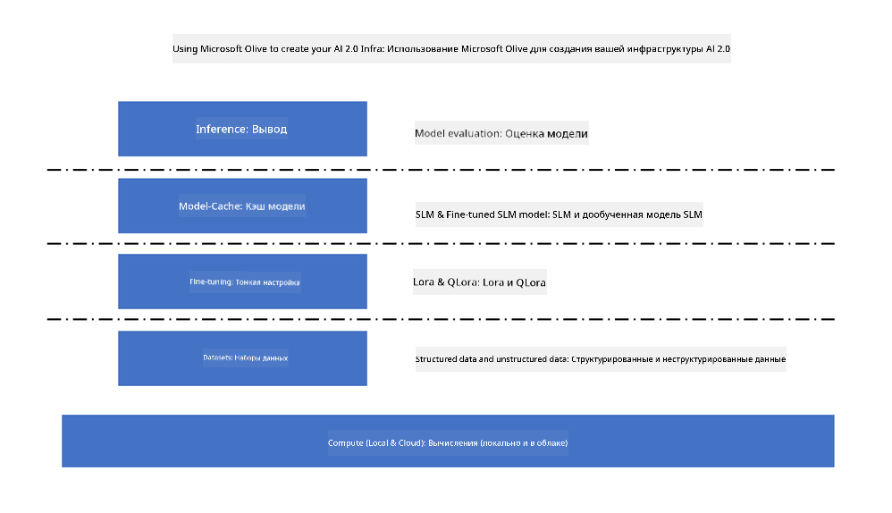
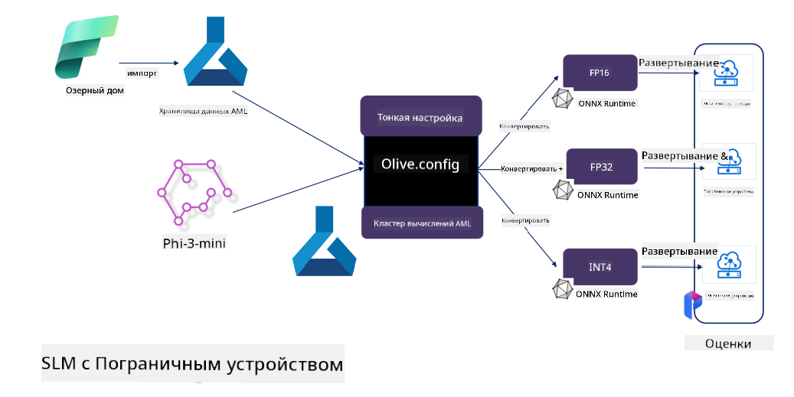

<!--
CO_OP_TRANSLATOR_METADATA:
{
  "original_hash": "5764be88ad2eb4f341e742eb8f14fab1",
  "translation_date": "2025-05-07T13:13:45+00:00",
  "source_file": "md/03.FineTuning/FineTuning_MicrosoftOlive.md",
  "language_code": "ru"
}
-->
# **Тонкая настройка Phi-3 с Microsoft Olive**

[Olive](https://github.com/microsoft/OLive?WT.mc_id=aiml-138114-kinfeylo) — это удобный инструмент для оптимизации моделей с учётом аппаратного обеспечения, который объединяет передовые методы сжатия, оптимизации и компиляции моделей.

Он создан, чтобы упростить процесс оптимизации моделей машинного обучения, обеспечивая максимально эффективное использование конкретных аппаратных архитектур.

Будь то облачные приложения или устройства на периферии, Olive позволяет легко и эффективно оптимизировать ваши модели.

## Основные возможности:
- Olive собирает и автоматизирует методы оптимизации для выбранных аппаратных платформ.
- Поскольку ни одна техника оптимизации не подходит для всех случаев, Olive предоставляет возможность расширения, позволяя экспертам индустрии внедрять свои инновационные методы.

## Снижение затрат на разработку:
- Разработчикам часто приходится изучать и использовать множество инструментов, специфичных для разных производителей оборудования, чтобы подготовить и оптимизировать обученные модели для развёртывания.
- Olive упрощает этот процесс, автоматизируя методы оптимизации для нужного оборудования.

## Готовое решение для сквозной оптимизации:

Комбинируя и настраивая интегрированные методы, Olive предлагает единое решение для сквозной оптимизации.
При оптимизации моделей учитываются ограничения по точности и задержке.

## Использование Microsoft Olive для тонкой настройки

Microsoft Olive — это очень простой в использовании open source инструмент оптимизации моделей, который охватывает как тонкую настройку, так и референс в области генеративного искусственного интеллекта. Он требует лишь простой настройки, а в сочетании с открытыми малыми языковыми моделями и соответствующими средами выполнения (AzureML / локальный GPU, CPU, DirectML) позволяет автоматически оптимизировать модель, выполняя тонкую настройку или референс, и находить лучшую модель для развёртывания в облаке или на устройствах на периферии. Это даёт возможность компаниям создавать собственные отраслевые модели как локально, так и в облаке.



## Тонкая настройка Phi-3 с Microsoft Olive



## Пример кода и использование Phi-3 Olive
В этом примере вы воспользуетесь Olive для:

- Тонкой настройки адаптера LoRA для классификации фраз на категории Sad, Joy, Fear, Surprise.
- Объединения весов адаптера с базовой моделью.
- Оптимизации и квантизации модели в int4.

[Пример кода](../../code/03.Finetuning/olive-ort-example/README.md)

### Установка Microsoft Olive

Установка Microsoft Olive очень проста, поддерживается для CPU, GPU, DirectML и Azure ML

```bash
pip install olive-ai
```

Если вы хотите запустить ONNX-модель на CPU, можно использовать

```bash
pip install olive-ai[cpu]
```

Если хотите запустить ONNX-модель на GPU, используйте

```python
pip install olive-ai[gpu]
```

Для работы через Azure ML используйте

```python
pip install git+https://github.com/microsoft/Olive#egg=olive-ai[azureml]
```

**Примечание**
Требования к ОС: Ubuntu 20.04 / 22.04

### **Файл конфигурации Microsoft Olive Config.json**

После установки можно настроить различные параметры, специфичные для модели, через файл Config, включая данные, вычисления, обучение, развёртывание и генерацию модели.

**1. Данные**

Microsoft Olive поддерживает обучение как на локальных данных, так и на данных из облака, что можно настроить в конфигурации.

*Настройка локальных данных*

Вы можете просто указать набор данных для обучения тонкой настройки, обычно в формате json, и адаптировать его с помощью шаблона данных. Это нужно делать в соответствии с требованиями модели (например, адаптировать под формат Microsoft Phi-3-mini. Если у вас другие модели, обратитесь к требуемым форматам тонкой настройки для них).

```json

    "data_configs": [
        {
            "name": "dataset_default_train",
            "type": "HuggingfaceContainer",
            "load_dataset_config": {
                "params": {
                    "data_name": "json", 
                    "data_files":"dataset/dataset-classification.json",
                    "split": "train"
                }
            },
            "pre_process_data_config": {
                "params": {
                    "dataset_type": "corpus",
                    "text_cols": [
                            "phrase",
                            "tone"
                    ],
                    "text_template": "### Text: {phrase}\n### The tone is:\n{tone}",
                    "corpus_strategy": "join",
                    "source_max_len": 2048,
                    "pad_to_max_len": false,
                    "use_attention_mask": false
                }
            }
        }
    ],
```

**Настройка облачных источников данных**

Связывая хранилище данных Azure AI Studio/Azure Machine Learning Service, можно подключать данные из облака, выбирая различные источники через Microsoft Fabric и Azure Data для поддержки обучения.

```json

    "data_configs": [
        {
            "name": "dataset_default_train",
            "type": "HuggingfaceContainer",
            "load_dataset_config": {
                "params": {
                    "data_name": "json", 
                    "data_files": {
                        "type": "azureml_datastore",
                        "config": {
                            "azureml_client": {
                                "subscription_id": "Your Azure Subscrition ID",
                                "resource_group": "Your Azure Resource Group",
                                "workspace_name": "Your Azure ML Workspaces name"
                            },
                            "datastore_name": "workspaceblobstore",
                            "relative_path": "Your train_data.json Azure ML Location"
                        }
                    },
                    "split": "train"
                }
            },
            "pre_process_data_config": {
                "params": {
                    "dataset_type": "corpus",
                    "text_cols": [
                            "Question",
                            "Best Answer"
                    ],
                    "text_template": "<|user|>\n{Question}<|end|>\n<|assistant|>\n{Best Answer}\n<|end|>",
                    "corpus_strategy": "join",
                    "source_max_len": 2048,
                    "pad_to_max_len": false,
                    "use_attention_mask": false
                }
            }
        }
    ],
    
```

**2. Конфигурация вычислений**

Если нужно работать локально, можно использовать локальные ресурсы. Для использования ресурсов Azure AI Studio / Azure Machine Learning Service необходимо настроить соответствующие параметры Azure, имя вычислительного ресурса и прочее.

```json

    "systems": {
        "aml": {
            "type": "AzureML",
            "config": {
                "accelerators": ["gpu"],
                "hf_token": true,
                "aml_compute": "Your Azure AI Studio / Azure Machine Learning Service Compute Name",
                "aml_docker_config": {
                    "base_image": "Your Azure AI Studio / Azure Machine Learning Service docker",
                    "conda_file_path": "conda.yaml"
                }
            }
        },
        "azure_arc": {
            "type": "AzureML",
            "config": {
                "accelerators": ["gpu"],
                "aml_compute": "Your Azure AI Studio / Azure Machine Learning Service Compute Name",
                "aml_docker_config": {
                    "base_image": "Your Azure AI Studio / Azure Machine Learning Service docker",
                    "conda_file_path": "conda.yaml"
                }
            }
        }
    },
```

***Примечание***

Поскольку запуск происходит через контейнер в Azure AI Studio/Azure Machine Learning Service, необходимо настроить требуемую среду. Это делается в файле conda.yaml.

```yaml

name: project_environment
channels:
  - defaults
dependencies:
  - python=3.8.13
  - pip=22.3.1
  - pip:
      - einops
      - accelerate
      - azure-keyvault-secrets
      - azure-identity
      - bitsandbytes
      - datasets
      - huggingface_hub
      - peft
      - scipy
      - sentencepiece
      - torch>=2.2.0
      - transformers
      - git+https://github.com/microsoft/Olive@jiapli/mlflow_loading_fix#egg=olive-ai[gpu]
      - --extra-index-url https://aiinfra.pkgs.visualstudio.com/PublicPackages/_packaging/ORT-Nightly/pypi/simple/ 
      - ort-nightly-gpu==1.18.0.dev20240307004
      - --extra-index-url https://aiinfra.pkgs.visualstudio.com/PublicPackages/_packaging/onnxruntime-genai/pypi/simple/
      - onnxruntime-genai-cuda

    

```

**3. Выбор SLM**

Можно использовать модель напрямую с Hugging Face или выбрать модель из каталога Azure AI Studio / Azure Machine Learning. В приведённом ниже примере используется Microsoft Phi-3-mini.

Если модель у вас локально, используйте следующий способ

```json

    "input_model":{
        "type": "PyTorchModel",
        "config": {
            "hf_config": {
                "model_name": "model-cache/microsoft/phi-3-mini",
                "task": "text-generation",
                "model_loading_args": {
                    "trust_remote_code": true
                }
            }
        }
    },
```

Если хотите использовать модель из Azure AI Studio / Azure Machine Learning Service, используйте

```json

    "input_model":{
        "type": "PyTorchModel",
        "config": {
            "model_path": {
                "type": "azureml_registry_model",
                "config": {
                    "name": "microsoft/Phi-3-mini-4k-instruct",
                    "registry_name": "azureml-msr",
                    "version": "11"
                }
            },
             "model_file_format": "PyTorch.MLflow",
             "hf_config": {
                "model_name": "microsoft/Phi-3-mini-4k-instruct",
                "task": "text-generation",
                "from_pretrained_args": {
                    "trust_remote_code": true
                }
            }
        }
    },
```

**Примечание:**
Для интеграции с Azure AI Studio / Azure Machine Learning Service при настройке модели обратите внимание на номер версии и соответствующие имена.

Все модели в Azure должны быть настроены на PyTorch.MLflow.

Для работы нужен аккаунт Hugging Face и привязка ключа к значению Key в Azure AI Studio / Azure Machine Learning.

**4. Алгоритм**

Microsoft Olive хорошо инкапсулирует алгоритмы тонкой настройки Lora и QLora. Нужно лишь настроить несколько параметров. В качестве примера рассмотрим QLora.

```json
        "lora": {
            "type": "LoRA",
            "config": {
                "target_modules": [
                    "o_proj",
                    "qkv_proj"
                ],
                "double_quant": true,
                "lora_r": 64,
                "lora_alpha": 64,
                "lora_dropout": 0.1,
                "train_data_config": "dataset_default_train",
                "eval_dataset_size": 0.3,
                "training_args": {
                    "seed": 0,
                    "data_seed": 42,
                    "per_device_train_batch_size": 1,
                    "per_device_eval_batch_size": 1,
                    "gradient_accumulation_steps": 4,
                    "gradient_checkpointing": false,
                    "learning_rate": 0.0001,
                    "num_train_epochs": 3,
                    "max_steps": 10,
                    "logging_steps": 10,
                    "evaluation_strategy": "steps",
                    "eval_steps": 187,
                    "group_by_length": true,
                    "adam_beta2": 0.999,
                    "max_grad_norm": 0.3
                }
            }
        },
```

Если нужна квантизация, основная ветка Microsoft Olive уже поддерживает метод onnxruntime-genai. Настройте её по потребностям:

1. Объединение весов адаптера с базовой моделью
2. Конвертация модели в onnx с нужной точностью через ModelBuilder

Например, преобразование в квантизированный INT4

```json

        "merge_adapter_weights": {
            "type": "MergeAdapterWeights"
        },
        "builder": {
            "type": "ModelBuilder",
            "config": {
                "precision": "int4"
            }
        }
```

**Примечание**
- При использовании QLoRA пока не поддерживается квантизация через ONNXRuntime-genai.
- Важно: вы можете настраивать вышеуказанные шаги по своему усмотрению. Не обязательно выполнять все полностью. В зависимости от задач можно использовать только алгоритмические шаги без тонкой настройки, а в конце настроить соответствующие движки.

```json

    "engine": {
        "log_severity_level": 0,
        "host": "aml",
        "target": "aml",
        "search_strategy": false,
        "execution_providers": ["CUDAExecutionProvider"],
        "cache_dir": "../model-cache/models/phi3-finetuned/cache",
        "output_dir" : "../model-cache/models/phi3-finetuned"
    }
```

**5. Завершение тонкой настройки**

Выполните команду в каталоге с файлом olive-config.json

```bash
olive run --config olive-config.json  
```

**Отказ от ответственности**:  
Этот документ был переведен с помощью сервиса автоматического перевода [Co-op Translator](https://github.com/Azure/co-op-translator). Несмотря на наши усилия по обеспечению точности, имейте в виду, что автоматический перевод может содержать ошибки или неточности. Оригинальный документ на исходном языке следует считать авторитетным источником. Для критически важной информации рекомендуется использовать профессиональный перевод, выполненный человеком. Мы не несем ответственности за любые недоразумения или неправильные толкования, возникшие в результате использования данного перевода.