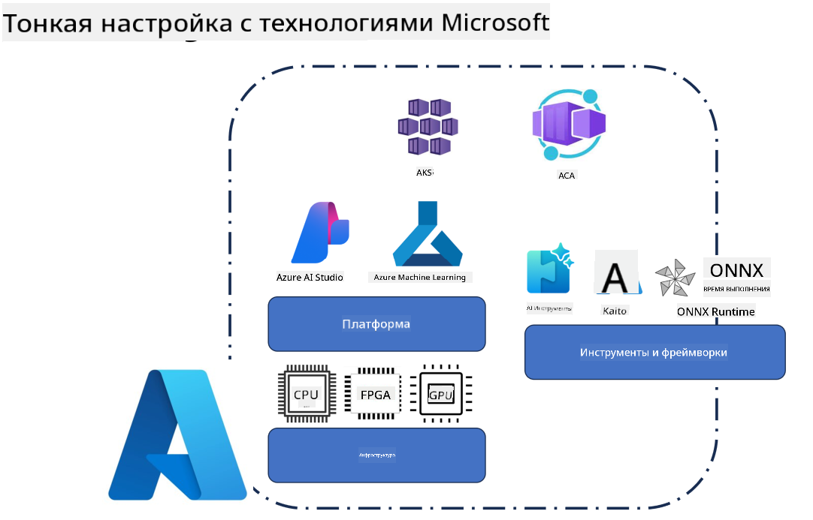
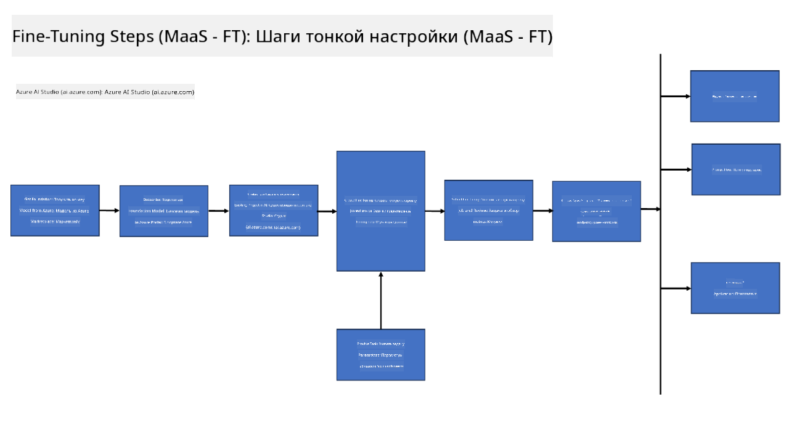
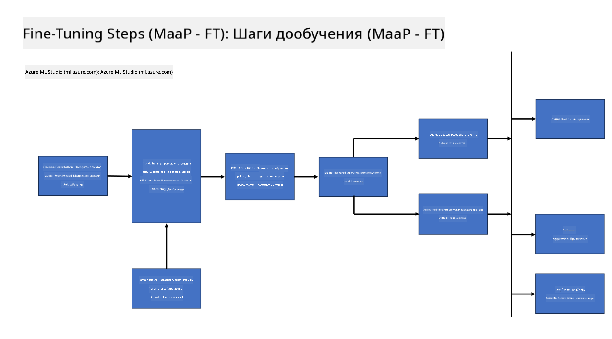
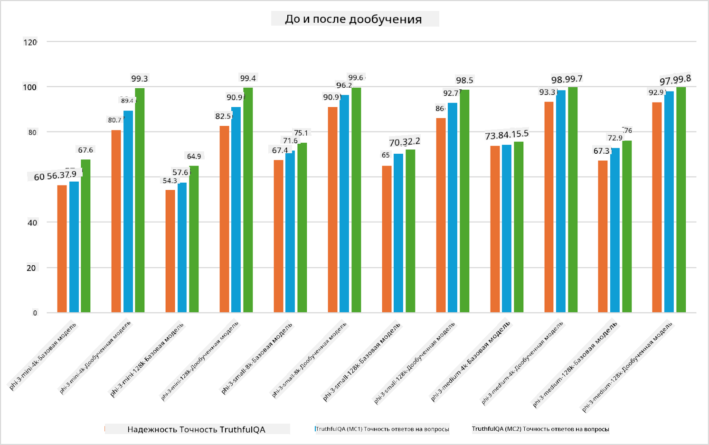

<!--
CO_OP_TRANSLATOR_METADATA:
{
  "original_hash": "cb5648935f63edc17e95ce38f23adc32",
  "translation_date": "2025-05-07T13:37:17+00:00",
  "source_file": "md/03.FineTuning/FineTuning_Scenarios.md",
  "language_code": "ru"
}
-->
## Сценарии дообучения

**Платформа** Включает различные технологии, такие как Azure AI Foundry, Azure Machine Learning, AI Tools, Kaito и ONNX Runtime.

**Инфраструктура** Включает CPU и FPGA, которые необходимы для процесса дообучения. Позвольте показать вам иконки для каждой из этих технологий.

**Инструменты и фреймворки** Включают ONNX Runtime и ONNX Runtime. Позвольте показать вам иконки для каждой из этих технологий.  
[Вставьте иконки для ONNX Runtime и ONNX Runtime]

Процесс дообучения с использованием технологий Microsoft включает различные компоненты и инструменты. Понимая и используя эти технологии, мы можем эффективно дообучать наши приложения и создавать лучшие решения.

## Модель как сервис

Дообучайте модель с помощью хостинга дообучения, без необходимости создавать и управлять вычислительными ресурсами.

Безсерверное дообучение доступно для моделей Phi-3-mini и Phi-3-medium, что позволяет разработчикам быстро и легко настраивать модели для облачных и edge-сценариев без необходимости организовывать вычисления. Также мы объявили, что Phi-3-small теперь доступна через наше предложение Models-as-a-Service, чтобы разработчики могли быстро и просто начать работу с ИИ без управления базовой инфраструктурой.

## Модель как платформа

Пользователи управляют собственными вычислительными ресурсами для дообучения своих моделей.

[Пример дообучения](https://github.com/Azure/azureml-examples/blob/main/sdk/python/foundation-models/system/finetune/chat-completion/chat-completion.ipynb)

## Сценарии дообучения

| | | | | | | |
|-|-|-|-|-|-|-|
|Сценарий|LoRA|QLoRA|PEFT|DeepSpeed|ZeRO|DORA|
|Адаптация предварительно обученных LLM под конкретные задачи или домены|Да|Да|Да|Да|Да|Да|
|Дообучение для задач NLP, таких как классификация текста, распознавание именованных сущностей и машинный перевод|Да|Да|Да|Да|Да|Да|
|Дообучение для задач вопросов и ответов|Да|Да|Да|Да|Да|Да|
|Дообучение для генерации человекоподобных ответов в чатботах|Да|Да|Да|Да|Да|Да|
|Дообучение для генерации музыки, искусства или других форм творчества|Да|Да|Да|Да|Да|Да|
|Снижение вычислительных и финансовых затрат|Да|Да|Нет|Да|Да|Нет|
|Снижение использования памяти|Нет|Да|Нет|Да|Да|Да|
|Использование меньшего количества параметров для эффективного дообучения|Нет|Да|Да|Нет|Нет|Да|
|Память-эффективная форма параллелизма данных, обеспечивающая доступ к совокупной памяти всех доступных GPU|Нет|Нет|Нет|Да|Да|Да|

## Примеры производительности дообучения

**Отказ от ответственности**:  
Этот документ был переведен с помощью сервиса автоматического перевода [Co-op Translator](https://github.com/Azure/co-op-translator). Несмотря на наши усилия по обеспечению точности, имейте в виду, что автоматический перевод может содержать ошибки или неточности. Оригинальный документ на его исходном языке следует считать авторитетным источником. Для критически важной информации рекомендуется использовать профессиональный перевод, выполненный человеком. Мы не несем ответственности за любые недоразумения или неправильные толкования, возникшие в результате использования данного перевода.