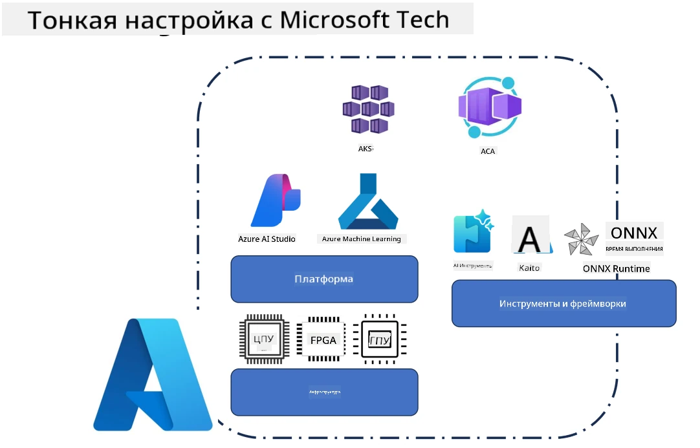
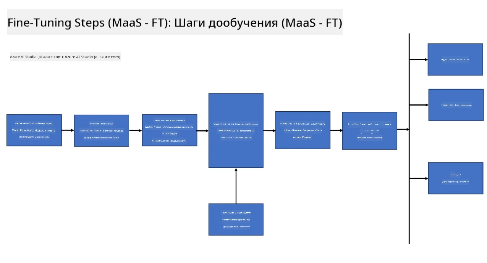
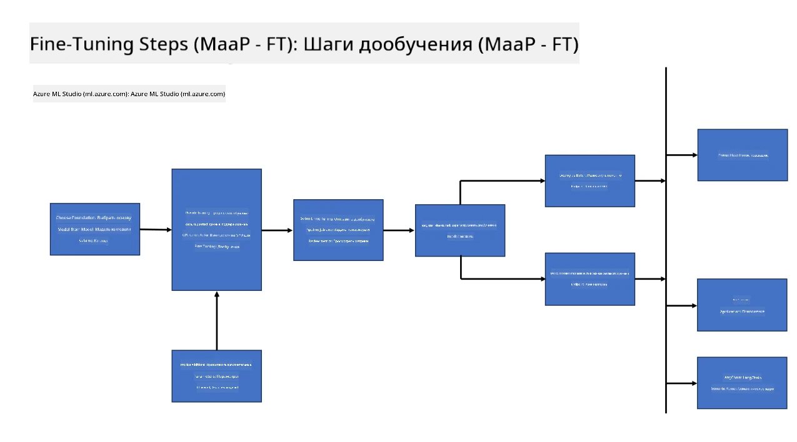
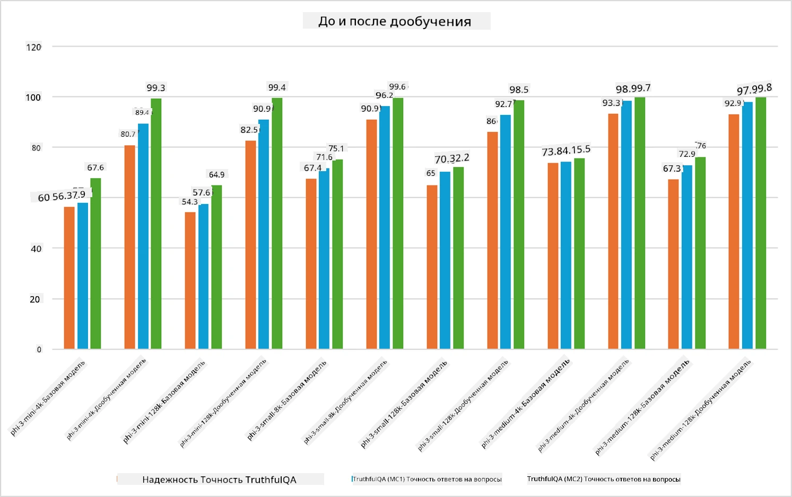

## Сценарии тонкой настройки

В этом разделе приводится обзор сценариев тонкой настройки в средах Microsoft Foundry и Azure, включая модели развертывания, уровни инфраструктуры и часто используемые техники оптимизации.

**Платформа**  
Включает управляемые сервисы, такие как Microsoft Foundry (ранее Azure AI Foundry) и Azure Machine Learning, которые предоставляют управление моделями, оркестрацию, отслеживание экспериментов и рабочие процессы развертывания.

**Инфраструктура**  
Тонкая настройка требует масштабируемых вычислительных ресурсов. В средах Azure это обычно включает виртуальные машины на базе GPU и CPU для легких рабочих нагрузок, а также масштабируемое хранилище для наборов данных и контрольных точек.

**Инструменты и фреймворки**  
Рабочие процессы тонкой настройки обычно опираются на фреймворки и библиотеки оптимизации, такие как Hugging Face Transformers, DeepSpeed и PEFT (параметр-эффективная тонкая настройка).

Процесс тонкой настройки с использованием технологий Microsoft охватывает сервисы платформы, вычислительную инфраструктуру и обучающие фреймворки. Понимание того, как эти компоненты взаимодействуют, позволяет разработчикам эффективно адаптировать базовые модели для конкретных задач и производственных сценариев.

## Модель как сервис

Тонкая настройка модели с помощью размещенной тонкой настройки без необходимости создавать и управлять вычислительными ресурсами.

Безсерверная тонкая настройка теперь доступна для семейств моделей Phi-3, Phi-3.5 и Phi-4, позволяя разработчикам быстро и легко настраивать модели для облачных и периферийных сценариев без необходимости организовывать вычисления.

## Модель как платформа

Пользователи управляют собственными вычислительными ресурсами для тонкой настройки своих моделей.

[Пример тонкой настройки](https://github.com/Azure/azureml-examples/blob/main/sdk/python/foundation-models/system/finetune/chat-completion/chat-completion.ipynb)

## Сравнение техник тонкой настройки

|Сценарий|LoRA|QLoRA|PEFT|DeepSpeed|ZeRO|DoRA|
|---|---|---|---|---|---|---|
|Адаптация предобученных LLM к конкретным задачам или доменам|Да|Да|Да|Да|Да|Да|
|Тонкая настройка для задач NLP, таких как классификация текста, распознавание именованных сущностей и машинный перевод|Да|Да|Да|Да|Да|Да|
|Тонкая настройка для задач вопрос-ответ|Да|Да|Да|Да|Да|Да|
|Тонкая настройка для генерации ответов, похожих на человеческие, в чат-ботах|Да|Да|Да|Да|Да|Да|
|Тонкая настройка для генерации музыки, искусства или других форм творчества|Да|Да|Да|Да|Да|Да|
|Снижение вычислительных и финансовых затрат|Да|Да|Да|Да|Да|Да|
|Снижение использования памяти|Да|Да|Да|Да|Да|Да|
|Использование меньшего числа параметров для эффективной тонкой настройки|Да|Да|Да|Нет|Нет|Да|
|Память-эффективная форма параллелизма данных, которая даёт доступ к агрегированной памяти GPU всех доступных GPU устройств|Нет|Нет|Нет|Да|Да|Нет|

> [!NOTE]
> LoRA, QLoRA, PEFT и DoRA — это методы параметр-эффективной тонкой настройки, в то время как DeepSpeed и ZeRO сосредоточены на распределённом обучении и оптимизации памяти.

## Примеры производительности тонкой настройки

---

<!-- CO-OP TRANSLATOR DISCLAIMER START -->
**Отказ от ответственности**:  
Этот документ был переведен с помощью сервиса автоматического перевода [Co-op Translator](https://github.com/Azure/co-op-translator). Несмотря на наши усилия по обеспечению точности, просим учитывать, что автоматический перевод может содержать ошибки или неточности. Оригинальный документ на его исходном языке следует считать авторитетным источником. Для получения критически важной информации рекомендуется обращаться к услугам профессионального переводчика. Мы не несем ответственность за любые недоразумения или неправильные толкования, возникшие в результате использования данного перевода.
<!-- CO-OP TRANSLATOR DISCLAIMER END -->