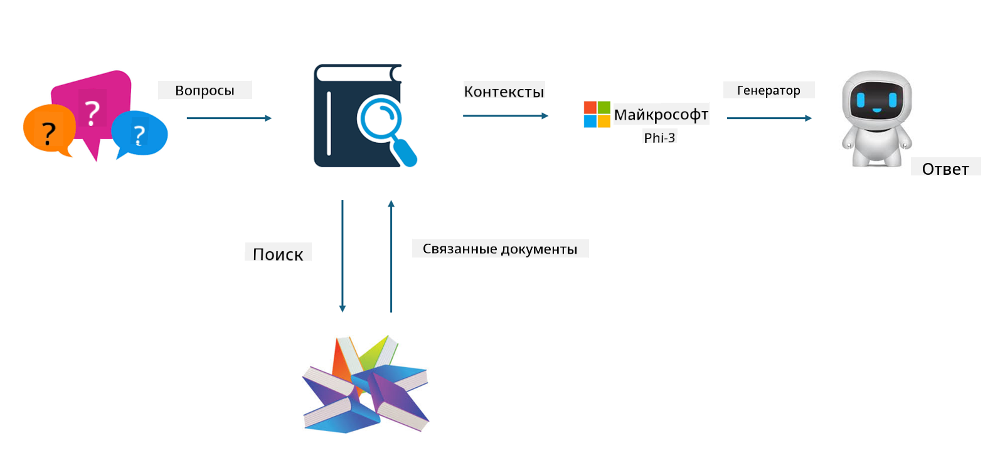

<!--
CO_OP_TRANSLATOR_METADATA:
{
  "original_hash": "e4e010400c2918557b36bb932a14004c",
  "translation_date": "2025-05-07T13:32:51+00:00",
  "source_file": "md/03.FineTuning/FineTuning_vs_RAG.md",
  "language_code": "ru"
}
-->
## Тонкая настройка против RAG

## Retrieval Augmented Generation

RAG — это сочетание поиска данных и генерации текста. Структурированные и неструктурированные данные предприятия хранятся в векторной базе данных. При поиске релевантного контента находят соответствующие сводки и материалы, которые формируют контекст, а затем с помощью возможностей дополнения текста LLM/SLM генерируется итоговый контент.

## Процесс RAG

## Тонкая настройка
Тонкая настройка основана на улучшении конкретной модели. Нет необходимости начинать с алгоритма модели, но нужно постоянно накапливать данные. Если вам нужна более точная терминология и языковое выражение для отраслевых приложений, тонкая настройка — лучший выбор. Однако при частых изменениях данных тонкая настройка может стать сложной.

## Как выбрать
Если для ответа требуется подключение внешних данных, RAG — лучший вариант.

Если нужно выдавать стабильные и точные отраслевые знания, тонкая настройка будет хорошим выбором. RAG ориентирован на поиск релевантного контента, но не всегда может точно передать специализированные нюансы.

Тонкая настройка требует качественного набора данных, и если данных мало, эффект будет незначительным. RAG более гибкий.  
Тонкая настройка — это "черный ящик", своего рода метафизика, и сложно понять внутренний механизм. В то время как RAG позволяет легче отслеживать источник данных, что помогает эффективно корректировать галлюцинации или ошибки в контенте и обеспечивает лучшую прозрачность.

**Отказ от ответственности**:  
Этот документ был переведен с помощью сервиса автоматического перевода [Co-op Translator](https://github.com/Azure/co-op-translator). Несмотря на наши усилия обеспечить точность, имейте в виду, что автоматический перевод может содержать ошибки или неточности. Оригинальный документ на исходном языке следует считать авторитетным источником. Для критически важной информации рекомендуется использовать профессиональный перевод, выполненный человеком. Мы не несем ответственности за любые недоразумения или неправильные толкования, возникшие в результате использования данного перевода.