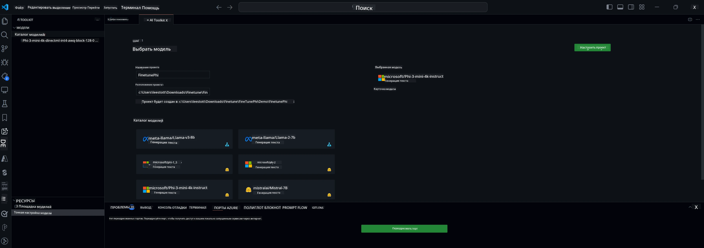

## Добро пожаловать в AI Toolkit для VS Code

[AI Toolkit для VS Code](https://github.com/microsoft/vscode-ai-toolkit/tree/main) объединяет различные модели из Azure AI Studio Catalog и других каталогов, таких как Hugging Face. Этот набор инструментов упрощает типичные задачи разработки AI-приложений с использованием генеративных AI-инструментов и моделей, предоставляя возможности для:
- Начала работы с поиском моделей и песочницей.
- Тонкой настройки моделей и инференса с использованием локальных вычислительных ресурсов.
- Удалённой тонкой настройки и инференса с использованием ресурсов Azure.

[Установить AI Toolkit для VSCode](https://marketplace.visualstudio.com/items?itemName=ms-windows-ai-studio.windows-ai-studio)



**[Private Preview]** Однонажатное развертывание Azure Container Apps для запуска тонкой настройки и инференса моделей в облаке.

Давайте приступим к разработке вашего AI-приложения:

- [Добро пожаловать в AI Toolkit для VS Code](../../../../md/03.FineTuning)
- [Локальная разработка](../../../../md/03.FineTuning)
  - [Подготовка](../../../../md/03.FineTuning)
  - [Активация Conda](../../../../md/03.FineTuning)
  - [Только тонкая настройка базовой модели](../../../../md/03.FineTuning)
  - [Тонкая настройка модели и инференс](../../../../md/03.FineTuning)
  - [Тонкая настройка модели](../../../../md/03.FineTuning)
  - [Microsoft Olive](../../../../md/03.FineTuning)
  - [Примеры и ресурсы для тонкой настройки](../../../../md/03.FineTuning)
- [**\[Private Preview\]** Удалённая разработка](../../../../md/03.FineTuning)
  - [Требования](../../../../md/03.FineTuning)
  - [Настройка удалённого проекта разработки](../../../../md/03.FineTuning)
  - [Развёртывание ресурсов Azure](../../../../md/03.FineTuning)
  - [\[Опционально\] Добавление токена Huggingface в секрет Azure Container App](../../../../md/03.FineTuning)
  - [Запуск тонкой настройки](../../../../md/03.FineTuning)
  - [Развёртывание конечной точки инференса](../../../../md/03.FineTuning)
  - [Деплой конечной точки инференса](../../../../md/03.FineTuning)
  - [Расширенное использование](../../../../md/03.FineTuning)

## Локальная разработка
### Подготовка

1. Убедитесь, что на хосте установлен драйвер NVIDIA.  
2. Выполните `huggingface-cli login`, если вы используете HF для работы с датасетами.  
3. Объяснения настроек ключа `Olive` для всего, что влияет на использование памяти.

### Активация Conda
Поскольку мы используем среду WSL, которая является общей, необходимо вручную активировать окружение conda. После этого шага можно запускать тонкую настройку или инференс.

```bash
conda activate [conda-env-name] 
```

### Только тонкая настройка базовой модели
Если вы хотите просто попробовать базовую модель без тонкой настройки, выполните эту команду после активации conda.

```bash
cd inference

# Web browser interface allows to adjust a few parameters like max new token length, temperature and so on.
# User has to manually open the link (e.g. http://0.0.0.0:7860) in a browser after gradio initiates the connections.
python gradio_chat.py --baseonly
```

### Тонкая настройка модели и инференс

После открытия рабочей области в dev-контейнере откройте терминал (по умолчанию путь — корень проекта) и выполните команду ниже для тонкой настройки LLM на выбранном датасете.

```bash
python finetuning/invoke_olive.py 
```

Контрольные точки и итоговая модель будут сохранены в папке `models`.

Далее выполните инференс с помощью тонко настроенной модели через чат в `консоли`, `веб-браузере` или `prompt flow`.

```bash
cd inference

# Console interface.
python console_chat.py

# Web browser interface allows to adjust a few parameters like max new token length, temperature and so on.
# User has to manually open the link (e.g. http://127.0.0.1:7860) in a browser after gradio initiates the connections.
python gradio_chat.py
```

Для использования `prompt flow` в VS Code обратитесь к этому [Quick Start](https://microsoft.github.io/promptflow/how-to-guides/quick-start.html).

### Тонкая настройка модели

Далее скачайте модель в зависимости от наличия GPU на вашем устройстве.

Для запуска локальной сессии тонкой настройки с использованием QLoRA выберите модель из нашего каталога, которую хотите дообучить.
| Платформа | Наличие GPU | Название модели | Размер (ГБ) |
|---------|---------|--------|--------|
| Windows | Да | Phi-3-mini-4k-**directml**-int4-awq-block-128-onnx | 2.13GB |
| Linux | Да | Phi-3-mini-4k-**cuda**-int4-onnx | 2.30GB |
| Windows<br>Linux | Нет | Phi-3-mini-4k-**cpu**-int4-rtn-block-32-acc-level-4-onnx | 2.72GB |

**_Примечание_** Для скачивания моделей не требуется аккаунт Azure.

Модель Phi3-mini (int4) занимает примерно 2-3 ГБ. В зависимости от скорости сети загрузка может занять несколько минут.

Начните с выбора имени проекта и его расположения.  
Затем выберите модель из каталога. Вам будет предложено скачать шаблон проекта. После этого можно нажать "Configure Project" для настройки параметров.

### Microsoft Olive

Мы используем [Olive](https://microsoft.github.io/Olive/why-olive.html) для запуска QLoRA тонкой настройки модели PyTorch из нашего каталога. Все настройки предустановлены по умолчанию для оптимизации локального запуска с эффективным использованием памяти, но их можно изменить под ваши задачи.

### Примеры и ресурсы для тонкой настройки

- [Руководство по началу работы с тонкой настройкой](https://learn.microsoft.com/windows/ai/toolkit/toolkit-fine-tune)
- [Тонкая настройка с использованием датасета HuggingFace](https://github.com/microsoft/vscode-ai-toolkit/blob/main/archive/walkthrough-hf-dataset.md)
- [Тонкая настройка с простым датасетом](https://github.com/microsoft/vscode-ai-toolkit/blob/main/archive/walkthrough-simple-dataset.md)

## **[Private Preview]** Удалённая разработка

### Требования

1. Для запуска тонкой настройки модели в удалённой среде Azure Container App убедитесь, что в вашей подписке достаточно GPU-ресурсов. Отправьте [запрос в поддержку](https://azure.microsoft.com/support/create-ticket/), чтобы получить необходимую мощность для вашего приложения. [Подробнее о GPU-ресурсах](https://learn.microsoft.com/azure/container-apps/workload-profiles-overview)  
2. Если вы используете приватный датасет на HuggingFace, убедитесь, что у вас есть [аккаунт HuggingFace](https://huggingface.co/?WT.mc_id=aiml-137032-kinfeylo) и вы [создали токен доступа](https://huggingface.co/docs/hub/security-tokens?WT.mc_id=aiml-137032-kinfeylo)  
3. Включите флаг функции удалённой тонкой настройки и инференса в AI Toolkit для VS Code  
   1. Откройте настройки VS Code через *File -> Preferences -> Settings*.  
   2. Перейдите в раздел *Extensions* и выберите *AI Toolkit*.  
   3. Включите опцию *"Enable Remote Fine-tuning And Inference"*.  
   4. Перезапустите VS Code для применения изменений.

- [Удалённая тонкая настройка](https://github.com/microsoft/vscode-ai-toolkit/blob/main/archive/remote-finetuning.md)

### Настройка удалённого проекта разработки
1. Выполните команду из палитры `AI Toolkit: Focus on Resource View`.  
2. Перейдите в раздел *Model Fine-tuning* для доступа к каталогу моделей. Задайте имя проекта и выберите его расположение на вашем устройстве. Затем нажмите кнопку *"Configure Project"*.  
3. Конфигурация проекта  
    1. Не включайте опцию *"Fine-tune locally"*.  
    2. Появятся настройки Olive с предустановленными значениями. Отредактируйте и заполните их по необходимости.  
    3. Перейдите к *Generate Project*. Этот этап использует WSL и создаёт новое окружение Conda, готовя проект к будущим обновлениям с поддержкой Dev Containers.  
4. Нажмите *"Relaunch Window In Workspace"*, чтобы открыть удалённый проект разработки.

> **Примечание:** Проект в текущей версии работает либо локально, либо удалённо в AI Toolkit для VS Code. Если при создании проекта выбрать *"Fine-tune locally"*, он будет работать только в WSL без поддержки удалённой разработки. Если не включать *"Fine-tune locally"*, проект будет ограничен удалённой средой Azure Container App.

### Развёртывание ресурсов Azure
Для начала необходимо развернуть ресурсы Azure для удалённой тонкой настройки. Запустите команду `AI Toolkit: Provision Azure Container Apps job for fine-tuning` из палитры команд.

Отслеживайте процесс развертывания по ссылке, которая появится в выводе.

### [Опционально] Добавление токена Huggingface в секрет Azure Container App
Если вы используете приватный датасет HuggingFace, установите токен HuggingFace как переменную окружения, чтобы избежать необходимости ручного входа в Hugging Face Hub.  
Это можно сделать с помощью команды `AI Toolkit: Add Azure Container Apps Job secret for fine-tuning`. Введите имя секрета [`HF_TOKEN`](https://huggingface.co/docs/huggingface_hub/package_reference/environment_variables#hftoken) и используйте ваш токен Hugging Face в качестве значения.

### Запуск тонкой настройки
Для запуска удалённой тонкой настройки выполните команду `AI Toolkit: Run fine-tuning`.

Для просмотра системных и консольных логов можно перейти в портал Azure по ссылке в панели вывода (подробнее в [Просмотр и запрос логов в Azure](https://aka.ms/ai-toolkit/remote-provision#view-and-query-logs-on-azure)). Либо просматривать логи консоли прямо в панели вывода VSCode, выполнив команду `AI Toolkit: Show the running fine-tuning job streaming logs`.  
> **Примечание:** Задача может находиться в очереди из-за нехватки ресурсов. Если логи не отображаются, выполните команду `AI Toolkit: Show the running fine-tuning job streaming logs`, подождите некоторое время и повторите команду для повторного подключения к потоковым логам.

В процессе будет использоваться QLoRA для тонкой настройки, которая создаст LoRA-адаптеры для модели, используемые при инференсе.  
Результаты тонкой настройки сохраняются в Azure Files.

### Развёртывание конечной точки инференса
После обучения адаптеров в удалённой среде используйте простое приложение Gradio для взаимодействия с моделью.  
Аналогично процессу тонкой настройки, настройте ресурсы Azure для удалённого инференса, выполнив команду `AI Toolkit: Provision Azure Container Apps for inference` из палитры команд.

По умолчанию подписка и группа ресурсов для инференса должны совпадать с теми, что использовались для тонкой настройки. Инференс будет использовать ту же среду Azure Container App и получать доступ к модели и адаптерам, сохранённым в Azure Files, созданным на этапе тонкой настройки.

### Деплой конечной точки инференса
Если вы хотите изменить код инференса или перезагрузить модель инференса, выполните команду `AI Toolkit: Deploy for inference`. Это синхронизирует ваш последний код с Azure Container App и перезапустит реплику.

После успешного деплоя вы сможете получить доступ к API инференса, нажав кнопку "*Go to Inference Endpoint*" в уведомлении VSCode. Также веб-адрес API можно найти в `ACA_APP_ENDPOINT` в файле `./infra/inference.config.json` и в панели вывода. Теперь вы готовы оценивать модель через этот эндпоинт.

### Расширенное использование
Для дополнительной информации об удалённой разработке с AI Toolkit обратитесь к документации [Тонкая настройка моделей удалённо](https://aka.ms/ai-toolkit/remote-provision) и [Инференс с тонко настроенной моделью](https://aka.ms/ai-toolkit/remote-inference).

**Отказ от ответственности**:  
Этот документ был переведен с помощью сервиса автоматического перевода [Co-op Translator](https://github.com/Azure/co-op-translator). Несмотря на наши усилия по обеспечению точности, просим учитывать, что автоматический перевод может содержать ошибки или неточности. Оригинальный документ на исходном языке следует считать авторитетным источником. Для получения критически важной информации рекомендуется обращаться к профессиональному человеческому переводу. Мы не несем ответственности за любые недоразумения или неправильные толкования, возникшие в результате использования данного перевода.