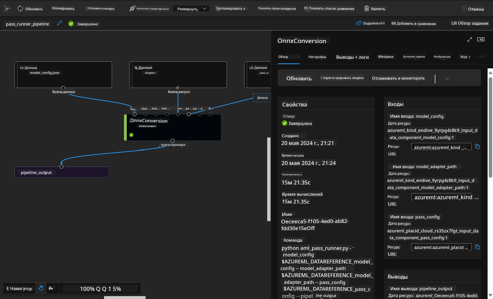

<!--
CO_OP_TRANSLATOR_METADATA:
{
  "original_hash": "7fe541373802e33568e94e13226d463c",
  "translation_date": "2025-07-17T09:33:54+00:00",
  "source_file": "md/03.FineTuning/Introduce_AzureML.md",
  "language_code": "ru"
}
-->
# **Введение в Azure Machine Learning Service**

[Azure Machine Learning](https://ml.azure.com?WT.mc_id=aiml-138114-kinfeylo) — это облачный сервис для ускорения и управления жизненным циклом проектов машинного обучения (ML).

Профессионалы в области ML, дата-сайентисты и инженеры могут использовать его в своей повседневной работе для:

- Обучения и развертывания моделей.
- Управления операциями машинного обучения (MLOps).
- Вы можете создать модель в Azure Machine Learning или использовать модель, созданную на базе открытых платформ, таких как PyTorch, TensorFlow или scikit-learn.
- Инструменты MLOps помогают отслеживать, дообучать и повторно развертывать модели.

## Для кого предназначен Azure Machine Learning?

**Дата-сайентисты и ML-инженеры**

Они могут использовать инструменты для ускорения и автоматизации своих ежедневных задач.  
Azure ML предоставляет функции для обеспечения справедливости, объяснимости, отслеживания и аудита.

**Разработчики приложений**

Могут легко интегрировать модели в приложения или сервисы.

**Разработчики платформ**

Имеют доступ к мощному набору инструментов, поддерживаемых надежными API Azure Resource Manager.  
Эти инструменты позволяют создавать продвинутые ML-инструменты.

**Корпорации**

Работая в облаке Microsoft Azure, предприятия получают преимущества знакомых механизмов безопасности и контроля доступа на основе ролей.  
Можно настраивать проекты для контроля доступа к защищённым данным и определённым операциям.

## Повышение продуктивности для всей команды

Проекты ML часто требуют команды с разнообразными навыками для создания и поддержки решений.

Azure ML предоставляет инструменты, которые позволяют:  
- Сотрудничать с командой через общие блокноты, вычислительные ресурсы, бессерверные вычисления, данные и окружения.  
- Разрабатывать модели с учётом справедливости, объяснимости, отслеживания и аудита для соблюдения требований по происхождению данных и аудиту.  
- Быстро и просто развертывать ML-модели в масштабах, а также эффективно управлять ими с помощью MLOps.  
- Запускать задачи машинного обучения в любом месте с встроенным управлением, безопасностью и соответствием требованиям.

## Кроссплатформенные инструменты

Любой участник команды ML может использовать привычные инструменты для выполнения задач.  
Будь то быстрые эксперименты, настройка гиперпараметров, построение пайплайнов или управление выводами, доступны знакомые интерфейсы:  
- Azure Machine Learning Studio  
- Python SDK (v2)  
- Azure CLI (v2)  
- Azure Resource Manager REST API

По мере доработки моделей и совместной работы на протяжении всего цикла разработки вы можете делиться и находить активы, ресурсы и метрики через интерфейс Azure Machine Learning studio.

## **LLM/SLM в Azure ML**

Azure ML добавил множество функций, связанных с LLM/SLM, объединяя LLMOps и SLMOps для создания корпоративной платформы генеративного искусственного интеллекта.

### **Каталог моделей**

Корпоративные пользователи могут развертывать разные модели в зависимости от бизнес-сценариев через Каталог моделей и предоставлять сервисы в формате Model as Service для разработчиков или пользователей.

Каталог моделей в Azure Machine Learning studio — это центр для поиска и использования широкого спектра моделей, которые позволяют создавать приложения генеративного ИИ. В каталоге представлены сотни моделей от таких поставщиков, как Azure OpenAI service, Mistral, Meta, Cohere, Nvidia, Hugging Face, включая модели, обученные Microsoft. Модели от поставщиков, не относящихся к Microsoft, считаются Non-Microsoft Products согласно условиям Microsoft и подчиняются условиям, предоставленным вместе с моделью.

### **Пайплайн задач**

Основная идея пайплайна машинного обучения — разбить полную задачу на многоэтапный рабочий процесс. Каждый этап — это управляемый компонент, который можно разрабатывать, оптимизировать, настраивать и автоматизировать отдельно. Этапы связаны через чётко определённые интерфейсы. Сервис пайплайнов Azure Machine Learning автоматически координирует все зависимости между этапами.

При дообучении SLM / LLM мы можем управлять данными, обучением и процессами генерации через Pipeline.

### **Prompt flow**

Преимущества использования Azure Machine Learning prompt flow  
Azure Machine Learning prompt flow предлагает ряд преимуществ, которые помогают пользователям перейти от идеи к экспериментам и, в конечном итоге, к готовым к производству приложениям на базе LLM:

**Гибкость в создании подсказок**

Интерактивный опыт создания: Azure Machine Learning prompt flow предоставляет визуальное представление структуры потока, позволяя пользователям легко понимать и ориентироваться в своих проектах. Также доступен опыт кодирования, похожий на работу с блокнотами, для эффективной разработки и отладки потоков.  
Варианты настройки подсказок: пользователи могут создавать и сравнивать несколько вариантов подсказок, что облегчает итеративное улучшение.

Оценка: встроенные потоки оценки позволяют пользователям анализировать качество и эффективность своих подсказок и потоков.

Обширные ресурсы: Azure Machine Learning prompt flow включает библиотеку встроенных инструментов, примеров и шаблонов, которые служат отправной точкой для разработки, вдохновляя и ускоряя процесс.

**Готовность к корпоративному использованию LLM-приложений**

Сотрудничество: Azure Machine Learning prompt flow поддерживает командную работу, позволяя нескольким пользователям совместно работать над проектами по созданию подсказок, обмениваться знаниями и вести контроль версий.

Все в одном: Azure Machine Learning prompt flow упрощает весь процесс создания подсказок — от разработки и оценки до развертывания и мониторинга. Пользователи могут легко развертывать свои потоки как конечные точки Azure Machine Learning и отслеживать их работу в реальном времени, обеспечивая оптимальную работу и постоянное улучшение.

Корпоративные решения Azure Machine Learning: Prompt flow использует надёжные корпоративные решения Azure Machine Learning, обеспечивая безопасную, масштабируемую и надёжную основу для разработки, экспериментов и развертывания потоков.

С помощью Azure Machine Learning prompt flow пользователи могут раскрыть гибкость создания подсказок, эффективно сотрудничать и использовать корпоративные решения для успешной разработки и внедрения приложений на базе LLM.

Объединяя вычислительные мощности, данные и различные компоненты Azure ML, корпоративные разработчики могут легко создавать собственные приложения искусственного интеллекта.

**Отказ от ответственности**:  
Этот документ был переведен с помощью сервиса автоматического перевода [Co-op Translator](https://github.com/Azure/co-op-translator). Несмотря на наши усилия по обеспечению точности, просим учитывать, что автоматический перевод может содержать ошибки или неточности. Оригинальный документ на его исходном языке следует считать авторитетным источником. Для получения критически важной информации рекомендуется обращаться к профессиональному переводу, выполненному человеком. Мы не несем ответственности за любые недоразумения или неправильные толкования, возникшие в результате использования данного перевода.