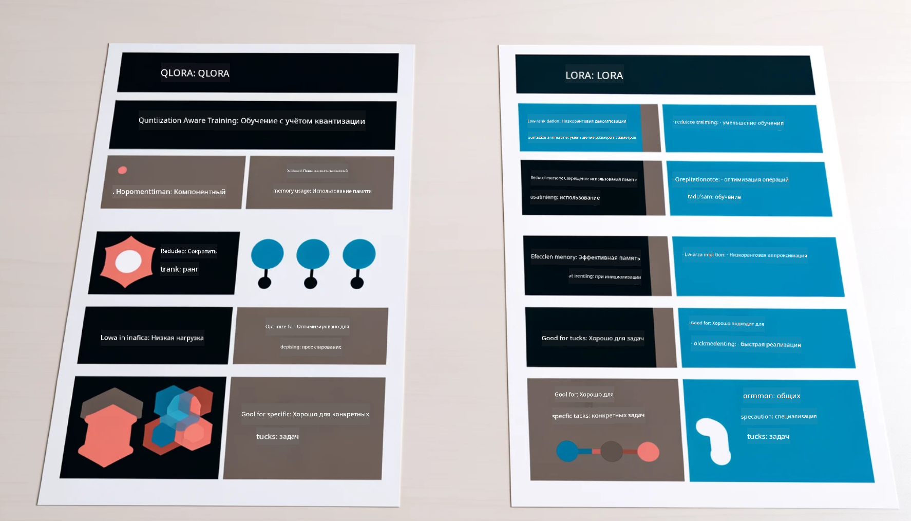

<!--
CO_OP_TRANSLATOR_METADATA:
{
  "original_hash": "743d7e9cb9c4e8ea642d77bee657a7fa",
  "translation_date": "2025-05-07T13:33:38+00:00",
  "source_file": "md/03.FineTuning/LetPhi3gotoIndustriy.md",
  "language_code": "ru"
}
-->
# **Пусть Phi-3 станет экспертом в отрасли**

Чтобы внедрить модель Phi-3 в конкретную отрасль, необходимо добавить в неё бизнес-данные этой отрасли. У нас есть два варианта: первый — RAG (Retrieval Augmented Generation), второй — Fine Tuning (дообучение).

## **RAG vs Fine-Tuning**

### **Retrieval Augmented Generation**

RAG — это поиск данных + генерация текста. Структурированные и неструктурированные данные предприятия хранятся в векторной базе данных. При поиске релевантного контента находится соответствующее резюме и информация, формируется контекст, и затем возможности LLM/SLM по дополнению текста используются для генерации контента.

### **Fine-tuning**

Fine-tuning — это дообучение существующей модели. Нет необходимости начинать с алгоритма модели, но нужно постоянно накапливать данные. Если в отраслевых приложениях требуется более точная терминология и стилистика, то дообучение — лучший выбор. Однако при частой смене данных дообучение может усложниться.

### **Как выбрать**

1. Если для ответа нужно подключить внешние данные, лучше выбрать RAG.

2. Если важна стабильность и точность отраслевых знаний, лучше подойдет дообучение. RAG ориентирован на поиск релевантного контента, но может не всегда точно передавать специализированные нюансы.

3. Для дообучения требуется качественный набор данных, и если данные ограничены, эффект будет минимальным. RAG более гибкий.

4. Дообучение — это своего рода «черный ящик», трудно понять внутренние механизмы. RAG же позволяет легче отследить источник данных, что помогает эффективно корректировать галлюцинации или ошибки в содержании и обеспечивает большую прозрачность.

### **Сценарии**

1. Для узкоспециализированных отраслей с профессиональной терминологией ***Fine-tuning*** — лучший выбор.

2. Для систем вопросов и ответов, требующих синтеза разных знаний, лучше подходит ***RAG***.

3. Для автоматизации бизнес-процессов оптимально сочетание ***RAG + Fine-tuning***.

## **Как использовать RAG**

Векторная база данных — это коллекция данных, хранящихся в математической форме. Векторные базы облегчают моделям машинного обучения запоминание предыдущих данных, что позволяет использовать машинное обучение для поддержки таких задач, как поиск, рекомендации и генерация текста. Данные идентифицируются по метрикам сходства, а не по точным совпадениям, что позволяет моделям лучше понимать контекст.

Векторная база — ключ к реализации RAG. Мы можем преобразовывать данные в векторное представление с помощью моделей, таких как text-embedding-3, jina-ai-embedding и других.

Подробнее о создании RAG-приложений можно узнать по ссылке [https://github.com/microsoft/Phi-3CookBook](https://github.com/microsoft/Phi-3CookBook?WT.mc_id=aiml-138114-kinfeylo)

## **Как использовать Fine-tuning**

Чаще всего для дообучения применяются алгоритмы Lora и QLora. Как выбрать?
- [Подробнее в этом примере ноутбука](../../../../code/04.Finetuning/Phi_3_Inference_Finetuning.ipynb)
- [Пример Python-скрипта для FineTuning](../../../../code/04.Finetuning/FineTrainingScript.py)

### **Lora и QLora**

LoRA (Low-Rank Adaptation) и QLoRA (Quantized Low-Rank Adaptation) — это методы дообучения больших языковых моделей (LLM) с использованием Parameter Efficient Fine Tuning (PEFT). PEFT позволяет обучать модели более эффективно, чем традиционные методы.  
LoRA — самостоятельная техника дообучения, которая снижает использование памяти за счёт низкорангового приближения матрицы обновления весов. Обучение происходит быстро, при этом качество близко к традиционному дообучению.

QLoRA — расширенная версия LoRA с использованием квантования для ещё большего снижения потребления памяти. QLoRA квантует параметры весов предобученной модели до 4-битной точности, что экономит память по сравнению с LoRA. Однако обучение с QLoRA примерно на 30% медленнее из-за дополнительных операций квантования и деквантования.

QLoRA использует LoRA для корректировки ошибок, возникающих при квантовании. QLoRA позволяет дообучать огромные модели с миллиардами параметров на относительно небольших и доступных GPU. Например, QLoRA может дообучить модель с 70 миллиардами параметров, требующую 36 GPU, используя всего 2...

**Отказ от ответственности**:  
Этот документ был переведен с помощью сервиса автоматического перевода [Co-op Translator](https://github.com/Azure/co-op-translator). Несмотря на наши усилия по обеспечению точности, пожалуйста, учитывайте, что автоматический перевод может содержать ошибки или неточности. Оригинальный документ на исходном языке следует считать авторитетным источником. Для получения критически важной информации рекомендуется профессиональный перевод человеком. Мы не несем ответственности за любые недоразумения или неправильные толкования, возникшие в результате использования данного перевода.