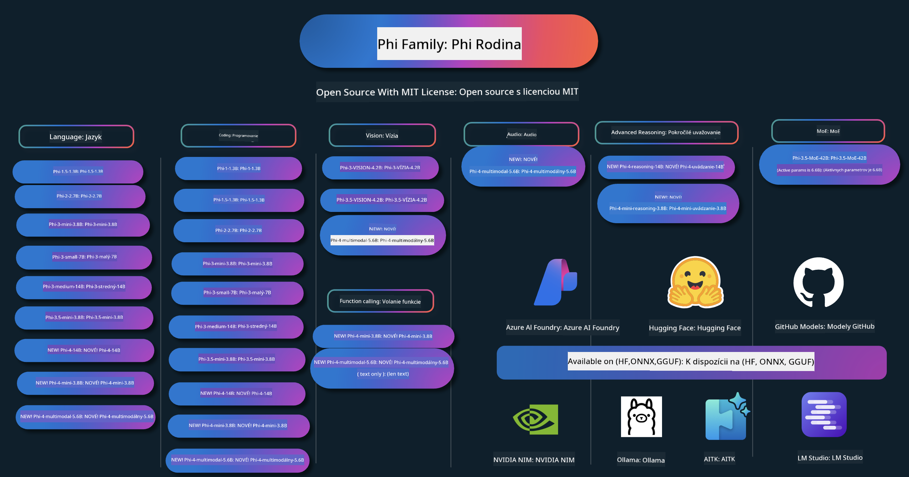

<!--
CO_OP_TRANSLATOR_METADATA:
{
  "original_hash": "1cab9282e04f2e1c388a38dca7763c16",
  "translation_date": "2025-05-09T04:11:24+00:00",
  "source_file": "README.md",
  "language_code": "sk"
}
-->
# Phi Cookbook: Praktické príklady s Microsoft Phi modelmi

  

  
  
  

  
  

Phi je séria open source AI modelov vyvinutých spoločnosťou Microsoft.

Phi je momentálne najvýkonnejší a zároveň cenovo najefektívnejší malý jazykový model (SLM), ktorý dosahuje veľmi dobré výsledky v mnohých jazykoch, v oblasti uvažovania, generovania textu/chatov, programovania, obrázkov, zvuku a ďalších scenárov.

Phi môžete nasadiť v cloude alebo na edge zariadeniach a ľahko vytvárať generatívne AI aplikácie s obmedzeným výpočtovým výkonom.

Postupujte podľa týchto krokov, aby ste mohli začať využívať tieto zdroje:  
1. **Forknite repozitár**: Kliknite na   
2. **Naklonujte repozitár**: `git clone https://github.com/microsoft/PhiCookBook.git`  
3. [**Pridajte sa do Microsoft AI Discord komunity a spoznajte expertov a ďalších vývojárov**](https://discord.com/invite/ByRwuEEgH4?WT.mc_id=aiml-137032-kinfeylo)

## 🌐 Podpora viacerých jazykov

### Podporované cez GitHub Action (automatizované a vždy aktuálne)

[French](../fr/README.md) | [Spanish](../es/README.md) | [German](../de/README.md) | [Russian](../ru/README.md) | [Arabic](../ar/README.md) | [Persian (Farsi)](../fa/README.md) | [Urdu](../ur/README.md) | [Chinese (Simplified)](../zh/README.md) | [Chinese (Traditional, Macau)](../mo/README.md) | [Chinese (Traditional, Hong Kong)](../hk/README.md) | [Chinese (Traditional, Taiwan)](../tw/README.md) | [Japanese](../ja/README.md) | [Korean](../ko/README.md) | [Hindi](../hi/README.md)

### Podporované cez CLI
## Obsah

- Úvod
- [Vitajte v rodine Phi](./md/01.Introduction/01/01.PhiFamily.md)
  - [Nastavenie vášho prostredia](./md/01.Introduction/01/01.EnvironmentSetup.md)
  - [Pochopenie kľúčových technológií](./md/01.Introduction/01/01.Understandingtech.md)
  - [Bezpečnosť AI pre modely Phi](./md/01.Introduction/01/01.AISafety.md)
  - [Podpora hardvéru Phi](./md/01.Introduction/01/01.Hardwaresupport.md)
  - [Modely Phi a ich dostupnosť na rôznych platformách](./md/01.Introduction/01/01.Edgeandcloud.md)
  - [Používanie Guidance-ai a Phi](./md/01.Introduction/01/01.Guidance.md)
  - [GitHub Marketplace modely](https://github.com/marketplace/models)
  - [Azure AI katalóg modelov](https://ai.azure.com)

- Inference Phi v rôznych prostrediach
    -  [Hugging face](./md/01.Introduction/02/01.HF.md)
    -  [GitHub modely](./md/01.Introduction/02/02.GitHubModel.md)
    -  [Azure AI Foundry katalóg modelov](./md/01.Introduction/02/03.AzureAIFoundry.md)
    -  [Ollama](./md/01.Introduction/02/04.Ollama.md)
    -  [AI Toolkit VSCode (AITK)](./md/01.Introduction/02/05.AITK.md)
    -  [NVIDIA NIM](./md/01.Introduction/02/06.NVIDIA.md)

- Inference Phi rodiny
    - [Inference Phi na iOS](./md/01.Introduction/03/iOS_Inference.md)
    - [Inference Phi na Android](./md/01.Introduction/03/Android_Inference.md)
    - [Inference Phi na Jetson](./md/01.Introduction/03/Jetson_Inference.md)
    - [Inference Phi na AI PC](./md/01.Introduction/03/AIPC_Inference.md)
    - [Inference Phi s Apple MLX Framework](./md/01.Introduction/03/MLX_Inference.md)
    - [Inference Phi na lokálnom serveri](./md/01.Introduction/03/Local_Server_Inference.md)
    - [Inference Phi na vzdialenom serveri pomocou AI Toolkit](./md/01.Introduction/03/Remote_Interence.md)
    - [Inference Phi s Rustom](./md/01.Introduction/03/Rust_Inference.md)
    - [Inference Phi--Vision lokálne](./md/01.Introduction/03/Vision_Inference.md)
    - [Inference Phi s Kaito AKS, Azure Containers (oficiálna podpora)](./md/01.Introduction/03/Kaito_Inference.md)
-  [Kvantifikácia Phi rodiny](./md/01.Introduction/04/QuantifyingPhi.md)
    - [Kvantizácia Phi-3.5 / 4 pomocou llama.cpp](./md/01.Introduction/04/UsingLlamacppQuantifyingPhi.md)
    - [Kvantizácia Phi-3.5 / 4 pomocou Generative AI rozšírení pre onnxruntime](./md/01.Introduction/04/UsingORTGenAIQuantifyingPhi.md)
    - [Kvantizácia Phi-3.5 / 4 pomocou Intel OpenVINO](./md/01.Introduction/04/UsingIntelOpenVINOQuantifyingPhi.md)
    - [Kvantizácia Phi-3.5 / 4 pomocou Apple MLX Framework](./md/01.Introduction/04/UsingAppleMLXQuantifyingPhi.md)

-  Hodnotenie Phi
- [Response AI](./md/01.Introduction/05/ResponsibleAI.md)
    - [Azure AI Foundry pre hodnotenie](./md/01.Introduction/05/AIFoundry.md)
    - [Použitie Promptflow pre hodnotenie](./md/01.Introduction/05/Promptflow.md)
 
- RAG s Azure AI Search
    - [Ako používať Phi-4-mini a Phi-4-multimodal(RAG) s Azure AI Search](https://github.com/microsoft/PhiCookBook/blob/main/code/06.E2E/E2E_Phi-4-RAG-Azure-AI-Search.ipynb)

- Ukážky vývoja Phi aplikácií
  - Textové a chatové aplikácie
    - Phi-4 ukážky 🆕
      - [📓] [Chat s Phi-4-mini ONNX modelom](./md/02.Application/01.TextAndChat/Phi4/ChatWithPhi4ONNX/README.md)
      - [Chat s Phi-4 lokálnym ONNX modelom v .NET](../../md/04.HOL/dotnet/src/LabsPhi4-Chat-01OnnxRuntime)
      - [Chat .NET konzolová aplikácia s Phi-4 ONNX použitím Semantic Kernel](../../md/04.HOL/dotnet/src/LabsPhi4-Chat-02SK)
    - Phi-3 / 3.5 ukážky
      - [Lokálny chatbot v prehliadači pomocou Phi3, ONNX Runtime Web a WebGPU](https://github.com/microsoft/onnxruntime-inference-examples/tree/main/js/chat)
      - [OpenVino Chat](./md/02.Application/01.TextAndChat/Phi3/E2E_OpenVino_Chat.md)
      - [Multi Model - Interaktívny Phi-3-mini a OpenAI Whisper](./md/02.Application/01.TextAndChat/Phi3/E2E_Phi-3-mini_with_whisper.md)
      - [MLFlow - Vytváranie wrapperu a použitie Phi-3 s MLFlow](./md//02.Application/01.TextAndChat/Phi3/E2E_Phi-3-MLflow.md)
      - [Optimalizácia modelu - Ako optimalizovať Phi-3-mini model pre ONNX Runtime Web s Olive](https://github.com/microsoft/Olive/tree/main/examples/phi3)
      - [WinUI3 aplikácia s Phi-3 mini-4k-instruct-onnx](https://github.com/microsoft/Phi3-Chat-WinUI3-Sample/)
      - [WinUI3 Multi Model AI poháňaná poznámková aplikácia - ukážka](https://github.com/microsoft/ai-powered-notes-winui3-sample)
      - [Doladenie a integrácia vlastných Phi-3 modelov s Prompt flow](./md/02.Application/01.TextAndChat/Phi3/E2E_Phi-3-FineTuning_PromptFlow_Integration.md)
      - [Doladenie a integrácia vlastných Phi-3 modelov s Prompt flow v Azure AI Foundry](./md/02.Application/01.TextAndChat/Phi3/E2E_Phi-3-FineTuning_PromptFlow_Integration_AIFoundry.md)
      - [Hodnotenie doladeného Phi-3 / Phi-3.5 modelu v Azure AI Foundry so zameraním na zásady Responsible AI od Microsoftu](./md/02.Application/01.TextAndChat/Phi3/E2E_Phi-3-Evaluation_AIFoundry.md)
      - [📓] [Phi-3.5-mini-instruct príklad predikcie jazyka (čínska/anglická)](../../md/02.Application/01.TextAndChat/Phi3/phi3-instruct-demo.ipynb)
      - [Phi-3.5-Instruct WebGPU RAG chatbot](./md/02.Application/01.TextAndChat/Phi3/WebGPUWithPhi35Readme.md)
      - [Použitie Windows GPU na vytvorenie Prompt flow riešenia s Phi-3.5-Instruct ONNX](./md/02.Application/01.TextAndChat/Phi3/UsingPromptFlowWithONNX.md)
      - [Použitie Microsoft Phi-3.5 tflite na vytvorenie Android aplikácie](./md/02.Application/01.TextAndChat/Phi3/UsingPhi35TFLiteCreateAndroidApp.md)
      - [Q&A .NET príklad s lokálnym ONNX Phi-3 modelom použitím Microsoft.ML.OnnxRuntime](../../md/04.HOL/dotnet/src/LabsPhi301)
      - [Konzolová chat .NET aplikácia so Semantic Kernel a Phi-3](../../md/04.HOL/dotnet/src/LabsPhi302)

  - Ukážky založené na Azure AI Inference SDK kóde
    - Phi-4 ukážky 🆕
      - [📓] [Generovanie projektového kódu pomocou Phi-4-multimodal](./md/02.Application/02.Code/Phi4/GenProjectCode/README.md)
    - Phi-3 / 3.5 ukážky
      - [Vytvorte si vlastný Visual Studio Code GitHub Copilot Chat s Microsoft Phi-3 Family](./md/02.Application/02.Code/Phi3/VSCodeExt/README.md)
      - [Vytvorte si vlastného Visual Studio Code Chat Copilot agenta s Phi-3.5 pomocou GitHub modelov](/md/02.Application/02.Code/Phi3/CreateVSCodeChatAgentWithGitHubModels.md)

  - Ukážky pokročilého uvažovania
    - Phi-4 ukážky 🆕
      - [📓] [Phi-4-mini-reasoning alebo Phi-4-reasoning ukážky](./md/02.Application/03.AdvancedReasoning/Phi4/AdvancedResoningPhi4mini/README.md)
      - [📓] [Doladenie Phi-4-mini-reasoning pomocou Microsoft Olive](../../md/02.Application/03.AdvancedReasoning/Phi4/AdvancedResoningPhi4mini/olive_ft_phi_4_reasoning_with_medicaldata.ipynb)
      - [📓] [Doladenie Phi-4-mini-reasoning pomocou Apple MLX](../../md/02.Application/03.AdvancedReasoning/Phi4/AdvancedResoningPhi4mini/mlx_ft_phi_4_reasoning_with_medicaldata.ipynb)
      - [📓] [Phi-4-mini-reasoning s GitHub modelmi](../../md/02.Application/02.Code/Phi4r/github_models_inference.ipynb)
- [📓] [Phi-4-mini uvažovanie s Azure AI Foundry modelmi](../../md/02.Application/02.Code/Phi4r/azure_models_inference.ipynb)
  - Ukážky
      - [Phi-4-mini ukážky hosťované na Hugging Face Spaces](https://huggingface.co/spaces/microsoft/phi-4-mini?WT.mc_id=aiml-137032-kinfeylo)
      - [Phi-4-multimodálne ukážky hosťované na Hugging Face Spaces](https://huggingface.co/spaces/microsoft/phi-4-multimodal?WT.mc_id=aiml-137032-kinfeylo)
  - Vizuálne ukážky
    - Phi-4 ukážky 🆕
      - [📓] [Použitie Phi-4-multimodálneho na čítanie obrázkov a generovanie kódu](./md/02.Application/04.Vision/Phi4/CreateFrontend/README.md) 
    - Phi-3 / 3.5 ukážky
      -  [📓][Phi-3-vision-Prevod textu z obrázka na text](../../md/02.Application/04.Vision/Phi3/E2E_Phi-3-vision-image-text-to-text-online-endpoint.ipynb)
      - [Phi-3-vision-ONNX](https://onnxruntime.ai/docs/genai/tutorials/phi3-v.html)
      - [📓][Phi-3-vision CLIP embedding](../../md/02.Application/04.Vision/Phi3/E2E_Phi-3-vision-image-text-to-text-online-endpoint.ipynb)
      - [DEMO: Phi-3 recyklácia](https://github.com/jennifermarsman/PhiRecycling/)
      - [Phi-3-vision - vizuálny jazykový asistent - s Phi3-Vision a OpenVINO](https://docs.openvino.ai/nightly/notebooks/phi-3-vision-with-output.html)
      - [Phi-3 Vision Nvidia NIM](./md/02.Application/04.Vision/Phi3/E2E_Nvidia_NIM_Vision.md)
      - [Phi-3 Vision OpenVino](./md/02.Application/04.Vision/Phi3/E2E_OpenVino_Phi3Vision.md)
      - [📓][Phi-3.5 Vision viacero snímok alebo viacero obrázkov ukážka](../../md/02.Application/04.Vision/Phi3/phi3-vision-demo.ipynb)
      - [Phi-3 Vision lokálny ONNX model pomocou Microsoft.ML.OnnxRuntime .NET](../../md/04.HOL/dotnet/src/LabsPhi303)
      - [Menu založený Phi-3 Vision lokálny ONNX model pomocou Microsoft.ML.OnnxRuntime .NET](../../md/04.HOL/dotnet/src/LabsPhi304)

  - Audio ukážky
    - Phi-4 ukážky 🆕
      - [📓] [Extrahovanie audio prepisov pomocou Phi-4-multimodálneho](./md/02.Application/05.Audio/Phi4/Transciption/README.md)
      - [📓] [Phi-4-multimodálne audio ukážka](../../md/02.Application/05.Audio/Phi4/Siri/demo.ipynb)
      - [📓] [Phi-4-multimodálne preklad reči ukážka](../../md/02.Application/05.Audio/Phi4/Translate/demo.ipynb)
      - [.NET konzolová aplikácia používajúca Phi-4-multimodálne audio na analýzu audio súboru a generovanie prepisu](../../md/04.HOL/dotnet/src/LabsPhi4-MultiModal-02Audio)

  - MOE ukážky
    - Phi-3 / 3.5 ukážky
      - [📓] [Phi-3.5 Mixture of Experts modely (MoEs) ukážka pre sociálne médiá](../../md/02.Application/06.MoE/Phi3/phi3_moe_demo.ipynb)
      - [📓] [Vytvorenie Retrieval-Augmented Generation (RAG) pipeline s NVIDIA NIM Phi-3 MOE, Azure AI Search a LlamaIndex](../../md/02.Application/06.MoE/Phi3/azure-ai-search-nvidia-rag.ipynb)
  - Ukážky volania funkcií
    - Phi-4 ukážky 🆕
      -  [📓] [Použitie volania funkcií s Phi-4-mini](./md/02.Application/07.FunctionCalling/Phi4/FunctionCallingBasic/README.md)
      -  [📓] [Použitie volania funkcií na vytvorenie multi-agentov s Phi-4-mini](../../md/02.Application/07.FunctionCalling/Phi4/Multiagents/Phi_4_mini_multiagent.ipynb)
      -  [📓] [Použitie volania funkcií s Ollama](../../md/02.Application/07.FunctionCalling/Phi4/Ollama/ollama_functioncalling.ipynb)
  - Ukážky multimodálneho mixovania
    - Phi-4 ukážky 🆕
      -  [📓] [Použitie Phi-4-multimodálneho ako technologického novinára](../../md/02.Application/08.Multimodel/Phi4/TechJournalist/phi_4_mm_audio_text_publish_news.ipynb)
      - [.NET konzolová aplikácia používajúca Phi-4-multimodálne na analýzu obrázkov](../../md/04.HOL/dotnet/src/LabsPhi4-MultiModal-01Images)

- Fine-tuning Phi ukážky
  - [Scenáre fine-tuningu](./md/03.FineTuning/FineTuning_Scenarios.md)
  - [Fine-tuning verzus RAG](./md/03.FineTuning/FineTuning_vs_RAG.md)
  - [Fine-tuning: Nechajte Phi-3 stať sa odborníkom v priemysle](./md/03.FineTuning/LetPhi3gotoIndustriy.md)
  - [Fine-tuning Phi-3 s AI Toolkit pre VS Code](./md/03.FineTuning/Finetuning_VSCodeaitoolkit.md)
  - [Fine-tuning Phi-3 s Azure Machine Learning Service](./md/03.FineTuning/Introduce_AzureML.md)
- [Ladenie Phi-3 pomocou Lora](./md/03.FineTuning/FineTuning_Lora.md)
  - [Ladenie Phi-3 pomocou QLora](./md/03.FineTuning/FineTuning_Qlora.md)
  - [Ladenie Phi-3 pomocou Azure AI Foundry](./md/03.FineTuning/FineTuning_AIFoundry.md)
  - [Ladenie Phi-3 pomocou Azure ML CLI/SDK](./md/03.FineTuning/FineTuning_MLSDK.md)
  - [Ladenie pomocou Microsoft Olive](./md/03.FineTuning/FineTuning_MicrosoftOlive.md)
  - [Praktický kurz ladenia pomocou Microsoft Olive](./md/03.FineTuning/olive-lab/readme.md)
  - [Ladenie Phi-3-vision pomocou Weights and Bias](./md/03.FineTuning/FineTuning_Phi-3-visionWandB.md)
  - [Ladenie Phi-3 pomocou Apple MLX Framework](./md/03.FineTuning/FineTuning_MLX.md)
  - [Ladenie Phi-3-vision (oficiálna podpora)](./md/03.FineTuning/FineTuning_Vision.md)
  - [Ladenie Phi-3 s Kaito AKS, Azure Containers (oficiálna podpora)](./md/03.FineTuning/FineTuning_Kaito.md)
  - [Ladenie Phi-3 a 3.5 Vision](https://github.com/2U1/Phi3-Vision-Finetune)

- Praktický kurz
  - [Preskúmanie najmodernejších modelov: LLM, SLM, lokálny vývoj a ďalšie](https://github.com/microsoft/aitour-exploring-cutting-edge-models)
  - [Odhalenie potenciálu NLP: Ladenie pomocou Microsoft Olive](https://github.com/azure/Ignite_FineTuning_workshop)

- Akademické výskumné práce a publikácie
  - [Textbooks Are All You Need II: technická správa phi-1.5](https://arxiv.org/abs/2309.05463)
  - [Phi-3 technická správa: vysoko schopný jazykový model priamo na vašom telefóne](https://arxiv.org/abs/2404.14219)
  - [Phi-4 technická správa](https://arxiv.org/abs/2412.08905)
  - [Phi-4-Mini technická správa: Kompaktné, no výkonné multimodálne jazykové modely pomocou Mixture-of-LoRAs](https://arxiv.org/abs/2503.01743)
  - [Optimalizácia malých jazykových modelov pre volanie funkcií v aute](https://arxiv.org/abs/2501.02342)
  - [(WhyPHI) Ladenie PHI-3 pre odpovedanie na otázky s výberom viacerých možností: Metodológia, výsledky a výzvy](https://arxiv.org/abs/2501.01588)
  - [Phi-4-reasoning technická správa](https://www.microsoft.com/en-us/research/wp-content/uploads/2025/04/phi_4_reasoning.pdf)
  - [Phi-4-mini-reasoning technická správa](https://huggingface.co/microsoft/Phi-4-mini-reasoning/blob/main/Phi-4-Mini-Reasoning.pdf)

## Používanie Phi modelov

### Phi na Azure AI Foundry

Môžete sa naučiť, ako používať Microsoft Phi a ako vytvárať end-to-end riešenia na rôznych hardvérových zariadeniach. Ak chcete Phi vyskúšať, začnite experimentovaním s modelmi a prispôsobením Phi pre vaše scenáre pomocou [Azure AI Foundry Azure AI Model Catalog](https://aka.ms/phi3-azure-ai). Viac sa dozviete v návode Začíname s [Azure AI Foundry](/md/02.QuickStart/AzureAIFoundry_QuickStart.md)

**Playground**
Každý model má vyhradené prostredie na testovanie modelu [Azure AI Playground](https://aka.ms/try-phi3).

### Phi na GitHub modeloch

Môžete sa naučiť, ako používať Microsoft Phi a ako vytvárať end-to-end riešenia na rôznych hardvérových zariadeniach. Ak chcete Phi vyskúšať, začnite experimentovaním s modelom a prispôsobením Phi pre vaše scenáre pomocou [GitHub Model Catalog](https://github.com/marketplace/models?WT.mc_id=aiml-137032-kinfeylo). Viac sa dozviete v návode Začíname s [GitHub Model Catalog](/md/02.QuickStart/GitHubModel_QuickStart.md)

**Playground**
Každý model má vyhradené [prostredie na testovanie modelu](/md/02.QuickStart/GitHubModel_QuickStart.md).

### Phi na Hugging Face

Model nájdete aj na [Hugging Face](https://huggingface.co/microsoft)

**Playground**
 [Hugging Chat playground](https://huggingface.co/chat/models/microsoft/Phi-3-mini-4k-instruct)

## Zodpovedné AI

Microsoft sa zaväzuje pomáhať svojim zákazníkom používať naše AI produkty zodpovedne, zdieľať naše poznatky a budovať dôveru prostredníctvom nástrojov ako Transparency Notes a Impact Assessments. Mnohé z týchto zdrojov nájdete na [https://aka.ms/RAI](https://aka.ms/RAI).  
Prístup Microsoftu k zodpovednej AI je založený na našich princípoch AI: spravodlivosť, spoľahlivosť a bezpečnosť, ochrana súkromia a bezpečnosť, inkluzívnosť, transparentnosť a zodpovednosť.
Veľké modely spracovania prirodzeného jazyka, obrázkov a reči – ako tie použité v tomto príklade – môžu potenciálne konať nespravodlivo, nespoľahlivo alebo urážlivo, čo môže viesť k škodám. Pre informácie o rizikách a obmedzeniach si prosím prečítajte [Azure OpenAI service Transparency note](https://learn.microsoft.com/legal/cognitive-services/openai/transparency-note?tabs=text).

Odporúčaný prístup na zmiernenie týchto rizík je zahrnúť do vašej architektúry bezpečnostný systém, ktorý dokáže detegovať a zabrániť škodlivému správaniu. [Azure AI Content Safety](https://learn.microsoft.com/azure/ai-services/content-safety/overview) poskytuje nezávislú ochrannú vrstvu, schopnú detegovať škodlivý obsah vytvorený používateľmi aj AI v aplikáciách a službách. Azure AI Content Safety zahŕňa textové a obrazové API, ktoré umožňujú odhaliť škodlivý materiál. V rámci Azure AI Foundry vám služba Content Safety umožňuje prezerať, skúmať a vyskúšať ukážkový kód na detekciu škodlivého obsahu v rôznych modalitách. Nasledujúca [rýchla príručka](https://learn.microsoft.com/azure/ai-services/content-safety/quickstart-text?tabs=visual-studio%2Clinux&pivots=programming-language-rest) vás prevedie procesom posielania požiadaviek na službu.

Ďalším aspektom, ktorý treba zvážiť, je celkový výkon aplikácie. Pri multimodálnych a multimodelových aplikáciách považujeme výkon za to, že systém funguje podľa očakávaní vás a vašich používateľov, vrátane nevytvárania škodlivých výstupov. Je dôležité vyhodnotiť výkon vašej aplikácie pomocou [Performance and Quality and Risk and Safety evaluators](https://learn.microsoft.com/azure/ai-studio/concepts/evaluation-metrics-built-in). Máte tiež možnosť vytvárať a hodnotiť pomocou [custom evaluators](https://learn.microsoft.com/azure/ai-studio/how-to/develop/evaluate-sdk#custom-evaluators).

Svoju AI aplikáciu môžete hodnotiť vo vývojovom prostredí pomocou [Azure AI Evaluation SDK](https://microsoft.github.io/promptflow/index.html). Na základe testovacej dátovej sady alebo cieľa sa generácie vašej generatívnej AI aplikácie kvantitatívne merajú pomocou vstavaných alebo vlastných evaluátorov podľa vášho výberu. Ak chcete začať s azure ai evaluation sdk na hodnotenie vášho systému, môžete nasledovať [rýchlu príručku](https://learn.microsoft.com/azure/ai-studio/how-to/develop/flow-evaluate-sdk). Po vykonaní hodnotenia môžete [vizualizovať výsledky v Azure AI Foundry](https://learn.microsoft.com/azure/ai-studio/how-to/evaluate-flow-results).

## Ochranné známky

Tento projekt môže obsahovať ochranné známky alebo logá projektov, produktov alebo služieb. Autorizované používanie ochranných známok alebo log Microsoftu podlieha a musí dodržiavať [Microsoft's Trademark & Brand Guidelines](https://www.microsoft.com/legal/intellectualproperty/trademarks/usage/general). Používanie ochranných známok alebo log Microsoftu v upravených verziách tohto projektu nesmie spôsobovať zmätok ani naznačovať sponzorstvo Microsoftom. Použitie ochranných známok alebo log tretích strán podlieha pravidlám týchto tretích strán.

**Zrieknutie sa zodpovednosti**:  
Tento dokument bol preložený pomocou AI prekladateľskej služby [Co-op Translator](https://github.com/Azure/co-op-translator). Hoci sa snažíme o presnosť, prosím, berte na vedomie, že automatizované preklady môžu obsahovať chyby alebo nepresnosti. Originálny dokument v jeho pôvodnom jazyku by mal byť považovaný za autoritatívny zdroj. Pre kritické informácie sa odporúča profesionálny ľudský preklad. Nie sme zodpovední za akékoľvek nedorozumenia alebo nesprávne interpretácie vyplývajúce z použitia tohto prekladu.