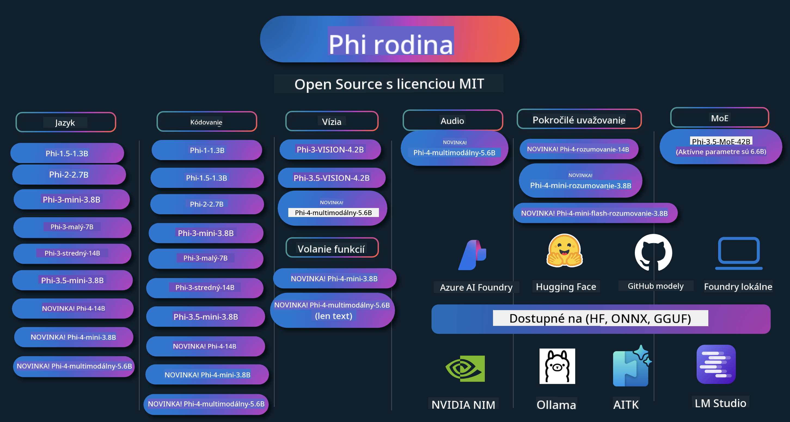

<!--
CO_OP_TRANSLATOR_METADATA:
{
  "original_hash": "5c07bb4c3c89a36c9be332a065a9a33c",
  "translation_date": "2025-07-16T15:29:19+00:00",
  "source_file": "README.md",
  "language_code": "sk"
}
-->
# Phi Cookbook: Praktické príklady s modelmi Phi od Microsoftu

  

  
  
  

  
  

Phi je séria open source AI modelov vyvinutých spoločnosťou Microsoft.

Phi je momentálne najvýkonnejší a zároveň cenovo najefektívnejší malý jazykový model (SLM), ktorý dosahuje veľmi dobré výsledky v oblastiach ako viacjazyčnosť, uvažovanie, generovanie textu/chatov, kódovanie, spracovanie obrázkov, zvuku a ďalších scenárov.

Model Phi môžete nasadiť do cloudu alebo na edge zariadenia a jednoducho vytvárať generatívne AI aplikácie aj s obmedzeným výpočtovým výkonom.

Postupujte podľa týchto krokov, aby ste začali využívať tieto zdroje:  
1. **Forknite repozitár**: Kliknite na   
2. **Naklonujte repozitár**: `git clone https://github.com/microsoft/PhiCookBook.git`  
3. [**Pridajte sa do Microsoft AI Discord komunity a spoznajte expertov a ďalších vývojárov**](https://discord.com/invite/ByRwuEEgH4?WT.mc_id=aiml-137032-kinfeylo)

### 🌐 Podpora viacerých jazykov

#### Podporované cez GitHub Action (automatizované a vždy aktuálne)

[Francúzština](../fr/README.md) | [Španielčina](../es/README.md) | [Nemčina](../de/README.md) | [Ruština](../ru/README.md) | [Arabčina](../ar/README.md) | [Perzština (Farsi)](../fa/README.md) | [Urdu](../ur/README.md) | [Čínština (zjednodušená)](../zh/README.md) | [Čínština (tradičná, Macau)](../mo/README.md) | [Čínština (tradičná, Hong Kong)](../hk/README.md) | [Čínština (tradičná, Taiwan)](../tw/README.md) | [Japončina](../ja/README.md) | [Kórejčina](../ko/README.md) | [Hindčina](../hi/README.md)  
[Bengálčina](../bn/README.md) | [Maráthčina](../mr/README.md) | [Nepálčina](../ne/README.md) | [Pandžábčina (Gurmukhi)](../pa/README.md) | [Portugalčina (Portugalsko)](../pt/README.md) | [Portugalčina (Brazília)](../br/README.md) | [Taliančina](../it/README.md) | [Poľština](../pl/README.md) | [Turečtina](../tr/README.md) | [Gréčtina](../el/README.md) | [Thajčina](../th/README.md) | [Švédčina](../sv/README.md) | [Dánčina](../da/README.md) | [Nórčina](../no/README.md) | [Fínčina](../fi/README.md) | [Holandčina](../nl/README.md) | [Hebrejčina](../he/README.md) | [Vietnamčina](../vi/README.md) | [Indonézština](../id/README.md) | [Malajčina](../ms/README.md) | [Tagalog (Filipínčina)](../tl/README.md) | [Swahilčina](../sw/README.md) | [Maďarčina](../hu/README.md) | [Čeština](../cs/README.md) | [Slovenčina](./README.md) | [Rumunčina](../ro/README.md) | [Bulharčina](../bg/README.md) | [Srbčina (cyrilika)](../sr/README.md) | [Chorvátčina](../hr/README.md) | [Slovinčina](../sl/README.md)

## Obsah

- Úvod  
  - [Vitajte v rodine Phi](./md/01.Introduction/01/01.PhiFamily.md)  
  - [Nastavenie prostredia](./md/01.Introduction/01/01.EnvironmentSetup.md)  
  - [Pochopenie kľúčových technológií](./md/01.Introduction/01/01.Understandingtech.md)  
  - [Bezpečnosť AI pre modely Phi](./md/01.Introduction/01/01.AISafety.md)  
  - [Podpora hardvéru Phi](./md/01.Introduction/01/01.Hardwaresupport.md)  
  - [Modely Phi a ich dostupnosť na rôznych platformách](./md/01.Introduction/01/01.Edgeandcloud.md)  
  - [Používanie Guidance-ai a Phi](./md/01.Introduction/01/01.Guidance.md)  
  - [GitHub Marketplace modely](https://github.com/marketplace/models)  
  - [Azure AI katalóg modelov](https://ai.azure.com)

- Inference Phi v rôznych prostrediach  
    -  [Hugging face](./md/01.Introduction/02/01.HF.md)  
    -  [GitHub modely](./md/01.Introduction/02/02.GitHubModel.md)  
    -  [Azure AI Foundry katalóg modelov](./md/01.Introduction/02/03.AzureAIFoundry.md)  
    -  [Ollama](./md/01.Introduction/02/04.Ollama.md)  
    -  [AI Toolkit VSCode (AITK)](./md/01.Introduction/02/05.AITK.md)  
    -  [NVIDIA NIM](./md/01.Introduction/02/06.NVIDIA.md)  
    -  [Foundry Local](./md/01.Introduction/02/07.FoundryLocal.md)

- Inference Phi Family  
    - [Inference Phi na iOS](./md/01.Introduction/03/iOS_Inference.md)  
    - [Inference Phi na Android](./md/01.Introduction/03/Android_Inference.md)  
    - [Inference Phi na Jetson](./md/01.Introduction/03/Jetson_Inference.md)  
    - [Inference Phi na AI PC](./md/01.Introduction/03/AIPC_Inference.md)  
    - [Inference Phi s Apple MLX Framework](./md/01.Introduction/03/MLX_Inference.md)  
    - [Inference Phi na lokálnom serveri](./md/01.Introduction/03/Local_Server_Inference.md)  
    - [Inference Phi na vzdialenom serveri pomocou AI Toolkit](./md/01.Introduction/03/Remote_Interence.md)  
    - [Inference Phi s Rust](./md/01.Introduction/03/Rust_Inference.md)  
    - [Inference Phi – Vision lokálne](./md/01.Introduction/03/Vision_Inference.md)  
    - [Inference Phi s Kaito AKS, Azure Containers (oficiálna podpora)](./md/01.Introduction/03/Kaito_Inference.md)  
-  [Kvantifikácia Phi Family](./md/01.Introduction/04/QuantifyingPhi.md)  
    - [Kvantifikácia Phi-3.5 / 4 pomocou llama.cpp](./md/01.Introduction/04/UsingLlamacppQuantifyingPhi.md)  
    - [Kvantifikácia Phi-3.5 / 4 pomocou Generative AI rozšírení pre onnxruntime](./md/01.Introduction/04/UsingORTGenAIQuantifyingPhi.md)  
    - [Kvantifikácia Phi-3.5 / 4 pomocou Intel OpenVINO](./md/01.Introduction/04/UsingIntelOpenVINOQuantifyingPhi.md)  
    - [Kvantifikácia Phi-3.5 / 4 pomocou Apple MLX Framework](./md/01.Introduction/04/UsingAppleMLXQuantifyingPhi.md)

- Hodnotenie Phi  
    - [Zodpovedná AI](./md/01.Introduction/05/ResponsibleAI.md)  
    - [Azure AI Foundry pre hodnotenie](./md/01.Introduction/05/AIFoundry.md)  
    - [Použitie Promptflow pre hodnotenie](./md/01.Introduction/05/Promptflow.md)

- RAG s Azure AI Search  
    - [Ako používať Phi-4-mini a Phi-4-multimodal (RAG) s Azure AI Search](https://github.com/microsoft/PhiCookBook/blob/main/code/06.E2E/E2E_Phi-4-RAG-Azure-AI-Search.ipynb)

- Ukážky vývoja aplikácií Phi  
  - Textové a chatové aplikácie  
    - Phi-4 ukážky 🆕  
      - [📓] [Chat s Phi-4-mini ONNX modelom](./md/02.Application/01.TextAndChat/Phi4/ChatWithPhi4ONNX/README.md)  
      - [Chat s Phi-4 lokálnym ONNX modelom v .NET](../../md/04.HOL/dotnet/src/LabsPhi4-Chat-01OnnxRuntime)  
      - [Chat .NET konzolová aplikácia s Phi-4 ONNX pomocou Semantic Kernel](../../md/04.HOL/dotnet/src/LabsPhi4-Chat-02SK)  
    - Phi-3 / 3.5 ukážky  
      - [Lokálny chatbot v prehliadači s Phi3, ONNX Runtime Web a WebGPU](https://github.com/microsoft/onnxruntime-inference-examples/tree/main/js/chat)  
      - [OpenVino Chat](./md/02.Application/01.TextAndChat/Phi3/E2E_OpenVino_Chat.md)  
      - [Multi Model – Interaktívny Phi-3-mini a OpenAI Whisper](./md/02.Application/01.TextAndChat/Phi3/E2E_Phi-3-mini_with_whisper.md)  
      - [MLFlow – Vytváranie wrappera a používanie Phi-3 s MLFlow](./md//02.Application/01.TextAndChat/Phi3/E2E_Phi-3-MLflow.md)  
      - [Optimalizácia modelu – Ako optimalizovať Phi-3-mini model pre ONNX Runtime Web pomocou Olive](https://github.com/microsoft/Olive/tree/main/examples/phi3)  
      - [WinUI3 aplikácia s Phi-3 mini-4k-instruct-onnx](https://github.com/microsoft/Phi3-Chat-WinUI3-Sample/)  
      - [WinUI3 Multi Model AI Powered Notes App ukážka](https://github.com/microsoft/ai-powered-notes-winui3-sample)
- [Doladenie a integrácia vlastných modelov Phi-3 s Prompt flow](./md/02.Application/01.TextAndChat/Phi3/E2E_Phi-3-FineTuning_PromptFlow_Integration.md)
- [Doladenie a integrácia vlastných modelov Phi-3 s Prompt flow v Azure AI Foundry](./md/02.Application/01.TextAndChat/Phi3/E2E_Phi-3-FineTuning_PromptFlow_Integration_AIFoundry.md)
- [Vyhodnotenie doladeného modelu Phi-3 / Phi-3.5 v Azure AI Foundry so zameraním na zásady zodpovednej AI od Microsoftu](./md/02.Application/01.TextAndChat/Phi3/E2E_Phi-3-Evaluation_AIFoundry.md)
- [📓] [Ukážka predikcie jazyka Phi-3.5-mini-instruct (čínska/anglická)](../../md/02.Application/01.TextAndChat/Phi3/phi3-instruct-demo.ipynb)
- [Phi-3.5-Instruct WebGPU RAG Chatbot](./md/02.Application/01.TextAndChat/Phi3/WebGPUWithPhi35Readme.md)
- [Použitie Windows GPU na vytvorenie riešenia Prompt flow s Phi-3.5-Instruct ONNX](./md/02.Application/01.TextAndChat/Phi3/UsingPromptFlowWithONNX.md)
- [Použitie Microsoft Phi-3.5 tflite na vytvorenie Android aplikácie](./md/02.Application/01.TextAndChat/Phi3/UsingPhi35TFLiteCreateAndroidApp.md)
- [Príklad Q&A v .NET s lokálnym ONNX modelom Phi-3 pomocou Microsoft.ML.OnnxRuntime](../../md/04.HOL/dotnet/src/LabsPhi301)
- [Konzolová chat .NET aplikácia so Semantic Kernel a Phi-3](../../md/04.HOL/dotnet/src/LabsPhi302)

- Azure AI Inference SDK ukážky založené na kóde
  - Phi-4 ukážky 🆕
    - [📓] [Generovanie kódu projektu pomocou Phi-4-multimodal](./md/02.Application/02.Code/Phi4/GenProjectCode/README.md)
  - Phi-3 / 3.5 ukážky
    - [Vytvorte si vlastného GitHub Copilot Chat pre Visual Studio Code s Microsoft Phi-3 rodinou](./md/02.Application/02.Code/Phi3/VSCodeExt/README.md)
    - [Vytvorte si vlastného chatovacieho asistenta pre Visual Studio Code s Phi-3.5 pomocou GitHub modelov](/md/02.Application/02.Code/Phi3/CreateVSCodeChatAgentWithGitHubModels.md)

- Ukážky pokročilého uvažovania
  - Phi-4 ukážky 🆕
    - [📓] [Ukážky Phi-4-mini-reasoning alebo Phi-4-reasoning](./md/02.Application/03.AdvancedReasoning/Phi4/AdvancedResoningPhi4mini/README.md)
    - [📓] [Doladenie Phi-4-mini-reasoning s Microsoft Olive](../../md/02.Application/03.AdvancedReasoning/Phi4/AdvancedResoningPhi4mini/olive_ft_phi_4_reasoning_with_medicaldata.ipynb)
    - [📓] [Doladenie Phi-4-mini-reasoning s Apple MLX](../../md/02.Application/03.AdvancedReasoning/Phi4/AdvancedResoningPhi4mini/mlx_ft_phi_4_reasoning_with_medicaldata.ipynb)
    - [📓] [Phi-4-mini-reasoning s GitHub modelmi](../../md/02.Application/02.Code/Phi4r/github_models_inference.ipynb)
    - [📓] [Phi-4-mini-reasoning s Azure AI Foundry modelmi](../../md/02.Application/02.Code/Phi4r/azure_models_inference.ipynb)
- Demos
    - [Phi-4-mini demo hosťované na Hugging Face Spaces](https://huggingface.co/spaces/microsoft/phi-4-mini?WT.mc_id=aiml-137032-kinfeylo)
    - [Phi-4-multimodal demo hosťované na Hugging Face Spaces](https://huggingface.co/spaces/microsoft/phi-4-multimodal?WT.mc_id=aiml-137032-kinfeylo)
- Ukážky pre videnie
  - Phi-4 ukážky 🆕
    - [📓] [Použitie Phi-4-multimodal na čítanie obrázkov a generovanie kódu](./md/02.Application/04.Vision/Phi4/CreateFrontend/README.md)
  - Phi-3 / 3.5 ukážky
    - [📓][Phi-3-vision - prevod textu z obrázka na text](../../md/02.Application/04.Vision/Phi3/E2E_Phi-3-vision-image-text-to-text-online-endpoint.ipynb)
    - [Phi-3-vision-ONNX](https://onnxruntime.ai/docs/genai/tutorials/phi3-v.html)
    - [📓][Phi-3-vision CLIP Embedding](../../md/02.Application/04.Vision/Phi3/E2E_Phi-3-vision-image-text-to-text-online-endpoint.ipynb)
    - [DEMO: Phi-3 Recycling](https://github.com/jennifermarsman/PhiRecycling/)
    - [Phi-3-vision - vizuálny jazykový asistent - s Phi3-Vision a OpenVINO](https://docs.openvino.ai/nightly/notebooks/phi-3-vision-with-output.html)
    - [Phi-3 Vision Nvidia NIM](./md/02.Application/04.Vision/Phi3/E2E_Nvidia_NIM_Vision.md)
    - [Phi-3 Vision OpenVino](./md/02.Application/04.Vision/Phi3/E2E_OpenVino_Phi3Vision.md)
    - [📓][Phi-3.5 Vision ukážka s viacerými snímkami alebo obrázkami](../../md/02.Application/04.Vision/Phi3/phi3-vision-demo.ipynb)
    - [Phi-3 Vision lokálny ONNX model pomocou Microsoft.ML.OnnxRuntime .NET](../../md/04.HOL/dotnet/src/LabsPhi303)
    - [Menu založený Phi-3 Vision lokálny ONNX model pomocou Microsoft.ML.OnnxRuntime .NET](../../md/04.HOL/dotnet/src/LabsPhi304)

- Ukážky matematiky
  - Phi-4-Mini-Flash-Reasoning-Instruct ukážky 🆕 [Matematické demo s Phi-4-Mini-Flash-Reasoning-Instruct](../../md/02.Application/09.Math/MathDemo.ipynb)

- Ukážky zvuku
  - Phi-4 ukážky 🆕
    - [📓] [Extrahovanie audio prepisov pomocou Phi-4-multimodal](./md/02.Application/05.Audio/Phi4/Transciption/README.md)
    - [📓] [Phi-4-multimodal audio ukážka](../../md/02.Application/05.Audio/Phi4/Siri/demo.ipynb)
    - [📓] [Phi-4-multimodal ukážka prekladu reči](../../md/02.Application/05.Audio/Phi4/Translate/demo.ipynb)
    - [.NET konzolová aplikácia používajúca Phi-4-multimodal Audio na analýzu audio súboru a generovanie prepisu](../../md/04.HOL/dotnet/src/LabsPhi4-MultiModal-02Audio)

- MOE ukážky
  - Phi-3 / 3.5 ukážky
    - [📓] [Phi-3.5 Mixture of Experts Models (MoEs) ukážka pre sociálne médiá](../../md/02.Application/06.MoE/Phi3/phi3_moe_demo.ipynb)
    - [📓] [Vytváranie Retrieval-Augmented Generation (RAG) pipeline s NVIDIA NIM Phi-3 MOE, Azure AI Search a LlamaIndex](../../md/02.Application/06.MoE/Phi3/azure-ai-search-nvidia-rag.ipynb)

- Ukážky volania funkcií
  - Phi-4 ukážky 🆕
    - [📓] [Použitie volania funkcií s Phi-4-mini](./md/02.Application/07.FunctionCalling/Phi4/FunctionCallingBasic/README.md)
    - [📓] [Použitie volania funkcií na vytvorenie multi-agentov s Phi-4-mini](../../md/02.Application/07.FunctionCalling/Phi4/Multiagents/Phi_4_mini_multiagent.ipynb)
    - [📓] [Použitie volania funkcií s Ollama](../../md/02.Application/07.FunctionCalling/Phi4/Ollama/ollama_functioncalling.ipynb)
    - [📓] [Použitie volania funkcií s ONNX](../../md/02.Application/07.FunctionCalling/Phi4/ONNX/onnx_parallel_functioncalling.ipynb)

- Ukážky multimodálneho mixovania
  - Phi-4 ukážky 🆕
    - [📓] [Použitie Phi-4-multimodal ako technologický novinár](../../md/02.Application/08.Multimodel/Phi4/TechJournalist/phi_4_mm_audio_text_publish_news.ipynb)
    - [.NET konzolová aplikácia používajúca Phi-4-multimodal na analýzu obrázkov](../../md/04.HOL/dotnet/src/LabsPhi4-MultiModal-01Images)

- Doladenie Phi ukážok
  - [Scenáre doladenia](./md/03.FineTuning/FineTuning_Scenarios.md)
  - [Doladenie vs RAG](./md/03.FineTuning/FineTuning_vs_RAG.md)
  - [Doladenie: Nechajte Phi-3 stať sa odborníkom v priemysle](./md/03.FineTuning/LetPhi3gotoIndustriy.md)
  - [Doladenie Phi-3 s AI Toolkit pre VS Code](./md/03.FineTuning/Finetuning_VSCodeaitoolkit.md)
  - [Doladenie Phi-3 s Azure Machine Learning Service](./md/03.FineTuning/Introduce_AzureML.md)
  - [Doladenie Phi-3 s Lora](./md/03.FineTuning/FineTuning_Lora.md)
  - [Doladenie Phi-3 s QLora](./md/03.FineTuning/FineTuning_Qlora.md)
  - [Doladenie Phi-3 s Azure AI Foundry](./md/03.FineTuning/FineTuning_AIFoundry.md)
  - [Doladenie Phi-3 s Azure ML CLI/SDK](./md/03.FineTuning/FineTuning_MLSDK.md)
  - [Doladenie s Microsoft Olive](./md/03.FineTuning/FineTuning_MicrosoftOlive.md)
  - [Doladenie s Microsoft Olive Hands-On Lab](./md/03.FineTuning/olive-lab/readme.md)
  - [Doladenie Phi-3-vision s Weights and Bias](./md/03.FineTuning/FineTuning_Phi-3-visionWandB.md)
  - [Doladenie Phi-3 s Apple MLX Framework](./md/03.FineTuning/FineTuning_MLX.md)
  - [Doladenie Phi-3-vision (oficiálna podpora)](./md/03.FineTuning/FineTuning_Vision.md)
  - [Doladenie Phi-3 s Kaito AKS, Azure Containers (oficiálna podpora)](./md/03.FineTuning/FineTuning_Kaito.md)
  - [Doladenie Phi-3 a 3.5 Vision](https://github.com/2U1/Phi3-Vision-Finetune)

- Hands on Lab
  - [Preskúmanie najmodernejších modelov: LLM, SLM, lokálny vývoj a ďalšie](https://github.com/microsoft/aitour-exploring-cutting-edge-models)
  - [Odomknutie potenciálu NLP: Doladenie s Microsoft Olive](https://github.com/azure/Ignite_FineTuning_workshop)

- Akademické výskumné práce a publikácie
  - [Textbooks Are All You Need II: phi-1.5 technická správa](https://arxiv.org/abs/2309.05463)
  - [Phi-3 technická správa: vysoko schopný jazykový model lokálne na vašom telefóne](https://arxiv.org/abs/2404.14219)
  - [Phi-4 technická správa](https://arxiv.org/abs/2412.08905)
  - [Phi-4-Mini technická správa: kompaktné, no výkonné multimodálne jazykové modely cez Mixture-of-LoRAs](https://arxiv.org/abs/2503.01743)
  - [Optimalizácia malých jazykových modelov pre volanie funkcií vo vozidle](https://arxiv.org/abs/2501.02342)
  - [(WhyPHI) Doladenie PHI-3 pre odpovede na otázky s viacerými možnosťami: metodológia, výsledky a výzvy](https://arxiv.org/abs/2501.01588)
- [Phi-4-reasoning Technická správa](https://www.microsoft.com/en-us/research/wp-content/uploads/2025/04/phi_4_reasoning.pdf)  
- [Phi-4-mini-reasoning Technická správa](https://huggingface.co/microsoft/Phi-4-mini-reasoning/blob/main/Phi-4-Mini-Reasoning.pdf)

## Používanie modelov Phi

### Phi na Azure AI Foundry

Môžete sa naučiť, ako používať Microsoft Phi a ako vytvárať E2E riešenia na rôznych hardvérových zariadeniach. Ak chcete Phi vyskúšať na vlastnej koži, začnite hraním sa s modelmi a prispôsobovaním Phi pre vaše scenáre pomocou [Azure AI Foundry Azure AI Model Catalog](https://aka.ms/phi3-azure-ai). Viac sa dozviete v návode Začíname s [Azure AI Foundry](/md/02.QuickStart/AzureAIFoundry_QuickStart.md).

**Playground**  
Každý model má vyhradené prostredie na testovanie modelu [Azure AI Playground](https://aka.ms/try-phi3).

### Phi na GitHub modeloch

Môžete sa naučiť, ako používať Microsoft Phi a ako vytvárať E2E riešenia na rôznych hardvérových zariadeniach. Ak chcete Phi vyskúšať na vlastnej koži, začnite hraním sa s modelom a prispôsobovaním Phi pre vaše scenáre pomocou [GitHub Model Catalog](https://github.com/marketplace/models?WT.mc_id=aiml-137032-kinfeylo). Viac sa dozviete v návode Začíname s [GitHub Model Catalog](/md/02.QuickStart/GitHubModel_QuickStart.md).

**Playground**  
Každý model má vyhradené [prostredie na testovanie modelu](/md/02.QuickStart/GitHubModel_QuickStart.md).

### Phi na Hugging Face

Model nájdete aj na [Hugging Face](https://huggingface.co/microsoft).

**Playground**  
[Hugging Chat playground](https://huggingface.co/chat/models/microsoft/Phi-3-mini-4k-instruct)

## Zodpovedná AI

Microsoft sa zaväzuje pomáhať svojim zákazníkom používať naše AI produkty zodpovedne, zdieľať naše poznatky a budovať dôveru prostredníctvom nástrojov ako Transparency Notes a Impact Assessments. Mnohé z týchto zdrojov nájdete na [https://aka.ms/RAI](https://aka.ms/RAI).  
Prístup Microsoftu k zodpovednej AI je založený na našich princípoch AI: spravodlivosť, spoľahlivosť a bezpečnosť, ochrana súkromia a bezpečnosť, inkluzívnosť, transparentnosť a zodpovednosť.

Veľké modely pre spracovanie prirodzeného jazyka, obrázkov a reči – ako tie použité v tomto príklade – môžu potenciálne vykazovať nespravodlivé, nespoľahlivé alebo urážlivé správanie, čo môže viesť k škodám. Pre informácie o rizikách a obmedzeniach si prosím prečítajte [Azure OpenAI service Transparency note](https://learn.microsoft.com/legal/cognitive-services/openai/transparency-note?tabs=text).

Odporúčaný prístup na zmiernenie týchto rizík je zahrnúť do vašej architektúry bezpečnostný systém, ktorý dokáže detegovať a zabrániť škodlivému správaniu. [Azure AI Content Safety](https://learn.microsoft.com/azure/ai-services/content-safety/overview) poskytuje nezávislú ochrannú vrstvu, ktorá dokáže detegovať škodlivý obsah vytvorený používateľmi aj AI v aplikáciách a službách. Azure AI Content Safety zahŕňa textové a obrazové API, ktoré umožňujú detekciu škodlivého materiálu. V rámci Azure AI Foundry služba Content Safety umožňuje prezerať, skúmať a vyskúšať ukážkový kód na detekciu škodlivého obsahu v rôznych modalitách. Nasledujúca [rýchla príručka](https://learn.microsoft.com/azure/ai-services/content-safety/quickstart-text?tabs=visual-studio%2Clinux&pivots=programming-language-rest) vás prevedie vytváraním požiadaviek na službu.

Ďalším aspektom, ktorý treba zvážiť, je celkový výkon aplikácie. Pri multimodálnych a multimodelových aplikáciách považujeme výkon za to, že systém funguje tak, ako vy a vaši používatelia očakávate, vrátane toho, že nevytvára škodlivé výstupy. Je dôležité vyhodnotiť výkon celej aplikácie pomocou [Performance and Quality and Risk and Safety evaluators](https://learn.microsoft.com/azure/ai-studio/concepts/evaluation-metrics-built-in). Tiež máte možnosť vytvárať a hodnotiť pomocou [vlastných evaluátorov](https://learn.microsoft.com/azure/ai-studio/how-to/develop/evaluate-sdk#custom-evaluators).

Svoju AI aplikáciu môžete hodnotiť vo vývojovom prostredí pomocou [Azure AI Evaluation SDK](https://microsoft.github.io/promptflow/index.html). Na základe testovacej dátovej sady alebo cieľa sú generácie vašej generatívnej AI aplikácie kvantitatívne merané pomocou vstavaných alebo vlastných evaluátorov podľa vášho výberu. Ak chcete začať s azure ai evaluation sdk na hodnotenie vášho systému, môžete sledovať [rýchlu príručku](https://learn.microsoft.com/azure/ai-studio/how-to/develop/flow-evaluate-sdk). Po vykonaní hodnotenia môžete [vizualizovať výsledky v Azure AI Foundry](https://learn.microsoft.com/azure/ai-studio/how-to/evaluate-flow-results).

## Ochranné známky

Tento projekt môže obsahovať ochranné známky alebo logá projektov, produktov alebo služieb. Autorizované používanie ochranných známok alebo log Microsoftu podlieha a musí dodržiavať [Microsoft's Trademark & Brand Guidelines](https://www.microsoft.com/legal/intellectualproperty/trademarks/usage/general).  
Použitie ochranných známok alebo log Microsoftu v upravených verziách tohto projektu nesmie viesť k zmätku ani naznačovať sponzorstvo Microsoftom. Použitie ochranných známok alebo log tretích strán podlieha pravidlám týchto tretích strán.

**Zrieknutie sa zodpovednosti**:  
Tento dokument bol preložený pomocou AI prekladateľskej služby [Co-op Translator](https://github.com/Azure/co-op-translator). Aj keď sa snažíme o presnosť, prosím, majte na pamäti, že automatizované preklady môžu obsahovať chyby alebo nepresnosti. Originálny dokument v jeho pôvodnom jazyku by mal byť považovaný za autoritatívny zdroj. Pre kritické informácie sa odporúča profesionálny ľudský preklad. Nie sme zodpovední za akékoľvek nedorozumenia alebo nesprávne interpretácie vyplývajúce z použitia tohto prekladu.