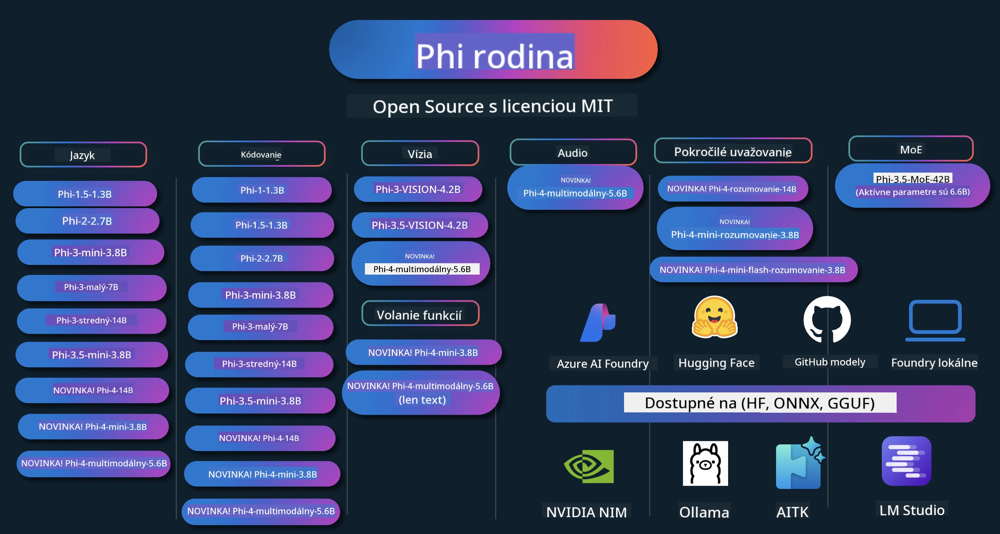

# Phi Kuchárka: Praktické príklady s Phi modelmi od Microsoftu

[](https://codespaces.new/microsoft/phicookbook)
[](https://vscode.dev/redirect?url=vscode://ms-vscode-remote.remote-containers/cloneInVolume?url=https://github.com/microsoft/phicookbook)

[](https://GitHub.com/microsoft/phicookbook/graphs/contributors/?WT.mc_id=aiml-137032-kinfeylo)
[](https://GitHub.com/microsoft/phicookbook/issues/?WT.mc_id=aiml-137032-kinfeylo)
[](https://GitHub.com/microsoft/phicookbook/pulls/?WT.mc_id=aiml-137032-kinfeylo)
[](http://makeapullrequest.com?WT.mc_id=aiml-137032-kinfeylo)

[](https://GitHub.com/microsoft/phicookbook/watchers/?WT.mc_id=aiml-137032-kinfeylo)
[](https://GitHub.com/microsoft/phicookbook/network/?WT.mc_id=aiml-137032-kinfeylo)
[](https://GitHub.com/microsoft/phicookbook/stargazers/?WT.mc_id=aiml-137032-kinfeylo)

[](https://discord.com/invite/ByRwuEEgH4)

Phi je séria open source AI modelov vyvinutých spoločnosťou Microsoft.

Phi je momentálne najsilnejší a najefektívnejší malý jazykový model (SLM), s veľmi dobrými benchmarkmi v mnohých jazykoch, uvažovaní, generovaní textu/čatu, kódovaní, obrazoch, zvuku a ďalších scenároch.

Phi môžete nasadiť do cloudu alebo na edge zariadenia a ľahko vytvárať generatívne AI aplikácie s obmedzeným výpočtovým výkonom.

Postupujte podľa týchto krokov, aby ste začali používať tieto zdroje:
1. **Vytvorte Fork repozitára**: Kliknite na [](https://GitHub.com/microsoft/phicookbook/network/?WT.mc_id=aiml-137032-kinfeylo)
2. **Klonujte repozitár**:   `git clone https://github.com/microsoft/PhiCookBook.git`
3. [**Pridajte sa do Microsoft AI Discord komunity a stretnite sa s odborníkmi a vývojármi**](https://discord.com/invite/ByRwuEEgH4?WT.mc_id=aiml-137032-kinfeylo)



### 🌐 Podpora viacerých jazykov

#### Podporované cez GitHub Action (automatizované a vždy aktuálne)

<!-- CO-OP TRANSLATOR LANGUAGES TABLE START -->
[Arabčina](../ar/README.md) | [Bengálčina](../bn/README.md) | [Bulharčina](../bg/README.md) | [Barmčina (Myanmar)](../my/README.md) | [Čínština (zjednodušená)](../zh-CN/README.md) | [Čínština (tradičná, Hong Kong)](../zh-HK/README.md) | [Čínština (tradičná, Macau)](../zh-MO/README.md) | [Čínština (tradičná, Taiwan)](../zh-TW/README.md) | [Chorvátčina](../hr/README.md) | [Český](../cs/README.md) | [Dánčina](../da/README.md) | [Holandčina](../nl/README.md) | [Estónčina](../et/README.md) | [Fínčina](../fi/README.md) | [Francúzština](../fr/README.md) | [Nemčina](../de/README.md) | [Géčtina](../el/README.md) | [Hebrejčina](../he/README.md) | [Hindčina](../hi/README.md) | [Maďarčina](../hu/README.md) | [Indonézština](../id/README.md) | [Taliančina](../it/README.md) | [Japončina](../ja/README.md) | [Kannadčina](../kn/README.md) | [Kórejčina](../ko/README.md) | [Litovčina](../lt/README.md) | [Malajčina](../ms/README.md) | [Malayalam](../ml/README.md) | [Maráthčina](../mr/README.md) | [Nepálčina](../ne/README.md) | [Nigérijský pidžin](../pcm/README.md) | [Norwegian](../no/README.md) | [Perzština (Farsi)](../fa/README.md) | [Poľština](../pl/README.md) | [Portugalčina (Brazília)](../pt-BR/README.md) | [Portugalčina (Portugalsko)](../pt-PT/README.md) | [Paňdžábčina (Gurmukhi)](../pa/README.md) | [Rumunčina](../ro/README.md) | [Ruština](../ru/README.md) | [Srbčina (cyrilika)](../sr/README.md) | [Slovenčina](./README.md) | [Slovinčina](../sl/README.md) | [Španielčina](../es/README.md) | [Svahilčina](../sw/README.md) | [Švédčina](../sv/README.md) | [Tagalog (Filipínska)](../tl/README.md) | [Tamilčina](../ta/README.md) | [Telugčina](../te/README.md) | [Thajčina](../th/README.md) | [Turečtina](../tr/README.md) | [Ukrajinčina](../uk/README.md) | [Urdu](../ur/README.md) | [Vietnamčina](../vi/README.md)

> **Radšej klonovať lokálne?**
>
> Tento repozitár obsahuje viac ako 50 jazykových prekladov, čo výrazne zvyšuje veľkosť sťahovania. Na klonovanie bez prekladov použite sparse checkout:
>
> **Bash / macOS / Linux:**
> ```bash
> git clone --filter=blob:none --sparse https://github.com/microsoft/PhiCookBook.git
> cd PhiCookBook
> git sparse-checkout set --no-cone '/*' '!translations' '!translated_images'
> ```
>
> **CMD (Windows):**
> ```cmd
> git clone --filter=blob:none --sparse https://github.com/microsoft/PhiCookBook.git
> cd PhiCookBook
> git sparse-checkout set --no-cone "/*" "!translations" "!translated_images"
> ```
>
> Toto vám poskytne všetko potrebné pre dokončenie kurzu s oveľa rýchlejším sťahovaním.
<!-- CO-OP TRANSLATOR LANGUAGES TABLE END -->

## Obsah

- Úvod
  - [Vitajte v rodine Phi](./md/01.Introduction/01/01.PhiFamily.md)
  - [Nastavenie vášho prostredia](./md/01.Introduction/01/01.EnvironmentSetup.md)
  - [Pochopenie kľúčových technológií](./md/01.Introduction/01/01.Understandingtech.md)
  - [Bezpečnosť AI pre Phi modely](./md/01.Introduction/01/01.AISafety.md)
  - [Podpora hardvéru Phi](./md/01.Introduction/01/01.Hardwaresupport.md)
  - [Phi modely & dostupnosť na rôznych platformách](./md/01.Introduction/01/01.Edgeandcloud.md)
  - [Používanie Guidance-ai a Phi](./md/01.Introduction/01/01.Guidance.md)
  - [GitHub Marketplace modely](https://github.com/marketplace/models)
  - [Azure AI Katalóg modelov](https://ai.azure.com)

- Inferencia Phi v rôznych prostrediach
    -  [Hugging face](./md/01.Introduction/02/01.HF.md)
    -  [GitHub modely](./md/01.Introduction/02/02.GitHubModel.md)
    -  [Microsoft Foundry Katalóg modelov](./md/01.Introduction/02/03.AzureAIFoundry.md)
    -  [Ollama](./md/01.Introduction/02/04.Ollama.md)
    -  [AI Toolkit VSCode (AITK)](./md/01.Introduction/02/05.AITK.md)
    -  [NVIDIA NIM](./md/01.Introduction/02/06.NVIDIA.md)
    -  [Foundry Lokálne](./md/01.Introduction/02/07.FoundryLocal.md)

- Inferencia Phi rodiny
    - [Inferencia Phi na iOS](./md/01.Introduction/03/iOS_Inference.md)
    - [Inferencia Phi na Androide](./md/01.Introduction/03/Android_Inference.md)
    - [Inferencia Phi na Jetson](./md/01.Introduction/03/Jetson_Inference.md)
    - [Inferencia Phi na AI PC](./md/01.Introduction/03/AIPC_Inference.md)
    - [Inferencia Phi s Apple MLX Framework](./md/01.Introduction/03/MLX_Inference.md)
    - [Inferencia Phi na lokálnom serveri](./md/01.Introduction/03/Local_Server_Inference.md)
    - [Inferencia Phi na vzdialenom serveri pomocou AI Toolkit](./md/01.Introduction/03/Remote_Interence.md)
    - [Inferencia Phi s Rustom](./md/01.Introduction/03/Rust_Inference.md)
    - [Inferencia Phi – Vision lokálne](./md/01.Introduction/03/Vision_Inference.md)
    - [Inferencia Phi s Kaito AKS, Azure Containers (oficiálna podpora)](./md/01.Introduction/03/Kaito_Inference.md)
-  [Kvantifikácia Phi rodiny](./md/01.Introduction/04/QuantifyingPhi.md)
    - [Kvantifikácia Phi-3.5 / 4 pomocou llama.cpp](./md/01.Introduction/04/UsingLlamacppQuantifyingPhi.md)
    - [Kvantifikácia Phi-3.5 / 4 pomocou Generatívnych AI rozšírení pre onnxruntime](./md/01.Introduction/04/UsingORTGenAIQuantifyingPhi.md)
    - [Kvantifikácia Phi-3.5 / 4 pomocou Intel OpenVINO](./md/01.Introduction/04/UsingIntelOpenVINOQuantifyingPhi.md)
    - [Kvantifikácia Phi-3.5 / 4 pomocou Apple MLX Framework](./md/01.Introduction/04/UsingAppleMLXQuantifyingPhi.md)

-  Hodnotenie Phi
    - [Zodpovedná AI](./md/01.Introduction/05/ResponsibleAI.md)
    - [Microsoft Foundry pre hodnotenie](./md/01.Introduction/05/AIFoundry.md)
    - [Použitie Promptflow pre hodnotenie](./md/01.Introduction/05/Promptflow.md)
 
- RAG s Azure AI Search
    - [Ako používať Phi-4-mini a Phi-4-multimodal(RAG) s Azure AI Search](https://github.com/microsoft/PhiCookBook/blob/main/code/06.E2E/E2E_Phi-4-RAG-Azure-AI-Search.ipynb)

- Ukážky vývoja aplikácií Phi
  - Text a chatové aplikácie
    - Phi-4 Ukážky 🆕
      - [📓] [Chat s Phi-4-mini ONNX modelom](./md/02.Application/01.TextAndChat/Phi4/ChatWithPhi4ONNX/README.md)
      - [Chat s Phi-4 lokálnym ONNX modelom v .NET](../../md/04.HOL/dotnet/src/LabsPhi4-Chat-01OnnxRuntime)
      - [Chat .NET konzolová aplikácia s Phi-4 ONNX pomocou Semantic Kernel](../../md/04.HOL/dotnet/src/LabsPhi4-Chat-02SK)
    - Phi-3 / 3.5 Ukážky
      - [Lokálny chatbot v prehliadači pomocou Phi3, ONNX Runtime Web a WebGPU](https://github.com/microsoft/onnxruntime-inference-examples/tree/main/js/chat)
      - [OpenVino Chat](./md/02.Application/01.TextAndChat/Phi3/E2E_OpenVino_Chat.md)
      - [Multi Model - Interaktívny Phi-3-mini a OpenAI Whisper](./md/02.Application/01.TextAndChat/Phi3/E2E_Phi-3-mini_with_whisper.md)
      - [MLFlow - Vytvorenie wrappera a použitie Phi-3 s MLFlow](./md//02.Application/01.TextAndChat/Phi3/E2E_Phi-3-MLflow.md)
      - [Optimalizácia modelu - Ako optimalizovať model Phi-3-min pre ONNX Runtime Web pomocou Olive](https://github.com/microsoft/Olive/tree/main/examples/phi3)
      - [WinUI3 aplikácia s Phi-3 mini-4k-instruct-onnx](https://github.com/microsoft/Phi3-Chat-WinUI3-Sample/)
      -[WinUI3 Multi Model AI Powered Notes App Sample](https://github.com/microsoft/ai-powered-notes-winui3-sample)
      - [Doladenie a integrácia vlastných modelov Phi-3 s Prompt flow](./md/02.Application/01.TextAndChat/Phi3/E2E_Phi-3-FineTuning_PromptFlow_Integration.md)
      - [Doladenie a integrácia vlastných modelov Phi-3 s Prompt flow v Microsoft Foundry](./md/02.Application/01.TextAndChat/Phi3/E2E_Phi-3-FineTuning_PromptFlow_Integration_AIFoundry.md)
      - [Vyhodnotenie doladeného modelu Phi-3 / Phi-3.5 v Microsoft Foundry so zameraním na Microsoft zásady zodpovednej AI](./md/02.Application/01.TextAndChat/Phi3/E2E_Phi-3-Evaluation_AIFoundry.md)
      - [📓] [Ukážka jazykovej predikcie Phi-3.5-mini-instruct (čínske/anglické)](./md/02.Application/01.TextAndChat/Phi3/phi3-instruct-demo.ipynb)
      - [Phi-3.5-Instruct WebGPU RAG Chatbot](./md/02.Application/01.TextAndChat/Phi3/WebGPUWithPhi35Readme.md)
      - [Použitie Windows GPU na vytvorenie riešenia Prompt flow s Phi-3.5-Instruct ONNX](./md/02.Application/01.TextAndChat/Phi3/UsingPromptFlowWithONNX.md)
      - [Použitie Microsoft Phi-3.5 tflite na vytvorenie Android aplikácie](./md/02.Application/01.TextAndChat/Phi3/UsingPhi35TFLiteCreateAndroidApp.md)
      - [Príklad dotazov a odpovedí .NET s použitím lokálneho ONNX Phi-3 modelu pomocou Microsoft.ML.OnnxRuntime](../../md/04.HOL/dotnet/src/LabsPhi301)
      - [Konzolová chat aplikácia .NET so Semantic Kernel a Phi-3](../../md/04.HOL/dotnet/src/LabsPhi302)

  - Azure AI Inference SDK Ukážky založené na kóde 
    - Phi-4 Ukážky 🆕
      - [📓] [Generovanie kódu projektu pomocou Phi-4-multimodal](./md/02.Application/02.Code/Phi4/GenProjectCode/README.md)
    - Phi-3 / 3.5 Ukážky
      - [Vytvorte si vlastný Visual Studio Code GitHub Copilot Chat s rodinou Microsoft Phi-3](./md/02.Application/02.Code/Phi3/VSCodeExt/README.md)
      - [Vytvorte si vlastného agenta Visual Studio Code Chat Copilot s Phi-3.5 pomocou GitHub modelov](/md/02.Application/02.Code/Phi3/CreateVSCodeChatAgentWithGitHubModels.md)

  - Ukážky pokročilého uvažovania
    - Phi-4 Ukážky 🆕
      - [📓] [Phi-4-mini-reasoning alebo Phi-4-reasoning Ukážky](./md/02.Application/03.AdvancedReasoning/Phi4/AdvancedResoningPhi4mini/README.md)
      - [📓] [Doladenie Phi-4-mini-reasoning s Microsoft Olive](./md/02.Application/03.AdvancedReasoning/Phi4/AdvancedResoningPhi4mini/olive_ft_phi_4_reasoning_with_medicaldata.ipynb)
      - [📓] [Doladenie Phi-4-mini-reasoning s Apple MLX](./md/02.Application/03.AdvancedReasoning/Phi4/AdvancedResoningPhi4mini/mlx_ft_phi_4_reasoning_with_medicaldata.ipynb)
      - [📓] [Phi-4-mini-reasoning s GitHub modelmi](./md/02.Application/02.Code/Phi4r/github_models_inference.ipynb)
      - [📓] [Phi-4-mini-reasoning s Microsoft Foundry modelmi](./md/02.Application/02.Code/Phi4r/azure_models_inference.ipynb)
  - Demos
      - [Phi-4-mini demo hosťované na Hugging Face Spaces](https://huggingface.co/spaces/microsoft/phi-4-mini?WT.mc_id=aiml-137032-kinfeylo)
      - [Phi-4-multimodal demo hosťované na Hugginge Face Spaces](https://huggingface.co/spaces/microsoft/phi-4-multimodal?WT.mc_id=aiml-137032-kinfeylo)
  - Ukážky pre zrak
    - Phi-4 Ukážky 🆕
      - [📓] [Použitie Phi-4-multimodal na čítanie obrázkov a generovanie kódu](./md/02.Application/04.Vision/Phi4/CreateFrontend/README.md) 
    - Phi-3 / 3.5 Ukážky
      -  [📓][Phi-3-vision-Obrázok text na text](./md/02.Application/04.Vision/Phi3/E2E_Phi-3-vision-image-text-to-text-online-endpoint.ipynb)
      - [Phi-3-vision-ONNX](https://onnxruntime.ai/docs/genai/tutorials/phi3-v.html)
      - [📓][Phi-3-vision CLIP Embedding](./md/02.Application/04.Vision/Phi3/E2E_Phi-3-vision-image-text-to-text-online-endpoint.ipynb)
      - [DEMO: Phi-3 Recyklácia](https://github.com/jennifermarsman/PhiRecycling/)
      - [Phi-3-vision - Asistent vizuálneho jazyka - s Phi3-Vision a OpenVINO](https://docs.openvino.ai/nightly/notebooks/phi-3-vision-with-output.html)
      - [Phi-3 Vision Nvidia NIM](./md/02.Application/04.Vision/Phi3/E2E_Nvidia_NIM_Vision.md)
      - [Phi-3 Vision OpenVino](./md/02.Application/04.Vision/Phi3/E2E_OpenVino_Phi3Vision.md)
      - [📓][Phi-3.5 Vision multi-frame alebo viac obrázkov ukážka](./md/02.Application/04.Vision/Phi3/phi3-vision-demo.ipynb)
      - [Phi-3 Vision Lokálny ONNX Model pomocou Microsoft.ML.OnnxRuntime .NET](../../md/04.HOL/dotnet/src/LabsPhi303)
      - [Menu založený Phi-3 Vision Lokálny ONNX Model pomocou Microsoft.ML.OnnxRuntime .NET](../../md/04.HOL/dotnet/src/LabsPhi304)

  - Matematické ukážky
    -  Phi-4-Mini-Flash-Reasoning-Instruct Ukážky 🆕 [Matematické demo s Phi-4-Mini-Flash-Reasoning-Instruct](./md/02.Application/09.Math/MathDemo.ipynb)

  - Ukážky zvuku
    - Phi-4 Ukážky 🆕
      - [📓] [Extrahovanie audio prepisov pomocou Phi-4-multimodal](./md/02.Application/05.Audio/Phi4/Transciption/README.md)
      - [📓] [Phi-4-multimodal audio ukážka](./md/02.Application/05.Audio/Phi4/Siri/demo.ipynb)
      - [📓] [Phi-4-multimodal ukážka prekladu reči](./md/02.Application/05.Audio/Phi4/Translate/demo.ipynb)
      - [.NET konzolová aplikácia používajúca Phi-4-multimodal Audio na analýzu audio súboru a generovanie prepisu](../../md/04.HOL/dotnet/src/LabsPhi4-MultiModal-02Audio)

  - MOE Ukážky
    - Phi-3 / 3.5 Ukážky
      - [📓] [Phi-3.5 Modely miešancov expertov (MoEs) ukážka sociálnych médií](./md/02.Application/06.MoE/Phi3/phi3_moe_demo.ipynb)
      - [📓] [Vytvorenie RAG pipeline s NVIDIA NIM Phi-3 MOE, Azure AI Search a LlamaIndex](./md/02.Application/06.MoE/Phi3/azure-ai-search-nvidia-rag.ipynb)
      - 
  - Ukážky volania funkcií
    - Phi-4 Ukážky 🆕
      -  [📓] [Použitie volania funkcie s Phi-4-mini](./md/02.Application/07.FunctionCalling/Phi4/FunctionCallingBasic/README.md)
      -  [📓] [Použitie volania funkcie na vytvorenie multi-agentov s Phi-4-mini](./md/02.Application/07.FunctionCalling/Phi4/Multiagents/Phi_4_mini_multiagent.ipynb)
      -  [📓] [Použitie volania funkcie s Ollama](./md/02.Application/07.FunctionCalling/Phi4/Ollama/ollama_functioncalling.ipynb)
      -  [📓] [Použitie volania funkcie s ONNX](./md/02.Application/07.FunctionCalling/Phi4/ONNX/onnx_parallel_functioncalling.ipynb)
  - Ukážky multimodálneho mixu
    - Phi-4 Ukážky 🆕
      -  [📓] [Použitie Phi-4-multimodal ako technologický novinár](./md/02.Application/08.Multimodel/Phi4/TechJournalist/phi_4_mm_audio_text_publish_news.ipynb)
      - [.NET konzolová aplikácia používajúca Phi-4-multimodal na analýzu obrázkov](../../md/04.HOL/dotnet/src/LabsPhi4-MultiModal-01Images)

- Doladenie Phi Ukážok
  - [Scenáre doladenia](./md/03.FineTuning/FineTuning_Scenarios.md)
  - [Doladenie vs RAG](./md/03.FineTuning/FineTuning_vs_RAG.md)
  - [Doladenie Nech Phi-3 sa stane priemyselným expertom](./md/03.FineTuning/LetPhi3gotoIndustriy.md)
  - [Doladenie Phi-3 s AI Toolkit pre VS Code](./md/03.FineTuning/Finetuning_VSCodeaitoolkit.md)
  - [Doladenie Phi-3 so službou Azure Machine Learning](./md/03.FineTuning/Introduce_AzureML.md)
  - [Doladenie Phi-3 s Lora](./md/03.FineTuning/FineTuning_Lora.md)
  - [Doladenie Phi-3 s QLora](./md/03.FineTuning/FineTuning_Qlora.md)
  - [Doladenie Phi-3 s Microsoft Foundry](./md/03.FineTuning/FineTuning_AIFoundry.md)
  - [Doladenie Phi-3 s Azure ML CLI/SDK](./md/03.FineTuning/FineTuning_MLSDK.md)
  - [Doladenie s Microsoft Olive](./md/03.FineTuning/FineTuning_MicrosoftOlive.md)
  - [Doladenie s Microsoft Olive Hands-On Lab](./md/03.FineTuning/olive-lab/readme.md)
  - [Doladenie Phi-3-vision s Weights and Bias](./md/03.FineTuning/FineTuning_Phi-3-visionWandB.md)
  - [Doladenie Phi-3 s Apple MLX Framework](./md/03.FineTuning/FineTuning_MLX.md)
  - [Doladenie Phi-3-vision (oficiálna podpora)](./md/03.FineTuning/FineTuning_Vision.md)
  - [Doladenie Phi-3 s Kaito AKS, Azure Containers (oficiálna podpora)](./md/03.FineTuning/FineTuning_Kaito.md)
  - [Doladenie Phi-3 a 3.5 Vision](https://github.com/2U1/Phi3-Vision-Finetune)

- Hands on Lab
  - [Preskúmanie najmodernejších modelov: LLM, SLM, lokálny vývoj a viac](https://github.com/microsoft/aitour-exploring-cutting-edge-models)
  - [Odomknutie potenciálu NLP: Doladenie s Microsoft Olive](https://github.com/azure/Ignite_FineTuning_workshop)
- Akademické výskumné práce a publikácie
  - [Učebnice sú všetko, čo potrebujete II: technická správa phi-1.5](https://arxiv.org/abs/2309.05463)
  - [Technická správa Phi-3: vysoko schopný jazykový model lokálne vo vašom telefóne](https://arxiv.org/abs/2404.14219)
  - [Technická správa Phi-4](https://arxiv.org/abs/2412.08905)
  - [Technická správa Phi-4-Mini: kompaktné, no výkonné multimodálne jazykové modely pomocou Mixture-of-LoRAs](https://arxiv.org/abs/2503.01743)
  - [Optimalizácia malých jazykových modelov na volanie funkcií vo vozidle](https://arxiv.org/abs/2501.02342)
  - [(WhyPHI) Doladenie PHI-3 pre odpovedanie na otázky s výberom z viacerých možností: metodológia, výsledky a výzvy](https://arxiv.org/abs/2501.01588)
  - [Technická správa Phi-4-reasoning](https://www.microsoft.com/en-us/research/wp-content/uploads/2025/04/phi_4_reasoning.pdf)
  - [Technická správa Phi-4-mini-reasoning](https://huggingface.co/microsoft/Phi-4-mini-reasoning/blob/main/Phi-4-Mini-Reasoning.pdf)

## Používanie modelov Phi

### Phi na Microsoft Foundry

Môžete sa naučiť, ako používať Microsoft Phi a ako vytvárať E2E riešenia vo svojich rôznych hardvérových zariadeniach. Ak chcete Phi vyskúšať sami, začnite hraním sa s modelmi a prispôsobením Phi pre vaše scenáre pomocou [Microsoft Foundry Azure AI Model Catalog](https://aka.ms/phi3-azure-ai). Viac sa dozviete v časti Začíname s [Microsoft Foundry](/md/02.QuickStart/AzureAIFoundry_QuickStart.md)

**Playground**
Každý model má vyhradené prostredie na testovanie modelu [Azure AI Playground](https://aka.ms/try-phi3).

### Phi na GitHub modeloch

Môžete sa naučiť, ako používať Microsoft Phi a ako vytvárať E2E riešenia vo svojich rôznych hardvérových zariadeniach. Ak chcete Phi vyskúšať sami, začnite hraním sa s modelom a prispôsobením Phi pre vaše scenáre pomocou [GitHub Model Catalog](https://github.com/marketplace/models?WT.mc_id=aiml-137032-kinfeylo). Viac sa dozviete v časti Začíname s [GitHub Model Catalog](/md/02.QuickStart/GitHubModel_QuickStart.md)

**Playground**
Každý model má vyhradené [prostredie na testovanie modelu](/md/02.QuickStart/GitHubModel_QuickStart.md).

### Phi na Hugging Face

Model nájdete aj na [Hugging Face](https://huggingface.co/microsoft)

**Playground**  
[Hugging Chat playground](https://huggingface.co/chat/models/microsoft/Phi-3-mini-4k-instruct)

## 🎒 Iné kurzy

Náš tím vytvára aj iné kurzy! Pozrite si:

<!-- CO-OP TRANSLATOR OTHER COURSES START -->
### LangChain
[](https://aka.ms/langchain4j-for-beginners)
[](https://aka.ms/langchainjs-for-beginners?WT.mc_id=m365-94501-dwahlin)
[](https://github.com/microsoft/langchain-for-beginners?WT.mc_id=m365-94501-dwahlin)
---

### Azure / Edge / MCP / Agenti
[](https://github.com/microsoft/AZD-for-beginners?WT.mc_id=academic-105485-koreyst)
[](https://github.com/microsoft/edgeai-for-beginners?WT.mc_id=academic-105485-koreyst)
[](https://github.com/microsoft/mcp-for-beginners?WT.mc_id=academic-105485-koreyst)
[](https://github.com/microsoft/ai-agents-for-beginners?WT.mc_id=academic-105485-koreyst)

---

### Série Generatívnej AI
[](https://github.com/microsoft/generative-ai-for-beginners?WT.mc_id=academic-105485-koreyst)
[-9333EA?style=for-the-badge&labelColor=E5E7EB&color=9333EA)](https://github.com/microsoft/Generative-AI-for-beginners-dotnet?WT.mc_id=academic-105485-koreyst)
[-C084FC?style=for-the-badge&labelColor=E5E7EB&color=C084FC)](https://github.com/microsoft/generative-ai-for-beginners-java?WT.mc_id=academic-105485-koreyst)
[-E879F9?style=for-the-badge&labelColor=E5E7EB&color=E879F9)](https://github.com/microsoft/generative-ai-with-javascript?WT.mc_id=academic-105485-koreyst)

---

### Základy učenia
[](https://aka.ms/ml-beginners?WT.mc_id=academic-105485-koreyst)
[](https://aka.ms/datascience-beginners?WT.mc_id=academic-105485-koreyst)
[](https://aka.ms/ai-beginners?WT.mc_id=academic-105485-koreyst)
[](https://github.com/microsoft/Security-101?WT.mc_id=academic-96948-sayoung)
[](https://aka.ms/webdev-beginners?WT.mc_id=academic-105485-koreyst)
[](https://aka.ms/iot-beginners?WT.mc_id=academic-105485-koreyst)
[](https://github.com/microsoft/xr-development-for-beginners?WT.mc_id=academic-105485-koreyst)

---

### Série Copilot
[](https://aka.ms/GitHubCopilotAI?WT.mc_id=academic-105485-koreyst)
[](https://github.com/microsoft/mastering-github-copilot-for-dotnet-csharp-developers?WT.mc_id=academic-105485-koreyst)
[](https://github.com/microsoft/CopilotAdventures?WT.mc_id=academic-105485-koreyst)
<!-- CO-OP TRANSLATOR OTHER COURSES END -->

## Zodpovedná AI

Microsoft je odhodlaný pomáhať našim zákazníkom používať naše AI produkty zodpovedne, zdieľať naše poznatky a budovať dôveryhodné partnerstvá prostredníctvom nástrojov ako Transparency Notes a Impact Assessments. Mnohé z týchto zdrojov nájdete na [https://aka.ms/RAI](https://aka.ms/RAI).
Prístup Microsoftu k zodpovednej AI je založený na našich princípoch AI, ktorými sú spravodlivosť, spoľahlivosť a bezpečnosť, súkromie a ochrana, inkluzívnosť, transparentnosť a zodpovednosť.

Veľké modely spracúvajúce prirodzený jazyk, obraz a reč – ako tie použité v tomto príklade – môžu potenciálne prejavovať správanie, ktoré je nespravodlivé, nespoľahlivé alebo urážlivé, čo môže viesť k škodám. Prosím, preverte si [Transparency note služby Azure OpenAI](https://learn.microsoft.com/legal/cognitive-services/openai/transparency-note?tabs=text), aby ste boli informovaní o rizikách a obmedzeniach.

Odporúčaný spôsob zmierňovania týchto rizík je zahrnutie bezpečnostného systému vo vašej architektúre, ktorý dokáže odhaliť a zabrániť škodlivému správaniu. [Azure AI Content Safety](https://learn.microsoft.com/azure/ai-services/content-safety/overview) poskytuje nezávislú vrstvu ochrany, schopnú detegovať škodlivý obsah vytvorený používateľmi a AI v aplikáciách a službách. Azure AI Content Safety zahŕňa rozhrania API pre text aj obraz, ktoré umožňujú detegovať škodlivý materiál. V rámci Microsoft Foundry služba Content Safety umožňuje zobraziť, preskúmať a vyskúšať ukážkový kód na detekciu škodlivého obsahu naprieč rôznymi modalitami. Nasledujúca [rýchla príručka](https://learn.microsoft.com/azure/ai-services/content-safety/quickstart-text?tabs=visual-studio%2Clinux&pivots=programming-language-rest) vás prevedie vytváraním požiadaviek na službu.
Ďalším aspektom, ktorý treba zohľadniť, je celkový výkon aplikácie. Pri multimodálnych a multimodelových aplikáciách chápeme výkon tak, že systém funguje podľa očakávaní vás a vašich používateľov, vrátane toho, že nevytvára škodlivé výstupy. Je dôležité hodnotiť výkon vašej celkovej aplikácie pomocou [hodnotiacich nástrojov Výkon a Kvalita a Riziko a Bezpečnosť](https://learn.microsoft.com/azure/ai-studio/concepts/evaluation-metrics-built-in). Máte tiež možnosť vytvárať a hodnotiť pomocou [vlastných hodnotiacich nástrojov](https://learn.microsoft.com/azure/ai-studio/how-to/develop/evaluate-sdk#custom-evaluators).

Svoju AI aplikáciu môžete hodnotiť vo vašom vývojovom prostredí pomocou [Azure AI Evaluation SDK](https://microsoft.github.io/promptflow/index.html). Na základe testovacej dátovej sady alebo cieľa sú vaše generované výstupy z generatívnej AI aplikácie kvantitatívne hodnotené pomocou vstavaných alebo vlastných hodnotiacich nástrojov podľa vášho výberu. Ak chcete začať s Azure AI Evaluation SDK na hodnotenie vášho systému, môžete nasledovať [rýchly návod](https://learn.microsoft.com/azure/ai-studio/how-to/develop/flow-evaluate-sdk). Po vykonaní hodnotiaceho behu môžete [vizualizovať výsledky v Microsoft Foundry](https://learn.microsoft.com/azure/ai-studio/how-to/evaluate-flow-results).

## Ochranné známky

Tento projekt môže obsahovať ochranné známky alebo logá projektov, produktov alebo služieb. Autorizované používanie ochranných známok alebo log Microsoftu podlieha a musí dodržiavať [pokyny pre ochranné známky a značku spoločnosti Microsoft](https://www.microsoft.com/legal/intellectualproperty/trademarks/usage/general).
Použitie ochranných známok alebo log Microsoftu v upravených verziách tohto projektu nesmie spôsobovať zmätok ani naznačovať sponzorstvo spoločnosťou Microsoft. Akékoľvek použitie ochranných známok alebo log tretích strán podlieha pravidlám týchto tretích strán.

## Získanie pomoci

Ak sa zaseknete alebo máte otázky k tvorbe AI aplikácií, pripojte sa do:

[](https://aka.ms/foundry/discord)

Ak máte spätnú väzbu na produkt alebo chyby pri tvorbe, navštívte:

[](https://aka.ms/foundry/forum)

---

<!-- CO-OP TRANSLATOR DISCLAIMER START -->
**Zrieknutie sa zodpovednosti**:
Tento dokument bol preložený pomocou AI prekladateľskej služby [Co-op Translator](https://github.com/Azure/co-op-translator). Aj keď sa snažíme o presnosť, majte prosím na pamäti, že automatizované preklady môžu obsahovať chyby alebo nepresnosti. Originálny dokument v jeho pôvodnom jazyku by mal byť považovaný za autoritatívny zdroj. Pre kritické informácie sa odporúča profesionálny ľudský preklad. Nie sme zodpovední za akékoľvek nedorozumenia alebo nesprávne výklady vzniknuté použitím tohto prekladu.
<!-- CO-OP TRANSLATOR DISCLAIMER END -->