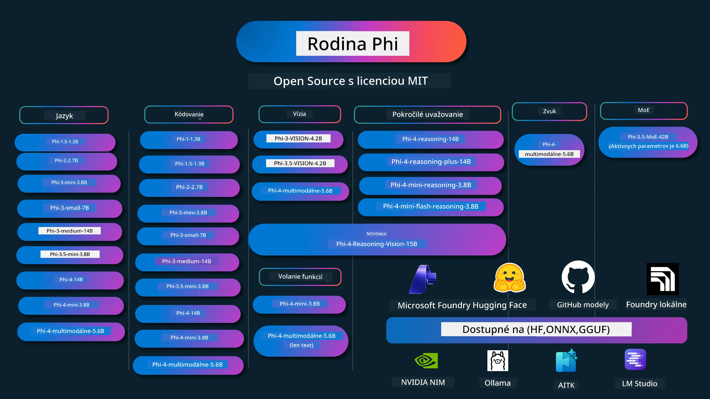

# Phi Kuchárka: Praktické príklady s Microsoft Phi modelmi

[](https://codespaces.new/microsoft/phicookbook)
[](https://vscode.dev/redirect?url=vscode://ms-vscode-remote.remote-containers/cloneInVolume?url=https://github.com/microsoft/phicookbook)

[](https://GitHub.com/microsoft/phicookbook/graphs/contributors/?WT.mc_id=aiml-137032-kinfeylo)
[](https://GitHub.com/microsoft/phicookbook/issues/?WT.mc_id=aiml-137032-kinfeylo)
[](https://GitHub.com/microsoft/phicookbook/pulls/?WT.mc_id=aiml-137032-kinfeylo)
[](http://makeapullrequest.com?WT.mc_id=aiml-137032-kinfeylo)

[](https://GitHub.com/microsoft/phicookbook/watchers/?WT.mc_id=aiml-137032-kinfeylo)
[](https://GitHub.com/microsoft/phicookbook/network/?WT.mc_id=aiml-137032-kinfeylo)
[](https://GitHub.com/microsoft/phicookbook/stargazers/?WT.mc_id=aiml-137032-kinfeylo)

[](https://discord.com/invite/ByRwuEEgH4)

Phi je séria open source AI modelov vyvinutých spoločnosťou Microsoft.

Phi je v súčasnosti najsilnejší a nákladovo najefektívnejší malý jazykový model (SLM), s veľmi dobrými výsledkami v oblasti viacjazyčnosti, uvažovania, generovania textu/rozhovorov, programovania, obrázkov, zvuku a iných scenárov.

Môžete nasadiť Phi do cloudu alebo na okrajové zariadenia a ľahko vytvárať generatívne AI aplikácie s obmedzeným výpočtovým výkonom.

Postupujte podľa týchto krokov, aby ste začali používať tieto zdroje:
1. **Forknite repozitár**: Kliknite na [](https://GitHub.com/microsoft/phicookbook/network/?WT.mc_id=aiml-137032-kinfeylo)
2. **Klónujte repozitár**: `git clone https://github.com/microsoft/PhiCookBook.git`
3. [**Pridajte sa do Microsoft AI Discord komunity a stretnite sa s odborníkmi a kolegami vývojármi**](https://discord.com/invite/ByRwuEEgH4?WT.mc_id=aiml-137032-kinfeylo)



### 🌐 Podpora viacjazyčnosti

#### Podporované cez GitHub Action (Automatizované a vždy aktuálne)

<!-- CO-OP TRANSLATOR LANGUAGES TABLE START -->
[Arabčina](../ar/README.md) | [Bengálčina](../bn/README.md) | [Bulharčina](../bg/README.md) | [Barmčina (Myanmar)](../my/README.md) | [Čínština (zjednodušená)](../zh-CN/README.md) | [Čínština (tradičná, Hongkong)](../zh-HK/README.md) | [Čínština (tradičná, Macau)](../zh-MO/README.md) | [Čínština (tradičná, Taiwan)](../zh-TW/README.md) | [Chorvátčina](../hr/README.md) | [Čeština](../cs/README.md) | [Dánčina](../da/README.md) | [Holandčina](../nl/README.md) | [Estónčina](../et/README.md) | [Fínčina](../fi/README.md) | [Nemčina](../de/README.md) | [Gréčtina](../el/README.md) | [Hebrejčina](../he/README.md) | [Hindi](../hi/README.md) | [Maďarčina](../hu/README.md) | [Indonézština](../id/README.md) | [Taliančina](../it/README.md) | [Japančina](../ja/README.md) | [Kannada](../kn/README.md) | [Khmerčina](../km/README.md) | [Kórejčina](../ko/README.md) | [Litovčina](../lt/README.md) | [Malajčina](../ms/README.md) | [Malajalámčina](../ml/README.md) | [Maráthčina](../mr/README.md) | [Nepálčina](../ne/README.md) | [Nigérijský pidžin](../pcm/README.md) | [Nórčina](../no/README.md) | [Perzština (Farsi)](../fa/README.md) | [Poľština](../pl/README.md) | [Portugalčina (Brazília)](../pt-BR/README.md) | [Portugalčina (Portugalsko)](../pt-PT/README.md) | [Pandžábčina (Gurmukhi)](../pa/README.md) | [Rumunčina](../ro/README.md) | [Ruština](../ru/README.md) | [Srbochorvátčina (Cyrilika)](../sr/README.md) | [Slovenčina](./README.md) | [Slovinčina](../sl/README.md) | [Španielčina](../es/README.md) | [Svahilčina](../sw/README.md) | [Švédčina](../sv/README.md) | [Tagalog (Filipínčina)](../tl/README.md) | [Tamil](../ta/README.md) | [Telugu](../te/README.md) | [Thajčina](../th/README.md) | [Turečtina](../tr/README.md) | [Ukrajinčina](../uk/README.md) | [Urdčina](../ur/README.md) | [Vietnamčina](../vi/README.md)

> **Preferujete klonovať lokálne?**
>
> Tento repozitár obsahuje viac ako 50 jazykových prekladov, čo výrazne zvyšuje veľkosť stiahnutia. Ak chcete klonovať bez prekladov, použite sparse checkout:
>
> **Bash / macOS / Linux:**
> ```bash
> git clone --filter=blob:none --sparse https://github.com/microsoft/PhiCookBook.git
> cd PhiCookBook
> git sparse-checkout set --no-cone '/*' '!translations' '!translated_images'
> ```
>
> **CMD (Windows):**
> ```cmd
> git clone --filter=blob:none --sparse https://github.com/microsoft/PhiCookBook.git
> cd PhiCookBook
> git sparse-checkout set --no-cone "/*" "!translations" "!translated_images"
> ```
>
> Toto vám poskytne všetko potrebné na dokončenie kurzu s oveľa rýchlejším sťahovaním.
<!-- CO-OP TRANSLATOR LANGUAGES TABLE END -->

## Obsah

- Úvod
  - [Vitajte v Phi rodine](./md/01.Introduction/01/01.PhiFamily.md)
  - [Nastavenie prostredia](./md/01.Introduction/01/01.EnvironmentSetup.md)
  - [Pochopenie kľúčových technológií](./md/01.Introduction/01/01.Understandingtech.md)
  - [Bezpečnosť AI pre Phi modely](./md/01.Introduction/01/01.AISafety.md)
  - [Podpora hardvéru Phi](./md/01.Introduction/01/01.Hardwaresupport.md)
  - [Phi modely a dostupnosť na rôznych platformách](./md/01.Introduction/01/01.Edgeandcloud.md)
  - [Použitie Guidancia-ai a Phi](./md/01.Introduction/01/01.Guidance.md)
  - [GitHub Marketplace Modely](https://github.com/marketplace/models)
  - [Azure AI Katalóg modelov](https://ai.azure.com)

- Inferencia Phi v rôznych prostrediach
    -  [Hugging face](./md/01.Introduction/02/01.HF.md)
    -  [GitHub Modely](./md/01.Introduction/02/02.GitHubModel.md)
    -  [Microsoft Foundry Katalóg modelov](./md/01.Introduction/02/03.AzureAIFoundry.md)
    -  [Ollama](./md/01.Introduction/02/04.Ollama.md)
    -  [AI Toolkit VSCode (AITK)](./md/01.Introduction/02/05.AITK.md)
    -  [NVIDIA NIM](./md/01.Introduction/02/06.NVIDIA.md)
    -  [Foundry Lokálne](./md/01.Introduction/02/07.FoundryLocal.md)

- Inferencia Phi rodiny
    - [Inferencia Phi v iOS](./md/01.Introduction/03/iOS_Inference.md)
    - [Inferencia Phi v Android](./md/01.Introduction/03/Android_Inference.md)
    - [Inferencia Phi v Jetson](./md/01.Introduction/03/Jetson_Inference.md)
    - [Inferencia Phi v AI PC](./md/01.Introduction/03/AIPC_Inference.md)
    - [Inferencia Phi s Apple MLX Framework](./md/01.Introduction/03/MLX_Inference.md)
    - [Inferencia Phi na lokálnom serveri](./md/01.Introduction/03/Local_Server_Inference.md)
    - [Inferencia Phi na vzdialenom serveri pomocou AI Toolkit](./md/01.Introduction/03/Remote_Interence.md)
    - [Inferencia Phi s Rust](./md/01.Introduction/03/Rust_Inference.md)
    - [Inferencia Phi--Vision lokálne](./md/01.Introduction/03/Vision_Inference.md)
    - [Inferencia Phi s Kaito AKS, Azure Containers (oficiálna podpora)](./md/01.Introduction/03/Kaito_Inference.md)
-  [Kvácovanie Phi rodiny](./md/01.Introduction/04/QuantifyingPhi.md)
    - [Kvácovanie Phi-3.5 / 4 pomocou llama.cpp](./md/01.Introduction/04/UsingLlamacppQuantifyingPhi.md)
    - [Kvácovanie Phi-3.5 / 4 pomocou Generative AI rozšírení pre onnxruntime](./md/01.Introduction/04/UsingORTGenAIQuantifyingPhi.md)
    - [Kvácovanie Phi-3.5 / 4 pomocou Intel OpenVINO](./md/01.Introduction/04/UsingIntelOpenVINOQuantifyingPhi.md)
    - [Kvácovanie Phi-3.5 / 4 pomocou Apple MLX Framework](./md/01.Introduction/04/UsingAppleMLXQuantifyingPhi.md)

-  Hodnotenie Phi
    - [Zodpovedné AI](./md/01.Introduction/05/ResponsibleAI.md)
    - [Microsoft Foundry pre hodnotenie](./md/01.Introduction/05/AIFoundry.md)
    - [Použitie Promptflow pre hodnotenie](./md/01.Introduction/05/Promptflow.md)
 
- RAG s Azure AI Search
    - [Ako používať Phi-4-mini a Phi-4-multimodal (RAG) s Azure AI Search](https://github.com/microsoft/PhiCookBook/blob/main/code/06.E2E/E2E_Phi-4-RAG-Azure-AI-Search.ipynb)
    - [Lokálne hybridné RAG Zero-Cloud s SQLite FTS5 a phi-4-mini](https://github.com/microsoft/PhiCookBook/blob/main/code/06.E2E/E2E_Phi-4-mini_Local_Hybrid_RAG_SQLite_FTS5.ipynb)

- Ukážky vývoja aplikácií Phi
  - Textové a chatové aplikácie
    - Ukážky Phi-4
      - [📓] [Chat s Phi-4-mini ONNX modelom](./md/02.Application/01.TextAndChat/Phi4/ChatWithPhi4ONNX/README.md)
      - [Chat s miestnym ONNX modelom Phi-4 .NET](../../md/04.HOL/dotnet/src/LabsPhi4-Chat-01OnnxRuntime)
      - [Chat .NET konzolová aplikácia s Phi-4 ONNX pomocou Sementic Kernel](../../md/04.HOL/dotnet/src/LabsPhi4-Chat-02SK)

    - Phi-3 / 3.5 Príklady
      - [Lokálny chatbot v prehliadači pomocou Phi3, ONNX Runtime Web a WebGPU](https://github.com/microsoft/onnxruntime-inference-examples/tree/main/js/chat)
      - [OpenVino Chat](./md/02.Application/01.TextAndChat/Phi3/E2E_OpenVino_Chat.md)
      - [Viac modelov - Interaktívny Phi-3-mini a OpenAI Whisper](./md/02.Application/01.TextAndChat/Phi3/E2E_Phi-3-mini_with_whisper.md)
      - [MLFlow - Vytváranie obalu a používanie Phi-3 s MLFlow](./md//02.Application/01.TextAndChat/Phi3/E2E_Phi-3-MLflow.md)
      - [Optimalizácia modelu - Ako optimalizovať model Phi-3-min pre ONNX Runtime Web pomocou Olive](https://github.com/microsoft/Olive/tree/main/examples/phi3)
      - [WinUI3 aplikácia s Phi-3 mini-4k-instruct-onnx](https://github.com/microsoft/Phi3-Chat-WinUI3-Sample/)
      -[WinUI3 Multimodelová aplikácia poznámok poháňaná umelou inteligenciou](https://github.com/microsoft/ai-powered-notes-winui3-sample)
      - [Doladenie a integrácia vlastných Phi-3 modelov s Prompt flow](./md/02.Application/01.TextAndChat/Phi3/E2E_Phi-3-FineTuning_PromptFlow_Integration.md)
      - [Doladenie a integrácia vlastných Phi-3 modelov s Prompt flow vo Microsoft Foundry](./md/02.Application/01.TextAndChat/Phi3/E2E_Phi-3-FineTuning_PromptFlow_Integration_AIFoundry.md)
      - [Vyhodnotenie doladeného modelu Phi-3 / Phi-3.5 vo Microsoft Foundry so zameraním na zodpovedné princípy AI od Microsoftu](./md/02.Application/01.TextAndChat/Phi3/E2E_Phi-3-Evaluation_AIFoundry.md)
      - [📓] [Phi-3.5-mini-instruct príklad predikcie jazyka (čínska/anglická)](./md/02.Application/01.TextAndChat/Phi3/phi3-instruct-demo.ipynb)
      - [Phi-3.5-Instruct WebGPU RAG Chatbot](./md/02.Application/01.TextAndChat/Phi3/WebGPUWithPhi35Readme.md)
      - [Použitie Windows GPU na vytvorenie riešenia Prompt flow s Phi-3.5-Instruct ONNX](./md/02.Application/01.TextAndChat/Phi3/UsingPromptFlowWithONNX.md)
      - [Použitie Microsoft Phi-3.5 tflite na vytvorenie Android aplikácie](./md/02.Application/01.TextAndChat/Phi3/UsingPhi35TFLiteCreateAndroidApp.md)
      - [Q&A .NET príklad používania lokálneho ONNX Phi-3 modelu s Microsoft.ML.OnnxRuntime](../../md/04.HOL/dotnet/src/LabsPhi301)
      - [Konzolová chat .NET aplikácia so Semantic Kernel a Phi-3](../../md/04.HOL/dotnet/src/LabsPhi302)

  - Ukážky Azure AI Inference SDK založené na kóde
    - Príklady Phi-4
      - [📓] [Generovanie kódu projektu pomocou Phi-4-multimodal](./md/02.Application/02.Code/Phi4/GenProjectCode/README.md)
    - Príklady Phi-3 / 3.5
      - [Vytvorte si vlastný Visual Studio Code GitHub Copilot Chat s Microsoft Phi-3 rodinou](./md/02.Application/02.Code/Phi3/VSCodeExt/README.md)
      - [Vytvorte si vlastného chat Copilot agenta v Visual Studio Code s Phi-3.5 pomocou GitHub modelov](/md/02.Application/02.Code/Phi3/CreateVSCodeChatAgentWithGitHubModels.md)

  - Pokročilé príklady uvažovania
    - Príklady Phi-4 
      - [📓] [Phi-4-mini-reasoning alebo Phi-4-reasoning príklady](./md/02.Application/03.AdvancedReasoning/Phi4/AdvancedResoningPhi4mini/README.md)
      - [📓] [Doladenie Phi-4-mini-reasoning s Microsoft Olive](./md/02.Application/03.AdvancedReasoning/Phi4/AdvancedResoningPhi4mini/olive_ft_phi_4_reasoning_with_medicaldata.ipynb)
      - [📓] [Doladenie Phi-4-mini-reasoning s Apple MLX](./md/02.Application/03.AdvancedReasoning/Phi4/AdvancedResoningPhi4mini/mlx_ft_phi_4_reasoning_with_medicaldata.ipynb)
      - [📓] [Phi-4-mini-reasoning s GitHub modelmi](./md/02.Application/02.Code/Phi4r/github_models_inference.ipynb)
      - [📓] [Phi-4-mini-reasoning s Microsoft Foundry modelmi](./md/02.Application/02.Code/Phi4r/azure_models_inference.ipynb)
  - Ukážky
      - [Phi-4-mini ukážky hosťované na Hugging Face Spaces](https://huggingface.co/spaces/microsoft/phi-4-mini?WT.mc_id=aiml-137032-kinfeylo)
      - [Phi-4-multimodal ukážky hosťované na Hugginge Face Spaces](https://huggingface.co/spaces/microsoft/phi-4-multimodal?WT.mc_id=aiml-137032-kinfeylo)
  - Príklady Vision
    - Príklady Phi-4
      - [📓] [Použitie Phi-4-multimodal na čítanie obrázkov a generovanie kódu](./md/02.Application/04.Vision/Phi4/CreateFrontend/README.md)
    - Príklady Phi-3 / 3.5
      -  [📓][Phi-3-vision-Obrázok text na text](./md/02.Application/04.Vision/Phi3/E2E_Phi-3-vision-image-text-to-text-online-endpoint.ipynb)
      - [Phi-3-vision-ONNX](https://onnxruntime.ai/docs/genai/tutorials/phi3-v.html)
      - [📓][Phi-3-vision CLIP Embedding](./md/02.Application/04.Vision/Phi3/E2E_Phi-3-vision-image-text-to-text-online-endpoint.ipynb)
      - [DEMO: Phi-3 Recyklácia](https://github.com/jennifermarsman/PhiRecycling/)
      - [Phi-3-vision - Vizuálny jazykový asistent - s Phi3-Vision a OpenVINO](https://docs.openvino.ai/nightly/notebooks/phi-3-vision-with-output.html)
      - [Phi-3 Vision Nvidia NIM](./md/02.Application/04.Vision/Phi3/E2E_Nvidia_NIM_Vision.md)
      - [Phi-3 Vision OpenVino](./md/02.Application/04.Vision/Phi3/E2E_OpenVino_Phi3Vision.md)
      - [📓][Phi-3.5 Vision multi-frame alebo multi-obrázkový príklad](./md/02.Application/04.Vision/Phi3/phi3-vision-demo.ipynb)
      - [Phi-3 Vision Lokálny ONNX model pomocou Microsoft.ML.OnnxRuntime .NET](../../md/04.HOL/dotnet/src/LabsPhi303)
      - [Ponuka založená Phi-3 Vision Lokálny ONNX model pomocou Microsoft.ML.OnnxRuntime .NET](../../md/04.HOL/dotnet/src/LabsPhi304)

  - Príklady Reasoning-Vision
    - Phi-4-Reasoning-Vision-15B
      - [📓] [Použitie Phi-4-Reasoning-Vision-15B na detekciu prechádzania mimo priechod](./md/02.Application/10.ReasoningVision/Phi_4_reasoning_vision_15b_Jaywalking.ipynb)
      - [📓] [Použitie Phi-4-Reasoning-Vision-15B na matematiku](./md/02.Application/10.ReasoningVision/Phi_4_reasoning_vision_15b_Math.ipynb)
      - [📓] [Použitie Phi-4-Reasoning-Vision-15B na detekciu UI](./md/02.Application/10.ReasoningVision/Phi_4_reasoning_vision_15b_ui.ipynb)

  - Príklady Matematiky
    -  Phi-4-Mini-Flash-Reasoning-Instruct príklady  [Matematická demo s Phi-4-Mini-Flash-Reasoning-Instruct](./md/02.Application/09.Math/MathDemo.ipynb)

  - Príklady Audio
    - Phi-4 Príklady
      - [📓] [Extrahovanie audio prepisov pomocou Phi-4-multimodal](./md/02.Application/05.Audio/Phi4/Transciption/README.md)
      - [📓] [Phi-4-multimodal Audio príklad](./md/02.Application/05.Audio/Phi4/Siri/demo.ipynb)
      - [📓] [Phi-4-multimodal príklad pretlmočenia reči](./md/02.Application/05.Audio/Phi4/Translate/demo.ipynb)
      - [.NET konzolová aplikácia používajúca Phi-4-multimodal Audio na analýzu audio súboru a generovanie prepisu](../../md/04.HOL/dotnet/src/LabsPhi4-MultiModal-02Audio)

  - MOE Príklady
    - Phi-3 / 3.5 Príklady
      - [📓] [Phi-3.5 Modely Mixture of Experts (MoEs) Social Media príklad](./md/02.Application/06.MoE/Phi3/phi3_moe_demo.ipynb)
      - [📓] [Vytváranie Retrieval-Augmented Generation (RAG) pipeline s NVIDIA NIM Phi-3 MOE, Azure AI Search a LlamaIndex](./md/02.Application/06.MoE/Phi3/azure-ai-search-nvidia-rag.ipynb)
      - 
  - Príklady volania funkcií
    - Phi-4 Príklady 🆕
      -  [📓] [Použitie volania funkcií s Phi-4-mini](./md/02.Application/07.FunctionCalling/Phi4/FunctionCallingBasic/README.md)
      -  [📓] [Použitie volania funkcií na vytvorenie multi-agentov s Phi-4-mini](./md/02.Application/07.FunctionCalling/Phi4/Multiagents/Phi_4_mini_multiagent.ipynb)
      -  [📓] [Použitie volania funkcií s Ollama](./md/02.Application/07.FunctionCalling/Phi4/Ollama/ollama_functioncalling.ipynb)
      -  [📓] [Použitie volania funkcií s ONNX](./md/02.Application/07.FunctionCalling/Phi4/ONNX/onnx_parallel_functioncalling.ipynb)
  - Príklady multimodálneho mixovania
    - Phi-4 Príklady 🆕
      -  [📓] [Použitie Phi-4-multimodal ako technologický novinár](./md/02.Application/08.Multimodel/Phi4/TechJournalist/phi_4_mm_audio_text_publish_news.ipynb)
      - [.NET konzolová aplikácia používajúca Phi-4-multimodal na analýzu obrázkov](../../md/04.HOL/dotnet/src/LabsPhi4-MultiModal-01Images)

- Doladenie Phi príkladov
  - [Scenáre doladenia](./md/03.FineTuning/FineTuning_Scenarios.md)
  - [Doladenie vs RAG](./md/03.FineTuning/FineTuning_vs_RAG.md)
  - [Doladenie: Nechajte Phi-3 stať sa priemyselným expertom](./md/03.FineTuning/LetPhi3gotoIndustriy.md)
  - [Doladenie Phi-3 pomocou AI Toolkit pre VS Code](./md/03.FineTuning/Finetuning_VSCodeaitoolkit.md)
  - [Doladenie Phi-3 pomocou Azure Machine Learning Service](./md/03.FineTuning/Introduce_AzureML.md)
  - [Doladenie Phi-3 pomocou Lora](./md/03.FineTuning/FineTuning_Lora.md)
  - [Doladenie Phi-3 pomocou QLora](./md/03.FineTuning/FineTuning_Qlora.md)
  - [Doladenie Phi-3 pomocou Microsoft Foundry](./md/03.FineTuning/FineTuning_AIFoundry.md)
  - [Doladenie Phi-3 pomocou Azure ML CLI/SDK](./md/03.FineTuning/FineTuning_MLSDK.md)
  - [Doladenie pomocou Microsoft Olive](./md/03.FineTuning/FineTuning_MicrosoftOlive.md)
  - [Doladenie pomocou Microsoft Olive Hands-On Lab](./md/03.FineTuning/olive-lab/readme.md)
  - [Doladenie Phi-3-vision pomocou Weights and Bias](./md/03.FineTuning/FineTuning_Phi-3-visionWandB.md)

  - [Doladenie Phi-3 s Apple MLX Framework](./md/03.FineTuning/FineTuning_MLX.md)
  - [Doladenie Phi-3-vision (oficiálna podpora)](./md/03.FineTuning/FineTuning_Vision.md)
  - [Doladenie Phi-3 s Kaito AKS, Azure Containers (oficiálna podpora)](./md/03.FineTuning/FineTuning_Kaito.md)
  - [Doladenie Phi-3 a 3.5 Vision](https://github.com/2U1/Phi3-Vision-Finetune)

- Praktický workshop
  - [Preskúmanie najmodernejších modelov: LLM, SLM, lokálny vývoj a viac](https://github.com/microsoft/aitour-exploring-cutting-edge-models)
  - [Odomknutie potenciálu NLP: Doladenie s Microsoft Olive](https://github.com/azure/Ignite_FineTuning_workshop)

- Akademické výskumné práce a publikácie
  - [Textbooks Are All You Need II: technická správa phi-1.5](https://arxiv.org/abs/2309.05463)
  - [Technická správa Phi-3: vysoko schopný jazykový model lokálne na vašom telefóne](https://arxiv.org/abs/2404.14219)
  - [Technická správa Phi-4](https://arxiv.org/abs/2412.08905)
  - [Technická správa Phi-4-Mini: Kompaktné a výkonné multimodálne jazykové modely cez zmes LoRA](https://arxiv.org/abs/2503.01743)
  - [Optimalizácia malých jazykových modelov pre volanie funkcií vo vozidle](https://arxiv.org/abs/2501.02342)
  - [(WhyPHI) Doladenie PHI-3 pre odpovedanie na otázky s viacerými možnosťami: metodológia, výsledky a výzvy](https://arxiv.org/abs/2501.01588)
  - [Technická správa Phi-4-reasoning](https://www.microsoft.com/en-us/research/wp-content/uploads/2025/04/phi_4_reasoning.pdf)
  - [Technická správa Phi-4-mini-reasoning](https://huggingface.co/microsoft/Phi-4-mini-reasoning/blob/main/Phi-4-Mini-Reasoning.pdf)

## Používanie Phi modelov

### Phi na Microsoft Foundry

Môžete sa naučiť, ako používať Microsoft Phi a ako vytvárať E2E riešenia vo vašich rôznych hardvérových zariadeniach. Na vyskúšanie Phi začnite hraním sa s modelmi a prispôsobovaním Phi pre vaše scenáre pomocou [Microsoft Foundry Azure AI Model Catalog](https://aka.ms/phi3-azure-ai). Viac sa dozviete v sekcii Začíname s [Microsoft Foundry](/md/02.QuickStart/AzureAIFoundry_QuickStart.md)

**Hracia plocha**
Každý model má venovanú hraciu plochu na testovanie modelu [Azure AI Playground](https://aka.ms/try-phi3).

### Phi na GitHub modeloch

Môžete sa naučiť, ako používať Microsoft Phi a ako vytvárať E2E riešenia vo vašich rôznych hardvérových zariadeniach. Na vyskúšanie Phi začnite hraním sa s modelom a prispôsobovaním Phi pre vaše scenáre pomocou [GitHub Model Catalog](https://github.com/marketplace/models?WT.mc_id=aiml-137032-kinfeylo). Viac sa dozviete v sekcii Začíname s [GitHub Model Catalog](/md/02.QuickStart/GitHubModel_QuickStart.md)

**Hracia plocha**
Každý model má venovanú [hraciu plochu na testovanie modelu](/md/02.QuickStart/GitHubModel_QuickStart.md).

### Phi na Hugging Face

Model nájdete aj na [Hugging Face](https://huggingface.co/microsoft)

**Hracia plocha**
 [Hugging Chat hracia plocha](https://huggingface.co/chat/models/microsoft/Phi-3-mini-4k-instruct)

 ## 🎒 Ostatné kurzy

Náš tím produkuje ďalšie kurzy! Pozrite si:

<!-- CO-OP TRANSLATOR OTHER COURSES START -->
### LangChain
[](https://aka.ms/langchain4j-for-beginners)
[](https://aka.ms/langchainjs-for-beginners?WT.mc_id=m365-94501-dwahlin)
[](https://github.com/microsoft/langchain-for-beginners?WT.mc_id=m365-94501-dwahlin)
---

### Azure / Edge / MCP / Agentov
[](https://github.com/microsoft/AZD-for-beginners?WT.mc_id=academic-105485-koreyst)
[](https://github.com/microsoft/edgeai-for-beginners?WT.mc_id=academic-105485-koreyst)
[](https://github.com/microsoft/mcp-for-beginners?WT.mc_id=academic-105485-koreyst)
[](https://github.com/microsoft/ai-agents-for-beginners?WT.mc_id=academic-105485-koreyst)

---
 
### Séria Generatívnej AI
[](https://github.com/microsoft/generative-ai-for-beginners?WT.mc_id=academic-105485-koreyst)
[-9333EA?style=for-the-badge&labelColor=E5E7EB&color=9333EA)](https://github.com/microsoft/Generative-AI-for-beginners-dotnet?WT.mc_id=academic-105485-koreyst)
[-C084FC?style=for-the-badge&labelColor=E5E7EB&color=C084FC)](https://github.com/microsoft/generative-ai-for-beginners-java?WT.mc_id=academic-105485-koreyst)
[-E879F9?style=for-the-badge&labelColor=E5E7EB&color=E879F9)](https://github.com/microsoft/generative-ai-with-javascript?WT.mc_id=academic-105485-koreyst)

---
 
### Základné vzdelávanie
[](https://aka.ms/ml-beginners?WT.mc_id=academic-105485-koreyst)
[](https://aka.ms/datascience-beginners?WT.mc_id=academic-105485-koreyst)
[](https://aka.ms/ai-beginners?WT.mc_id=academic-105485-koreyst)
[](https://github.com/microsoft/Security-101?WT.mc_id=academic-96948-sayoung)
[](https://aka.ms/webdev-beginners?WT.mc_id=academic-105485-koreyst)
[](https://aka.ms/iot-beginners?WT.mc_id=academic-105485-koreyst)
[](https://github.com/microsoft/xr-development-for-beginners?WT.mc_id=academic-105485-koreyst)

---
 
### Séria Copilot
[](https://aka.ms/GitHubCopilotAI?WT.mc_id=academic-105485-koreyst)
[](https://github.com/microsoft/mastering-github-copilot-for-dotnet-csharp-developers?WT.mc_id=academic-105485-koreyst)
[](https://github.com/microsoft/CopilotAdventures?WT.mc_id=academic-105485-koreyst)
<!-- CO-OP TRANSLATOR OTHER COURSES END -->

## Zodpovedná AI 

Microsoft sa zaviazal pomáhať svojim zákazníkom využívať naše AI produkty zodpovedne, zdielať naše skúsenosti a budovať dôverné partnerstvá prostredníctvom nástrojov ako Transparency Notes a Impact Assessments. Mnohé z týchto zdrojov nájdete na [https://aka.ms/RAI](https://aka.ms/RAI).
Prístup Microsoftu k zodpovednej AI je založený na našich zásadách AI, ktorými sú spravodlivosť, spoľahlivosť a bezpečnosť, súkromie a bezpečnosť, inkluzívnosť, transparentnosť a zodpovednosť.

Veľké modely spracovania prirodzeného jazyka, obrazu a reči – ako tie použité v tomto príklade – môžu potenciálne konať nespravodlivo, nespoľahlivo alebo urážlivo, čo môže viesť k škodám. Prosím, preštudujte si [oznam o transparentnosti Azure OpenAI služby](https://learn.microsoft.com/legal/cognitive-services/openai/transparency-note?tabs=text), aby ste sa oboznámili s rizikami a obmedzeniami.


Odporúčaným prístupom na zmiernenie týchto rizík je zahrnúť do vašej architektúry bezpečnostný systém, ktorý dokáže detekovať a zabrániť škodlivému správaniu. [Azure AI Content Safety](https://learn.microsoft.com/azure/ai-services/content-safety/overview) poskytuje nezávislú vrstvu ochrany, schopnú detekovať škodlivý obsah vytvorený používateľmi aj AI v aplikáciách a službách. Azure AI Content Safety obsahuje textové a obrazové API, ktoré vám umožnia detekovať škodlivý materiál. V rámci Microsoft Foundry vám služba Content Safety umožňuje prezerať, skúmať a vyskúšať ukážkový kód na detekciu škodlivého obsahu v rôznych modalitách. Nasledujúca [dokumentácia Quickstart](https://learn.microsoft.com/azure/ai-services/content-safety/quickstart-text?tabs=visual-studio%2Clinux&pivots=programming-language-rest) vás prevedie vytváraním požiadaviek na službu.

Ďalším aspektom, ktorý treba brať do úvahy, je celkový výkon aplikácie. Pri viacmodálnych a viacmodelových aplikáciách sa výkon považuje za to, že systém pracuje tak, ako vy a vaši používatelia očakávate, vrátane toho, že nevytvára škodlivé výstupy. Je dôležité zhodnotiť výkon vašej celkovej aplikácie pomocou [evaluátorov výkonu, kvality, rizika a bezpečnosti](https://learn.microsoft.com/azure/ai-studio/concepts/evaluation-metrics-built-in). Tiež máte možnosť vytvárať a hodnotiť pomocou [vlastných evaluátorov](https://learn.microsoft.com/azure/ai-studio/how-to/develop/evaluate-sdk#custom-evaluators).

Svoju AI aplikáciu môžete hodnotiť vo svojom vývojovom prostredí pomocou [Azure AI Evaluation SDK](https://microsoft.github.io/promptflow/index.html). Na základe testovacej dátovej množiny alebo cieľa sa generované výstupy vašej generatívnej AI aplikácie kvantitatívne merajú pomocou vstavaných alebo vlastných evaluátorov podľa vášho výberu. Ak chcete začať s azure ai evaluation sdk na hodnotenie vášho systému, môžete postupovať podľa [príručky Quickstart](https://learn.microsoft.com/azure/ai-studio/how-to/develop/flow-evaluate-sdk). Po vykonaní hodnotenia môžete [vizualizovať výsledky v Microsoft Foundry](https://learn.microsoft.com/azure/ai-studio/how-to/evaluate-flow-results).

## Ochranné známky

Tento projekt môže obsahovať ochranné známky alebo logá projektov, produktov alebo služieb. Autorizované používanie ochranných známok alebo log Microsoftu musí dodržiavať a riadiť sa [Smernicami pre ochranné známky a značky spoločnosti Microsoft](https://www.microsoft.com/legal/intellectualproperty/trademarks/usage/general).
Používanie ochranných známok alebo log Microsoftu v upravených verziách tohto projektu nesmie spôsobovať zmätok ani naznačovať sponzorstvo Microsoftom. Akékoľvek použitie ochranných známok alebo log tretích strán podlieha pravidlám týchto tretích strán.

## Dostať pomoc

Ak uviaznete alebo máte otázky týkajúce sa tvorby AI aplikácií, pripojte sa k:

[](https://aka.ms/foundry/discord)

Ak máte spätnú väzbu o produkte alebo sa stretnete s chybami pri tvorbe, navštívte:

[](https://aka.ms/foundry/forum)

---

<!-- CO-OP TRANSLATOR DISCLAIMER START -->
**Vyhlásenie o zodpovednosti**:
Tento dokument bol preložený pomocou AI prekladateľskej služby [Co-op Translator](https://github.com/Azure/co-op-translator). Hoci sa snažíme o presnosť, vezmite prosím na vedomie, že automatické preklady môžu obsahovať chyby alebo nepresnosti. Pôvodný dokument v jeho natívnom jazyku by mal byť považovaný za autoritatívny zdroj. Pre kritické informácie sa odporúča profesionálny ľudský preklad. Nie sme zodpovední za žiadne nedorozumenia alebo nesprávne interpretácie vyplývajúce z použitia tohto prekladu.
<!-- CO-OP TRANSLATOR DISCLAIMER END -->