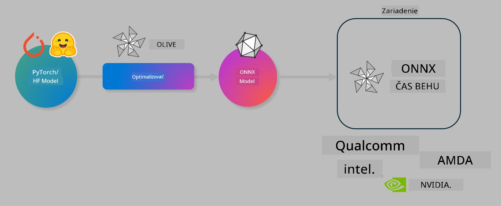

<!--
CO_OP_TRANSLATOR_METADATA:
{
  "original_hash": "6bbe47de3b974df7eea29dfeccf6032b",
  "translation_date": "2025-07-16T16:20:05+00:00",
  "source_file": "code/04.Finetuning/olive-lab/readme.md",
  "language_code": "sk"
}
-->
# Laboratórium. Optimalizácia AI modelov pre inferenciu priamo na zariadení

## Úvod

> [!IMPORTANT]
> Toto laboratórium vyžaduje **Nvidia A10 alebo A100 GPU** s nainštalovanými príslušnými ovládačmi a CUDA toolkit (verzia 12+).

> [!NOTE]
> Ide o **35-minútové** laboratórium, ktoré vám poskytne praktický úvod do základných konceptov optimalizácie modelov pre inferenciu priamo na zariadení pomocou OLIVE.

## Ciele učenia

Na konci tohto laboratória budete vedieť použiť OLIVE na:

- Kvantizáciu AI modelu pomocou metódy AWQ.
- Doladenie AI modelu pre konkrétnu úlohu.
- Generovanie LoRA adaptér (doladený model) pre efektívnu inferenciu priamo na zariadení pomocou ONNX Runtime.

### Čo je Olive

Olive (*O*NNX *live*) je nástroj na optimalizáciu modelov s príkazovým riadkom (CLI), ktorý vám umožní nasadiť modely pre ONNX runtime +++https://onnxruntime.ai+++ s dôrazom na kvalitu a výkon.



Vstupom do Olive je zvyčajne model PyTorch alebo Hugging Face a výstupom je optimalizovaný ONNX model, ktorý sa vykonáva na zariadení (cieľ nasadenia) bežiacom na ONNX runtime. Olive optimalizuje model pre AI akcelerátor cieľového zariadenia (NPU, GPU, CPU) poskytovaný hardvérovým dodávateľom ako Qualcomm, AMD, Nvidia alebo Intel.

Olive vykonáva *workflow*, čo je usporiadaná sekvencia jednotlivých úloh optimalizácie modelu nazývaných *passes* – príklady takýchto passes sú: kompresia modelu, zachytenie grafu, kvantizácia, optimalizácia grafu. Každý pass má súbor parametrov, ktoré je možné doladiť pre dosiahnutie najlepších metrík, napríklad presnosti a latencie, ktoré vyhodnocuje príslušný evaluátor. Olive používa vyhľadávaciu stratégiu, ktorá využíva algoritmus na automatické doladenie každého passu jednotlivo alebo skupiny passov naraz.

#### Výhody Olive

- **Zníženie frustrácie a času** pri manuálnom skúšaní rôznych techník optimalizácie grafu, kompresie a kvantizácie metódou pokus-omyl. Definujte svoje požiadavky na kvalitu a výkon a nechajte Olive automaticky nájsť najlepší model pre vás.
- **Viac ako 40 vstavaných komponentov na optimalizáciu modelov** pokrývajúcich najmodernejšie techniky kvantizácie, kompresie, optimalizácie grafu a doladenia.
- **Jednoduchý CLI** pre bežné úlohy optimalizácie modelov, napríklad olive quantize, olive auto-opt, olive finetune.
- Zabudované balenie a nasadenie modelov.
- Podpora generovania modelov pre **Multi LoRA serving**.
- Možnosť vytvárať workflow pomocou YAML/JSON na orchestráciu úloh optimalizácie a nasadenia modelov.
- Integrácia s **Hugging Face** a **Azure AI**.
- Zabudovaný mechanizmus **cache** na **úsporu nákladov**.

## Inštrukcie k laboratóriu

> [!NOTE]
> Uistite sa, že máte pripravený Azure AI Hub a projekt a nastavili ste výpočtový uzol A100 podľa Laboratória 1.

### Krok 0: Pripojenie k Azure AI Compute

Pripojíte sa k Azure AI compute pomocou vzdialenej funkcie v **VS Code**.

1. Otvorte desktopovú aplikáciu **VS Code**:
2. Otvorte **príkazovú paletu** pomocou **Shift+Ctrl+P**
3. V príkazovej palete vyhľadajte **AzureML - remote: Connect to compute instance in New Window**.
4. Postupujte podľa pokynov na obrazovke na pripojenie k výpočtovému uzlu. Bude potrebné vybrať vašu Azure Subscription, Resource Group, projekt a názov Compute, ktorý ste nastavili v Laboratóriu 1.
5. Po pripojení k Azure ML Compute uzlu sa v ľavom dolnom rohu Visual Studio Code zobrazí `><Azure ML: Compute Name`.

### Krok 1: Klonovanie repozitára

Vo VS Code môžete otvoriť nový terminál pomocou **Ctrl+J** a klonovať tento repozitár:

V termináli by ste mali vidieť prompt

```
azureuser@computername:~/cloudfiles/code$ 
```  
Klonujte riešenie

```bash
cd ~/localfiles
git clone https://github.com/microsoft/phi-3cookbook.git
```

### Krok 2: Otvorenie priečinka vo VS Code

Na otvorenie VS Code v príslušnom priečinku spustite v termináli nasledujúci príkaz, ktorý otvorí nové okno:

```bash
code phi-3cookbook/code/04.Finetuning/Olive-lab
```

Alternatívne môžete priečinok otvoriť cez **File** > **Open Folder**.

### Krok 3: Závislosti

Otvorte terminál vo VS Code vo vašom Azure AI Compute inštancii (tip: **Ctrl+J**) a spustite nasledujúce príkazy na inštaláciu závislostí:

```bash
conda create -n olive-ai python=3.11 -y
conda activate olive-ai
pip install -r requirements.txt
az extension remove -n azure-cli-ml
az extension add -n ml
```

> [!NOTE]
> Inštalácia všetkých závislostí potrvá približne 5 minút.

V tomto laboratóriu budete sťahovať a nahrávať modely do Azure AI Model katalógu. Aby ste mali prístup ku katalógu modelov, je potrebné sa prihlásiť do Azure pomocou:

```bash
az login
```

> [!NOTE]
> Pri prihlasovaní budete vyzvaní na výber predplatného. Uistite sa, že vyberiete predplatné pridelené pre toto laboratórium.

### Krok 4: Spustenie príkazov Olive

Otvorte terminál vo VS Code vo vašom Azure AI Compute inštancii (tip: **Ctrl+J**) a uistite sa, že je aktivované conda prostredie `olive-ai`:

```bash
conda activate olive-ai
```

Potom spustite nasledujúce príkazy Olive v príkazovom riadku.

1. **Preskúmajte dáta:** V tomto príklade budete doladiť model Phi-3.5-Mini tak, aby bol špecializovaný na odpovede na otázky týkajúce sa cestovania. Nižšie uvedený kód zobrazí prvé záznamy datasetu vo formáte JSON lines:

    ```bash
    head data/data_sample_travel.jsonl
    ```

2. **Kvantizujte model:** Pred trénovaním modelu ho najskôr kvantizujete pomocou príkazu, ktorý používa techniku Active Aware Quantization (AWQ) +++https://arxiv.org/abs/2306.00978+++. AWQ kvantizuje váhy modelu s ohľadom na aktivácie generované počas inferencie. To znamená, že proces kvantizácie zohľadňuje skutočné rozdelenie dát v aktiváciách, čo vedie k lepšiemu zachovaniu presnosti modelu v porovnaní s tradičnými metódami kvantizácie váh.

    ```bash
    olive quantize \
       --model_name_or_path microsoft/Phi-3.5-mini-instruct \
       --trust_remote_code \
       --algorithm awq \
       --output_path models/phi/awq \
       --log_level 1
    ```

    Kvantizácia AWQ trvá približne **8 minút** a **zmenší veľkosť modelu z ~7,5GB na ~2,5GB**.

    V tomto laboratóriu ukazujeme, ako načítať modely z Hugging Face (napríklad: `microsoft/Phi-3.5-mini-instruct`). Olive však umožňuje aj načítanie modelov z Azure AI katalógu aktualizáciou argumentu `model_name_or_path` na Azure AI asset ID (napríklad: `azureml://registries/azureml/models/Phi-3.5-mini-instruct/versions/4`).

3. **Trénujte model:** Ďalej príkaz `olive finetune` doladí kvantizovaný model. Kvantizácia modelu *pred* doladením namiesto po ňom prináša lepšiu presnosť, pretože doladenie čiastočne kompenzuje stratu spôsobenú kvantizáciou.

    ```bash
    olive finetune \
        --method lora \
        --model_name_or_path models/phi/awq \
        --data_files "data/data_sample_travel.jsonl" \
        --data_name "json" \
        --text_template "<|user|>\n{prompt}<|end|>\n<|assistant|>\n{response}<|end|>" \
        --max_steps 100 \
        --output_path ./models/phi/ft \
        --log_level 1
    ```

    Doladenie trvá približne **6 minút** (s 100 krokmi).

4. **Optimalizujte:** Po natrénovaní modelu ho optimalizujete pomocou príkazu `auto-opt` v Olive, ktorý zachytí ONNX graf a automaticky vykoná niekoľko optimalizácií na zlepšenie výkonu modelu pre CPU kompresiou a fúziami. Treba poznamenať, že môžete optimalizovať aj pre iné zariadenia ako NPU alebo GPU len aktualizáciou argumentov `--device` a `--provider` – ale pre účely tohto laboratória použijeme CPU.

    ```bash
    olive auto-opt \
       --model_name_or_path models/phi/ft/model \
       --adapter_path models/phi/ft/adapter \
       --device cpu \
       --provider CPUExecutionProvider \
       --use_ort_genai \
       --output_path models/phi/onnx-ao \
       --log_level 1
    ```

    Optimalizácia trvá približne **5 minút**.

### Krok 5: Rýchly test inferencie modelu

Na otestovanie inferencie modelu vytvorte v priečinku Python súbor s názvom **app.py** a skopírujte do neho nasledujúci kód:

```python
import onnxruntime_genai as og
import numpy as np

print("loading model and adapters...", end="", flush=True)
model = og.Model("models/phi/onnx-ao/model")
adapters = og.Adapters(model)
adapters.load("models/phi/onnx-ao/model/adapter_weights.onnx_adapter", "travel")
print("DONE!")

tokenizer = og.Tokenizer(model)
tokenizer_stream = tokenizer.create_stream()

params = og.GeneratorParams(model)
params.set_search_options(max_length=100, past_present_share_buffer=False)
user_input = "what is the best thing to see in chicago"
params.input_ids = tokenizer.encode(f"<|user|>\n{user_input}<|end|>\n<|assistant|>\n")

generator = og.Generator(model, params)

generator.set_active_adapter(adapters, "travel")

print(f"{user_input}")

while not generator.is_done():
    generator.compute_logits()
    generator.generate_next_token()

    new_token = generator.get_next_tokens()[0]
    print(tokenizer_stream.decode(new_token), end='', flush=True)

print("\n")
```

Kód spustite pomocou:

```bash
python app.py
```

### Krok 6: Nahratie modelu do Azure AI

Nahratie modelu do Azure AI modelového repozitára umožňuje zdieľanie modelu s ostatnými členmi vývojového tímu a zároveň zabezpečuje správu verzií modelu. Na nahratie modelu spustite nasledujúci príkaz:

> [!NOTE]
> Nahraďte zástupné znaky `{}` názvom vašej resource group a názvom Azure AI projektu.

Ak chcete zistiť názov resource group a Azure AI projektu, spustite nasledujúci príkaz:

```
az ml workspace show
```

Alebo prejdite na +++ai.azure.com+++ a vyberte **management center** > **project** > **overview**

Nahraďte zástupné znaky `{}` názvom vašej resource group a názvom Azure AI projektu.

```bash
az ml model create \
    --name ft-for-travel \
    --version 1 \
    --path ./models/phi/onnx-ao \
    --resource-group {RESOURCE_GROUP_NAME} \
    --workspace-name {PROJECT_NAME}
```

Následne môžete svoj nahratý model vidieť a nasadiť na https://ml.azure.com/model/list

**Vyhlásenie o zodpovednosti**:  
Tento dokument bol preložený pomocou AI prekladateľskej služby [Co-op Translator](https://github.com/Azure/co-op-translator). Aj keď sa snažíme o presnosť, prosím, majte na pamäti, že automatizované preklady môžu obsahovať chyby alebo nepresnosti. Originálny dokument v jeho pôvodnom jazyku by mal byť považovaný za autoritatívny zdroj. Pre kritické informácie sa odporúča profesionálny ľudský preklad. Nie sme zodpovední za akékoľvek nedorozumenia alebo nesprávne interpretácie vyplývajúce z použitia tohto prekladu.