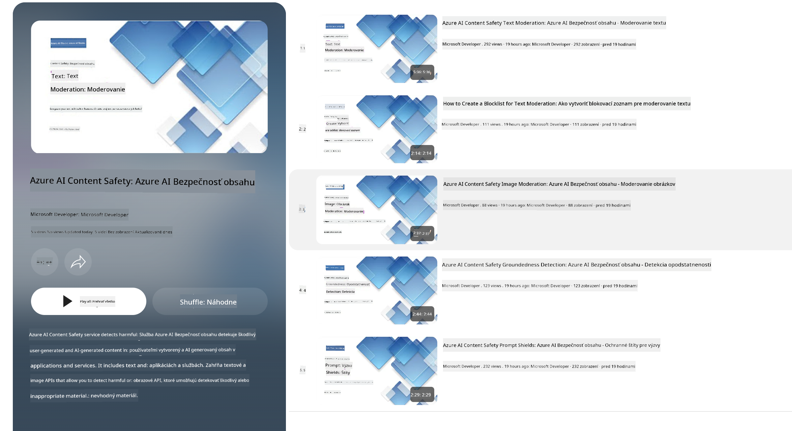

<!--
CO_OP_TRANSLATOR_METADATA:
{
  "original_hash": "c8273672cc57df2be675407a1383aaf0",
  "translation_date": "2025-07-16T17:52:45+00:00",
  "source_file": "md/01.Introduction/01/01.AISafety.md",
  "language_code": "sk"
}
-->
# Bezpečnosť AI pre modely Phi  
Rodina modelov Phi bola vyvinutá v súlade s [Microsoft Responsible AI Standard](https://query.prod.cms.rt.microsoft.com/cms/api/am/binary/RE5cmFl), čo je súbor požiadaviek platný v celej spoločnosti založený na týchto šiestich princípoch: zodpovednosť, transparentnosť, spravodlivosť, spoľahlivosť a bezpečnosť, súkromie a bezpečnosť, a inkluzívnosť, ktoré tvoria [Microsoft zásady zodpovednej AI](https://www.microsoft.com/ai/responsible-ai).

Rovnako ako pri predchádzajúcich modeloch Phi, bol prijatý viacrozmerný prístup k hodnoteniu bezpečnosti a bezpečnostnému doladeniu po tréningu, pričom boli prijaté ďalšie opatrenia zohľadňujúce viacjazyčné schopnosti tejto verzie. Náš prístup k bezpečnostnému tréningu a hodnoteniam vrátane testovania v rôznych jazykoch a kategóriách rizík je popísaný v [Phi Safety Post-Training Paper](https://arxiv.org/abs/2407.13833). Hoci modely Phi z tohto prístupu profitujú, vývojári by mali uplatňovať osvedčené postupy zodpovednej AI, vrátane mapovania, merania a zmierňovania rizík spojených s ich konkrétnym použitím a kultúrnym a jazykovým kontextom.

## Najlepšie postupy

Rovnako ako iné modely, aj rodina modelov Phi môže potenciálne vykazovať správanie, ktoré je nespravodlivé, nespoľahlivé alebo urážlivé.

Niektoré z obmedzujúcich správaní SLM a LLM, o ktorých by ste mali vedieť, zahŕňajú:

- **Kvalita služby:** Modely Phi sú trénované primárne na anglickom texte. Jazyky iné ako angličtina budú mať horší výkon. Varianty angličtiny s menším zastúpením v tréningových dátach môžu mať horší výkon než štandardná americká angličtina.  
- **Zastúpenie škôd a upevňovanie stereotypov:** Tieto modely môžu nadmerne alebo nedostatočne zastupovať určité skupiny ľudí, vymazávať zastúpenie niektorých skupín alebo posilňovať ponižujúce či negatívne stereotypy. Napriek bezpečnostnému doladeniu po tréningu môžu tieto obmedzenia pretrvávať kvôli rôznym úrovniam zastúpenia rôznych skupín alebo prevalencii príkladov negatívnych stereotypov v tréningových dátach, ktoré odrážajú reálne vzory a spoločenské predsudky.  
- **Nevhodný alebo urážlivý obsah:** Tieto modely môžu generovať aj iné typy nevhodného alebo urážlivého obsahu, čo môže znamenať, že ich nasadenie v citlivých kontextoch bez ďalších špecifických opatrení nie je vhodné.  
- **Spoľahlivosť informácií:** Jazykové modely môžu generovať nezmyselný obsah alebo vytvárať informácie, ktoré môžu znieť rozumne, ale sú nepresné alebo zastarané.  
- **Obmedzený rozsah pre kód:** Väčšina tréningových dát Phi-3 je založená na Pythone a používa bežné balíky ako "typing, math, random, collections, datetime, itertools". Ak model generuje Python skripty využívajúce iné balíky alebo skripty v iných jazykoch, dôrazne odporúčame používateľom manuálne overiť všetky použitia API.

Vývojári by mali uplatňovať osvedčené postupy zodpovednej AI a sú zodpovední za to, aby konkrétne použitie bolo v súlade s príslušnými zákonmi a predpismi (napr. ochrana súkromia, obchodné zákony a pod.).

## Úvahy o zodpovednej AI

Rovnako ako iné jazykové modely, aj modely série Phi môžu potenciálne vykazovať správanie, ktoré je nespravodlivé, nespoľahlivé alebo urážlivé. Niektoré z obmedzujúcich správaní, na ktoré treba dávať pozor, zahŕňajú:

**Kvalita služby:** Modely Phi sú trénované primárne na anglickom texte. Jazyky iné ako angličtina budú mať horší výkon. Varianty angličtiny s menším zastúpením v tréningových dátach môžu mať horší výkon než štandardná americká angličtina.

**Zastúpenie škôd a upevňovanie stereotypov:** Tieto modely môžu nadmerne alebo nedostatočne zastupovať určité skupiny ľudí, vymazávať zastúpenie niektorých skupín alebo posilňovať ponižujúce či negatívne stereotypy. Napriek bezpečnostnému doladeniu po tréningu môžu tieto obmedzenia pretrvávať kvôli rôznym úrovniam zastúpenia rôznych skupín alebo prevalencii príkladov negatívnych stereotypov v tréningových dátach, ktoré odrážajú reálne vzory a spoločenské predsudky.

**Nevhodný alebo urážlivý obsah:** Tieto modely môžu generovať aj iné typy nevhodného alebo urážlivého obsahu, čo môže znamenať, že ich nasadenie v citlivých kontextoch bez ďalších špecifických opatrení nie je vhodné.  
Spoľahlivosť informácií: Jazykové modely môžu generovať nezmyselný obsah alebo vytvárať informácie, ktoré môžu znieť rozumne, ale sú nepresné alebo zastarané.

**Obmedzený rozsah pre kód:** Väčšina tréningových dát Phi-3 je založená na Pythone a používa bežné balíky ako "typing, math, random, collections, datetime, itertools". Ak model generuje Python skripty využívajúce iné balíky alebo skripty v iných jazykoch, dôrazne odporúčame používateľom manuálne overiť všetky použitia API.

Vývojári by mali uplatňovať osvedčené postupy zodpovednej AI a sú zodpovední za to, aby konkrétne použitie bolo v súlade s príslušnými zákonmi a predpismi (napr. ochrana súkromia, obchodné zákony a pod.). Dôležité oblasti na zváženie zahŕňajú:

**Pridelenie:** Modely nemusia byť vhodné pre situácie, ktoré môžu mať zásadný vplyv na právny status alebo prideľovanie zdrojov či životných príležitostí (napr. bývanie, zamestnanie, úver a pod.) bez ďalších hodnotení a techník na odstránenie zaujatosti.

**Vysoko rizikové scenáre:** Vývojári by mali posúdiť vhodnosť použitia modelov vo vysoko rizikových situáciách, kde by nespravodlivé, nespoľahlivé alebo urážlivé výstupy mohli mať veľmi vážne následky alebo spôsobiť škodu. To zahŕňa poskytovanie rád v citlivých alebo odborných oblastiach, kde je presnosť a spoľahlivosť kľúčová (napr. právne alebo zdravotné poradenstvo). Na úrovni aplikácie by mali byť implementované ďalšie ochranné opatrenia podľa kontextu nasadenia.

**Dezinformácie:** Modely môžu produkovať nepresné informácie. Vývojári by mali dodržiavať najlepšie postupy transparentnosti a informovať koncových používateľov, že komunikujú s AI systémom. Na úrovni aplikácie môžu vývojári vytvárať mechanizmy spätnej väzby a procesy na zakotvenie odpovedí v kontextovo špecifických informáciách, techniku známu ako Retrieval Augmented Generation (RAG).

**Generovanie škodlivého obsahu:** Vývojári by mali hodnotiť výstupy podľa ich kontextu a používať dostupné bezpečnostné klasifikátory alebo vlastné riešenia vhodné pre ich použitie.

**Zneužitie:** Môžu byť možné aj iné formy zneužitia, ako podvody, spam alebo tvorba škodlivého softvéru, a vývojári by mali zabezpečiť, že ich aplikácie neporušujú platné zákony a predpisy.

### Doladenie a bezpečnosť AI obsahu

Po doladení modelu dôrazne odporúčame využiť opatrenia [Azure AI Content Safety](https://learn.microsoft.com/azure/ai-services/content-safety/overview) na monitorovanie obsahu generovaného modelmi, identifikáciu a blokovanie potenciálnych rizík, hrozieb a problémov s kvalitou.

[Azure AI Content Safety](https://learn.microsoft.com/azure/ai-services/content-safety/overview) podporuje textový aj obrazový obsah. Môže byť nasadený v cloude, v odpojených kontajneroch a na edge/embedded zariadeniach.

## Prehľad Azure AI Content Safety

Azure AI Content Safety nie je univerzálne riešenie; dá sa prispôsobiť tak, aby vyhovovalo špecifickým politikám podnikov. Navyše jeho viacjazyčné modely umožňujú súčasné porozumenie viacerým jazykom.

- **Azure AI Content Safety**  
- **Microsoft Developer**  
- **5 videí**

Služba Azure AI Content Safety detekuje škodlivý obsah vytvorený používateľmi aj AI v aplikáciách a službách. Zahŕňa textové a obrazové API, ktoré umožňujú detekciu škodlivého alebo nevhodného materiálu.

[AI Content Safety Playlist](https://www.youtube.com/playlist?list=PLlrxD0HtieHjaQ9bJjyp1T7FeCbmVcPkQ)

**Vyhlásenie o zodpovednosti**:  
Tento dokument bol preložený pomocou AI prekladateľskej služby [Co-op Translator](https://github.com/Azure/co-op-translator). Aj keď sa snažíme o presnosť, prosím, majte na pamäti, že automatizované preklady môžu obsahovať chyby alebo nepresnosti. Originálny dokument v jeho pôvodnom jazyku by mal byť považovaný za autoritatívny zdroj. Pre kritické informácie sa odporúča profesionálny ľudský preklad. Nie sme zodpovední za akékoľvek nedorozumenia alebo nesprávne interpretácie vyplývajúce z použitia tohto prekladu.