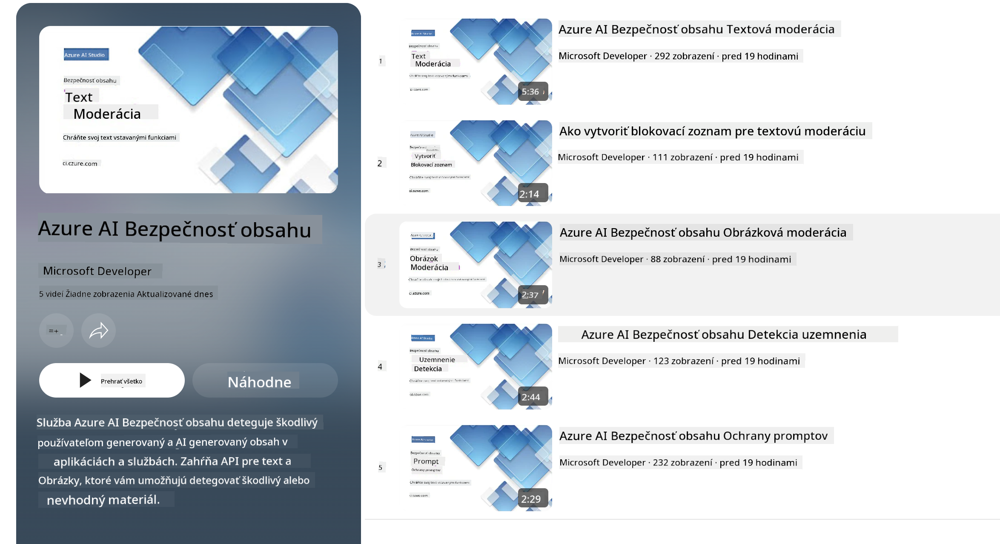

<!--
CO_OP_TRANSLATOR_METADATA:
{
  "original_hash": "c8273672cc57df2be675407a1383aaf0",
  "translation_date": "2025-05-09T06:20:33+00:00",
  "source_file": "md/01.Introduction/01/01.AISafety.md",
  "language_code": "sk"
}
-->
# AI bezpečnosť pre modely Phi  
Rodina modelov Phi bola vyvinutá v súlade so [Microsoft Responsible AI Standard](https://query.prod.cms.rt.microsoft.com/cms/api/am/binary/RE5cmFl), čo je firemný súbor požiadaviek založený na týchto šiestich princípoch: zodpovednosť, transparentnosť, spravodlivosť, spoľahlivosť a bezpečnosť, súkromie a ochrana, a inkluzívnosť, ktoré tvoria [Microsoftove princípy zodpovednej AI](https://www.microsoft.com/ai/responsible-ai).

Rovnako ako pri predchádzajúcich modeloch Phi, bol prijatý viacrozmerný prístup k hodnoteniu bezpečnosti a bezpečnostnému doladeniu po tréningu, pričom boli prijaté ďalšie opatrenia na zohľadnenie viacjazyčných schopností tejto verzie. Náš prístup k bezpečnostnému tréningu a hodnoteniam vrátane testovania v rôznych jazykoch a kategóriách rizík je popísaný v [Phi Safety Post-Training Paper](https://arxiv.org/abs/2407.13833). Hoci modely Phi z tohto prístupu profitujú, vývojári by mali aplikovať osvedčené postupy zodpovednej AI vrátane mapovania, merania a zmierňovania rizík spojených s ich konkrétnym prípadom použitia a kultúrnym a jazykovým kontextom.

## Najlepšie praktiky  

Rovnako ako iné modely, rodina modelov Phi sa môže potenciálne správať spôsobmi, ktoré sú nespravodlivé, nespoľahlivé alebo urážlivé.

Medzi obmedzujúce správanie SLM a LLM, na ktoré by ste mali dávať pozor, patrí:

- **Kvalita služby:** Modely Phi sú primárne trénované na anglickom texte. Jazyky okrem angličtiny budú mať horší výkon. Varianty angličtiny s menšou reprezentáciou v trénovacích dátach môžu dosahovať horšie výsledky ako štandardná americká angličtina.  
- **Reprezentácia škôd a udržiavanie stereotypov:** Tieto modely môžu nadmerne alebo nedostatočne zastupovať určité skupiny ľudí, vymazávať reprezentáciu niektorých skupín alebo posilňovať ponižujúce či negatívne stereotypy. Napriek bezpečnostnému doladeniu po tréningu môžu tieto obmedzenia pretrvávať kvôli rôznym úrovniam zastúpenia skupín alebo prevalencii negatívnych stereotypov v trénovacích dátach, ktoré odrážajú reálne vzory a spoločenské predsudky.  
- **Nevhodný alebo urážlivý obsah:** Tieto modely môžu generovať iné typy nevhodného alebo urážlivého obsahu, čo môže znamenať, že ich nasadenie v citlivých kontextoch bez dodatočných opatrení špecifických pre daný prípad použitia nemusí byť vhodné.  
- **Spoľahlivosť informácií:** Jazykové modely môžu generovať nezmyselný obsah alebo vytvárať obsah, ktorý môže znieť rozumne, no je nepresný alebo zastaraný.  
- **Obmedzený rozsah pre kód:** Väčšina tréningových dát Phi-3 je založená na Pythone a používa bežné balíčky ako "typing, math, random, collections, datetime, itertools". Ak model generuje Python skripty používajúce iné balíčky alebo skripty v iných jazykoch, dôrazne odporúčame používateľom manuálne overiť všetky použitia API.

Vývojári by mali aplikovať osvedčené postupy zodpovednej AI a zodpovedajú za to, že konkrétny prípad použitia bude v súlade s príslušnými zákonmi a predpismi (napr. ochrana súkromia, obchodné pravidlá atď.).

## Úvahy o zodpovednej AI  

Rovnako ako iné jazykové modely, aj modely série Phi sa môžu potenciálne správať nespravodlivo, nespoľahlivo alebo urážlivo. Medzi obmedzujúce správanie, na ktoré treba dbať, patrí:

**Kvalita služby:** Modely Phi sú primárne trénované na anglickom texte. Jazyky okrem angličtiny budú mať horší výkon. Varianty angličtiny s menšou reprezentáciou v trénovacích dátach môžu dosahovať horšie výsledky ako štandardná americká angličtina.

**Reprezentácia škôd a udržiavanie stereotypov:** Tieto modely môžu nadmerne alebo nedostatočne zastupovať určité skupiny ľudí, vymazávať reprezentáciu niektorých skupín alebo posilňovať ponižujúce či negatívne stereotypy. Napriek bezpečnostnému doladeniu po tréningu môžu tieto obmedzenia pretrvávať kvôli rôznym úrovniam zastúpenia skupín alebo prevalencii negatívnych stereotypov v trénovacích dátach, ktoré odrážajú reálne vzory a spoločenské predsudky.

**Nevhodný alebo urážlivý obsah:** Tieto modely môžu generovať iné typy nevhodného alebo urážlivého obsahu, čo môže znamenať, že ich nasadenie v citlivých kontextoch bez dodatočných opatrení špecifických pre daný prípad použitia nemusí byť vhodné.  
Spoľahlivosť informácií: Jazykové modely môžu generovať nezmyselný obsah alebo vytvárať obsah, ktorý môže znieť rozumne, no je nepresný alebo zastaraný.

**Obmedzený rozsah pre kód:** Väčšina tréningových dát Phi-3 je založená na Pythone a používa bežné balíčky ako "typing, math, random, collections, datetime, itertools". Ak model generuje Python skripty používajúce iné balíčky alebo skripty v iných jazykoch, dôrazne odporúčame používateľom manuálne overiť všetky použitia API.

Vývojári by mali aplikovať osvedčené postupy zodpovednej AI a zodpovedajú za to, že konkrétny prípad použitia bude v súlade s príslušnými zákonmi a predpismi (napr. ochrana súkromia, obchodné pravidlá atď.). Dôležité oblasti na zváženie zahŕňajú:

**Pridelenie:** Modely nemusia byť vhodné pre situácie, ktoré môžu mať zásadný dopad na právny status alebo prideľovanie zdrojov či životných príležitostí (napr. bývanie, zamestnanie, úver atď.) bez ďalších hodnotení a ďalších techník na odstraňovanie predsudkov.

**Vysoko rizikové scenáre:** Vývojári by mali posúdiť vhodnosť použitia modelov vo vysoko rizikových situáciách, kde by nespravodlivé, nespoľahlivé alebo urážlivé výstupy mohli byť mimoriadne nákladné alebo viesť k poškodeniu. To zahŕňa poskytovanie rád v citlivých alebo odborných oblastiach, kde je presnosť a spoľahlivosť kritická (napr. právne alebo zdravotné poradenstvo). Na úrovni aplikácie by mali byť implementované dodatočné ochranné opatrenia podľa kontextu nasadenia.

**Dezinformácie:** Modely môžu produkovať nepresné informácie. Vývojári by mali dodržiavať najlepšie postupy transparentnosti a informovať koncových používateľov, že komunikujú s AI systémom. Na úrovni aplikácie môžu vývojári vytvárať spätnoväzobné mechanizmy a procesy na zakladanie odpovedí na špecifické kontextové informácie daného prípadu použitia, techniku známu ako Retrieval Augmented Generation (RAG).

**Generovanie škodlivého obsahu:** Vývojári by mali vyhodnocovať výstupy v ich kontexte a používať dostupné bezpečnostné klasifikátory alebo vlastné riešenia vhodné pre ich prípad použitia.

**Zneužitie:** Môžu byť možné aj iné formy zneužitia, ako sú podvody, spam alebo tvorba škodlivého softvéru, a vývojári by mali zabezpečiť, že ich aplikácie neporušujú platné zákony a predpisy.

### Doladenie a bezpečnosť AI obsahu  

Po doladení modelu dôrazne odporúčame využiť opatrenia [Azure AI Content Safety](https://learn.microsoft.com/azure/ai-services/content-safety/overview) na monitorovanie obsahu generovaného modelmi, identifikáciu a blokovanie potenciálnych rizík, hrozieb a problémov s kvalitou.

[Azure AI Content Safety](https://learn.microsoft.com/azure/ai-services/content-safety/overview) podporuje textový aj obrazový obsah. Môže byť nasadený v cloude, v odpojených kontajneroch a na edge/embedded zariadeniach.

## Prehľad Azure AI Content Safety  

Azure AI Content Safety nie je riešenie typu „jedna veľkosť pre všetkých“; dá sa prispôsobiť tak, aby zodpovedalo špecifickým politikám podnikov. Okrem toho jeho viacjazyčné modely umožňujú súčasné porozumenie viacerým jazykom.

- **Azure AI Content Safety**  
- **Microsoft Developer**  
- **5 videí**  

Služba Azure AI Content Safety detekuje škodlivý obsah vytváraný používateľmi aj AI v aplikáciách a službách. Zahŕňa textové a obrazové API, ktoré umožňujú detekovať škodlivý alebo nevhodný materiál.

[AI Content Safety Playlist](https://www.youtube.com/playlist?list=PLlrxD0HtieHjaQ9bJjyp1T7FeCbmVcPkQ)

**Vyhlásenie o zodpovednosti**:  
Tento dokument bol preložený pomocou AI prekladateľskej služby [Co-op Translator](https://github.com/Azure/co-op-translator). Aj keď sa snažíme o presnosť, berte prosím na vedomie, že automatizované preklady môžu obsahovať chyby alebo nepresnosti. Pôvodný dokument v jeho rodnom jazyku by mal byť považovaný za autoritatívny zdroj. Pre kritické informácie sa odporúča profesionálny ľudský preklad. Nie sme zodpovední za akékoľvek nedorozumenia alebo nesprávne interpretácie vyplývajúce z použitia tohto prekladu.