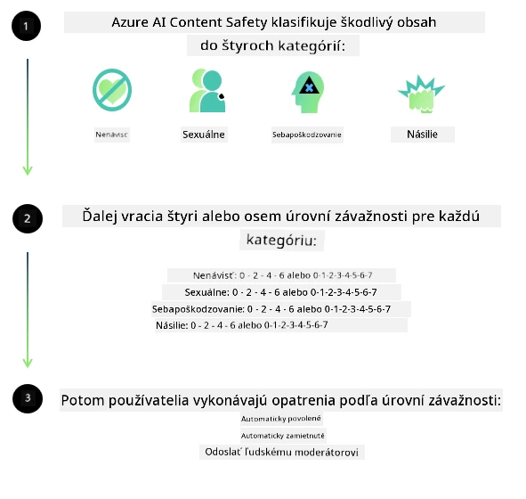

# Bezpečnosť AI pre modely Phi
Rodina modelov Phi bola vyvinutá v súlade so [Štandardom zodpovednej AI spoločnosti Microsoft](https://www.microsoft.com/ai/principles-and-approach#responsible-ai-standard), ktorý je celofiremnou sadou požiadaviek založených na nasledujúcich šiestich princípoch: zodpovednosť, transparentnosť, spravodlivosť, spoľahlivosť a bezpečnosť, súkromie a bezpečnosť, a inkluzívnosť, ktoré tvoria [zásady zodpovednej AI spoločnosti Microsoft](https://www.microsoft.com/ai/responsible-ai). 

Rovnako ako pri predchádzajúcich modeloch Phi, bol prijatý multifacetový prístup k vyhodnocovaniu bezpečnosti a bezpečnostným opatreniam po tréningu, pričom boli prijaté ďalšie opatrenia zohľadňujúce viacjazyčné schopnosti tohto vydania. Náš prístup k tréningu bezpečnosti a hodnoteniam vrátane testovania naprieč viacerými jazykmi a kategóriami rizík je opísaný v [dokumente Phi Safety Post-Training Paper](https://arxiv.org/abs/2407.13833). Zatiaľ čo modely Phi z tohto prístupu profitujú, vývojári by mali uplatňovať osvedčené postupy zodpovednej AI, vrátane mapovania, merania a zmierňovania rizík spojených s ich konkrétnym prípadom použitia a kultúrnym a jazykovým kontextom.

## Osvedčené postupy

Podobne ako iné modely, modely rodiny Phi sa potenciálne môžu správať spôsobmi, ktoré sú nespravodlivé, nespoľahlivé alebo urážlivé.

Niektoré obmedzujúce správanie SLM a LLM, o ktorom by ste mali vedieť, zahŕňa:

- **Kvalita služby:** Modely Phi sú trénované primárne na anglickom texte. Jazyky odlišné od angličtiny budú mať horší výkon; varianty anglického jazyka s menšou zastúpenosťou v tréningových dátach môžu mať horší výkon ako štandardná americká angličtina.
- **Reprezentácia ublíženia a udržiavanie stereotypov:** Tieto modely môžu nadmerne alebo nedostatočne zastupovať skupiny ľudí, vymazávať zastúpenie niektorých skupín alebo posilňovať ponižujúce alebo negatívne stereotypy. Napriek bezpečnostnému post-tréningu môžu tieto obmedzenia naďalej pretrvávať v dôsledku rozdielnych úrovní zastúpenia rôznych skupín alebo prevalencie príkladov negatívnych stereotypov v tréningových dátach, ktoré odrážajú reálne svetové vzorce a spoločenské predsudky.
- **Nevhodný alebo urážlivý obsah:** Tieto modely môžu produkovať iné typy nevhodného alebo urážlivého obsahu, čo môže spôsobiť nevhodnosť ich nasadenia v citlivých kontextoch bez ďalších opatrení, ktoré sú špecifické pre daný prípad použitia.
- **Spoľahlivosť informácií:** Jazykové modely môžu generovať nezmyselný obsah alebo vytvárať obsah, ktorý môže znieť rozumne, ale je nepresný alebo zastaraný.
- **Obmedzený rozsah pre kód:** Väčšina tréningových dát Phi-3 je založená na Pythone a používa bežné balíky ako "typing, math, random, collections, datetime, itertools". Ak model generuje Python skripty, ktoré využívajú iné balíky alebo skripty v iných jazykoch, dôrazne odporúčame používateľom manuálne overiť všetky používania API.

Vývojári by mali uplatňovať osvedčené postupy zodpovednej AI a sú zodpovední za zabezpečenie, že konkrétny prípad použitia bude v súlade s platnými zákonmi a predpismi (napr. ochrana súkromia, obchod, atď.).

## Zohľadnenie zodpovednej AI

Rovnako ako iné jazykové modely, modely série Phi sa potenciálne môžu správať spôsobmi, ktoré sú nespravodlivé, nespoľahlivé alebo urážlivé. Niektoré obmedzujúce správanie, na ktoré treba dávať pozor, zahŕňa:

**Kvalita služby:** Modely Phi sú trénované primárne na anglickom texte. Jazyky odlišné od angličtiny budú mať horší výkon. Varianty anglického jazyka s menšou zastúpenosťou v tréningových dátach môžu mať horší výkon ako štandardná americká angličtina.

**Reprezentácia ublíženia a udržiavanie stereotypov:** Tieto modely môžu nadmerne alebo nedostatočne zastupovať skupiny ľudí, vymazávať zastúpenie niektorých skupín alebo posilňovať ponižujúce alebo negatívne stereotypy. Napriek bezpečnostnému post-tréningu môžu tieto obmedzenia naďalej pretrvávať v dôsledku rozdielnych úrovní zastúpenia rôznych skupín alebo prevalencie príkladov negatívnych stereotypov v tréningových dátach, ktoré odrážajú reálne svetové vzorce a spoločenské predsudky.

**Nevhodný alebo urážlivý obsah:** Tieto modely môžu produkovať iné typy nevhodného alebo urážlivého obsahu, čo môže spôsobiť nevhodnosť ich nasadenia v citlivých kontextoch bez ďalších opatrení, ktoré sú špecifické pre daný prípad použitia.
Spoľahlivosť informácií: Jazykové modely môžu generovať nezmyselný obsah alebo vytvárať obsah, ktorý môže znieť rozumne, ale je nepresný alebo zastaraný.

**Obmedzený rozsah pre kód:** Väčšina tréningových dát Phi-3 je založená na Pythone a používa bežné balíky ako "typing, math, random, collections, datetime, itertools". Ak model generuje Python skripty, ktoré využívajú iné balíky alebo skripty v iných jazykoch, dôrazne odporúčame používateľom manuálne overiť všetky používania API.

Vývojári by mali uplatňovať osvedčené postupy zodpovednej AI a sú zodpovední za zabezpečenie, že konkrétny prípad použitia bude v súlade s platnými zákonmi a predpismi (napr. ochrana súkromia, obchod, atď.). Dôležité oblasti na zváženie zahŕňajú:

**Pridelenie:** Modely nemusia byť vhodné pre scenáre, ktoré môžu mať významný dopad na právny status alebo rozdeľovanie zdrojov či životných príležitostí (napr. bývanie, zamestnanie, úvery, atď.) bez ďalších hodnotení a dodatočných techník odstraňovania zaujatosti.

**Vysoko rizikové scenáre:** Vývojári by mali posúdiť vhodnosť použitia modelov vo vysoko rizikových scenároch, kde by nespravodlivé, nespoľahlivé alebo urážlivé výstupy mohli byť mimoriadne nákladné alebo viesť k škodám. To zahŕňa poskytovanie rád v citlivých alebo odborných oblastiach, kde sú presnosť a spoľahlivosť kritické (napr. právne alebo zdravotné rady). Dodatočné ochranné opatrenia by mali byť implementované na úrovni aplikácie podľa kontextu nasadenia.

**Dezinformácie:** Modely môžu produkovať nepresné informácie. Vývojári by mali dodržiavať osvedčené postupy transparentnosti a informovať koncových používateľov, že interagujú s AI systémom. Na úrovni aplikácie môžu vývojári vytvárať mechanizmy spätnej väzby a procesy na zakotvenie odpovedí v kontextovo špecifických informáciách daného prípadu použitia, techniku známy ako Retrieval Augmented Generation (RAG).

**Generovanie škodlivého obsahu:** Vývojári by mali hodnotiť výstupy podľa ich kontextu a používať dostupné bezpečnostné klasifikátory alebo vlastné riešenia vhodné pre ich použitie.

**Zneužitie:** Iné formy zneužitia, ako podvody, spam alebo výroba malvéru, môžu byť možné, a vývojári by mali zabezpečiť, že ich aplikácie neporušujú platné zákony a predpisy.

### Doladenie a bezpečnosť obsahu AI

Po doladení modelu dôrazne odporúčame využiť opatrenia [Azure AI Content Safety](https://learn.microsoft.com/azure/ai-services/content-safety/overview) na monitorovanie obsahu generovaného modelmi, identifikáciu a blokovanie potenciálnych rizík, hrozieb a problémov s kvalitou.

[Azure AI Content Safety](https://learn.microsoft.com/azure/ai-services/content-safety/overview) podporuje textový aj obrazový obsah. Môže byť nasadený v cloude, odpojených kontajneroch a na edge/embedded zariadeniach.

## Prehľad Azure AI Content Safety

Azure AI Content Safety nie je univerzálne riešenie; môže byť prispôsobené tak, aby vyhovovalo špecifickým politikám podnikov. Okrem toho jeho viacjazyčné modely umožňujú rozumieť viacerým jazykom súčasne.

- **Azure AI Content Safety**
- **Microsoft Developer**
- **5 videí**

Služba Azure AI Content Safety deteguje škodlivý obsah vytváraný používateľmi a AI v aplikáciách a službách. Zahŕňa API pre text a obrázky, ktoré umožňujú detekovať škodlivý alebo nevhodný materiál.

[AI Content Safety Playlist](https://www.youtube.com/playlist?list=PLlrxD0HtieHjaQ9bJjyp1T7FeCbmVcPkQ)

---

<!-- CO-OP TRANSLATOR DISCLAIMER START -->
**Vyhlásenie o zodpovednosti**:  
Tento dokument bol preložený pomocou AI prekladateľskej služby [Co-op Translator](https://github.com/Azure/co-op-translator). Aj keď sa snažíme o presnosť, berte prosím na vedomie, že automatizované preklady môžu obsahovať chyby alebo nepresnosti. Originálny dokument v jeho pôvodnom jazyku by mal byť považovaný za autoritatívny zdroj. Pre kritické informácie sa odporúča profesionálny ľudský preklad. Nie sme zodpovední za akékoľvek nedorozumenia alebo nesprávne interpretácie vyplývajúce z použitia tohto prekladu.
<!-- CO-OP TRANSLATOR DISCLAIMER END -->