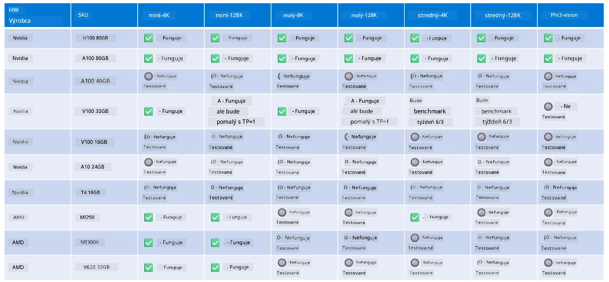

<!--
CO_OP_TRANSLATOR_METADATA:
{
  "original_hash": "8cdc17ce0f10535da30b53d23fe1a795",
  "translation_date": "2025-07-16T18:26:59+00:00",
  "source_file": "md/01.Introduction/01/01.Hardwaresupport.md",
  "language_code": "sk"
}
-->
# Podpora hardvéru Phi

Microsoft Phi bol optimalizovaný pre ONNX Runtime a podporuje Windows DirectML. Funguje dobre na rôznych typoch hardvéru, vrátane GPU, CPU a dokonca aj mobilných zariadení.

## Hardvér zariadenia  
Konkrétne podporovaný hardvér zahŕňa:

- GPU SKU: RTX 4090 (DirectML)
- GPU SKU: 1 A100 80GB (CUDA)
- CPU SKU: Standard F64s v2 (64 vCPU, 128 GiB pamäte)

## Mobilné SKU

- Android – Samsung Galaxy S21
- Apple iPhone 14 alebo novší s procesorom A16/A17

## Špecifikácia hardvéru Phi

- Minimálna požadovaná konfigurácia.
- Windows: GPU s podporou DirectX 12 a minimálne 4 GB celkovej RAM

CUDA: NVIDIA GPU s výpočtovou schopnosťou >= 7.02



## Spustenie onnxruntime na viacerých GPU

Aktuálne dostupné Phi ONNX modely sú určené len pre 1 GPU. Podpora viacerých GPU pre Phi model je možná, no ORT s 2 GPU nezaručuje vyšší výkon v porovnaní s dvoma inštanciami ORT. Pre najnovšie informácie navštívte [ONNX Runtime](https://onnxruntime.ai/).

Na [Build 2024 tím GenAI ONNX](https://youtu.be/WLW4SE8M9i8?si=EtG04UwDvcjunyfC) oznámil, že namiesto multi-GPU pre Phi modely povolili multi-inštanciu.

V súčasnosti to umožňuje spustiť jednu inštanciu onnxruntime alebo onnxruntime-genai s premennou prostredia CUDA_VISIBLE_DEVICES takto.

```Python
CUDA_VISIBLE_DEVICES=0 python infer.py
CUDA_VISIBLE_DEVICES=1 python infer.py
```

Neváhajte preskúmať Phi ďalej v [Azure AI Foundry](https://ai.azure.com)

**Vyhlásenie o zodpovednosti**:  
Tento dokument bol preložený pomocou AI prekladateľskej služby [Co-op Translator](https://github.com/Azure/co-op-translator). Aj keď sa snažíme o presnosť, prosím, majte na pamäti, že automatizované preklady môžu obsahovať chyby alebo nepresnosti. Pôvodný dokument v jeho rodnom jazyku by mal byť považovaný za autoritatívny zdroj. Pre kritické informácie sa odporúča profesionálny ľudský preklad. Nie sme zodpovední za akékoľvek nedorozumenia alebo nesprávne interpretácie vyplývajúce z použitia tohto prekladu.