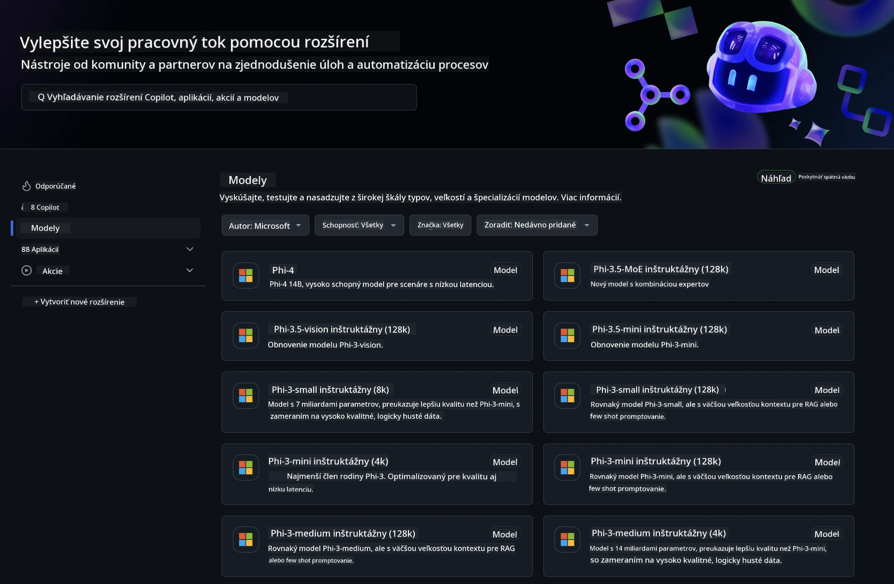
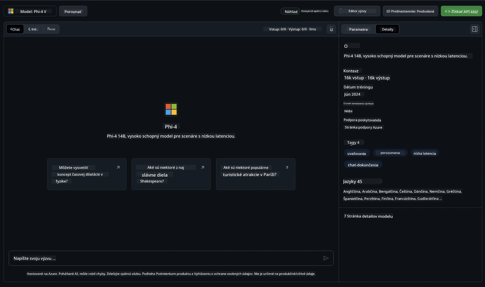
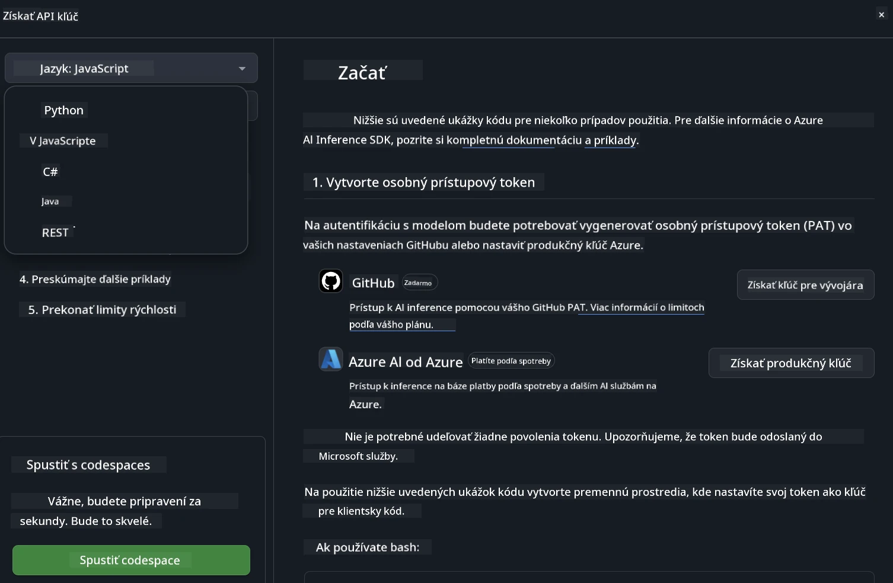
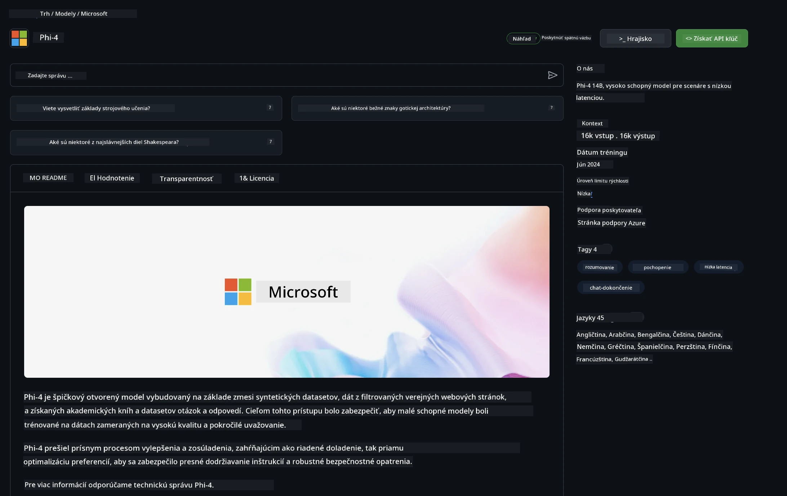

<!--
CO_OP_TRANSLATOR_METADATA:
{
  "original_hash": "fb67a08b9fc911a10ed58081fadef416",
  "translation_date": "2025-07-16T19:04:18+00:00",
  "source_file": "md/01.Introduction/02/02.GitHubModel.md",
  "language_code": "sk"
}
-->
## Phi rodina v GitHub Models

Vitajte na [GitHub Models](https://github.com/marketplace/models)! Máme všetko pripravené, aby ste mohli preskúmať AI modely hosťované na Azure AI.



Pre viac informácií o modeloch dostupných na GitHub Models si pozrite [GitHub Model Marketplace](https://github.com/marketplace/models)

## Dostupné modely

Každý model má vlastné prostredie na testovanie a ukážkový kód



### Phi rodina v katalógu GitHub modelov

- [Phi-4](https://github.com/marketplace/models/azureml/Phi-4)

- [Phi-3.5-MoE instruct (128k)](https://github.com/marketplace/models/azureml/Phi-3-5-MoE-instruct)

- [Phi-3.5-vision instruct (128k)](https://github.com/marketplace/models/azureml/Phi-3-5-vision-instruct)

- [Phi-3.5-mini instruct (128k)](https://github.com/marketplace/models/azureml/Phi-3-5-mini-instruct)

- [Phi-3-Medium-128k-Instruct](https://github.com/marketplace/models/azureml/Phi-3-medium-128k-instruct)

- [Phi-3-medium-4k-instruct](https://github.com/marketplace/models/azureml/Phi-3-medium-4k-instruct)

- [Phi-3-mini-128k-instruct](https://github.com/marketplace/models/azureml/Phi-3-mini-128k-instruct)

- [Phi-3-mini-4k-instruct](https://github.com/marketplace/models/azureml/Phi-3-mini-4k-instruct)

- [Phi-3-small-128k-instruct](https://github.com/marketplace/models/azureml/Phi-3-small-128k-instruct)

- [Phi-3-small-8k-instruct](https://github.com/marketplace/models/azureml/Phi-3-small-8k-instruct)

## Začíname

K dispozícii je niekoľko základných príkladov, ktoré môžete ihneď spustiť. Nájdete ich v priečinku samples. Ak chcete prejsť priamo na svoj obľúbený programovací jazyk, príklady sú dostupné v týchto jazykoch:

- Python
- JavaScript
- C#
- Java
- cURL

K dispozícii je tiež špeciálne prostredie Codespaces na spúšťanie príkladov a modelov.



## Ukážkový kód

Nižšie nájdete ukážky kódu pre niekoľko prípadov použitia. Pre ďalšie informácie o Azure AI Inference SDK si pozrite kompletnú dokumentáciu a príklady.

## Nastavenie

1. Vytvorte osobný prístupový token  
Nie je potrebné tokenu prideľovať žiadne špeciálne oprávnenia. Upozorňujeme, že token bude odoslaný do služby Microsoft.

Na použitie ukážok kódu nižšie si vytvorte premennú prostredia, kde nastavíte svoj token ako kľúč pre klientsky kód.

Ak používate bash:  
```
export GITHUB_TOKEN="<your-github-token-goes-here>"
```  
Ak používate powershell:  

```
$Env:GITHUB_TOKEN="<your-github-token-goes-here>"
```  

Ak používate Windows príkazový riadok:  

```
set GITHUB_TOKEN=<your-github-token-goes-here>
```  

## Ukážka v Pythone

### Inštalácia závislostí  
Nainštalujte Azure AI Inference SDK pomocou pip (vyžaduje Python >=3.8):

```
pip install azure-ai-inference
```  
### Spustenie základného príkladu kódu

Tento príklad ukazuje základné volanie API pre chat completion. Využíva endpoint GitHub AI modelu a váš GitHub token. Volanie je synchronné.

```python
import os
from azure.ai.inference import ChatCompletionsClient
from azure.ai.inference.models import SystemMessage, UserMessage
from azure.core.credentials import AzureKeyCredential

endpoint = "https://models.inference.ai.azure.com"
model_name = "Phi-4"
token = os.environ["GITHUB_TOKEN"]

client = ChatCompletionsClient(
    endpoint=endpoint,
    credential=AzureKeyCredential(token),
)

response = client.complete(
    messages=[
        UserMessage(content="I have $20,000 in my savings account, where I receive a 4% profit per year and payments twice a year. Can you please tell me how long it will take for me to become a millionaire? Also, can you please explain the math step by step as if you were explaining it to an uneducated person?"),
    ],
    temperature=0.4,
    top_p=1.0,
    max_tokens=2048,
    model=model_name
)

print(response.choices[0].message.content)
```

### Spustenie viackolovej konverzácie

Tento príklad demonštruje viackolovú konverzáciu s chat completion API. Pri použití modelu v chatovej aplikácii je potrebné spravovať históriu konverzácie a posielať modelu najnovšie správy.

```
import os
from azure.ai.inference import ChatCompletionsClient
from azure.ai.inference.models import AssistantMessage, SystemMessage, UserMessage
from azure.core.credentials import AzureKeyCredential

token = os.environ["GITHUB_TOKEN"]
endpoint = "https://models.inference.ai.azure.com"
# Replace Model_Name
model_name = "Phi-4"

client = ChatCompletionsClient(
    endpoint=endpoint,
    credential=AzureKeyCredential(token),
)

messages = [
    SystemMessage(content="You are a helpful assistant."),
    UserMessage(content="What is the capital of France?"),
    AssistantMessage(content="The capital of France is Paris."),
    UserMessage(content="What about Spain?"),
]

response = client.complete(messages=messages, model=model_name)

print(response.choices[0].message.content)
```

### Streamovanie výstupu

Pre lepší používateľský zážitok je vhodné streamovať odpoveď modelu, aby sa prvý token zobrazil čo najskôr a nemuseli ste čakať na dlhé odpovede.

```
import os
from azure.ai.inference import ChatCompletionsClient
from azure.ai.inference.models import SystemMessage, UserMessage
from azure.core.credentials import AzureKeyCredential

token = os.environ["GITHUB_TOKEN"]
endpoint = "https://models.inference.ai.azure.com"
# Replace Model_Name
model_name = "Phi-4"

client = ChatCompletionsClient(
    endpoint=endpoint,
    credential=AzureKeyCredential(token),
)

response = client.complete(
    stream=True,
    messages=[
        SystemMessage(content="You are a helpful assistant."),
        UserMessage(content="Give me 5 good reasons why I should exercise every day."),
    ],
    model=model_name,
)

for update in response:
    if update.choices:
        print(update.choices[0].delta.content or "", end="")

client.close()
```

## Bezplatné používanie a limity pre GitHub Models



[Rate limity pre playground a bezplatné API používanie](https://docs.github.com/en/github-models/prototyping-with-ai-models#rate-limits) sú určené na to, aby ste mohli experimentovať s modelmi a prototypovať svoju AI aplikáciu. Ak chcete prekročiť tieto limity a škálovať svoju aplikáciu, musíte si zabezpečiť zdroje cez Azure účet a autentifikovať sa tam namiesto použitia osobného GitHub tokenu. Nie je potrebné meniť nič iné v kóde. Použite tento odkaz, aby ste zistili, ako prekročiť limity bezplatnej úrovne v Azure AI.

### Upozornenia

Pamätajte, že pri práci s modelom experimentujete s AI, takže sa môžu vyskytnúť chyby v obsahu.

Funkcia je obmedzená rôznymi limitmi (vrátane počtu požiadaviek za minútu, za deň, tokenov na požiadavku a súbežných požiadaviek) a nie je určená na produkčné použitie.

GitHub Models používa Azure AI Content Safety. Tieto filtre nie je možné v rámci GitHub Models vypnúť. Ak sa rozhodnete používať modely cez platenú službu, nastavte si filtre obsahu podľa svojich požiadaviek.

Táto služba je poskytovaná podľa GitHub Pre-release Terms.

**Vyhlásenie o zodpovednosti**:  
Tento dokument bol preložený pomocou AI prekladateľskej služby [Co-op Translator](https://github.com/Azure/co-op-translator). Aj keď sa snažíme o presnosť, prosím, majte na pamäti, že automatizované preklady môžu obsahovať chyby alebo nepresnosti. Originálny dokument v jeho pôvodnom jazyku by mal byť považovaný za autoritatívny zdroj. Pre kritické informácie sa odporúča profesionálny ľudský preklad. Nie sme zodpovední za akékoľvek nedorozumenia alebo nesprávne interpretácie vyplývajúce z použitia tohto prekladu.