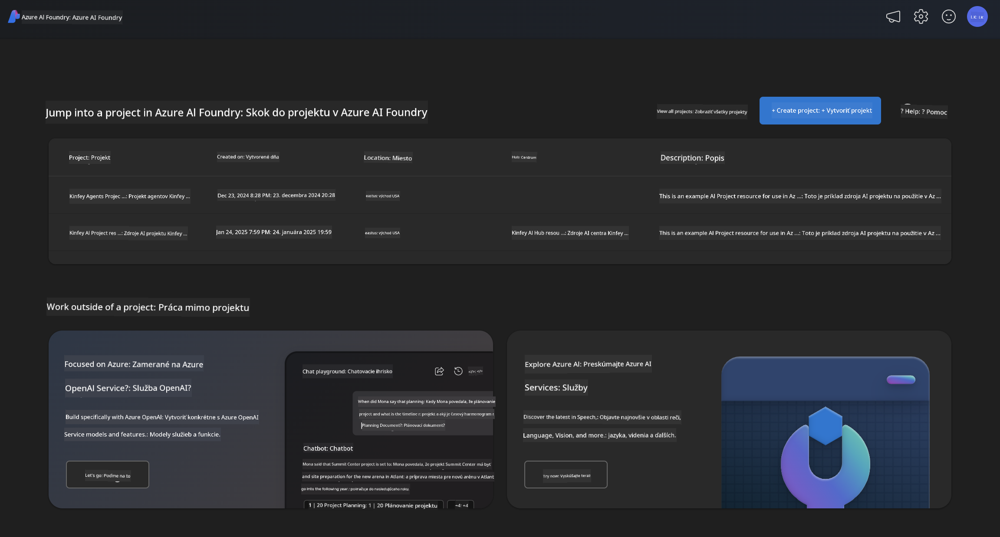
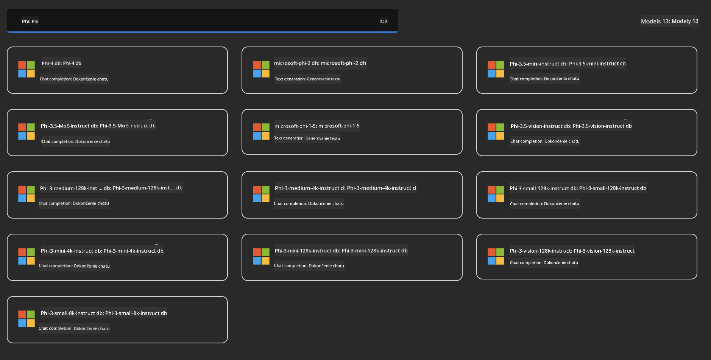
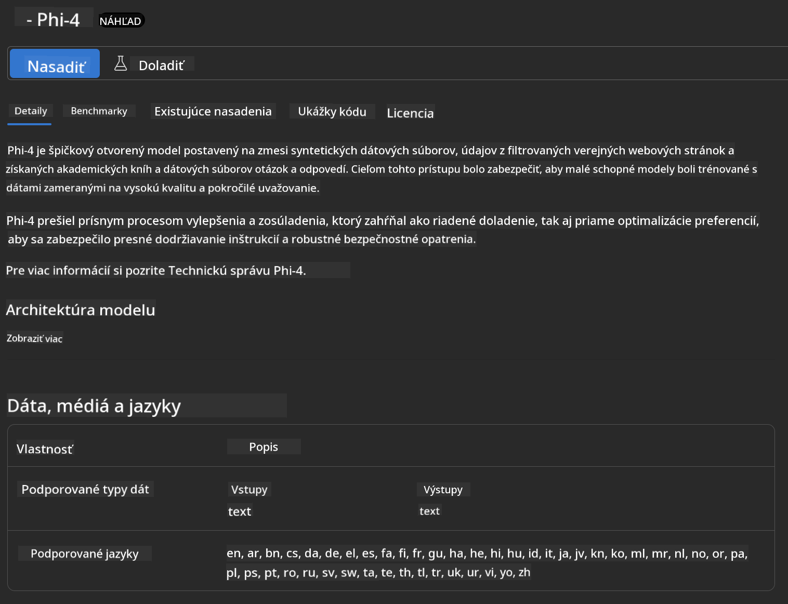
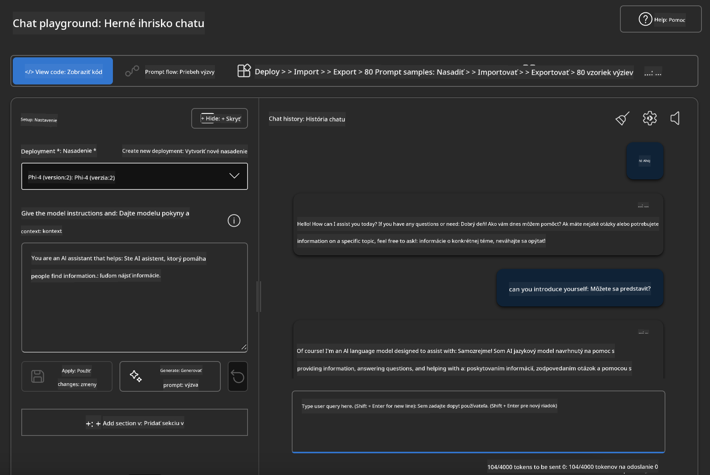

<!--
CO_OP_TRANSLATOR_METADATA:
{
  "original_hash": "3ae21dc5554e888defbe57946ee995ee",
  "translation_date": "2025-05-09T09:09:25+00:00",
  "source_file": "md/01.Introduction/02/03.AzureAIFoundry.md",
  "language_code": "sk"
}
-->
## Rodina Phi v Azure AI Foundry

[Azure AI Foundry](https://ai.azure.com) je dôveryhodná platforma, ktorá umožňuje vývojárom poháňať inovácie a formovať budúcnosť s AI bezpečným, spoľahlivým a zodpovedným spôsobom.

[Azure AI Foundry](https://ai.azure.com) je navrhnutá pre vývojárov, aby:

- Vytvárali generatívne AI aplikácie na podnikovej úrovni.
- Preskúmavali, vytvárali, testovali a nasadzovali pomocou špičkových AI nástrojov a ML modelov, založených na zásadách zodpovednej AI.
- Spolupracovali v tíme počas celého životného cyklu vývoja aplikácií.

S Azure AI Foundry môžete preskúmať širokú škálu modelov, služieb a funkcií a začať vytvárať AI aplikácie, ktoré najlepšie vyhovujú vašim cieľom. Platforma Azure AI Foundry uľahčuje škálovanie pri transformácii dôkazov konceptu na plnohodnotné produkčné aplikácie. Neustále monitorovanie a vylepšovanie podporujú dlhodobý úspech.



Okrem použitia služby Azure AOAI v Azure AI Foundry môžete tiež využiť modely tretích strán v Katalógu modelov Azure AI Foundry. Toto je dobrá voľba, ak chcete používať Azure AI Foundry ako platformu pre vaše AI riešenia.

Modely rodiny Phi môžeme rýchlo nasadiť cez Katalóg modelov v Azure AI Foundry

[Microsoft Phi Models v Azure AI Foundry Models](https://ai.azure.com/explore/models/?selectedCollection=phi)



### **Nasadenie Phi-4 v Azure AI Foundry**



### **Testovanie Phi-4 v Azure AI Foundry Playground**



### **Spustenie Python kódu na volanie Azure AI Foundry Phi-4**

```python

import os  
import base64
from openai import AzureOpenAI  
from azure.identity import DefaultAzureCredential, get_bearer_token_provider  
        
endpoint = os.getenv("ENDPOINT_URL", "Your Azure AOAI Service Endpoint")  
deployment = os.getenv("DEPLOYMENT_NAME", "Phi-4")  
      
token_provider = get_bearer_token_provider(  
    DefaultAzureCredential(),  
    "https://cognitiveservices.azure.com/.default"  
)  
  
client = AzureOpenAI(  
    azure_endpoint=endpoint,  
    azure_ad_token_provider=token_provider,  
    api_version="2024-05-01-preview",  
)  
  

chat_prompt = [
    {
        "role": "system",
        "content": "You are an AI assistant that helps people find information."
    },
    {
        "role": "user",
        "content": "can you introduce yourself"
    }
] 
    
# Include speech result if speech is enabled  
messages = chat_prompt 

completion = client.chat.completions.create(  
    model=deployment,  
    messages=messages,
    max_tokens=800,  
    temperature=0.7,  
    top_p=0.95,  
    frequency_penalty=0,  
    presence_penalty=0,
    stop=None,  
    stream=False  
)  
  
print(completion.to_json())  

```

**Vyhlásenie o zodpovednosti**:  
Tento dokument bol preložený pomocou AI prekladateľskej služby [Co-op Translator](https://github.com/Azure/co-op-translator). Aj keď sa snažíme o presnosť, prosím, majte na pamäti, že automatické preklady môžu obsahovať chyby alebo nepresnosti. Originálny dokument v jeho pôvodnom jazyku by mal byť považovaný za autoritatívny zdroj. Pre kritické informácie sa odporúča profesionálny ľudský preklad. Nie sme zodpovední za akékoľvek nedorozumenia alebo nesprávne výklady vyplývajúce z použitia tohto prekladu.