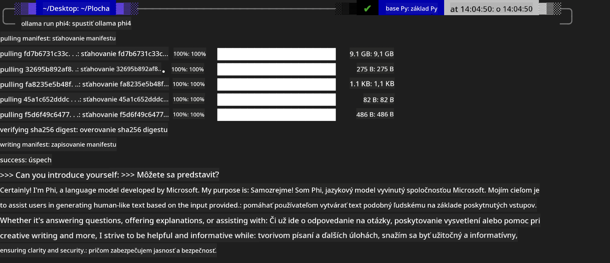
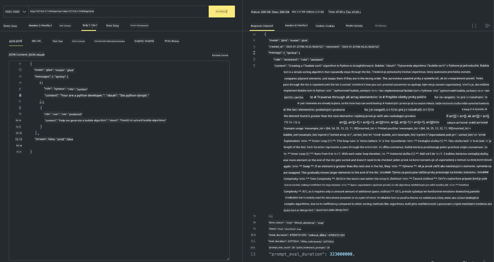

<!--
CO_OP_TRANSLATOR_METADATA:
{
  "original_hash": "2aa35f3c8b437fd5dc9995d53909d495",
  "translation_date": "2025-12-21T13:28:25+00:00",
  "source_file": "md/01.Introduction/02/04.Ollama.md",
  "language_code": "sk"
}
-->
## Rodina Phi v Ollama


[Ollama](https://ollama.com) umožňuje viacerým ľuďom priamo nasadzovať open source LLM alebo SLM pomocou jednoduchých skriptov, a takisto dokáže vytvárať API na podporu lokálnych scenárov aplikácie Copilot.

## **1. Inštalácia**

Ollama podporuje beh na Windows, macOS a Linux. Ollama môžete nainštalovať cez tento odkaz ([https://ollama.com/download](https://ollama.com/download)). Po úspešnej inštalácii môžete priamo použiť Ollama skript na volanie Phi-3 cez okno terminálu. Môžete si pozrieť všetky [dostupné knižnice v Ollama](https://ollama.com/library). Ak otvoríte toto úložisko v Codespace, Ollama bude už nainštalovaná.

```bash

ollama run phi4

```

> [!NOTE]
> Model sa pri prvom spustení najprv stiahne. Samozrejme môžete aj priamo špecifikovať už stiahnutý model Phi-4. Ako príklad použijeme WSL na spustenie príkazu. Po úspešnom stiahnutí modelu môžete priamo komunikovať v termináli.



## **2. Volanie API phi-4 z Ollama**

Ak chcete volať Phi-4 API generované Ollama, môžete v termináli použiť tento príkaz na spustenie servera Ollama.

```bash

ollama serve

```

> [!NOTE]
> Ak spúšťate macOS alebo Linux, môže sa vám zobraziť nasledujúca chyba **"Error: listen tcp 127.0.0.1:11434: bind: address already in use"**. Túto chybu môžete pri volaní príkazu dostať. Môžete ju buď ignorovať, pretože zvyčajne znamená, že server už beží, alebo môžete Ollama zastaviť a reštartovať:

**macOS**

```bash

brew services restart ollama

```

**Linux**

```bash

sudo systemctl stop ollama

```

Ollama podporuje dve API: generate a chat. Modelové API poskytované Ollama môžete volať podľa potreby odosielaním požiadaviek na lokálnu službu bežiacu na porte 11434.

**Chat**

```bash

curl http://127.0.0.1:11434/api/chat -d '{
  "model": "phi3",
  "messages": [
    {
      "role": "system",
      "content": "Your are a python developer."
    },
    {
      "role": "user",
      "content": "Help me generate a bubble algorithm"
    }
  ],
  "stream": false
  
}'
```

Toto je výsledok v Postman



## Ďalšie zdroje

Skontrolujte zoznam dostupných modelov v Ollama v [ich knižnici](https://ollama.com/library).

Stiahnite si model zo servera Ollama pomocou tohto príkazu

```bash
ollama pull phi4
```

Spustite model pomocou tohto príkazu

```bash
ollama run phi4
```

***Poznámka:*** Navštívte tento odkaz [https://github.com/ollama/ollama/blob/main/docs/api.md](https://github.com/ollama/ollama/blob/main/docs/api.md) pre viac informácií

## Volanie Ollama z Pythonu

Môžete použiť `requests` alebo `urllib3` na odosielanie požiadaviek na lokálne serverové koncové body uvedené vyššie. Populárny spôsob, ako používať Ollama v Pythone, je však cez SDK [openai](https://pypi.org/project/openai/), pretože Ollama poskytuje aj OpenAI-kompatibilné serverové koncové body.

Tu je príklad pre phi3-mini:

```python
import openai

client = openai.OpenAI(
    base_url="http://localhost:11434/v1",
    api_key="nokeyneeded",
)

response = client.chat.completions.create(
    model="phi4",
    temperature=0.7,
    n=1,
    messages=[
        {"role": "system", "content": "You are a helpful assistant."},
        {"role": "user", "content": "Write a haiku about a hungry cat"},
    ],
)

print("Response:")
print(response.choices[0].message.content)
```

## Volanie Ollama z JavaScriptu 
```javascript
// Príklad sumarizácie súboru pomocou Phi-4
script({
    model: "ollama:phi4",
    title: "Summarize with Phi-4",
    system: ["system"],
})

// Príklad sumarizácie
const file = def("FILE", env.files)
$`Summarize ${file} in a single paragraph.`
```

## Volanie Ollama z C#

Vytvorte novú C# konzolovú aplikáciu a pridajte nasledujúci balík NuGet:

```bash
dotnet add package Microsoft.SemanticKernel --version 1.34.0
```

Potom nahraďte tento kód v súbore `Program.cs`

```csharp
using Microsoft.SemanticKernel;
using Microsoft.SemanticKernel.ChatCompletion;

// add chat completion service using the local ollama server endpoint
#pragma warning disable SKEXP0001, SKEXP0003, SKEXP0010, SKEXP0011, SKEXP0050, SKEXP0052
builder.AddOpenAIChatCompletion(
    modelId: "phi4",
    endpoint: new Uri("http://localhost:11434/"),
    apiKey: "non required");

// invoke a simple prompt to the chat service
string prompt = "Write a joke about kittens";
var response = await kernel.InvokePromptAsync(prompt);
Console.WriteLine(response.GetValue<string>());
```

Spustite aplikáciu príkazom:

```bash
dotnet run
```

---

<!-- CO-OP TRANSLATOR DISCLAIMER START -->
**Vylúčenie zodpovednosti**:
Tento dokument bol preložený pomocou AI prekladateľskej služby [Co-op Translator](https://github.com/Azure/co-op-translator). Aj keď sa usilujeme o presnosť, majte prosím na pamäti, že automatické preklady môžu obsahovať chyby alebo nepresnosti. Pôvodný dokument v jeho pôvodnom jazyku by mal byť považovaný za autoritatívny zdroj. Pre kritické informácie sa odporúča profesionálny ľudský preklad. Nie sme zodpovední za akékoľvek nedorozumenia alebo nesprávne výklady vyplývajúce z použitia tohto prekladu.
<!-- CO-OP TRANSLATOR DISCLAIMER END -->