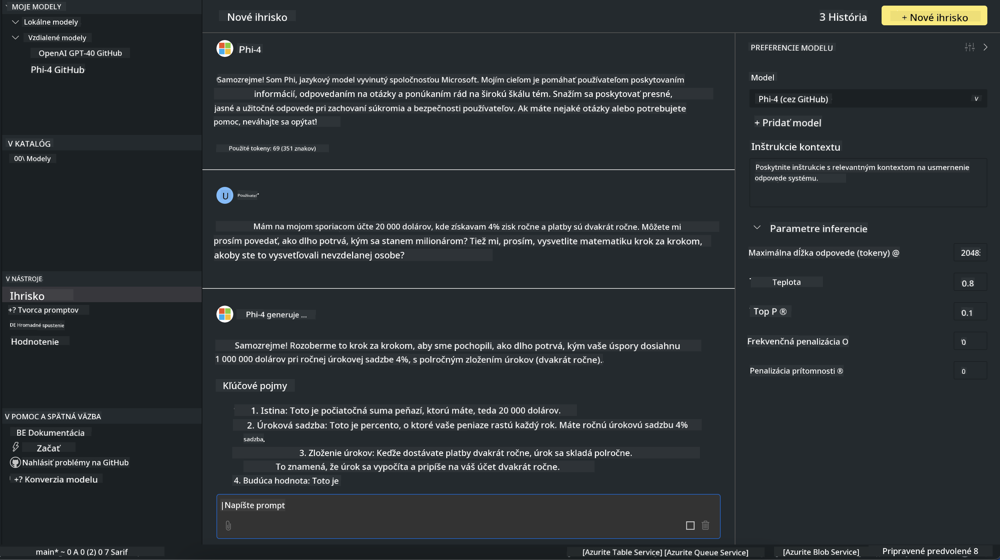

<!--
CO_OP_TRANSLATOR_METADATA:
{
  "original_hash": "4951d458c0b60c02cd1e751b40903877",
  "translation_date": "2025-07-16T19:30:00+00:00",
  "source_file": "md/01.Introduction/02/05.AITK.md",
  "language_code": "sk"
}
-->
# Phi Family v AITK

[AI Toolkit pre VS Code](https://marketplace.visualstudio.com/items?itemName=ms-windows-ai-studio.windows-ai-studio) zjednodušuje vývoj generatívnych AI aplikácií tým, že spája najmodernejšie nástroje a modely AI z Azure AI Foundry Catalog a ďalších katalógov ako Hugging Face. Budete môcť prehliadať katalóg AI modelov poháňaný GitHub Models a Azure AI Foundry Model Catalogs, sťahovať ich lokálne alebo na diaľku, doladiť, testovať a používať vo svojej aplikácii.

AI Toolkit Preview beží lokálne. Lokálny inference alebo doladenie závisí od vybraného modelu, môže byť potrebné mať GPU, napríklad NVIDIA CUDA GPU. GitHub Models môžete spúšťať priamo aj cez AITK.

## Začíname

[Zistite viac o inštalácii Windows subsystému pre Linux](https://learn.microsoft.com/windows/wsl/install?WT.mc_id=aiml-137032-kinfeylo)

a [ako zmeniť predvolenú distribúciu](https://learn.microsoft.com/windows/wsl/install#change-the-default-linux-distribution-installed).

[AI Toolkit GitHub repozitár](https://github.com/microsoft/vscode-ai-toolkit/)

- Windows, Linux, macOS
  
- Pre doladenie na Windows aj Linux budete potrebovať Nvidia GPU. Okrem toho **Windows** vyžaduje subsystém pre Linux s distribúciou Ubuntu 18.4 alebo novšou. [Zistite viac o inštalácii Windows subsystému pre Linux](https://learn.microsoft.com/windows/wsl/install) a [ako zmeniť predvolenú distribúciu](https://learn.microsoft.com/windows/wsl/install#change-the-default-linux-distribution-installed).

### Inštalácia AI Toolkit

AI Toolkit je dodávaný ako [rozšírenie pre Visual Studio Code](https://code.visualstudio.com/docs/setup/additional-components#_vs-code-extensions), preto je potrebné najskôr nainštalovať [VS Code](https://code.visualstudio.com/docs/setup/windows?WT.mc_id=aiml-137032-kinfeylo) a potom stiahnuť AI Toolkit z [VS Marketplace](https://marketplace.visualstudio.com/items?itemName=ms-windows-ai-studio.windows-ai-studio).  
[AI Toolkit je dostupný vo Visual Studio Marketplace](https://marketplace.visualstudio.com/items?itemName=ms-windows-ai-studio.windows-ai-studio) a dá sa nainštalovať ako akékoľvek iné rozšírenie pre VS Code.

Ak nie ste oboznámení s inštaláciou rozšírení vo VS Code, postupujte podľa týchto krokov:

### Prihlásenie

1. V Activity Bar vo VS Code vyberte **Extensions**  
1. Do vyhľadávacieho poľa zadajte "AI Toolkit"  
1. Vyberte "AI Toolkit for Visual Studio code"  
1. Kliknite na **Install**

Teraz ste pripravení používať rozšírenie!

Budete vyzvaní na prihlásenie do GitHub, preto kliknite na "Allow" pre pokračovanie. Budete presmerovaní na prihlasovaciu stránku GitHub.

Prihláste sa a postupujte podľa pokynov. Po úspešnom dokončení budete presmerovaní späť do VS Code.

Po nainštalovaní rozšírenia sa v Activity Bar zobrazí ikona AI Toolkit.

Poďme preskúmať dostupné akcie!

### Dostupné akcie

Hlavný bočný panel AI Toolkit je rozdelený na  

- **Models**  
- **Resources**  
- **Playground**  
- **Fine-tuning**  
- **Evaluation**

Sú dostupné v sekcii Resources. Pre začiatok vyberte **Model Catalog**.

### Stiahnutie modelu z katalógu

Po spustení AI Toolkit z bočného panela VS Code môžete vybrať z nasledujúcich možností:


- Nájdite podporovaný model v **Model Catalog** a stiahnite ho lokálne  
- Otestujte inferenciu modelu v **Model Playground**  
- Doladte model lokálne alebo na diaľku v **Model Fine-tuning**  
- Nasadzujte doladené modely do cloudu cez príkazovú paletu AI Toolkit  
- Vyhodnocovanie modelov

> [!NOTE]
>
> **GPU vs CPU**
>
> Všimnete si, že karty modelov zobrazujú veľkosť modelu, platformu a typ akcelerátora (CPU, GPU). Pre optimalizovaný výkon na **Windows zariadeniach s aspoň jedným GPU** vyberte verzie modelov, ktoré cielia iba na Windows.
>
> Tým zabezpečíte, že máte model optimalizovaný pre akcelerátor DirectML.
>
> Názvy modelov majú formát
>
> - `{model_name}-{accelerator}-{quantization}-{format}`.
>
>Aby ste zistili, či máte GPU na vašom Windows zariadení, otvorte **Správcu úloh** a vyberte záložku **Výkon**. Ak máte GPU, budú uvedené pod názvami ako "GPU 0" alebo "GPU 1".

### Spustenie modelu v playgrounde

Keď sú všetky parametre nastavené, kliknite na **Generate Project**.

Po stiahnutí modelu vyberte na karte modelu v katalógu **Load in Playground**:

- Spustí sa sťahovanie modelu  
- Nainštalujú sa všetky predpoklady a závislosti  
- Vytvorí sa pracovný priestor vo VS Code



### Použitie REST API vo vašej aplikácii

AI Toolkit obsahuje lokálny REST API webový server **na porte 5272**, ktorý používa [formát OpenAI chat completions](https://platform.openai.com/docs/api-reference/chat/create).

To vám umožní testovať vašu aplikáciu lokálne bez potreby spoliehať sa na cloudovú AI službu. Napríklad nasledujúci JSON súbor ukazuje, ako nakonfigurovať telo požiadavky:

```json
{
    "model": "Phi-4",
    "messages": [
        {
            "role": "user",
            "content": "what is the golden ratio?"
        }
    ],
    "temperature": 0.7,
    "top_p": 1,
    "top_k": 10,
    "max_tokens": 100,
    "stream": true
}
```

REST API môžete testovať pomocou (napríklad) [Postman](https://www.postman.com/) alebo nástroja CURL (Client URL):

```bash
curl -vX POST http://127.0.0.1:5272/v1/chat/completions -H 'Content-Type: application/json' -d @body.json
```

### Použitie OpenAI klientskej knižnice pre Python

```python
from openai import OpenAI

client = OpenAI(
    base_url="http://127.0.0.1:5272/v1/", 
    api_key="x" # required for the API but not used
)

chat_completion = client.chat.completions.create(
    messages=[
        {
            "role": "user",
            "content": "what is the golden ratio?",
        }
    ],
    model="Phi-4",
)

print(chat_completion.choices[0].message.content)
```

### Použitie Azure OpenAI klientskej knižnice pre .NET

Pridajte do svojho projektu [Azure OpenAI klientsku knižnicu pre .NET](https://www.nuget.org/packages/Azure.AI.OpenAI/) pomocou NuGet:

```bash
dotnet add {project_name} package Azure.AI.OpenAI --version 1.0.0-beta.17
```

Pridajte do projektu súbor C# s názvom **OverridePolicy.cs** a vložte nasledujúci kód:

```csharp
// OverridePolicy.cs
using Azure.Core.Pipeline;
using Azure.Core;

internal partial class OverrideRequestUriPolicy(Uri overrideUri)
    : HttpPipelineSynchronousPolicy
{
    private readonly Uri _overrideUri = overrideUri;

    public override void OnSendingRequest(HttpMessage message)
    {
        message.Request.Uri.Reset(_overrideUri);
    }
}
```

Následne vložte nasledujúci kód do súboru **Program.cs**:

```csharp
// Program.cs
using Azure.AI.OpenAI;

Uri localhostUri = new("http://localhost:5272/v1/chat/completions");

OpenAIClientOptions clientOptions = new();
clientOptions.AddPolicy(
    new OverrideRequestUriPolicy(localhostUri),
    Azure.Core.HttpPipelinePosition.BeforeTransport);
OpenAIClient client = new(openAIApiKey: "unused", clientOptions);

ChatCompletionsOptions options = new()
{
    DeploymentName = "Phi-4",
    Messages =
    {
        new ChatRequestSystemMessage("You are a helpful assistant. Be brief and succinct."),
        new ChatRequestUserMessage("What is the golden ratio?"),
    }
};

StreamingResponse<StreamingChatCompletionsUpdate> streamingChatResponse
    = await client.GetChatCompletionsStreamingAsync(options);

await foreach (StreamingChatCompletionsUpdate chatChunk in streamingChatResponse)
{
    Console.Write(chatChunk.ContentUpdate);
}
```


## Doladenie s AI Toolkit

- Začnite objavovaním modelov a playgroundom.  
- Doladenie modelov a inferencia pomocou lokálnych výpočtových zdrojov.  
- Vzdialené doladenie a inferencia pomocou Azure zdrojov.

[Doladenie s AI Toolkit](../../03.FineTuning/Finetuning_VSCodeaitoolkit.md)

## AI Toolkit Q&A zdroje

Pre najčastejšie problémy a riešenia navštívte našu [Q&A stránku](https://github.com/microsoft/vscode-ai-toolkit/blob/main/archive/QA.md)

**Vyhlásenie o zodpovednosti**:  
Tento dokument bol preložený pomocou AI prekladateľskej služby [Co-op Translator](https://github.com/Azure/co-op-translator). Aj keď sa snažíme o presnosť, prosím, majte na pamäti, že automatizované preklady môžu obsahovať chyby alebo nepresnosti. Originálny dokument v jeho pôvodnom jazyku by mal byť považovaný za autoritatívny zdroj. Pre kritické informácie sa odporúča profesionálny ľudský preklad. Nie sme zodpovední za akékoľvek nedorozumenia alebo nesprávne interpretácie vyplývajúce z použitia tohto prekladu.