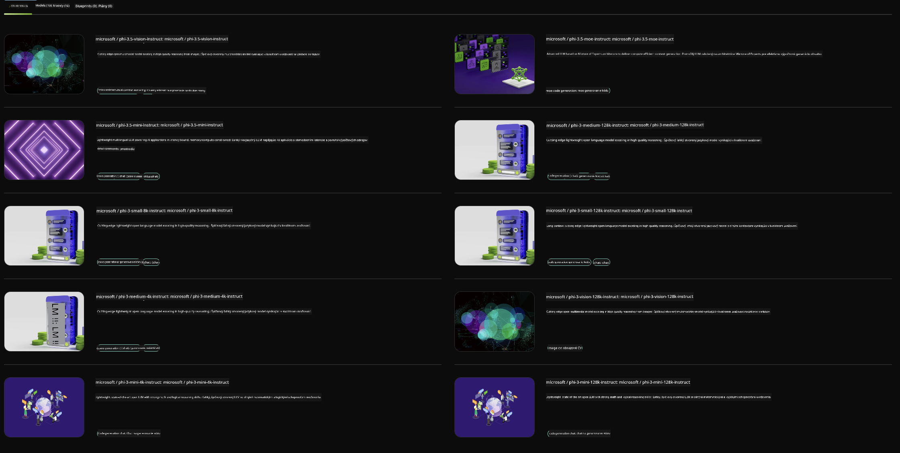

<!--
CO_OP_TRANSLATOR_METADATA:
{
  "original_hash": "7b08e277df2a9307f861ae54bc30c772",
  "translation_date": "2025-05-09T10:02:04+00:00",
  "source_file": "md/01.Introduction/02/06.NVIDIA.md",
  "language_code": "sk"
}
-->
## Phi rodina v NVIDIA NIM

NVIDIA NIM je sada ľahko použiteľných mikroslužieb navrhnutých na zrýchlenie nasadenia generatívnych AI modelov v cloude, dátových centrách a pracovných staniciach. NIM sú rozdelené podľa rodiny modelov a jednotlivých modelov. Napríklad NVIDIA NIM pre veľké jazykové modely (LLM) prináša silu najmodernejších LLM do podnikových aplikácií, poskytujúc bezkonkurenčné schopnosti spracovania a porozumenia prirodzenému jazyku.

NIM umožňuje IT a DevOps tímom jednoducho si vlastnoručne hosťovať veľké jazykové modely (LLM) vo vlastných spravovaných prostrediach a zároveň poskytuje vývojárom štandardné API, ktoré im umožňuje vytvárať výkonné kopiloty, chatboty a AI asistentov, ktorí môžu transformovať ich podnikanie. Vďaka špičkovej akcelerácii GPU od NVIDIA a škálovateľnému nasadeniu ponúka NIM najrýchlejšiu cestu k inferencii s bezkonkurenčným výkonom.

Môžete použiť NVIDIA NIM na inferenciu modelov Phi rodiny



### **Ukážky - Phi-3-Vision v NVIDIA NIM**

Predstavte si, že máte obrázok (`demo.png`) a chcete vygenerovať Python kód, ktorý tento obrázok spracuje a uloží jeho novú verziu (`phi-3-vision.jpg`).

Kód vyššie automatizuje tento proces takto:

1. Nastaví prostredie a potrebné konfigurácie.
2. Vytvorí prompt, ktorý modelu prikáže vygenerovať požadovaný Python kód.
3. Pošle prompt modelu a získa vygenerovaný kód.
4. Extrahuje a spustí vygenerovaný kód.
5. Zobrazí pôvodný a spracovaný obrázok.

Tento prístup využíva silu AI na automatizáciu úloh spracovania obrázkov, čo zjednodušuje a urýchľuje dosiahnutie vašich cieľov.

[Ukážkový kód](../../../../../code/06.E2E/E2E_Nvidia_NIM_Phi3_Vision.ipynb)

Pozrime sa krok za krokom, čo celý kód robí:

1. **Inštalácia potrebného balíka**:
    ```python
    !pip install langchain_nvidia_ai_endpoints -U
    ```
    Tento príkaz nainštaluje balík `langchain_nvidia_ai_endpoints` a zabezpečí, že máte jeho najnovšiu verziu.

2. **Import potrebných modulov**:
    ```python
    from langchain_nvidia_ai_endpoints import ChatNVIDIA
    import getpass
    import os
    import base64
    ```
    Tieto importy načítajú moduly potrebné na interakciu s NVIDIA AI endpointmi, bezpečné spracovanie hesiel, prácu s operačným systémom a kódovanie/dekódovanie v base64 formáte.

3. **Nastavenie API kľúča**:
    ```python
    if not os.getenv("NVIDIA_API_KEY"):
        os.environ["NVIDIA_API_KEY"] = getpass.getpass("Enter your NVIDIA API key: ")
    ```
    Tento kód skontroluje, či je nastavená premenná prostredia `NVIDIA_API_KEY`. Ak nie je, bezpečne vyžiada od používateľa zadanie API kľúča.

4. **Definovanie modelu a cesty k obrázku**:
    ```python
    model = 'microsoft/phi-3-vision-128k-instruct'
    chat = ChatNVIDIA(model=model)
    img_path = './imgs/demo.png'
    ```
    Nastaví sa model, vytvorí inštancia `ChatNVIDIA` s daným modelom a definuje sa cesta k obrázku.

5. **Vytvorenie textového promptu**:
    ```python
    text = "Please create Python code for image, and use plt to save the new picture under imgs/ and name it phi-3-vision.jpg."
    ```
    Definuje sa textový prompt, ktorý modelu prikazuje vygenerovať Python kód na spracovanie obrázka.

6. **Zakódovanie obrázka do Base64**:
    ```python
    with open(img_path, "rb") as f:
        image_b64 = base64.b64encode(f.read()).decode()
    image = f''
    ```
    Tento kód načíta obrázok, zakóduje ho do base64 a vytvorí HTML tag obrázka s týmto zakódovaným obsahom.

7. **Spojenie textu a obrázka do promptu**:
    ```python
    prompt = f"{text} {image}"
    ```
    Spojí sa textový prompt a HTML tag obrázka do jedného reťazca.

8. **Generovanie kódu pomocou ChatNVIDIA**:
    ```python
    code = ""
    for chunk in chat.stream(prompt):
        print(chunk.content, end="")
        code += chunk.content
    ```
    Tento kód pošle prompt do `ChatNVIDIA` a získa reťazec s vygenerovaným kódom.

9. **Extrahovanie Python kódu z vygenerovaného obsahu**:
    ```python
    begin = code.index('```python') + 9
    code = code[begin:]
    end = code.index('```')
    code = code[:end]
    ```
    Tento krok vyextrahuje samotný Python kód z vygenerovaného obsahu odstránením markdown formátovania.

10. **Spustenie vygenerovaného kódu**:
    ```python
    import subprocess
    result = subprocess.run(["python", "-c", code], capture_output=True)
    ```
    Spustí sa vyextrahovaný Python kód ako podproces a zachytí sa jeho výstup.

11. **Zobrazenie obrázkov**:
    ```python
    from IPython.display import Image, display
    display(Image(filename='./imgs/phi-3-vision.jpg'))
    display(Image(filename='./imgs/demo.png'))
    ```
    Tieto riadky zobrazia obrázky pomocou modulu `IPython.display`.

**Zrieknutie sa zodpovednosti**:  
Tento dokument bol preložený pomocou AI prekladateľskej služby [Co-op Translator](https://github.com/Azure/co-op-translator). Aj keď sa snažíme o presnosť, prosím berte na vedomie, že automatické preklady môžu obsahovať chyby alebo nepresnosti. Originálny dokument v jeho pôvodnom jazyku by mal byť považovaný za autoritatívny zdroj. Pre kritické informácie sa odporúča profesionálny ľudský preklad. Nie sme zodpovední za akékoľvek nedorozumenia alebo nesprávne výklady vyplývajúce z použitia tohto prekladu.