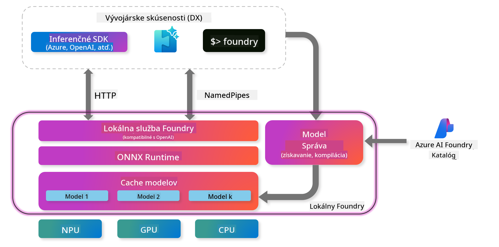

<!--
CO_OP_TRANSLATOR_METADATA:
{
  "original_hash": "52973a5680a65a810aa80b7036afd31f",
  "translation_date": "2025-07-16T19:50:36+00:00",
  "source_file": "md/01.Introduction/02/07.FoundryLocal.md",
  "language_code": "sk"
}
-->
## Začíname s modelmi Phi-Family vo Foundry Local

### Úvod do Foundry Local

Foundry Local je výkonné riešenie pre AI inferenciu priamo na zariadení, ktoré prináša podnikové AI schopnosti priamo na váš lokálny hardvér. Tento návod vás prevedie nastavením a používaním modelov Phi-Family vo Foundry Local, čím získate úplnú kontrolu nad svojimi AI úlohami, zároveň si zachováte súkromie a znížite náklady.

Foundry Local ponúka výhody v oblasti výkonu, súkromia, prispôsobenia a nákladovej efektívnosti tým, že AI modely bežia priamo na vašom zariadení. Bezproblémovo sa integruje do vašich existujúcich pracovných tokov a aplikácií cez intuitívne CLI, SDK a REST API.




### Prečo si vybrať Foundry Local?

Pochopenie výhod Foundry Local vám pomôže urobiť informované rozhodnutia o stratégii nasadenia AI:

- **Inferencia priamo na zariadení:** Spúšťajte modely lokálne na vlastnom hardvéri, čím znížite náklady a zároveň všetky dáta zostanú na vašom zariadení.

- **Prispôsobenie modelov:** Vyberte si z prednastavených modelov alebo použite vlastné, aby ste splnili špecifické požiadavky a prípady použitia.

- **Nákladová efektívnosť:** Odstráňte opakujúce sa náklady na cloudové služby využitím existujúceho hardvéru, čím sprístupníte AI širšiemu okruhu používateľov.

- **Bezproblémová integrácia:** Prepojte sa s vašimi aplikáciami cez SDK, API endpointy alebo CLI, s možnosťou jednoduchého škálovania na Azure AI Foundry podľa rastúcich potrieb.

> **Poznámka na začiatok:** Tento návod sa zameriava na používanie Foundry Local cez rozhrania CLI a SDK. Naučíte sa oba prístupy, aby ste si mohli vybrať ten najvhodnejší pre váš prípad použitia.

## Časť 1: Nastavenie Foundry Local CLI

### Krok 1: Inštalácia

Foundry Local CLI je váš vstup do správy a spúšťania AI modelov lokálne. Začnime jeho inštaláciou na vašom systéme.

**Podporované platformy:** Windows a macOS

Pre podrobné inštrukcie inštalácie si pozrite [oficiálnu dokumentáciu Foundry Local](https://github.com/microsoft/Foundry-Local/blob/main/README.md).

### Krok 2: Preskúmanie dostupných modelov

Keď máte Foundry Local CLI nainštalované, môžete zistiť, aké modely sú k dispozícii pre váš prípad použitia. Tento príkaz vám zobrazí všetky podporované modely:


```bash
foundry model list
```

### Krok 3: Pochopenie modelov Phi Family

Phi Family ponúka rad modelov optimalizovaných pre rôzne prípady použitia a hardvérové konfigurácie. Tu sú modely Phi dostupné vo Foundry Local:

**Dostupné modely Phi:** 

- **phi-3.5-mini** - Kompaktný model pre základné úlohy
- **phi-3-mini-128k** - Verzia s rozšíreným kontextom pre dlhšie konverzácie
- **phi-3-mini-4k** - Štandardný kontextový model pre všeobecné použitie
- **phi-4** - Pokročilý model s vylepšenými schopnosťami
- **phi-4-mini** - Ľahká verzia Phi-4
- **phi-4-mini-reasoning** - Špecializovaný na komplexné úlohy s dôvodovaním

> **Kompatibilita hardvéru:** Každý model je možné nakonfigurovať pre rôzne hardvérové akcelerácie (CPU, GPU) podľa možností vášho systému.

### Krok 4: Spustenie prvého modelu Phi

Začnime praktickým príkladom. Spustíme model `phi-4-mini-reasoning`, ktorý vyniká v riešení zložitých problémov krok za krokom.


**Príkaz na spustenie modelu:**

```bash
foundry model run Phi-4-mini-reasoning-generic-cpu
```

> **Prvé spustenie:** Pri prvom spustení modelu si Foundry Local automaticky stiahne model do vášho zariadenia. Doba sťahovania závisí od rýchlosti vašej siete, preto prosím buďte trpezliví počas počiatočného nastavenia.

### Krok 5: Testovanie modelu na reálnom probléme

Teraz otestujme náš model na klasickom logickom probléme, aby sme videli, ako zvláda krokové dôvodovanie:

**Príklad problému:**

```txt
Please calculate the following step by step: Now there are pheasants and rabbits in the same cage, there are thirty-five heads on top and ninety-four legs on the bottom, how many pheasants and rabbits are there?
```

**Očakávané správanie:** Model by mal rozložiť tento problém na logické kroky, využívajúc fakt, že bažanti majú 2 nohy a králiky 4 nohy, aby vyriešil sústavu rovníc.

**Výsledky:**


## Časť 2: Vývoj aplikácií s Foundry Local SDK

### Prečo používať SDK?

Kým CLI je ideálne na testovanie a rýchle interakcie, SDK vám umožňuje programovo integrovať Foundry Local do vašich aplikácií. To otvára možnosti pre:

- Vytváranie vlastných AI aplikácií
- Automatizáciu pracovných tokov
- Integráciu AI schopností do existujúcich systémov
- Vývoj chatbotov a interaktívnych nástrojov

### Podporované programovacie jazyky

Foundry Local poskytuje SDK podporu pre viacero programovacích jazykov, aby vyhovel vašim vývojárskym preferenciám:

**📦 Dostupné SDK:**

- **C# (.NET):** [SDK dokumentácia a príklady](https://github.com/microsoft/Foundry-Local/tree/main/sdk/cs)
- **Python:** [SDK dokumentácia a príklady](https://github.com/microsoft/Foundry-Local/tree/main/sdk/python)
- **JavaScript:** [SDK dokumentácia a príklady](https://github.com/microsoft/Foundry-Local/tree/main/sdk/js)
- **Rust:** [SDK dokumentácia a príklady](https://github.com/microsoft/Foundry-Local/tree/main/sdk/rust)

### Ďalšie kroky

1. **Vyberte si preferované SDK** podľa vášho vývojového prostredia
2. **Postupujte podľa dokumentácie SDK** pre podrobné návody na implementáciu
3. **Začnite s jednoduchými príkladmi** predtým, než vytvoríte zložité aplikácie
4. **Preskúmajte ukážkový kód** dostupný v každom SDK repozitári

## Záver

Teraz ste sa naučili:
- ✅ Inštalovať a nastaviť Foundry Local CLI
- ✅ Objavovať a spúšťať modely Phi Family
- ✅ Testovať modely na reálnych problémoch
- ✅ Pochopiť možnosti SDK pre vývoj aplikácií

Foundry Local poskytuje silný základ pre prinášanie AI schopností priamo do vášho lokálneho prostredia, čím vám dáva kontrolu nad výkonom, súkromím a nákladmi, pričom zachováva flexibilitu škálovania na cloudové riešenia podľa potreby.

**Vyhlásenie o zodpovednosti**:  
Tento dokument bol preložený pomocou AI prekladateľskej služby [Co-op Translator](https://github.com/Azure/co-op-translator). Aj keď sa snažíme o presnosť, prosím, majte na pamäti, že automatizované preklady môžu obsahovať chyby alebo nepresnosti. Pôvodný dokument v jeho rodnom jazyku by mal byť považovaný za autoritatívny zdroj. Pre kritické informácie sa odporúča profesionálny ľudský preklad. Nie sme zodpovední za akékoľvek nedorozumenia alebo nesprávne interpretácie vyplývajúce z použitia tohto prekladu.