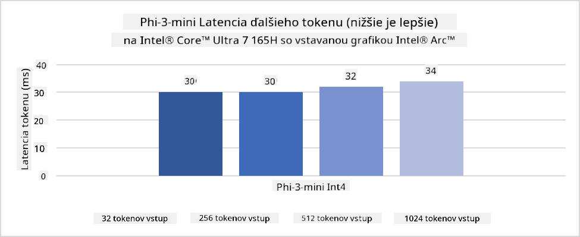
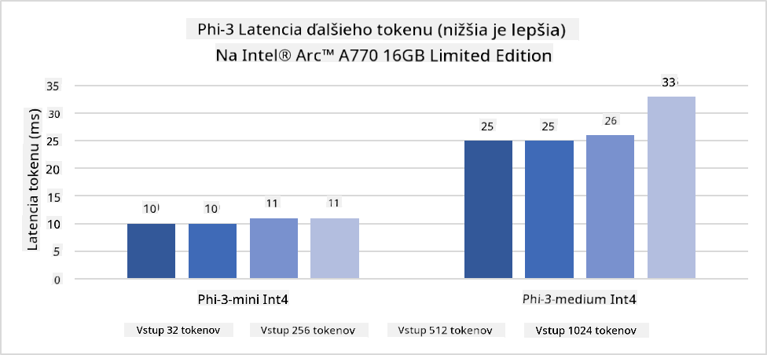
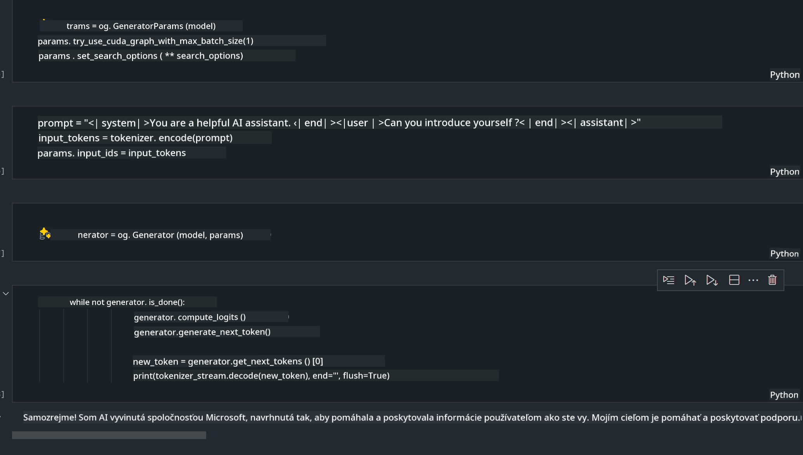
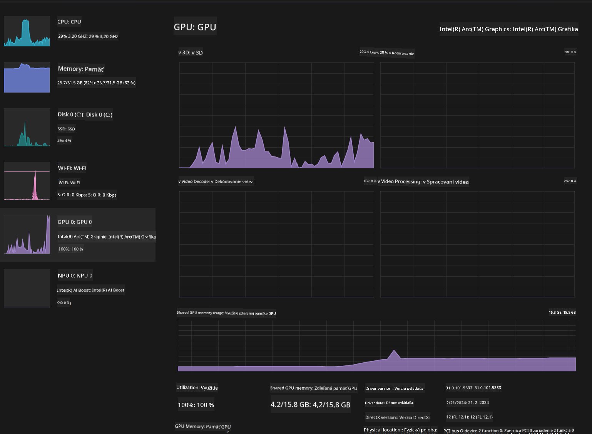

<!--
CO_OP_TRANSLATOR_METADATA:
{
  "original_hash": "e08ce816e23ad813244a09ca34ebb8ac",
  "translation_date": "2025-05-09T10:35:34+00:00",
  "source_file": "md/01.Introduction/03/AIPC_Inference.md",
  "language_code": "sk"
}
-->
# **Inferencia Phi-3 na AI PC**

S rozvojom generatívnej AI a zlepšovaním hardvérových schopností edge zariadení je čoraz viac generatívnych AI modelov možné integrovať do zariadení používateľov v rámci Bring Your Own Device (BYOD). AI PC patria medzi tieto modely. Od roku 2024 spolupracujú Intel, AMD a Qualcomm s výrobcom PC na zavedení AI PC, ktoré umožňujú nasadenie lokalizovaných generatívnych AI modelov prostredníctvom hardvérových úprav. V tejto diskusii sa zameriame na Intel AI PC a ukážeme, ako nasadiť Phi-3 na Intel AI PC.

### Čo je NPU

NPU (Neural Processing Unit) je špecializovaný procesor alebo výpočtová jednotka na väčšom SoC, navrhnutá špeciálne na zrýchlenie operácií neurónových sietí a AI úloh. Na rozdiel od všeobecných CPU a GPU sú NPU optimalizované na dátovo riadené paralelné výpočty, vďaka čomu sú veľmi efektívne pri spracovaní veľkého množstva multimediálnych dát, ako sú videá a obrázky, a pri spracovaní dát pre neurónové siete. Obzvlášť dobre zvládajú AI úlohy, ako je rozpoznávanie reči, rozmazanie pozadia pri videohovoroch či úprava fotografií alebo videí, napríklad detekcia objektov.

## NPU vs GPU

Hoci veľa AI a strojového učenia beží na GPU, existuje zásadný rozdiel medzi GPU a NPU.  
GPU sú známe svojimi paralelnými výpočtovými schopnosťami, no nie všetky GPU sú rovnako efektívne mimo spracovania grafiky. NPU sú naopak špeciálne vytvorené na zložité výpočty potrebné pre neurónové siete, vďaka čomu sú veľmi účinné pre AI úlohy.

Zhrnuté, NPU sú matematickí experti, ktorí zrýchľujú AI výpočty a zohrávajú kľúčovú úlohu v novej ére AI PC!

***Tento príklad je založený na najnovšom procesore Intel Core Ultra***

## **1. Použitie NPU na spustenie modelu Phi-3**

Intel® NPU zariadenie je AI inferenčný akcelerátor integrovaný s Intel klientskymi CPU, začínajúc procesormi Intel® Core™ Ultra (predtým známe ako Meteor Lake). Umožňuje energeticky efektívne vykonávanie úloh umelej neurónovej siete.





**Intel NPU Acceleration Library**

Intel NPU Acceleration Library [https://github.com/intel/intel-npu-acceleration-library](https://github.com/intel/intel-npu-acceleration-library) je Python knižnica navrhnutá na zvýšenie efektivity vašich aplikácií využitím výkonu Intel Neural Processing Unit (NPU) na rýchle výpočty na kompatibilnom hardvéri.

Príklad Phi-3-mini na AI PC s procesormi Intel® Core™ Ultra.


Inštalácia Python knižnice cez pip

```bash

   pip install intel-npu-acceleration-library

```

***Poznámka*** Projekt je stále vo vývoji, ale referenčný model je už veľmi kompletný.

### **Spustenie Phi-3 s Intel NPU Acceleration Library**

Použitím Intel NPU akcelerácie táto knižnica neovplyvňuje tradičný proces kódovania. Stačí použiť túto knižnicu na kvantizáciu pôvodného modelu Phi-3, napríklad FP16, INT8, INT4, ako je uvedené nižšie

```python
from transformers import AutoTokenizer, pipeline,TextStreamer
from intel_npu_acceleration_library import NPUModelForCausalLM, int4
from intel_npu_acceleration_library.compiler import CompilerConfig
import warnings

model_id = "microsoft/Phi-3-mini-4k-instruct"

compiler_conf = CompilerConfig(dtype=int4)
model = NPUModelForCausalLM.from_pretrained(
    model_id, use_cache=True, config=compiler_conf, attn_implementation="sdpa"
).eval()

tokenizer = AutoTokenizer.from_pretrained(model_id)

text_streamer = TextStreamer(tokenizer, skip_prompt=True)
```

Po úspešnej kvantizácii pokračujte v spustení a zavolaní NPU na spustenie modelu Phi-3.

```python
generation_args = {
   "max_new_tokens": 1024,
   "return_full_text": False,
   "temperature": 0.3,
   "do_sample": False,
   "streamer": text_streamer,
}

pipe = pipeline(
   "text-generation",
   model=model,
   tokenizer=tokenizer,
)

query = "<|system|>You are a helpful AI assistant.<|end|><|user|>Can you introduce yourself?<|end|><|assistant|>"

with warnings.catch_warnings():
    warnings.simplefilter("ignore")
    pipe(query, **generation_args)
```

Pri vykonávaní kódu môžeme sledovať stav behu NPU cez Správcu úloh


***Ukážky*** : [AIPC_NPU_DEMO.ipynb](../../../../../code/03.Inference/AIPC/AIPC_NPU_DEMO.ipynb)

## **2. Použitie DirectML + ONNX Runtime na spustenie modelu Phi-3**

### **Čo je DirectML**

[DirectML](https://github.com/microsoft/DirectML) je vysoko výkonná hardvérovo akcelerovaná knižnica DirectX 12 pre strojové učenie. DirectML poskytuje GPU akceleráciu pre bežné úlohy strojového učenia na širokej škále podporovaného hardvéru a ovládačov, vrátane všetkých GPU kompatibilných s DirectX 12 od výrobcov ako AMD, Intel, NVIDIA a Qualcomm.

Keď sa používa samostatne, DirectML API je nízkoúrovňová knižnica DirectX 12 vhodná pre výkonné, nízkolatenčné aplikácie ako frameworky, hry a iné realtime aplikácie. Bezproblémová interoperabilita DirectML s Direct3D 12, nízke režijné náklady a konzistentnosť výsledkov naprieč hardvérom robia z DirectML ideálny nástroj na zrýchlenie strojového učenia, keď je potrebný vysoký výkon a spoľahlivosť naprieč zariadeniami.

***Poznámka*** : Najnovší DirectML už podporuje NPU (https://devblogs.microsoft.com/directx/introducing-neural-processor-unit-npu-support-in-directml-developer-preview/)

### Porovnanie DirectML a CUDA z hľadiska schopností a výkonu:

**DirectML** je knižnica pre strojové učenie vyvinutá Microsoftom. Je navrhnutá na zrýchlenie strojového učenia na Windows zariadeniach, vrátane desktopov, notebookov a edge zariadení.  
- Postavená na DX12: DirectML je postavený na DirectX 12, ktorý podporuje širokú škálu hardvéru vrátane NVIDIA a AMD GPU.  
- Širšia podpora: Vďaka DX12 funguje DirectML s akýmkoľvek GPU, ktorý DX12 podporuje, vrátane integrovaných GPU.  
- Spracovanie obrázkov: DirectML spracováva obrázky a iné dáta pomocou neurónových sietí, vhodné pre úlohy ako rozpoznávanie obrazu, detekcia objektov a podobne.  
- Jednoduchá inštalácia: Nastavenie DirectML je jednoduché, nevyžaduje špecifické SDK alebo knižnice od výrobcov GPU.  
- Výkon: V niektorých prípadoch má DirectML dobrý výkon a môže byť rýchlejší než CUDA, najmä pri určitých úlohách.  
- Obmedzenia: Niekedy môže byť DirectML pomalší, najmä pri veľkých dávkach float16 dát.

**CUDA** je paralelná výpočtová platforma a programovací model od NVIDIA. Umožňuje vývojárom využiť výkon NVIDIA GPU na všeobecné výpočty vrátane strojového učenia a vedeckých simulácií.  
- Špecifické pre NVIDIA: CUDA je úzko integrovaný s NVIDIA GPU a je pre ne špeciálne navrhnutý.  
- Vysoká optimalizácia: Poskytuje vynikajúci výkon pri GPU-akcelerovaných úlohách, najmä na NVIDIA GPU.  
- Široké využitie: Mnohé frameworky a knižnice strojového učenia (napr. TensorFlow, PyTorch) podporujú CUDA.  
- Prispôsobenie: Vývojári môžu jemne doladiť nastavenia CUDA pre konkrétne úlohy, čo vedie k optimálnemu výkonu.  
- Obmedzenia: Závislosť na NVIDIA hardvéri môže byť limitujúca, ak potrebujete širšiu kompatibilitu s rôznymi GPU.

### Výber medzi DirectML a CUDA

Výber závisí od vášho konkrétneho použitia, dostupnosti hardvéru a preferencií. Ak hľadáte širšiu kompatibilitu a jednoduchú inštaláciu, DirectML môže byť dobrá voľba. Ak máte NVIDIA GPU a potrebujete vysoký výkon, CUDA je silný kandidát. Oba majú svoje výhody a nevýhody, preto zvážte svoje požiadavky a dostupný hardvér.

### **Generatívna AI s ONNX Runtime**

V ére AI je prenositeľnosť AI modelov veľmi dôležitá. ONNX Runtime umožňuje jednoduché nasadenie trénovaných modelov na rôzne zariadenia. Vývojári nemusia riešiť konkrétny inferenčný framework, používajú jednotné API na vykonanie inferencie modelu. V ére generatívnej AI ONNX Runtime tiež vykonáva optimalizáciu kódu (https://onnxruntime.ai/docs/genai/). Vďaka optimalizovanému ONNX Runtime je možné kvantizovaný generatívny AI model spustiť na rôznych zariadeniach. V generatívnej AI s ONNX Runtime môžete vykonávať inferenciu AI modelu cez Python, C#, C / C++. Samozrejme, nasadenie na iPhone môže využiť Generative AI ONNX Runtime API v C++.

[Ukážkový kód](https://github.com/Azure-Samples/Phi-3MiniSamples/tree/main/onnx)

***Kompilácia generatívnej AI s ONNX Runtime knižnicou***

```bash

winget install --id=Kitware.CMake  -e

git clone https://github.com/microsoft/onnxruntime.git

cd .\onnxruntime\

./build.bat --build_shared_lib --skip_tests --parallel --use_dml --config Release

cd ../

git clone https://github.com/microsoft/onnxruntime-genai.git

cd .\onnxruntime-genai\

mkdir ort

cd ort

mkdir include

mkdir lib

copy ..\onnxruntime\include\onnxruntime\core\providers\dml\dml_provider_factory.h ort\include

copy ..\onnxruntime\include\onnxruntime\core\session\onnxruntime_c_api.h ort\include

copy ..\onnxruntime\build\Windows\Release\Release\*.dll ort\lib

copy ..\onnxruntime\build\Windows\Release\Release\onnxruntime.lib ort\lib

python build.py --use_dml


```

**Inštalácia knižnice**

```bash

pip install .\onnxruntime_genai_directml-0.3.0.dev0-cp310-cp310-win_amd64.whl

```

Toto je výsledok behu



***Ukážky*** : [AIPC_DirectML_DEMO.ipynb](../../../../../code/03.Inference/AIPC/AIPC_DirectML_DEMO.ipynb)

## **3. Použitie Intel OpenVINO na spustenie modelu Phi-3**

### **Čo je OpenVINO**

[OpenVINO](https://github.com/openvinotoolkit/openvino) je open-source nástrojový balík na optimalizáciu a nasadenie hlbokých neurónových modelov. Poskytuje zrýchlenie hlbokého učenia pre vizuálne, audio a jazykové modely z populárnych frameworkov ako TensorFlow, PyTorch a ďalšie. Začnite s OpenVINO. OpenVINO je možné použiť v kombinácii s CPU a GPU na spustenie modelu Phi-3.

***Poznámka***: V súčasnosti OpenVINO nepodporuje NPU.

### **Inštalácia OpenVINO knižnice**

```bash

 pip install git+https://github.com/huggingface/optimum-intel.git

 pip install git+https://github.com/openvinotoolkit/nncf.git

 pip install openvino-nightly

```

### **Spustenie Phi-3 s OpenVINO**

Rovnako ako pri NPU, OpenVINO vykonáva spustenie generatívnych AI modelov cez kvantizované modely. Najprv je potrebné Phi-3 model kvantizovať a dokončiť kvantizáciu cez príkazový riadok pomocou optimum-cli.

**INT4**

```bash

optimum-cli export openvino --model "microsoft/Phi-3-mini-4k-instruct" --task text-generation-with-past --weight-format int4 --group-size 128 --ratio 0.6  --sym  --trust-remote-code ./openvinomodel/phi3/int4

```

**FP16**

```bash

optimum-cli export openvino --model "microsoft/Phi-3-mini-4k-instruct" --task text-generation-with-past --weight-format fp16 --trust-remote-code ./openvinomodel/phi3/fp16

```

Takto vyzerá konvertovaný formát


Načítajte cesty k modelu (model_dir), súvisiace konfigurácie (ov_config = {"PERFORMANCE_HINT": "LATENCY", "NUM_STREAMS": "1", "CACHE_DIR": ""}) a hardvérovo akcelerované zariadenia (GPU.0) cez OVModelForCausalLM

```python

ov_model = OVModelForCausalLM.from_pretrained(
     model_dir,
     device='GPU.0',
     ov_config=ov_config,
     config=AutoConfig.from_pretrained(model_dir, trust_remote_code=True),
     trust_remote_code=True,
)

```

Pri vykonávaní kódu môžeme sledovať stav GPU cez Správcu úloh



***Ukážky*** : [AIPC_OpenVino_Demo.ipynb](../../../../../code/03.Inference/AIPC/AIPC_OpenVino_Demo.ipynb)

### ***Poznámka*** : Všetky tri vyššie uvedené metódy majú svoje výhody, no odporúča sa použiť NPU akceleráciu pre inferenciu na AI PC.

**Vyhlásenie o zodpovednosti**:  
Tento dokument bol preložený pomocou AI prekladateľskej služby [Co-op Translator](https://github.com/Azure/co-op-translator). Hoci sa snažíme o presnosť, prosím, majte na pamäti, že automatizované preklady môžu obsahovať chyby alebo nepresnosti. Pôvodný dokument v jeho rodnom jazyku by mal byť považovaný za autoritatívny zdroj. Pre dôležité informácie sa odporúča profesionálny ľudský preklad. Nie sme zodpovední za akékoľvek nedorozumenia alebo nesprávne interpretácie vyplývajúce z použitia tohto prekladu.