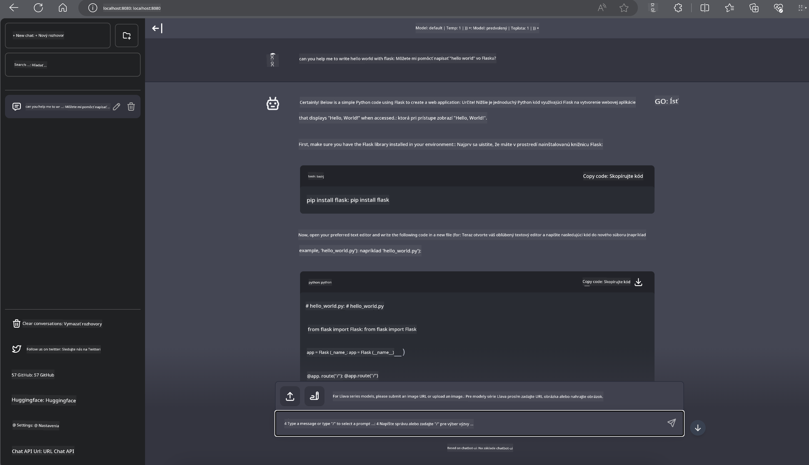

<!--
CO_OP_TRANSLATOR_METADATA:
{
  "original_hash": "be4101a30d98e95a71d42c276e8bcd37",
  "translation_date": "2025-05-09T11:45:13+00:00",
  "source_file": "md/01.Introduction/03/Jetson_Inference.md",
  "language_code": "sk"
}
-->
# **Inference Phi-3 na Nvidia Jetson**

Nvidia Jetson je séria zabudovaných výpočtových dosiek od Nvidia. Modely Jetson TK1, TX1 a TX2 všetky obsahujú Tegra procesor (alebo SoC) od Nvidia, ktorý integruje CPU s ARM architektúrou. Jetson je nízkoenergetický systém navrhnutý na zrýchlenie aplikácií strojového učenia. Nvidia Jetson používajú profesionálni vývojári na vytváranie prelomových AI produktov v rôznych odvetviach, ako aj študenti a nadšenci na praktické učenie AI a tvorbu úžasných projektov. SLM je nasadený v edge zariadeniach ako Jetson, čo umožňuje lepšiu implementáciu priemyselných scenárov generatívnej AI.

## Nasadenie na NVIDIA Jetson:
Vývojári pracujúci na autonómnych robotických a zabudovaných zariadeniach môžu využiť Phi-3 Mini. Relatívne malá veľkosť Phi-3 ho robí ideálnym pre edge nasadenie. Parametre boli dôkladne doladené počas tréningu, čo zaručuje vysokú presnosť odpovedí.

### TensorRT-LLM optimalizácia:
NVIDIA [TensorRT-LLM knižnica](https://github.com/NVIDIA/TensorRT-LLM?WT.mc_id=aiml-138114-kinfeylo) optimalizuje inferenciu veľkých jazykových modelov. Podporuje dlhé kontextové okno Phi-3 Mini, čím zlepšuje priepustnosť aj latenciu. Optimalizácie zahŕňajú techniky ako LongRoPE, FP8 a inflight batching.

### Dostupnosť a nasadenie:
Vývojári môžu preskúmať Phi-3 Mini s 128K kontextovým oknom na [NVIDIA AI](https://www.nvidia.com/en-us/ai-data-science/generative-ai/). Je zabalený ako NVIDIA NIM, mikroservis so štandardným API, ktorý je možné nasadiť kdekoľvek. Okrem toho sú k dispozícii [TensorRT-LLM implementácie na GitHube](https://github.com/NVIDIA/TensorRT-LLM).

## **1. Príprava**

a. Jetson Orin NX / Jetson NX

b. JetPack 5.1.2+

c. Cuda 11.8

d. Python 3.8+

## **2. Spustenie Phi-3 na Jetson**

Môžeme si vybrať [Ollama](https://ollama.com) alebo [LlamaEdge](https://llamaedge.com)

Ak chcete používať gguf súčasne v cloude aj na edge zariadeniach, LlamaEdge možno chápať ako WasmEdge (WasmEdge je ľahký, vysoko výkonný a škálovateľný WebAssembly runtime vhodný pre cloud native, edge a decentralizované aplikácie. Podporuje serverless aplikácie, zabudované funkcie, mikroservisy, smart kontrakty a IoT zariadenia). Pomocou LlamaEdge môžete nasadiť kvantifikovaný model gguf na edge zariadenia aj do cloudu.


Tu sú kroky na použitie

1. Nainštalujte a stiahnite potrebné knižnice a súbory

```bash

curl -sSf https://raw.githubusercontent.com/WasmEdge/WasmEdge/master/utils/install.sh | bash -s -- --plugin wasi_nn-ggml

curl -LO https://github.com/LlamaEdge/LlamaEdge/releases/latest/download/llama-api-server.wasm

curl -LO https://github.com/LlamaEdge/chatbot-ui/releases/latest/download/chatbot-ui.tar.gz

tar xzf chatbot-ui.tar.gz

```

**Poznámka**: llama-api-server.wasm a chatbot-ui musia byť v rovnakom adresári

2. Spustite skripty v termináli

```bash

wasmedge --dir .:. --nn-preload default:GGML:AUTO:{Your gguf path} llama-api-server.wasm -p phi-3-chat

```

Tu je výsledok spustenia



***Ukážkový kód*** [Phi-3 mini WASM Notebook Sample](https://github.com/Azure-Samples/Phi-3MiniSamples/tree/main/wasm)

Na záver, Phi-3 Mini predstavuje významný posun v modelovaní jazyka, kombinujúc efektivitu, kontextové povedomie a optimalizácie od NVIDIA. Či už budujete roboty alebo edge aplikácie, Phi-3 Mini je silný nástroj, ktorý stojí za pozornosť.

**Vyhlásenie o zodpovednosti**:  
Tento dokument bol preložený pomocou AI prekladateľskej služby [Co-op Translator](https://github.com/Azure/co-op-translator). Aj keď sa snažíme o presnosť, prosím, majte na pamäti, že automatické preklady môžu obsahovať chyby alebo nepresnosti. Pôvodný dokument v jeho rodnom jazyku by mal byť považovaný za autoritatívny zdroj. Pre kritické informácie sa odporúča profesionálny ľudský preklad. Nie sme zodpovední za akékoľvek nedorozumenia alebo nesprávne výklady vyplývajúce z použitia tohto prekladu.