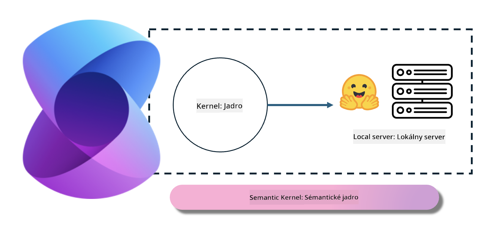
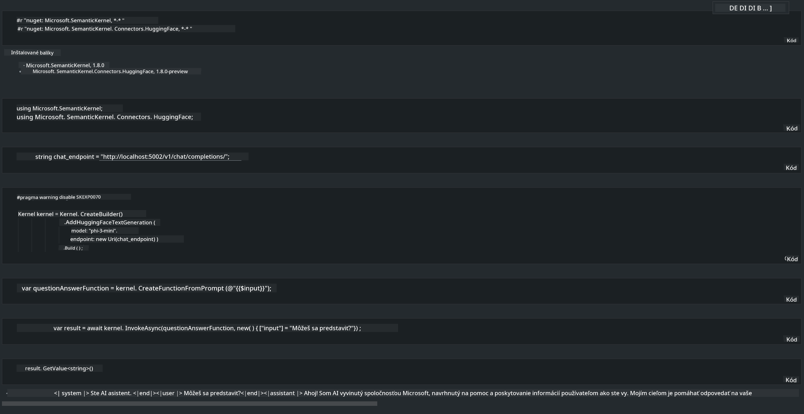

<!--
CO_OP_TRANSLATOR_METADATA:
{
  "original_hash": "bcf5dd7031db0031abdb9dd0c05ba118",
  "translation_date": "2025-05-09T12:08:42+00:00",
  "source_file": "md/01.Introduction/03/Local_Server_Inference.md",
  "language_code": "sk"
}
-->
# **Inference Phi-3 na lokálnom serveri**

Phi-3 môžeme nasadiť na lokálnom serveri. Používatelia si môžu vybrať riešenia ako [Ollama](https://ollama.com) alebo [LM Studio](https://llamaedge.com), alebo môžu napísať vlastný kód. Phi-3 lokálne služby môžete prepojiť cez [Semantic Kernel](https://github.com/microsoft/semantic-kernel?WT.mc_id=aiml-138114-kinfeylo) alebo [Langchain](https://www.langchain.com/) na vytváranie aplikácií Copilot.

## **Použitie Semantic Kernel na prístup k Phi-3-mini**

V aplikácii Copilot vytvárame aplikácie cez Semantic Kernel / LangChain. Tento typ aplikačného rámca je zvyčajne kompatibilný so službou Azure OpenAI / OpenAI modelmi, a zároveň podporuje open source modely na Hugging Face aj lokálne modely. Čo robiť, ak chceme použiť Semantic Kernel na prístup k Phi-3-mini? Na príklade .NET ho môžeme skombinovať s Hugging Face Connectorom v Semantic Kernel. Štandardne zodpovedá modelovému ID na Hugging Face (pri prvom použití sa model stiahne z Hugging Face, čo trvá dlhšie). Môžete sa tiež pripojiť k vytvorenej lokálnej službe. Medzi týmito dvoma možnosťami odporúčame použiť tú druhú, pretože poskytuje vyššiu mieru autonómie, najmä v podnikových aplikáciách.

Zo schémy je zrejmé, že prístup k lokálnym službám cez Semantic Kernel umožňuje jednoduché prepojenie s vlastným Phi-3-mini modelovým serverom. Tu je výsledok behu

***Sample Code*** https://github.com/kinfey/Phi3MiniSamples/tree/main/semantickernel

**Vyhlásenie o zodpovednosti**:  
Tento dokument bol preložený pomocou AI prekladateľskej služby [Co-op Translator](https://github.com/Azure/co-op-translator). Aj keď sa snažíme o presnosť, berte prosím na vedomie, že automatické preklady môžu obsahovať chyby alebo nepresnosti. Originálny dokument v jeho pôvodnom jazyku by mal byť považovaný za autoritatívny zdroj. Pre kritické informácie sa odporúča profesionálny ľudský preklad. Nie sme zodpovední za akékoľvek nedorozumenia alebo nesprávne interpretácie vyplývajúce z použitia tohto prekladu.