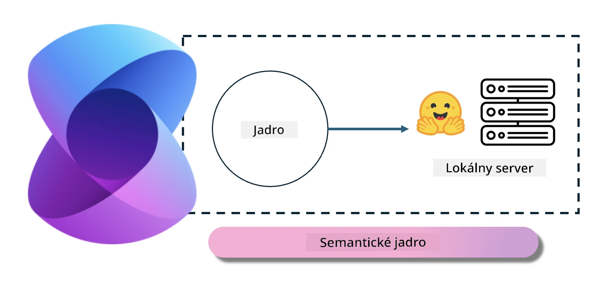
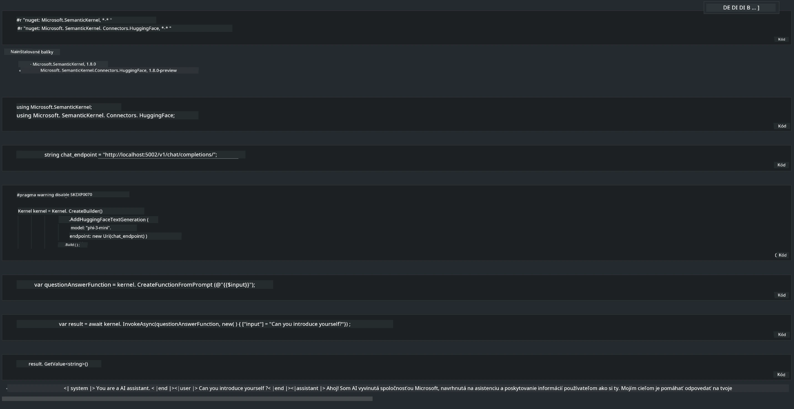

# **Inference Phi-3 na lokálnom serveri**

Môžeme nasadiť Phi-3 na lokálnom serveri. Používatelia si môžu vybrať riešenia [Ollama](https://ollama.com) alebo [LM Studio](https://llamaedge.com), alebo môžu napísať vlastný kód. Phi-3 lokálne služby je možné prepojiť cez [Semantic Kernel](https://github.com/microsoft/semantic-kernel?WT.mc_id=aiml-138114-kinfeylo) alebo [Langchain](https://www.langchain.com/) na vytváranie aplikácií Copilot.

## **Použitie Semantic Kernel na prístup k Phi-3-mini**

V aplikácii Copilot vytvárame aplikácie cez Semantic Kernel / LangChain. Tento typ aplikačného rámca je všeobecne kompatibilný so službou Azure OpenAI / OpenAI modelmi a zároveň podporuje open source modely na Hugging Face aj lokálne modely. Čo robiť, ak chceme použiť Semantic Kernel na prístup k Phi-3-mini? Ako príklad použijeme .NET, ktorý môžeme skombinovať s Hugging Face Connectorom v Semantic Kernel. Štandardne zodpovedá modelovému ID na Hugging Face (pri prvom použití sa model stiahne z Hugging Face, čo trvá dlhšie). Môžete sa tiež pripojiť k vlastnoručne vytvorenej lokálnej službe. V porovnaní s oboma možnosťami odporúčame použiť tú druhú, pretože poskytuje vyššiu mieru autonómie, najmä v podnikových aplikáciách.

Z obrázka je vidieť, že prístup k lokálnym službám cez Semantic Kernel umožňuje jednoduché pripojenie k vlastnému serveru modelu Phi-3-mini. Tu je výsledok behu:

***Ukážkový kód*** https://github.com/kinfey/Phi3MiniSamples/tree/main/semantickernel

**Vyhlásenie o zodpovednosti**:  
Tento dokument bol preložený pomocou AI prekladateľskej služby [Co-op Translator](https://github.com/Azure/co-op-translator). Aj keď sa snažíme o presnosť, prosím, majte na pamäti, že automatizované preklady môžu obsahovať chyby alebo nepresnosti. Originálny dokument v jeho pôvodnom jazyku by mal byť považovaný za autoritatívny zdroj. Pre kritické informácie sa odporúča profesionálny ľudský preklad. Nie sme zodpovední za akékoľvek nedorozumenia alebo nesprávne interpretácie vyplývajúce z použitia tohto prekladu.