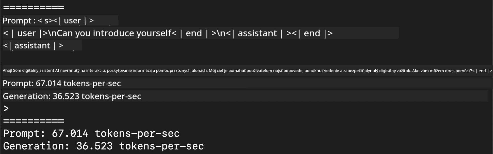
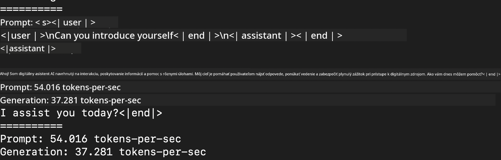
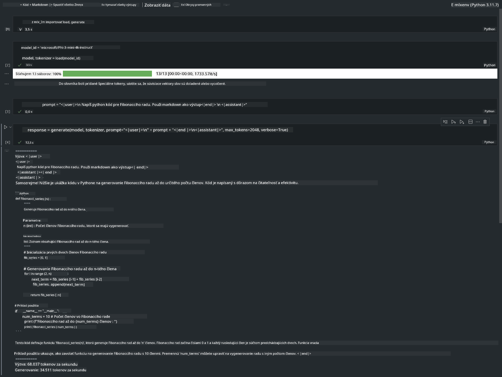

<!--
CO_OP_TRANSLATOR_METADATA:
{
  "original_hash": "dcb656f3d206fc4968e236deec5d4384",
  "translation_date": "2025-05-09T12:19:07+00:00",
  "source_file": "md/01.Introduction/03/MLX_Inference.md",
  "language_code": "sk"
}
-->
# **Inference Phi-3 s Apple MLX Frameworkom**

## **Čo je MLX Framework**

MLX je framework pre prácu s poľami určený na výskum strojového učenia na Apple silicóne, vyvinutý Apple tímom pre strojové učenie.

MLX je navrhnutý výskumníkmi strojového učenia pre výskumníkov strojového učenia. Framework je užívateľsky prívetivý, no zároveň efektívny na trénovanie a nasadenie modelov. Jeho dizajn je konceptuálne jednoduchý. Cieľom je umožniť výskumníkom ľahko rozširovať a vylepšovať MLX, aby mohli rýchlo skúmať nové nápady.

LLM môžu byť zrýchlené na zariadeniach Apple Silicon pomocou MLX a modely je možné pohodlne spúšťať lokálne.

## **Použitie MLX na inference Phi-3-mini**

### **1. Nastavenie MLX prostredia**

1. Python 3.11.x  
2. Inštalácia MLX knižnice


```bash

pip install mlx-lm

```

### **2. Spustenie Phi-3-mini v termináli s MLX**


```bash

python -m mlx_lm.generate --model microsoft/Phi-3-mini-4k-instruct --max-token 2048 --prompt  "<|user|>\nCan you introduce yourself<|end|>\n<|assistant|>"

```

Výsledok (moje prostredie je Apple M1 Max, 64GB) je



### **3. Kvantizácia Phi-3-mini pomocou MLX v termináli**


```bash

python -m mlx_lm.convert --hf-path microsoft/Phi-3-mini-4k-instruct

```

***Note：*** Model je možné kvantizovať cez mlx_lm.convert, predvolená kvantizácia je INT4. Tento príklad kvantizuje Phi-3-mini do INT4.

Model je možné kvantizovať cez mlx_lm.convert, predvolená kvantizácia je INT4. V tomto príklade sa Phi-3-mini kvantizuje do INT4. Po kvantizácii bude uložený v predvolenom adresári ./mlx_model

Model kvantizovaný pomocou MLX môžeme otestovať z terminálu


```bash

python -m mlx_lm.generate --model ./mlx_model/ --max-token 2048 --prompt  "<|user|>\nCan you introduce yourself<|end|>\n<|assistant|>"

```

Výsledok je




### **4. Spustenie Phi-3-mini s MLX v Jupyter Notebooku**




***Note:*** Prečítajte si tento príklad [kliknite na tento odkaz](../../../../../code/03.Inference/MLX/MLX_DEMO.ipynb)


## **Zdroje**

1. Viac o Apple MLX Frameworku [https://ml-explore.github.io](https://ml-explore.github.io/mlx/build/html/index.html)

2. Apple MLX GitHub Repo [https://github.com/ml-explore](https://github.com/ml-explore)

**Zrieknutie sa zodpovednosti**:  
Tento dokument bol preložený pomocou AI prekladateľskej služby [Co-op Translator](https://github.com/Azure/co-op-translator). Hoci sa snažíme o presnosť, prosím, majte na pamäti, že automatizované preklady môžu obsahovať chyby alebo nepresnosti. Pôvodný dokument v jeho rodnom jazyku by mal byť považovaný za autoritatívny zdroj. Pre kritické informácie sa odporúča profesionálny ľudský preklad. Nie sme zodpovední za akékoľvek nedorozumenia alebo nesprávne výklady vyplývajúce z použitia tohto prekladu.