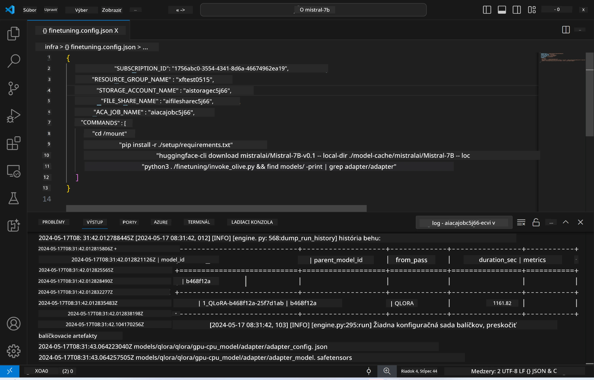
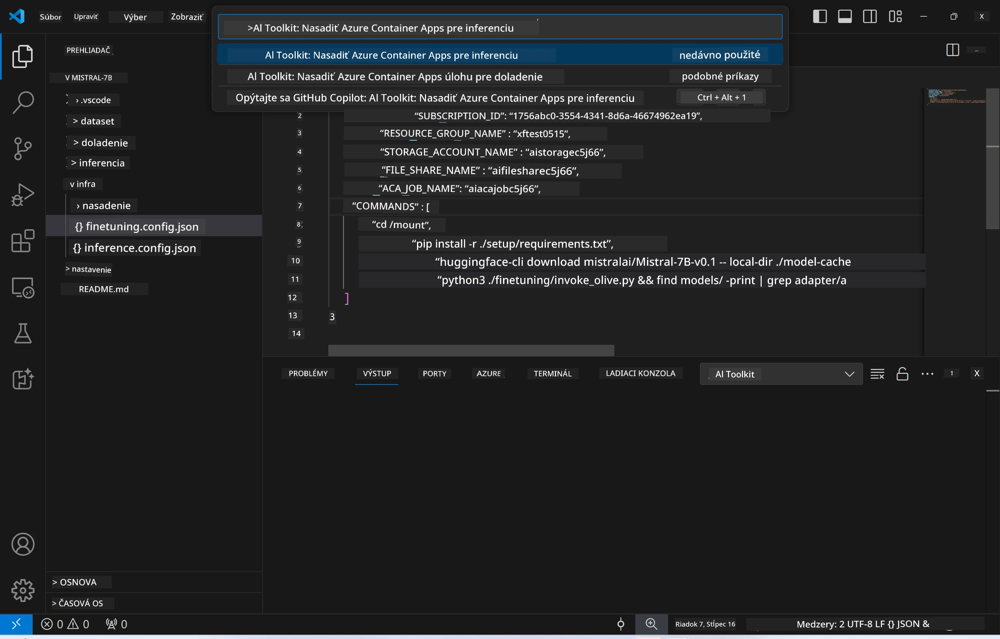
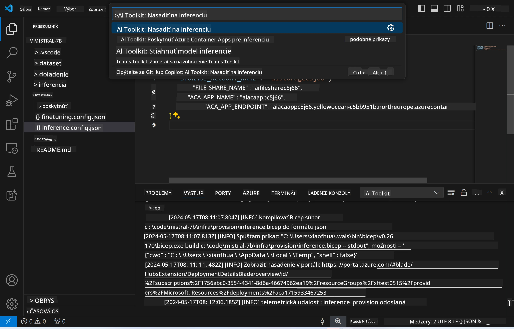
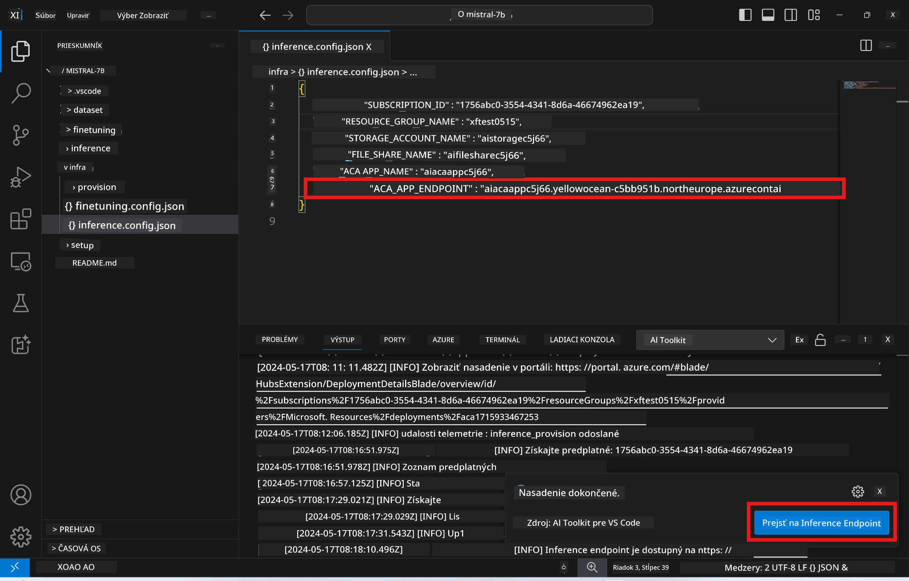

# Vzdialené inferovanie s doladeným modelom

Po natrénovaní adaptér v diaľkovom prostredí použite jednoduchú aplikáciu Gradio na interakciu s modelom.



### Zabezpečenie Azure zdrojov
Pre vzdialené inferovanie je potrebné nastaviť Azure zdroje spustením príkazu `AI Toolkit: Provision Azure Container Apps for inference` z príkazovej palety. Počas tohto nastavenia budete vyzvaní na výber Azure predplatného a skupiny zdrojov.  

   
Predvolene by predplatné a skupina zdrojov pre inferovanie mali zodpovedať tým, ktoré sa použili pri doladení modelu. Inferovanie bude využívať rovnaké prostredie Azure Container App a pristupovať k modelu a adaptérovi modelu uloženým v Azure Files, ktoré boli vytvorené počas kroku doladenia.

## Použitie AI Toolkit

### Nasadenie pre inferovanie  
Ak chcete upraviť inferenčný kód alebo znovu načítať inferenčný model, spustite príkaz `AI Toolkit: Deploy for inference`. Tým sa synchronizuje váš najnovší kód s ACA a reštartuje sa replika.



Po úspešnom nasadení je model pripravený na vyhodnotenie cez tento endpoint.

### Prístup k inferenčnému API

K inferenčnému API sa dostanete kliknutím na tlačidlo „*Go to Inference Endpoint*“ v notifikácii VSCode. Alternatívne nájdete webový API endpoint v `ACA_APP_ENDPOINT` v súbore `./infra/inference.config.json` a v paneli výstupu.



> **Note:** Endpoint pre inferovanie môže chvíľu trvať, kým bude plne funkčný.

## Komponenty inferovania zahrnuté v šablóne

| Zložka | Obsah |
| ------ |--------- |
| `infra` | Obsahuje všetky potrebné konfigurácie pre vzdialenú prevádzku. |
| `infra/provision/inference.parameters.json` | Obsahuje parametre pre bicep šablóny, používané na zabezpečenie Azure zdrojov pre inferovanie. |
| `infra/provision/inference.bicep` | Obsahuje šablóny na zabezpečenie Azure zdrojov pre inferovanie. |
| `infra/inference.config.json` | Konfiguračný súbor, vytvorený príkazom `AI Toolkit: Provision Azure Container Apps for inference`. Slúži ako vstup pre ďalšie vzdialené príkazy. |

### Použitie AI Toolkit na konfiguráciu zabezpečenia Azure zdrojov
Nakonfigurujte [AI Toolkit](https://marketplace.visualstudio.com/items?itemName=ms-windows-ai-studio.windows-ai-studio)

Príkaz `Provision Azure Container Apps for inference`.

Konfiguračné parametre nájdete v súbore `./infra/provision/inference.parameters.json`. Tu sú podrobnosti:
| Parameter | Popis |
| --------- |------------ |
| `defaultCommands` | Príkazy na spustenie webového API. |
| `maximumInstanceCount` | Nastavuje maximálny počet GPU inštancií. |
| `location` | Miesto, kde sa Azure zdroje zabezpečujú. Predvolená hodnota je rovnaká ako lokalita vybranej skupiny zdrojov. |
| `storageAccountName`, `fileShareName`, `acaEnvironmentName`, `acaEnvironmentStorageName`, `acaAppName`, `acaLogAnalyticsName` | Tieto parametre slúžia na pomenovanie Azure zdrojov pre zabezpečenie. Predvolene sú rovnaké ako názov zdrojov použitých pri doladení. Môžete zadať nový, nepoužitý názov zdroja pre vlastné pomenovanie, alebo použiť názov už existujúceho Azure zdroja. Pre viac informácií pozrite sekciu [Using existing Azure Resources](../../../../../md/01.Introduction/03). |

### Použitie existujúcich Azure zdrojov

Predvolene sa pri zabezpečení inferovania používajú rovnaké Azure Container App Environment, Storage Account, Azure File Share a Azure Log Analytics, ktoré sa použili pri doladení modelu. Samotná Azure Container App je vytvorená samostatne len pre inferenčné API.

Ak ste počas doladenia upravili Azure zdroje alebo chcete použiť vlastné existujúce Azure zdroje pre inferovanie, zadajte ich názvy do súboru `./infra/inference.parameters.json`. Potom spustite príkaz `AI Toolkit: Provision Azure Container Apps for inference` z príkazovej palety. Tým sa aktualizujú zadané zdroje a vytvoria chýbajúce.

Napríklad, ak máte existujúce Azure container prostredie, váš súbor `./infra/finetuning.parameters.json` by mal vyzerať takto:

```json
{
    "$schema": "https://schema.management.azure.com/schemas/2019-04-01/deploymentParameters.json#",
    "contentVersion": "1.0.0.0",
    "parameters": {
      ...
      "acaEnvironmentName": {
        "value": "<your-aca-env-name>"
      },
      "acaEnvironmentStorageName": {
        "value": null
      },
      ...
    }
  }
```

### Manuálne zabezpečenie  
Ak preferujete manuálne nastavenie Azure zdrojov, môžete použiť poskytnuté bicep súbory v priečinkoch `./infra/provision`. Ak ste už Azure zdroje nastavili a nakonfigurovali bez použitia príkazovej palety AI Toolkit, stačí zadať názvy zdrojov do súboru `inference.config.json`.

Napríklad:

```json
{
  "SUBSCRIPTION_ID": "<your-subscription-id>",
  "RESOURCE_GROUP_NAME": "<your-resource-group-name>",
  "STORAGE_ACCOUNT_NAME": "<your-storage-account-name>",
  "FILE_SHARE_NAME": "<your-file-share-name>",
  "ACA_APP_NAME": "<your-aca-name>",
  "ACA_APP_ENDPOINT": "<your-aca-endpoint>"
}
```

**Vyhlásenie o zodpovednosti**:  
Tento dokument bol preložený pomocou AI prekladateľskej služby [Co-op Translator](https://github.com/Azure/co-op-translator). Aj keď sa snažíme o presnosť, prosím, majte na pamäti, že automatizované preklady môžu obsahovať chyby alebo nepresnosti. Originálny dokument v jeho pôvodnom jazyku by mal byť považovaný za autoritatívny zdroj. Pre kritické informácie sa odporúča profesionálny ľudský preklad. Nie sme zodpovední za akékoľvek nedorozumenia alebo nesprávne interpretácie vyplývajúce z použitia tohto prekladu.