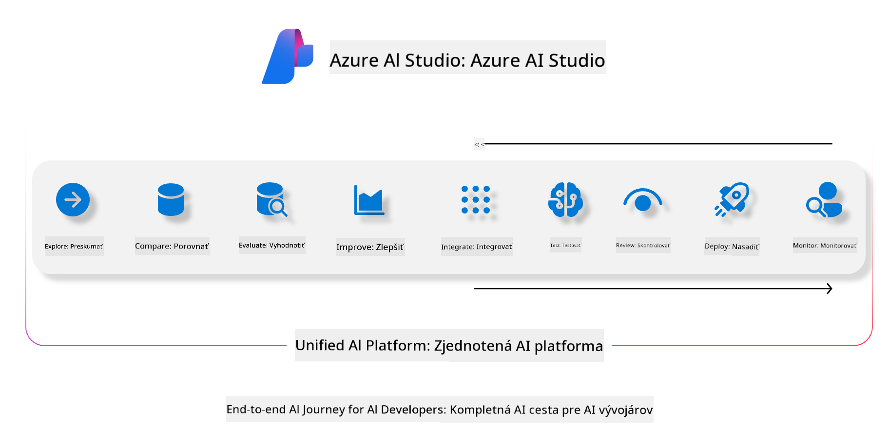

<!--
CO_OP_TRANSLATOR_METADATA:
{
  "original_hash": "7b4235159486df4000e16b7b46ddfec3",
  "translation_date": "2025-05-09T15:03:27+00:00",
  "source_file": "md/01.Introduction/05/AIFoundry.md",
  "language_code": "sk"
}
-->
# **Použitie Azure AI Foundry na hodnotenie**

Ako vyhodnotiť svoju generatívnu AI aplikáciu pomocou [Azure AI Foundry](https://ai.azure.com?WT.mc_id=aiml-138114-kinfeylo). Či už hodnotíte jednorázové alebo viackolové konverzácie, Azure AI Foundry poskytuje nástroje na vyhodnotenie výkonu modelu a jeho bezpečnosti.

## Ako hodnotiť generatívne AI aplikácie s Azure AI Foundry
Pre podrobnejšie pokyny pozrite si [Azure AI Foundry Dokumentáciu](https://learn.microsoft.com/azure/ai-studio/how-to/evaluate-generative-ai-app?WT.mc_id=aiml-138114-kinfeylo)

Tu sú kroky, ako začať:

## Hodnotenie generatívnych AI modelov v Azure AI Foundry

**Predpoklady**

- Testovacia dátová sada vo formáte CSV alebo JSON.
- Nasadený generatívny AI model (napríklad Phi-3, GPT 3.5, GPT 4 alebo modely Davinci).
- Runtime s výpočtovou inštanciou na spustenie hodnotenia.

## Vstavané hodnotiace metriky

Azure AI Foundry umožňuje hodnotiť jednorázové aj zložité viackolové konverzácie.  
Pre scenáre Retrieval Augmented Generation (RAG), kde je model založený na konkrétnych dátach, môžete vyhodnotiť výkon pomocou vstavaných hodnotiacich metrík.  
Okrem toho môžete hodnotiť aj bežné jednorázové otázky a odpovede (non-RAG).

## Vytvorenie hodnotiaceho behu

V používateľskom rozhraní Azure AI Foundry prejdite na stránku Evaluate alebo Prompt Flow.  
Postupujte podľa sprievodcu vytvorením hodnotenia. Môžete zadať voliteľný názov hodnotenia.  
Vyberte scenár, ktorý najlepšie zodpovedá cieľom vašej aplikácie.  
Zvoľte jednu alebo viac hodnotiacich metrík na vyhodnotenie výstupu modelu.

## Vlastný hodnotiaci tok (voliteľné)

Pre väčšiu flexibilitu môžete vytvoriť vlastný hodnotiaci tok. Prispôsobte hodnotiaci proces podľa svojich konkrétnych požiadaviek.

## Zobrazenie výsledkov

Po spustení hodnotenia si v Azure AI Foundry prezrite, analyzujte a zaznamenajte podrobné hodnotiace metriky. Získajte prehľad o schopnostiach a obmedzeniach vašej aplikácie.

**Note** Azure AI Foundry je momentálne vo verejnej ukážke, preto ho používajte na experimentovanie a vývoj. Pre produkčné nasadenie zvážte iné možnosti. Viac informácií a podrobných návodov nájdete v oficiálnej [AI Foundry dokumentácii](https://learn.microsoft.com/azure/ai-studio/?WT.mc_id=aiml-138114-kinfeylo).

**Zrieknutie sa zodpovednosti**:  
Tento dokument bol preložený pomocou AI prekladateľskej služby [Co-op Translator](https://github.com/Azure/co-op-translator). Aj keď sa snažíme o presnosť, berte prosím na vedomie, že automatické preklady môžu obsahovať chyby alebo nepresnosti. Originálny dokument v jeho pôvodnom jazyku by mal byť považovaný za autoritatívny zdroj. Pre kritické informácie sa odporúča profesionálny ľudský preklad. Nie sme zodpovední za akékoľvek nedorozumenia alebo nesprávne interpretácie vyplývajúce z použitia tohto prekladu.