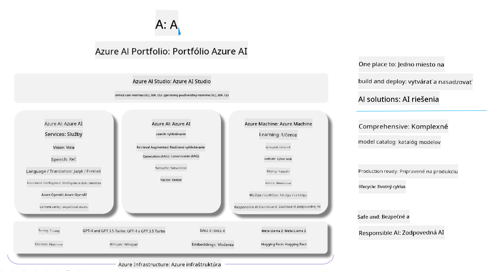

<!--
CO_OP_TRANSLATOR_METADATA:
{
  "original_hash": "7b4235159486df4000e16b7b46ddfec3",
  "translation_date": "2025-07-16T22:33:35+00:00",
  "source_file": "md/01.Introduction/05/AIFoundry.md",
  "language_code": "sk"
}
-->
# **Použitie Azure AI Foundry na hodnotenie**

Ako vyhodnotiť vašu generatívnu AI aplikáciu pomocou [Azure AI Foundry](https://ai.azure.com?WT.mc_id=aiml-138114-kinfeylo). Či už hodnotíte jednorazové alebo viackolové konverzácie, Azure AI Foundry poskytuje nástroje na posúdenie výkonu a bezpečnosti modelu.

## Ako hodnotiť generatívne AI aplikácie s Azure AI Foundry
Pre podrobnejšie pokyny si pozrite [Azure AI Foundry Dokumentáciu](https://learn.microsoft.com/azure/ai-studio/how-to/evaluate-generative-ai-app?WT.mc_id=aiml-138114-kinfeylo)

Tu sú kroky, ako začať:

## Hodnotenie generatívnych AI modelov v Azure AI Foundry

**Predpoklady**

- Testovacia dátová sada vo formáte CSV alebo JSON.
- Nasadený generatívny AI model (napríklad Phi-3, GPT 3.5, GPT 4 alebo modely Davinci).
- Runtime s výpočtovou inštanciou na spustenie hodnotenia.

## Vstavané metriky hodnotenia

Azure AI Foundry umožňuje hodnotiť jednorazové aj zložité viackolové konverzácie.  
Pre scenáre Retrieval Augmented Generation (RAG), kde je model založený na konkrétnych dátach, môžete využiť vstavané metriky na posúdenie výkonu.  
Okrem toho môžete hodnotiť aj bežné jednorazové otázky a odpovede (non-RAG).

## Vytvorenie hodnotiaceho behu

V používateľskom rozhraní Azure AI Foundry prejdite na stránku Evaluate alebo Prompt Flow.  
Postupujte podľa sprievodcu vytvorením hodnotenia. Môžete zadať voliteľný názov hodnotenia.  
Vyberte scenár, ktorý najviac zodpovedá cieľom vašej aplikácie.  
Zvoľte jednu alebo viac metrík na vyhodnotenie výstupu modelu.

## Vlastný hodnotiaci tok (voliteľné)

Pre väčšiu flexibilitu môžete vytvoriť vlastný hodnotiaci tok a prispôsobiť proces hodnotenia podľa vašich špecifických požiadaviek.

## Zobrazenie výsledkov

Po spustení hodnotenia si v Azure AI Foundry môžete prezrieť, zaznamenať a analyzovať podrobné metriky hodnotenia. Získate tak prehľad o schopnostiach a obmedzeniach vašej aplikácie.

**Note** Azure AI Foundry je momentálne v verejnej ukážke, preto ho používajte na experimentovanie a vývoj. Pre produkčné nasadenia zvážte iné možnosti. Pre viac informácií a podrobné návody navštívte oficiálnu [AI Foundry dokumentáciu](https://learn.microsoft.com/azure/ai-studio/?WT.mc_id=aiml-138114-kinfeylo).

**Vyhlásenie o zodpovednosti**:  
Tento dokument bol preložený pomocou AI prekladateľskej služby [Co-op Translator](https://github.com/Azure/co-op-translator). Aj keď sa snažíme o presnosť, prosím, majte na pamäti, že automatizované preklady môžu obsahovať chyby alebo nepresnosti. Originálny dokument v jeho pôvodnom jazyku by mal byť považovaný za autoritatívny zdroj. Pre kritické informácie sa odporúča profesionálny ľudský preklad. Nie sme zodpovední za akékoľvek nedorozumenia alebo nesprávne interpretácie vyplývajúce z použitia tohto prekladu.