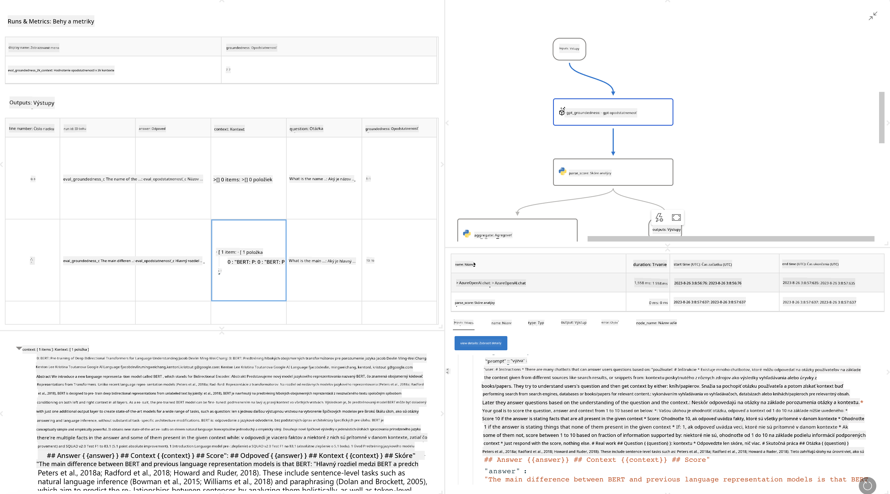

<!--
CO_OP_TRANSLATOR_METADATA:
{
  "original_hash": "3cbe7629d254f1043193b7fe22524d55",
  "translation_date": "2025-07-16T22:44:21+00:00",
  "source_file": "md/01.Introduction/05/Promptflow.md",
  "language_code": "sk"
}
-->
# **Predstavenie Promptflow**

[Microsoft Prompt Flow](https://microsoft.github.io/promptflow/index.html?WT.mc_id=aiml-138114-kinfeylo) je vizuálny nástroj na automatizáciu pracovných tokov, ktorý umožňuje používateľom vytvárať automatizované procesy pomocou predpripravených šablón a vlastných konektorov. Je navrhnutý tak, aby vývojárom a obchodným analytikom umožnil rýchlo vytvárať automatizované procesy pre úlohy ako správa dát, spolupráca a optimalizácia procesov. S Prompt Flow môžu používatelia jednoducho prepojiť rôzne služby, aplikácie a systémy a automatizovať zložité obchodné procesy.

Microsoft Prompt Flow je navrhnutý na zjednodušenie celého vývojového cyklu AI aplikácií poháňaných veľkými jazykovými modelmi (LLMs). Či už ide o nápady, prototypovanie, testovanie, hodnotenie alebo nasadzovanie aplikácií založených na LLM, Prompt Flow zjednodušuje proces a umožňuje vytvárať LLM aplikácie s kvalitou vhodnou na produkciu.

## Kľúčové vlastnosti a výhody používania Microsoft Prompt Flow:

**Interaktívne prostredie pre tvorbu**

Prompt Flow poskytuje vizuálne znázornenie štruktúry vášho toku, čo uľahčuje pochopenie a orientáciu v projektoch.  
Ponúka prostredie podobné poznámkovému bloku pre efektívny vývoj a ladenie toku.

**Varianty promptov a ladenie**

Vytvárajte a porovnávajte viacero variantov promptov, aby ste mohli iteratívne vylepšovať výsledky. Hodnoťte výkon rôznych promptov a vyberte tie najefektívnejšie.

**Vstavané hodnotiace toky**  
Posudzujte kvalitu a efektivitu vašich promptov a tokov pomocou vstavaných hodnotiacich nástrojov.  
Získajte prehľad o tom, ako dobre vaše aplikácie založené na LLM fungujú.

**Komplexné zdroje**

Prompt Flow obsahuje knižnicu vstavaných nástrojov, príkladov a šablón. Tieto zdroje slúžia ako východiskový bod pre vývoj, inšpirujú kreativitu a urýchľujú proces.

**Spolupráca a pripravenosť pre podniky**

Podporuje tímovú spoluprácu tým, že umožňuje viacerým používateľom pracovať spoločne na projektoch prompt engineeringu.  
Udržiava kontrolu verzií a efektívne zdieľanie znalostí. Zjednodušuje celý proces prompt engineeringu od vývoja a hodnotenia až po nasadenie a monitorovanie.

## Hodnotenie v Prompt Flow

V Microsoft Prompt Flow zohráva hodnotenie kľúčovú úlohu pri posudzovaní výkonu vašich AI modelov. Pozrime sa, ako môžete prispôsobiť hodnotiace toky a metriky v Prompt Flow:

**Pochopenie hodnotenia v Prompt Flow**

V Prompt Flow predstavuje tok sekvenciu uzlov, ktoré spracovávajú vstup a generujú výstup. Hodnotiace toky sú špeciálne typy tokov navrhnuté na posúdenie výkonu behu na základe konkrétnych kritérií a cieľov.

**Kľúčové vlastnosti hodnotiacich tokov**

Zvyčajne sa spúšťajú po teste daného toku a používajú jeho výstupy. Vypočítavajú skóre alebo metriky na meranie výkonu testovaného toku. Metriky môžu zahŕňať presnosť, skóre relevantnosti alebo iné relevantné ukazovatele.

### Prispôsobenie hodnotiacich tokov

**Definovanie vstupov**

Hodnotiace toky potrebujú prijímať výstupy testovaného behu. Definujte vstupy podobne ako pri štandardných tokoch.  
Napríklad, ak hodnotíte QnA tok, nazvite vstup „answer“. Pri hodnotení klasifikačného toku použite vstup „category“. Môžu byť potrebné aj vstupy s referenčnými hodnotami (napr. skutočné štítky).

**Výstupy a metriky**

Hodnotiace toky produkujú výsledky, ktoré merajú výkon testovaného toku. Metriky môžu byť vypočítané pomocou Pythonu alebo LLM. Použite funkciu log_metric() na zaznamenanie relevantných metrík.

**Použitie prispôsobených hodnotiacich tokov**

Vyvíjajte vlastné hodnotiace toky prispôsobené vašim konkrétnym úlohám a cieľom. Prispôsobte metriky podľa vašich hodnotiacich požiadaviek.  
Použite tento prispôsobený hodnotiaci tok na dávkové behy pre rozsiahle testovanie.

## Vstavané hodnotiace metódy

Prompt Flow tiež poskytuje vstavané hodnotiace metódy.  
Môžete spúšťať dávkové behy a použiť tieto metódy na hodnotenie výkonu vášho toku na veľkých dátových súboroch.  
Prezrite si výsledky hodnotenia, porovnajte metriky a podľa potreby iterujte.  
Nezabúdajte, že hodnotenie je nevyhnutné na zabezpečenie, aby vaše AI modely spĺňali požadované kritériá a ciele. Pre podrobné pokyny o vývoji a používaní hodnotiacich tokov v Microsoft Prompt Flow si preštudujte oficiálnu dokumentáciu.

Na záver, Microsoft Prompt Flow umožňuje vývojárom vytvárať kvalitné LLM aplikácie tým, že zjednodušuje prompt engineering a poskytuje robustné vývojové prostredie. Ak pracujete s LLM, Prompt Flow je cenný nástroj, ktorý stojí za preskúmanie. Preskúmajte [Prompt Flow Evaluation Documents](https://learn.microsoft.com/azure/machine-learning/prompt-flow/how-to-develop-an-evaluation-flow?view=azureml-api-2?WT.mc_id=aiml-138114-kinfeylo) pre podrobné inštrukcie o vývoji a používaní hodnotiacich tokov v Microsoft Prompt Flow.

**Vyhlásenie o zodpovednosti**:  
Tento dokument bol preložený pomocou AI prekladateľskej služby [Co-op Translator](https://github.com/Azure/co-op-translator). Aj keď sa snažíme o presnosť, prosím, majte na pamäti, že automatizované preklady môžu obsahovať chyby alebo nepresnosti. Originálny dokument v jeho pôvodnom jazyku by mal byť považovaný za autoritatívny zdroj. Pre kritické informácie sa odporúča profesionálny ľudský preklad. Nie sme zodpovední za akékoľvek nedorozumenia alebo nesprávne interpretácie vyplývajúce z použitia tohto prekladu.