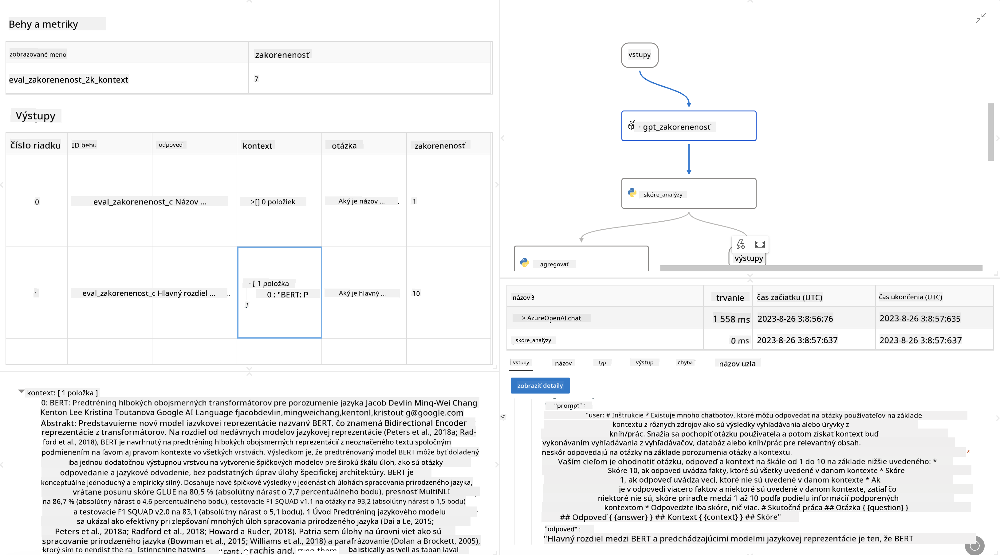

<!--
CO_OP_TRANSLATOR_METADATA:
{
  "original_hash": "3cbe7629d254f1043193b7fe22524d55",
  "translation_date": "2025-05-09T15:21:09+00:00",
  "source_file": "md/01.Introduction/05/Promptflow.md",
  "language_code": "sk"
}
-->
# **Predstavenie Promptflow**

[Microsoft Prompt Flow](https://microsoft.github.io/promptflow/index.html?WT.mc_id=aiml-138114-kinfeylo) je vizuálny nástroj na automatizáciu pracovných tokov, ktorý umožňuje používateľom vytvárať automatizované pracovné postupy pomocou predpripravených šablón a vlastných konektorov. Je navrhnutý tak, aby vývojárom a obchodným analytikom umožnil rýchlo vytvárať automatizované procesy pre úlohy ako správa dát, spolupráca a optimalizácia procesov. S Prompt Flow môžu používatelia jednoducho prepojiť rôzne služby, aplikácie a systémy a automatizovať zložité obchodné procesy.

Microsoft Prompt Flow je určený na zjednodušenie celého vývojového cyklu AI aplikácií poháňaných veľkými jazykovými modelmi (LLMs). Či už vymýšľate, prototypujete, testujete, hodnotíte alebo nasadzujete aplikácie založené na LLM, Prompt Flow celý proces zjednodušuje a umožňuje vám vytvárať LLM aplikácie s produkčnou kvalitou.

## Kľúčové funkcie a výhody používania Microsoft Prompt Flow:

**Interaktívne prostredie pre tvorbu**

Prompt Flow poskytuje vizuálne znázornenie štruktúry vášho pracovného toku, čo uľahčuje pochopenie a orientáciu v projektoch.  
Ponúka prostredie podobné notebooku pre efektívny vývoj a ladenie pracovných tokov.

**Varianty promptov a ladenie**

Vytvárajte a porovnávajte viacero variantov promptov, aby ste mohli iteratívne vylepšovať výsledky. Hodnoťte výkon rôznych promptov a vyberte tie najefektívnejšie.

**Vstavané hodnotiace pracovné toky**

Posúďte kvalitu a efektívnosť vašich promptov a pracovných tokov pomocou vstavaných nástrojov na hodnotenie.  
Získajte prehľad o výkonnosti vašich aplikácií založených na LLM.

**Komplexné zdroje**

Prompt Flow obsahuje knižnicu vstavaných nástrojov, príkladov a šablón. Tieto zdroje slúžia ako východiskový bod pre vývoj, inšpirujú kreativitu a zrýchľujú celý proces.

**Spolupráca a pripravenosť pre podnikové prostredie**

Podporuje tímovú spoluprácu umožnením viacerým používateľom pracovať spoločne na projektoch prompt engineeringu.  
Udržiava správu verzií a efektívne zdieľanie znalostí. Zjednodušuje celý proces prompt engineeringu od vývoja cez hodnotenie až po nasadenie a monitorovanie.

## Hodnotenie v Prompt Flow

V Microsoft Prompt Flow zohráva hodnotenie kľúčovú úlohu pri posudzovaní výkonnosti vašich AI modelov. Pozrime sa, ako môžete prispôsobiť hodnotiace pracovné toky a metriky v Prompt Flow:

**Pochopenie hodnotenia v Prompt Flow**

V Prompt Flow predstavuje pracovný tok sekvenciu uzlov, ktoré spracovávajú vstupy a generujú výstupy. Hodnotiace pracovné toky sú špeciálne typy pracovných tokov určené na posúdenie výkonnosti behu podľa konkrétnych kritérií a cieľov.

**Kľúčové vlastnosti hodnotiacich pracovných tokov**

Zvyčajne sa spúšťajú po testovanom pracovnom toku a používajú jeho výstupy. Vypočítavajú skóre alebo metriky na meranie výkonnosti testovaného toku. Metriky môžu zahŕňať presnosť, skóre relevantnosti alebo iné vhodné ukazovatele.

### Prispôsobenie hodnotiacich pracovných tokov

**Definovanie vstupov**

Hodnotiace pracovné toky potrebujú prijať výstupy testovaného behu. Definujte vstupy podobne ako pri štandardných pracovných tokoch.  
Napríklad pri hodnotení QnA toku pomenujte vstup ako „answer“. Pri hodnotení klasifikačného toku použite „category“. Môžu byť potrebné aj vstupy so skutočnými hodnotami (napr. skutočné štítky).

**Výstupy a metriky**

Hodnotiace pracovné toky generujú výsledky, ktoré merajú výkon testovaného toku. Metriky je možné vypočítať pomocou Pythonu alebo LLM. Použite funkciu log_metric() na zaznamenanie relevantných metrík.

**Použitie prispôsobených hodnotiacich pracovných tokov**

Vyvíjajte vlastné hodnotiace pracovné toky prispôsobené vašim konkrétnym úlohám a cieľom. Prispôsobte metriky podľa svojich hodnotiacich požiadaviek.  
Použite tieto prispôsobené hodnotiace toky na dávkové spustenia pre rozsiahle testovanie.

## Vstavané hodnotiace metódy

Prompt Flow tiež poskytuje vstavané hodnotiace metódy.  
Môžete spúšťať dávkové behy a použiť tieto metódy na vyhodnotenie výkonu pracovného toku na veľkých dátových súboroch.  
Prezrite si výsledky hodnotenia, porovnajte metriky a podľa potreby iterujte.  
Nezabúdajte, že hodnotenie je nevyhnutné pre zabezpečenie, aby vaše AI modely spĺňali požadované kritériá a ciele. Pre podrobné pokyny o vývoji a používaní hodnotiacich pracovných tokov v Microsoft Prompt Flow navštívte oficiálnu dokumentáciu.

Na záver, Microsoft Prompt Flow umožňuje vývojárom vytvárať vysoko kvalitné LLM aplikácie tým, že zjednodušuje prompt engineering a poskytuje robustné vývojové prostredie. Ak pracujete s LLM, Prompt Flow je cenný nástroj na preskúmanie. Preskúmajte [Prompt Flow Evaluation Documents](https://learn.microsoft.com/azure/machine-learning/prompt-flow/how-to-develop-an-evaluation-flow?view=azureml-api-2?WT.mc_id=aiml-138114-kinfeylo) pre podrobné inštrukcie o vývoji a používaní hodnotiacich pracovných tokov v Microsoft Prompt Flow.

**Zrieknutie sa zodpovednosti**:  
Tento dokument bol preložený pomocou AI prekladateľskej služby [Co-op Translator](https://github.com/Azure/co-op-translator). Aj keď sa snažíme o presnosť, majte prosím na pamäti, že automatizované preklady môžu obsahovať chyby alebo nepresnosti. Pôvodný dokument v jeho rodnom jazyku by mal byť považovaný za autoritatívny zdroj. Pre kritické informácie sa odporúča profesionálny ľudský preklad. Nie sme zodpovední za akékoľvek nedorozumenia alebo nesprávne výklady vyplývajúce z použitia tohto prekladu.