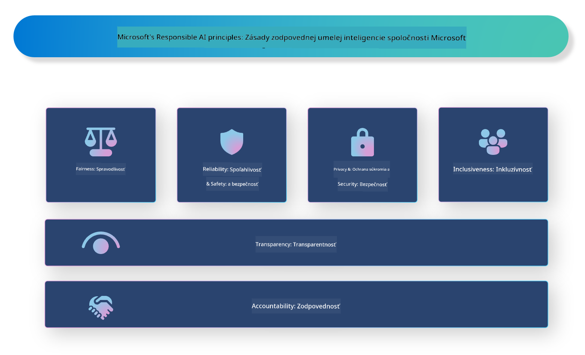

<!--
CO_OP_TRANSLATOR_METADATA:
{
  "original_hash": "805b96b20152936d8f4c587d90d6e06e",
  "translation_date": "2025-07-16T22:57:41+00:00",
  "source_file": "md/01.Introduction/05/ResponsibleAI.md",
  "language_code": "sk"
}
-->
# **Predstavenie zodpovednej AI**

[Microsoft Responsible AI](https://www.microsoft.com/ai/responsible-ai?WT.mc_id=aiml-138114-kinfeylo) je iniciatíva, ktorá pomáha vývojárom a organizáciám vytvárať AI systémy, ktoré sú transparentné, dôveryhodné a zodpovedné. Táto iniciatíva poskytuje usmernenia a zdroje na vývoj zodpovedných AI riešení, ktoré sú v súlade s etickými princípmi, ako sú súkromie, spravodlivosť a transparentnosť. Tiež sa pozrieme na niektoré výzvy a osvedčené postupy spojené s budovaním zodpovedných AI systémov.

## Prehľad Microsoft Responsible AI

**Etické princípy**

Microsoft Responsible AI sa riadi súborom etických princípov, ako sú súkromie, spravodlivosť, transparentnosť, zodpovednosť a bezpečnosť. Tieto princípy sú navrhnuté tak, aby zabezpečili, že AI systémy sú vyvíjané eticky a zodpovedne.

**Transparentná AI**

Microsoft Responsible AI zdôrazňuje dôležitosť transparentnosti v AI systémoch. To zahŕňa poskytovanie jasných vysvetlení, ako AI modely fungujú, ako aj zabezpečenie verejnej dostupnosti zdrojov dát a algoritmov.

**Zodpovedná AI**

[Microsoft Responsible AI](https://www.microsoft.com/ai/responsible-ai?WT.mc_id=aiml-138114-kinfeylo) podporuje vývoj zodpovedných AI systémov, ktoré dokážu poskytnúť prehľad o tom, ako AI modely prijímajú rozhodnutia. To pomáha používateľom lepšie pochopiť a dôverovať výstupom AI systémov.

**Inkluzívnosť**

AI systémy by mali byť navrhnuté tak, aby prinášali úžitok všetkým. Microsoft sa snaží vytvárať inkluzívnu AI, ktorá zohľadňuje rôzne perspektívy a vyhýba sa predsudkom či diskriminácii.

**Spoľahlivosť a bezpečnosť**

Zabezpečenie spoľahlivosti a bezpečnosti AI systémov je kľúčové. Microsoft sa zameriava na budovanie robustných modelov, ktoré fungujú konzistentne a predchádzajú škodlivým výsledkom.

**Spravodlivosť v AI**

Microsoft Responsible AI si uvedomuje, že AI systémy môžu prehlbovať predsudky, ak sú trénované na zaujatých dátach alebo algoritmoch. Iniciatíva poskytuje usmernenia na vývoj spravodlivých AI systémov, ktoré nevyužívajú diskrimináciu na základe rasy, pohlavia alebo veku.

**Súkromie a bezpečnosť**

Microsoft Responsible AI zdôrazňuje dôležitosť ochrany súkromia používateľov a bezpečnosti dát v AI systémoch. To zahŕňa implementáciu silného šifrovania dát a kontrol prístupu, ako aj pravidelné audity AI systémov na zraniteľnosti.

**Zodpovednosť a zodpovednosť**

Microsoft Responsible AI podporuje zodpovednosť a zodpovednosť pri vývoji a nasadzovaní AI. To znamená, že vývojári a organizácie by mali byť informovaní o potenciálnych rizikách spojených s AI systémami a prijímať opatrenia na ich zmiernenie.

## Osvedčené postupy pri budovaní zodpovedných AI systémov

**Vyvíjajte AI modely s použitím rôznorodých dátových súborov**

Aby sa predišlo predsudkom v AI systémoch, je dôležité používať rôznorodé dátové súbory, ktoré reprezentujú široké spektrum perspektív a skúseností.

**Používajte techniky vysvetliteľnej AI**

Techniky vysvetliteľnej AI pomáhajú používateľom pochopiť, ako AI modely prijímajú rozhodnutia, čo môže zvýšiť dôveru v systém.

**Pravidelne vykonávajte audity AI systémov na zraniteľnosti**

Pravidelné audity AI systémov pomáhajú identifikovať potenciálne riziká a zraniteľnosti, ktoré je potrebné riešiť.

**Implementujte silné šifrovanie dát a kontroly prístupu**

Šifrovanie dát a kontroly prístupu pomáhajú chrániť súkromie a bezpečnosť používateľov v AI systémoch.

**Dodržiavajte etické princípy pri vývoji AI**

Dodržiavanie etických princípov, ako sú spravodlivosť, transparentnosť a zodpovednosť, pomáha budovať dôveru v AI systémy a zabezpečuje ich zodpovedný vývoj.

## Použitie AI Foundry pre zodpovednú AI

[Azure AI Foundry](https://ai.azure.com?WT.mc_id=aiml-138114-kinfeylo) je výkonná platforma, ktorá umožňuje vývojárom a organizáciám rýchlo vytvárať inteligentné, moderné, pripravené na trh a zodpovedné aplikácie. Tu sú niektoré kľúčové funkcie a možnosti Azure AI Foundry:

**Hotové API a modely**

Azure AI Foundry poskytuje predpripravené a prispôsobiteľné API a modely. Pokrývajú širokú škálu AI úloh, vrátane generatívnej AI, spracovania prirodzeného jazyka pre konverzácie, vyhľadávania, monitorovania, prekladu, reči, videnia a rozhodovania.

**Prompt Flow**

Prompt flow v Azure AI Foundry umožňuje vytvárať konverzačné AI zážitky. Umožňuje navrhovať a spravovať konverzačné toky, čo uľahčuje tvorbu chatbotov, virtuálnych asistentov a iných interaktívnych aplikácií.

**Retrieval Augmented Generation (RAG)**

RAG je technika, ktorá kombinuje prístupy založené na vyhľadávaní a generovaní. Zlepšuje kvalitu generovaných odpovedí využitím existujúcich znalostí (vyhľadávanie) a kreatívnej generácie (generovanie).

**Metriky hodnotenia a monitorovania pre generatívnu AI**

Azure AI Foundry poskytuje nástroje na hodnotenie a monitorovanie generatívnych AI modelov. Môžete posúdiť ich výkon, spravodlivosť a ďalšie dôležité metriky, aby ste zabezpečili zodpovedné nasadenie. Ak ste vytvorili dashboard, môžete použiť no-code UI v Azure Machine Learning Studio na prispôsobenie a generovanie Responsible AI Dashboard a súvisiaceho scorecardu založeného na [Responsible AI Toolbox](https://responsibleaitoolbox.ai/?WT.mc_id=aiml-138114-kinfeylo) Python knižniciach. Tento scorecard pomáha zdieľať kľúčové poznatky týkajúce sa spravodlivosti, dôležitosti funkcií a ďalších aspektov zodpovedného nasadenia s technickými aj netechnickými zainteresovanými stranami.

Pre použitie AI Foundry so zodpovednou AI môžete nasledovať tieto osvedčené postupy:

**Definujte problém a ciele vášho AI systému**

Pred začatím vývoja je dôležité jasne definovať problém alebo cieľ, ktorý má váš AI systém riešiť. Pomôže vám to určiť potrebné dáta, algoritmy a zdroje na vytvorenie efektívneho modelu.

**Zbierajte a predspracujte relevantné dáta**

Kvalita a množstvo dát použitých na trénovanie AI systému má výrazný vplyv na jeho výkon. Preto je dôležité zhromaždiť relevantné dáta, vyčistiť ich, predspracovať a zabezpečiť, aby reprezentovali populáciu alebo problém, ktorý sa snažíte vyriešiť.

**Vyberte vhodné hodnotiace metódy**

Existuje množstvo hodnotiacich algoritmov. Je dôležité vybrať ten najvhodnejší podľa vašich dát a problému.

**Vyhodnoťte a interpretujte model**

Po vytvorení AI modelu je dôležité vyhodnotiť jeho výkon pomocou vhodných metrík a transparentne interpretovať výsledky. Pomôže vám to odhaliť prípadné predsudky alebo obmedzenia modelu a podľa potreby ho vylepšiť.

**Zabezpečte transparentnosť a vysvetliteľnosť**

AI systémy by mali byť transparentné a vysvetliteľné, aby používatelia pochopili, ako fungujú a ako sa prijímajú rozhodnutia. To je obzvlášť dôležité pre aplikácie, ktoré majú významný dopad na ľudské životy, ako sú zdravotníctvo, financie alebo právne systémy.

**Monitorujte a aktualizujte model**

AI systémy by mali byť neustále monitorované a aktualizované, aby si udržali presnosť a efektívnosť v priebehu času. To vyžaduje pravidelnú údržbu, testovanie a opätovné trénovanie modelu.

Na záver, Microsoft Responsible AI je iniciatíva, ktorá pomáha vývojárom a organizáciám vytvárať AI systémy, ktoré sú transparentné, dôveryhodné a zodpovedné. Pamätajte, že implementácia zodpovednej AI je kľúčová a Azure AI Foundry ju chce sprístupniť pre organizácie. Dodržiavaním etických princípov a osvedčených postupov môžeme zabezpečiť, že AI systémy budú vyvíjané a nasadzované zodpovedne a v prospech celej spoločnosti.

**Vyhlásenie o zodpovednosti**:  
Tento dokument bol preložený pomocou AI prekladateľskej služby [Co-op Translator](https://github.com/Azure/co-op-translator). Aj keď sa snažíme o presnosť, prosím, majte na pamäti, že automatizované preklady môžu obsahovať chyby alebo nepresnosti. Originálny dokument v jeho pôvodnom jazyku by mal byť považovaný za autoritatívny zdroj. Pre kritické informácie sa odporúča profesionálny ľudský preklad. Nie sme zodpovední za akékoľvek nedorozumenia alebo nesprávne interpretácie vyplývajúce z použitia tohto prekladu.