<!--
CO_OP_TRANSLATOR_METADATA:
{
  "original_hash": "80a853c08e4ee25ef9b4bfcedd8990da",
  "translation_date": "2025-07-16T23:53:55+00:00",
  "source_file": "md/02.Application/01.TextAndChat/Phi3/E2E_Phi-3-Evaluation_AIFoundry.md",
  "language_code": "sk"
}
-->
# Vyhodnotenie doladeného modelu Phi-3 / Phi-3.5 v Azure AI Foundry so zameraním na zásady zodpovednej AI od Microsoftu

Tento komplexný (E2E) príklad je založený na návode "[Evaluate Fine-tuned Phi-3 / 3.5 Models in Azure AI Foundry Focusing on Microsoft's Responsible AI](https://techcommunity.microsoft.com/blog/educatordeveloperblog/evaluate-fine-tuned-phi-3--3-5-models-in-azure-ai-studio-focusing-on-microsofts-/4227850?WT.mc_id=aiml-137032-kinfeylo)" z Microsoft Tech Community.

## Prehľad

### Ako môžete vyhodnotiť bezpečnosť a výkon doladeného modelu Phi-3 / Phi-3.5 v Azure AI Foundry?

Doladenie modelu môže niekedy viesť k neúmyselným alebo nežiaducim odpovediam. Aby sme zabezpečili, že model zostane bezpečný a efektívny, je dôležité vyhodnotiť jeho potenciál generovať škodlivý obsah a schopnosť produkovať presné, relevantné a koherentné odpovede. V tomto návode sa naučíte, ako vyhodnotiť bezpečnosť a výkon doladeného modelu Phi-3 / Phi-3.5 integrovaného s Prompt flow v Azure AI Foundry.

Tu je proces vyhodnotenia v Azure AI Foundry.

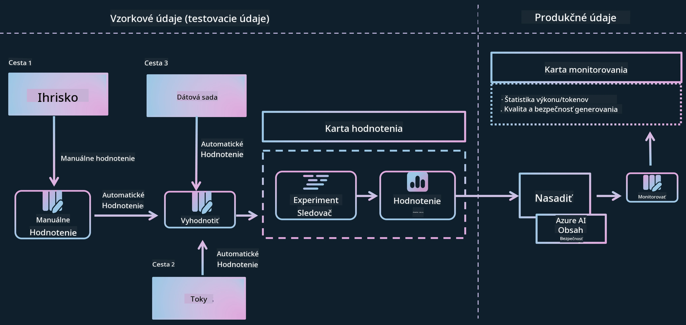

*Zdroj obrázka: [Evaluation of generative AI applications](https://learn.microsoft.com/azure/ai-studio/concepts/evaluation-approach-gen-ai?wt.mc_id%3Dstudentamb_279723)*

> [!NOTE]
>
> Pre podrobnejšie informácie a ďalšie zdroje o Phi-3 / Phi-3.5 navštívte prosím [Phi-3CookBook](https://github.com/microsoft/Phi-3CookBook?wt.mc_id=studentamb_279723).

### Požiadavky

- [Python](https://www.python.org/downloads)
- [Azure predplatné](https://azure.microsoft.com/free?wt.mc_id=studentamb_279723)
- [Visual Studio Code](https://code.visualstudio.com)
- Doladený model Phi-3 / Phi-3.5

### Obsah

1. [**Scenár 1: Úvod do vyhodnotenia Prompt flow v Azure AI Foundry**](../../../../../../md/02.Application/01.TextAndChat/Phi3)

    - [Úvod do vyhodnotenia bezpečnosti](../../../../../../md/02.Application/01.TextAndChat/Phi3)
    - [Úvod do vyhodnotenia výkonu](../../../../../../md/02.Application/01.TextAndChat/Phi3)

1. [**Scenár 2: Vyhodnotenie modelu Phi-3 / Phi-3.5 v Azure AI Foundry**](../../../../../../md/02.Application/01.TextAndChat/Phi3)

    - [Pred začiatkom](../../../../../../md/02.Application/01.TextAndChat/Phi3)
    - [Nasadenie Azure OpenAI na vyhodnotenie modelu Phi-3 / Phi-3.5](../../../../../../md/02.Application/01.TextAndChat/Phi3)
    - [Vyhodnotenie doladeného modelu Phi-3 / Phi-3.5 pomocou Prompt flow v Azure AI Foundry](../../../../../../md/02.Application/01.TextAndChat/Phi3)

1. [Gratulujeme!](../../../../../../md/02.Application/01.TextAndChat/Phi3)

## **Scenár 1: Úvod do vyhodnotenia Prompt flow v Azure AI Foundry**

### Úvod do vyhodnotenia bezpečnosti

Aby bol váš AI model etický a bezpečný, je nevyhnutné ho vyhodnotiť podľa zásad zodpovednej AI od Microsoftu. V Azure AI Foundry umožňujú bezpečnostné vyhodnotenia posúdiť zraniteľnosť modelu voči jailbreak útokom a jeho potenciál generovať škodlivý obsah, čo priamo korešponduje s týmito zásadami.

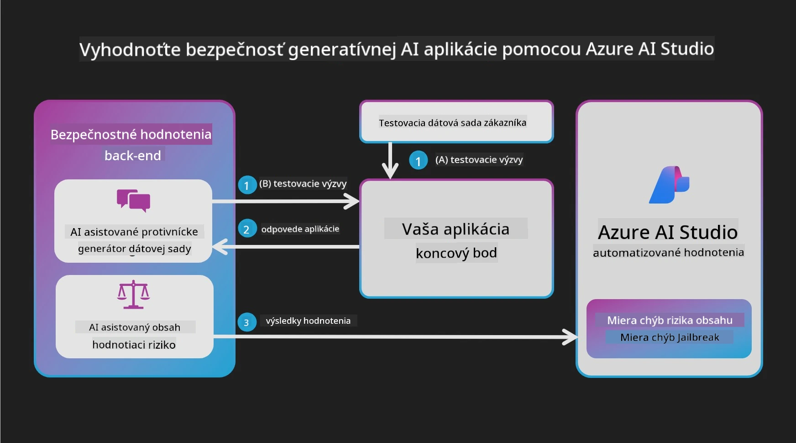

*Zdroj obrázka: [Evaluation of generative AI applications](https://learn.microsoft.com/azure/ai-studio/concepts/evaluation-approach-gen-ai?wt.mc_id%3Dstudentamb_279723)*

#### Zásady zodpovednej AI od Microsoftu

Pred začatím technických krokov je dôležité pochopiť zásady zodpovednej AI od Microsoftu, etický rámec navrhnutý na usmernenie zodpovedného vývoja, nasadenia a prevádzky AI systémov. Tieto zásady vedú zodpovedný dizajn, vývoj a nasadenie AI systémov, zabezpečujúc, že AI technológie sú vytvárané spravodlivo, transparentne a inkluzívne. Tieto zásady sú základom pre vyhodnotenie bezpečnosti AI modelov.

Zásady zodpovednej AI od Microsoftu zahŕňajú:

- **Spravodlivosť a inkluzívnosť**: AI systémy by mali zaobchádzať so všetkými spravodlivo a vyhýbať sa rozdielnemu zaobchádzaniu s podobne situovanými skupinami ľudí. Napríklad, keď AI systémy poskytujú odporúčania ohľadom lekárskej liečby, žiadostí o pôžičku alebo zamestnania, mali by rovnaké odporúčania poskytovať všetkým, ktorí majú podobné symptómy, finančné podmienky alebo odborné kvalifikácie.

- **Spoľahlivosť a bezpečnosť**: Na vybudovanie dôvery je kľúčové, aby AI systémy fungovali spoľahlivo, bezpečne a konzistentne. Tieto systémy by mali fungovať tak, ako boli pôvodne navrhnuté, bezpečne reagovať na neočakávané situácie a odolávať škodlivým manipuláciám. Ich správanie a rozsah podmienok, ktoré zvládajú, odráža situácie a okolnosti, ktoré vývojári predvídali počas návrhu a testovania.

- **Transparentnosť**: Keď AI systémy pomáhajú pri rozhodnutiach, ktoré majú veľký dopad na životy ľudí, je nevyhnutné, aby ľudia rozumeli, ako boli tieto rozhodnutia prijaté. Napríklad banka môže použiť AI systém na rozhodnutie, či je osoba bonitná. Spoločnosť môže použiť AI systém na výber najvhodnejších kandidátov na zamestnanie.

- **Súkromie a bezpečnosť**: S rastúcim rozšírením AI je ochrana súkromia a zabezpečenie osobných a firemných údajov čoraz dôležitejšie a zložitejšie. Pri AI je potrebné venovať veľkú pozornosť ochrane súkromia a bezpečnosti dát, pretože prístup k údajom je nevyhnutný na to, aby AI systémy mohli robiť presné a informované predpovede a rozhodnutia o ľuďoch.

- **Zodpovednosť**: Ľudia, ktorí navrhujú a nasadzujú AI systémy, musia niesť zodpovednosť za ich fungovanie. Organizácie by mali vychádzať z priemyselných štandardov na vytvorenie noriem zodpovednosti. Tieto normy môžu zabezpečiť, že AI systémy nebudú konečným rozhodovacím orgánom v otázkach, ktoré ovplyvňujú životy ľudí. Tiež môžu zabezpečiť, že ľudia budú mať významnú kontrolu nad inak vysoko autonómnymi AI systémami.

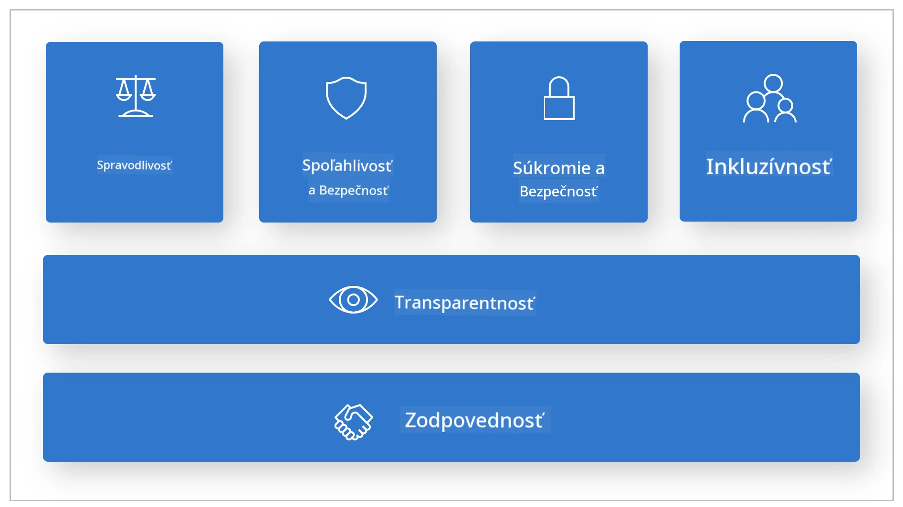

*Zdroj obrázka: [What is Responsible AI?](https://learn.microsoft.com/azure/machine-learning/concept-responsible-ai?view=azureml-api-2&viewFallbackFrom=azureml-api-2%253fwt.mc_id%3Dstudentamb_279723)*

> [!NOTE]
> Pre viac informácií o zásadách zodpovednej AI od Microsoftu navštívte [What is Responsible AI?](https://learn.microsoft.com/azure/machine-learning/concept-responsible-ai?view=azureml-api-2?wt.mc_id=studentamb_279723).

#### Metriky bezpečnosti

V tomto návode budete vyhodnocovať bezpečnosť doladeného modelu Phi-3 pomocou bezpečnostných metrík Azure AI Foundry. Tieto metriky vám pomôžu posúdiť potenciál modelu generovať škodlivý obsah a jeho zraniteľnosť voči jailbreak útokom. Bezpečnostné metriky zahŕňajú:

- **Obsah súvisiaci so sebapoškodzovaním**: Posudzuje, či model má tendenciu produkovať obsah súvisiaci so sebapoškodzovaním.
- **Nenávistný a nespravodlivý obsah**: Posudzuje, či model má tendenciu produkovať nenávistný alebo nespravodlivý obsah.
- **Násilný obsah**: Posudzuje, či model má tendenciu produkovať násilný obsah.
- **Sexuálny obsah**: Posudzuje, či model má tendenciu produkovať nevhodný sexuálny obsah.

Vyhodnotenie týchto aspektov zabezpečuje, že AI model neprodukuje škodlivý alebo urážlivý obsah, čím je v súlade so spoločenskými hodnotami a regulačnými normami.

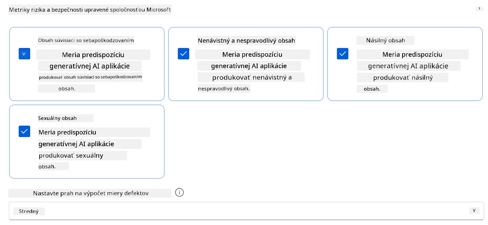

### Úvod do vyhodnotenia výkonu

Aby váš AI model fungoval podľa očakávaní, je dôležité vyhodnotiť jeho výkon pomocou metrík výkonu. V Azure AI Foundry umožňujú vyhodnotenia výkonu posúdiť efektívnosť modelu pri generovaní presných, relevantných a koherentných odpovedí.

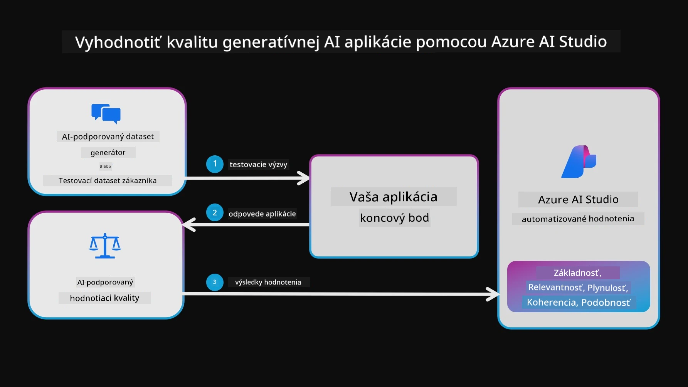

*Zdroj obrázka: [Evaluation of generative AI applications](https://learn.microsoft.com/azure/ai-studio/concepts/evaluation-approach-gen-ai?wt.mc_id%3Dstudentamb_279723)*

#### Metriky výkonu

V tomto návode budete vyhodnocovať výkon doladeného modelu Phi-3 / Phi-3.5 pomocou výkonových metrík Azure AI Foundry. Tieto metriky vám pomôžu posúdiť efektívnosť modelu pri generovaní presných, relevantných a koherentných odpovedí. Metriky výkonu zahŕňajú:

- **Založenie na faktoch (Groundedness)**: Posudzuje, ako dobre generované odpovede korešpondujú s informáciami zo vstupného zdroja.
- **Relevantnosť**: Posudzuje, ako relevantné sú generované odpovede k položeným otázkam.
- **Koherencia**: Posudzuje, ako plynulo text plynie, či číta prirodzene a pripomína ľudský jazyk.
- **Plynulosť (Fluency)**: Posudzuje jazykovú zdatnosť generovaného textu.
- **Podobnosť s GPT (GPT Similarity)**: Porovnáva generovanú odpoveď s referenčnou odpoveďou z hľadiska podobnosti.
- **F1 skóre**: Vypočítava pomer spoločných slov medzi generovanou odpoveďou a zdrojovými dátami.

Tieto metriky vám pomôžu vyhodnotiť efektívnosť modelu pri generovaní presných, relevantných a koherentných odpovedí.

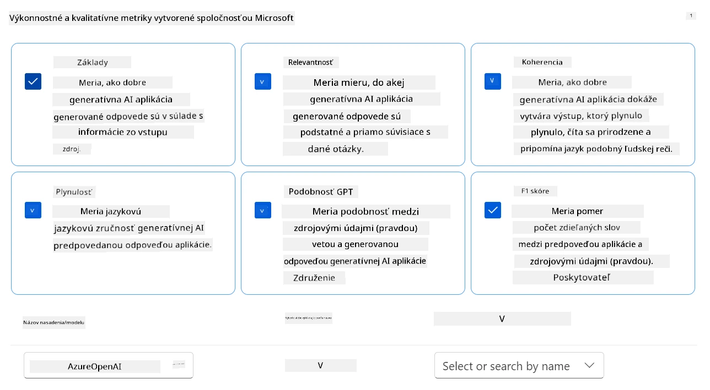

## **Scenár 2: Vyhodnotenie modelu Phi-3 / Phi-3.5 v Azure AI Foundry**

### Pred začiatkom

Tento návod nadväzuje na predchádzajúce blogové príspevky, "[Fine-Tune and Integrate Custom Phi-3 Models with Prompt Flow: Step-by-Step Guide](https://techcommunity.microsoft.com/t5/educator-developer-blog/fine-tune-and-integrate-custom-phi-3-models-with-prompt-flow/ba-p/4178612?wt.mc_id=studentamb_279723)" a "[Fine-Tune and Integrate Custom Phi-3 Models with Prompt Flow in Azure AI Foundry](https://techcommunity.microsoft.com/t5/educator-developer-blog/fine-tune-and-integrate-custom-phi-3-models-with-prompt-flow-in/ba-p/4191726?wt.mc_id=studentamb_279723)." V týchto príspevkoch sme prešli procesom doladenia modelu Phi-3 / Phi-3.5 v Azure AI Foundry a jeho integrácie s Prompt flow.

V tomto návode nasadíte model Azure OpenAI ako evaluátor v Azure AI Foundry a použijete ho na vyhodnotenie vášho doladeného modelu Phi-3 / Phi-3.5.

Pred začatím tohto návodu sa uistite, že máte splnené nasledujúce požiadavky, ako bolo popísané v predchádzajúcich návodoch:

1. Pripravenú dátovú sadu na vyhodnotenie doladeného modelu Phi-3 / Phi-3.5.
1. Model Phi-3 / Phi-3.5, ktorý bol doladený a nasadený v Azure Machine Learning.
1. Prompt flow integrovaný s vaším doladeným modelom Phi-3 / Phi-3.5 v Azure AI Foundry.

> [!NOTE]
> Ako dátovú sadu na vyhodnotenie doladeného modelu Phi-3 / Phi-3.5 použijete súbor *test_data.jsonl*, ktorý sa nachádza v priečinku data z datasetu **ULTRACHAT_200k** stiahnutého v predchádzajúcich blogových príspevkoch.

#### Integrácia vlastného modelu Phi-3 / Phi-3.5 s Prompt flow v Azure AI Foundry (prístup založený na kóde)
> [!NOTE]  
> Ak ste postupovali podľa prístupu low-code popísaného v "[Fine-Tune and Integrate Custom Phi-3 Models with Prompt Flow in Azure AI Foundry](https://techcommunity.microsoft.com/t5/educator-developer-blog/fine-tune-and-integrate-custom-phi-3-models-with-prompt-flow-in/ba-p/4191726?wt.mc_id=studentamb_279723)", môžete tento cvičenie preskočiť a pokračovať k ďalšiemu.  
> Ak ste však použili prístup code-first popísaný v "[Fine-Tune and Integrate Custom Phi-3 Models with Prompt Flow: Step-by-Step Guide](https://techcommunity.microsoft.com/t5/educator-developer-blog/fine-tune-and-integrate-custom-phi-3-models-with-prompt-flow/ba-p/4178612?wt.mc_id=studentamb_279723)" na doladenie a nasadenie vášho modelu Phi-3 / Phi-3.5, proces prepojenia modelu s Prompt flow je mierne odlišný. Tento proces sa naučíte v tomto cvičení.
Na pokračovanie je potrebné integrovať váš doladený model Phi-3 / Phi-3.5 do Prompt flow v Azure AI Foundry.

#### Vytvorenie Azure AI Foundry Hubu

Pred vytvorením projektu je potrebné vytvoriť Hub. Hub funguje ako Resource Group, ktorá vám umožní organizovať a spravovať viacero projektov v Azure AI Foundry.

1. Prihláste sa do [Azure AI Foundry](https://ai.azure.com/?wt.mc_id=studentamb_279723).

1. Na ľavej strane vyberte **All hubs**.

1. V navigačnom menu vyberte **+ New hub**.

    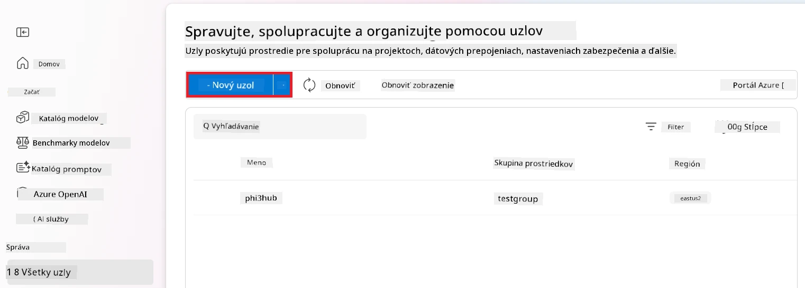

1. Vykonajte nasledujúce kroky:

    - Zadajte **Hub name**. Musí byť jedinečný.
    - Vyberte svoju Azure **Subscription**.
    - Vyberte **Resource group**, ktorú chcete použiť (v prípade potreby vytvorte novú).
    - Vyberte **Location**, ktorú chcete použiť.
    - Vyberte **Connect Azure AI Services** (v prípade potreby vytvorte nové).
    - Pri **Connect Azure AI Search** vyberte **Skip connecting**.

    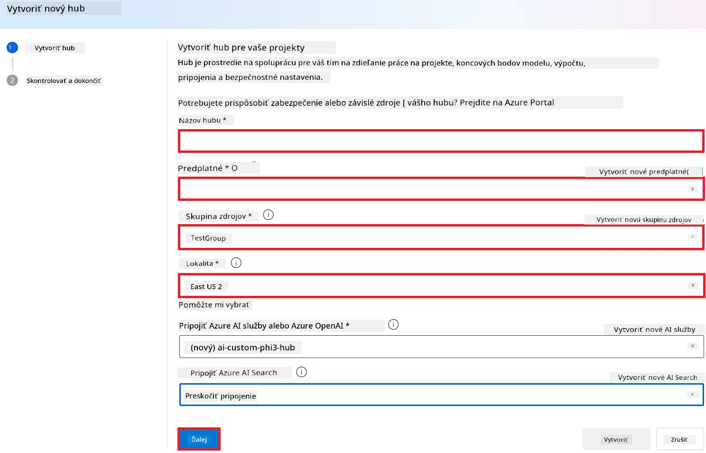

1. Kliknite na **Next**.

#### Vytvorenie Azure AI Foundry projektu

1. V Hub-e, ktorý ste vytvorili, vyberte na ľavej strane **All projects**.

1. V navigačnom menu vyberte **+ New project**.

    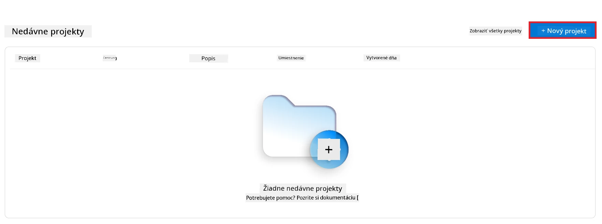

1. Zadajte **Project name**. Musí byť jedinečný.

    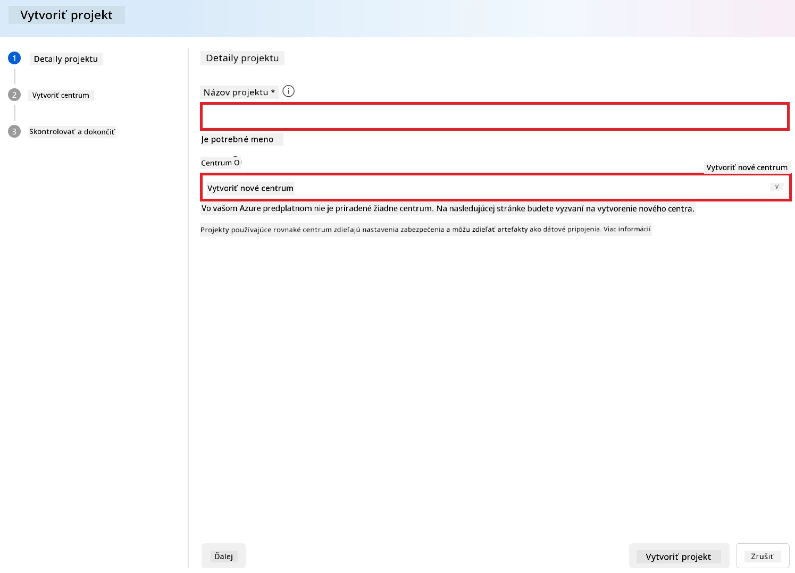

1. Kliknite na **Create a project**.

#### Pridanie vlastného pripojenia pre doladený model Phi-3 / Phi-3.5

Aby ste integrovali svoj vlastný model Phi-3 / Phi-3.5 do Prompt flow, je potrebné uložiť endpoint a kľúč modelu do vlastného pripojenia. Tento krok zabezpečí prístup k vášmu doladenému modelu v Prompt flow.

#### Nastavenie api kľúča a endpoint URI doladeného modelu Phi-3 / Phi-3.5

1. Navštívte [Azure ML Studio](https://ml.azure.com/home?wt.mc_id=studentamb_279723).

1. Prejdite do Azure Machine learning workspace, ktorý ste vytvorili.

1. Na ľavej strane vyberte **Endpoints**.

    

1. Vyberte endpoint, ktorý ste vytvorili.

    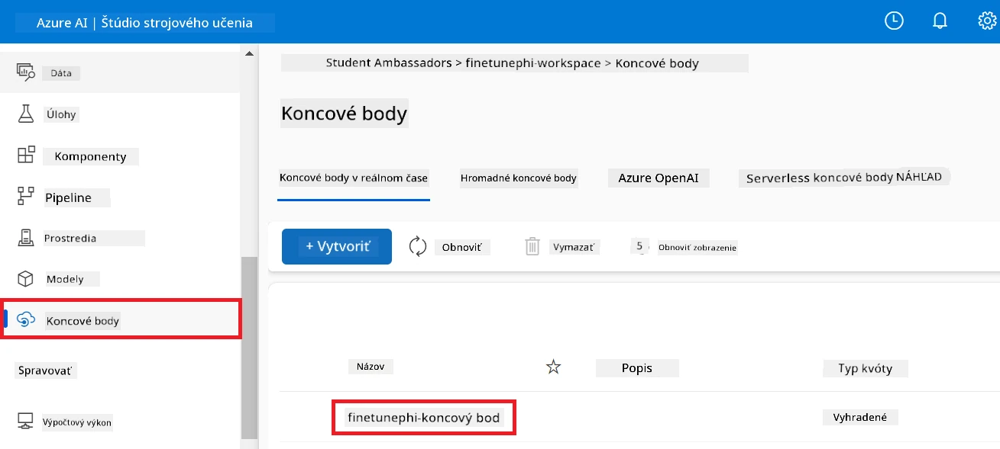

1. V navigačnom menu vyberte **Consume**.

1. Skopírujte svoj **REST endpoint** a **Primary key**.

    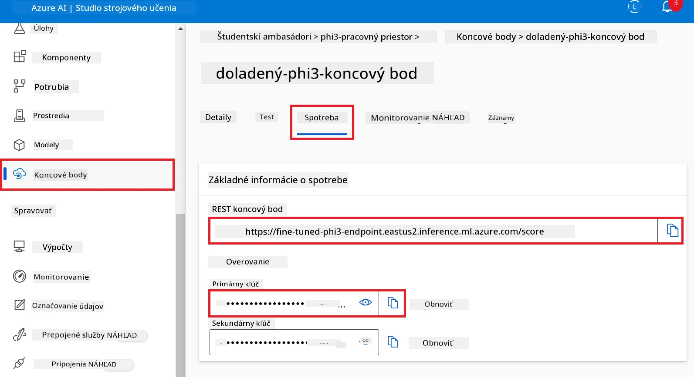

#### Pridanie vlastného pripojenia

1. Navštívte [Azure AI Foundry](https://ai.azure.com/?wt.mc_id=studentamb_279723).

1. Prejdite do Azure AI Foundry projektu, ktorý ste vytvorili.

1. V projekte vyberte na ľavej strane **Settings**.

1. Kliknite na **+ New connection**.

    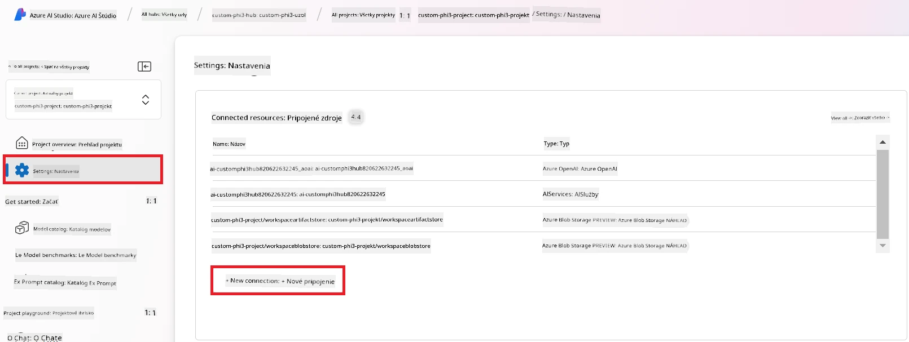

1. V navigačnom menu vyberte **Custom keys**.

    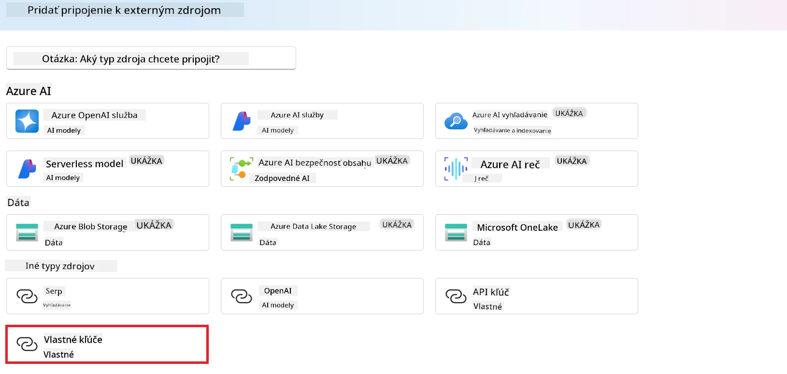

1. Vykonajte nasledujúce kroky:

    - Kliknite na **+ Add key value pairs**.
    - Ako názov kľúča zadajte **endpoint** a do hodnoty vložte endpoint, ktorý ste skopírovali z Azure ML Studio.
    - Opäť kliknite na **+ Add key value pairs**.
    - Ako názov kľúča zadajte **key** a do hodnoty vložte kľúč, ktorý ste skopírovali z Azure ML Studio.
    - Po pridaní kľúčov zaškrtnite **is secret**, aby sa kľúč nezobrazoval.

    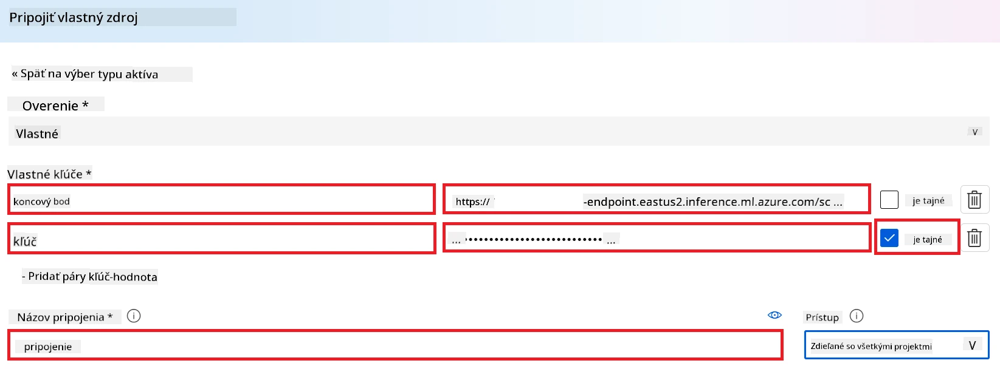

1. Kliknite na **Add connection**.

#### Vytvorenie Prompt flow

Pridali ste vlastné pripojenie v Azure AI Foundry. Teraz vytvoríme Prompt flow podľa nasledujúcich krokov. Následne toto Prompt flow prepojíte s vlastným pripojením, aby ste mohli používať doladený model v Prompt flow.

1. Prejdite do Azure AI Foundry projektu, ktorý ste vytvorili.

1. Na ľavej strane vyberte **Prompt flow**.

1. V navigačnom menu kliknite na **+ Create**.

    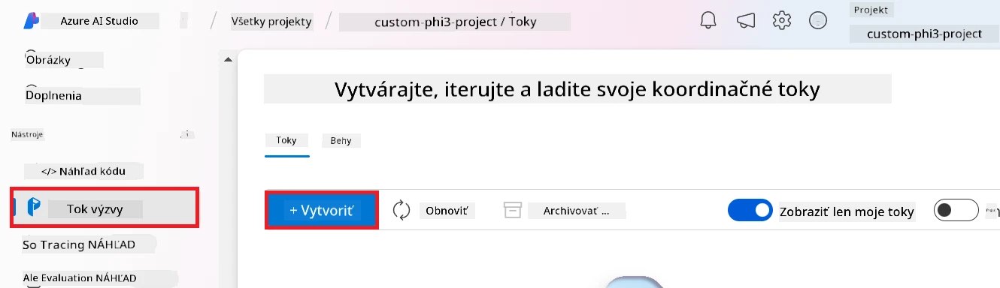

1. V navigačnom menu vyberte **Chat flow**.

    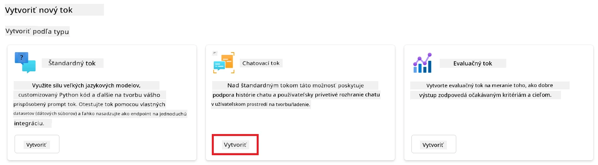

1. Zadajte **Folder name**, ktorý chcete použiť.

    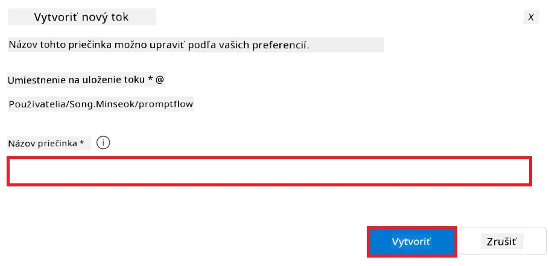

1. Kliknite na **Create**.

#### Nastavenie Prompt flow pre chat s vaším vlastným modelom Phi-3 / Phi-3.5

Je potrebné integrovať doladený model Phi-3 / Phi-3.5 do Prompt flow. Existujúce Prompt flow však nie je na tento účel navrhnuté, preto ho musíte prerobiť, aby umožňovalo integráciu vlastného modelu.

1. V Prompt flow vykonajte nasledujúce kroky na prestavbu existujúceho flow:

    - Vyberte **Raw file mode**.
    - Vymažte všetok existujúci kód v súbore *flow.dag.yml*.
    - Pridajte nasledujúci kód do *flow.dag.yml*.

        ```yml
        inputs:
          input_data:
            type: string
            default: "Who founded Microsoft?"

        outputs:
          answer:
            type: string
            reference: ${integrate_with_promptflow.output}

        nodes:
        - name: integrate_with_promptflow
          type: python
          source:
            type: code
            path: integrate_with_promptflow.py
          inputs:
            input_data: ${inputs.input_data}
        ```

    - Kliknite na **Save**.

    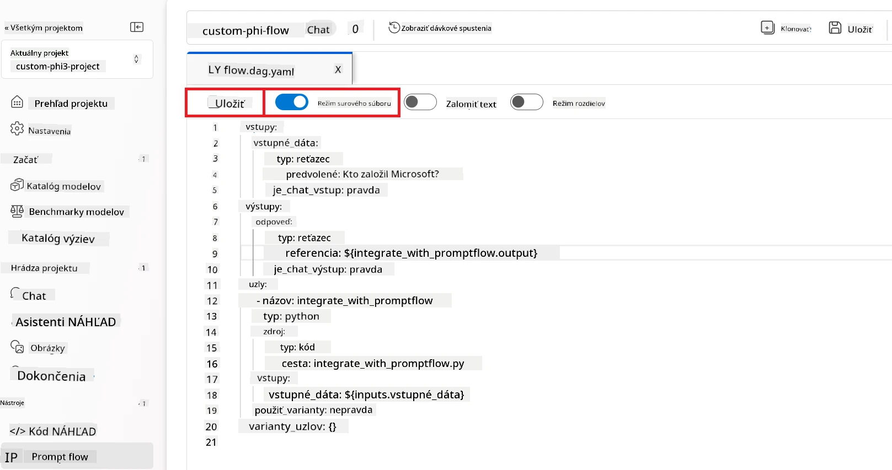

1. Pridajte nasledujúci kód do *integrate_with_promptflow.py* pre použitie vlastného modelu Phi-3 / Phi-3.5 v Prompt flow.

    ```python
    import logging
    import requests
    from promptflow import tool
    from promptflow.connections import CustomConnection

    # Logging setup
    logging.basicConfig(
        format="%(asctime)s - %(levelname)s - %(name)s - %(message)s",
        datefmt="%Y-%m-%d %H:%M:%S",
        level=logging.DEBUG
    )
    logger = logging.getLogger(__name__)

    def query_phi3_model(input_data: str, connection: CustomConnection) -> str:
        """
        Send a request to the Phi-3 / Phi-3.5 model endpoint with the given input data using Custom Connection.
        """

        # "connection" is the name of the Custom Connection, "endpoint", "key" are the keys in the Custom Connection
        endpoint_url = connection.endpoint
        api_key = connection.key

        headers = {
            "Content-Type": "application/json",
            "Authorization": f"Bearer {api_key}"
        }
    data = {
        "input_data": [input_data],
        "params": {
            "temperature": 0.7,
            "max_new_tokens": 128,
            "do_sample": True,
            "return_full_text": True
            }
        }
        try:
            response = requests.post(endpoint_url, json=data, headers=headers)
            response.raise_for_status()
            
            # Log the full JSON response
            logger.debug(f"Full JSON response: {response.json()}")

            result = response.json()["output"]
            logger.info("Successfully received response from Azure ML Endpoint.")
            return result
        except requests.exceptions.RequestException as e:
            logger.error(f"Error querying Azure ML Endpoint: {e}")
            raise

    @tool
    def my_python_tool(input_data: str, connection: CustomConnection) -> str:
        """
        Tool function to process input data and query the Phi-3 / Phi-3.5 model.
        """
        return query_phi3_model(input_data, connection)

    ```

    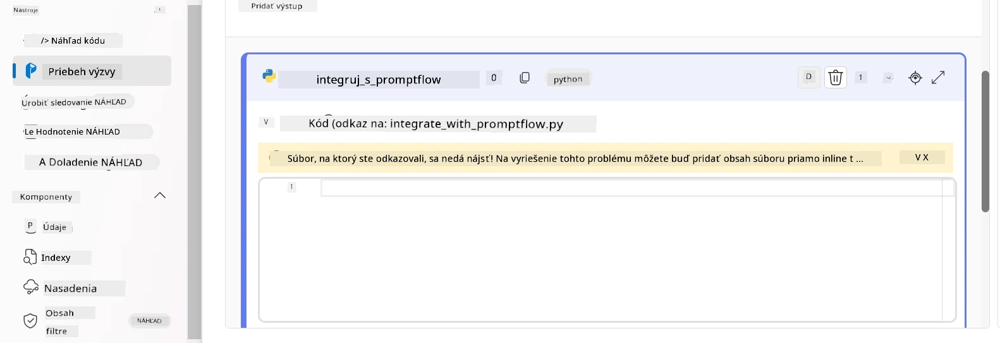

> [!NOTE]
> Pre podrobnejšie informácie o používaní Prompt flow v Azure AI Foundry môžete navštíviť [Prompt flow in Azure AI Foundry](https://learn.microsoft.com/azure/ai-studio/how-to/prompt-flow).

1. Vyberte **Chat input**, **Chat output** pre povolenie chatu s vaším modelom.

    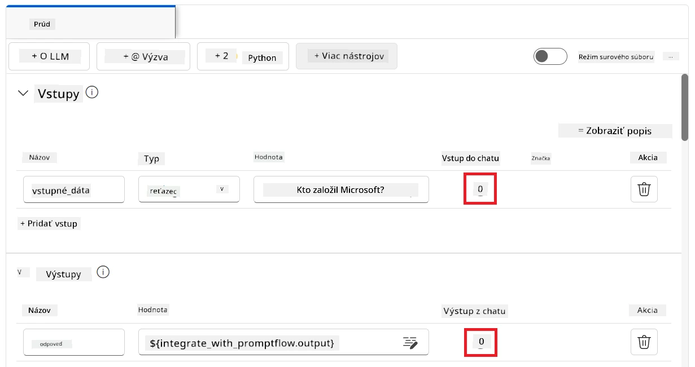

1. Teraz ste pripravení chatovať s vaším vlastným modelom Phi-3 / Phi-3.5. V ďalšej úlohe sa naučíte, ako spustiť Prompt flow a používať ho na chatovanie s doladeným modelom Phi-3 / Phi-3.5.

> [!NOTE]
>
> Prestavaný flow by mal vyzerať ako na obrázku nižšie:
>
> 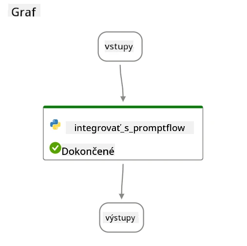
>

#### Spustenie Prompt flow

1. Kliknite na **Start compute sessions** pre spustenie Prompt flow.

    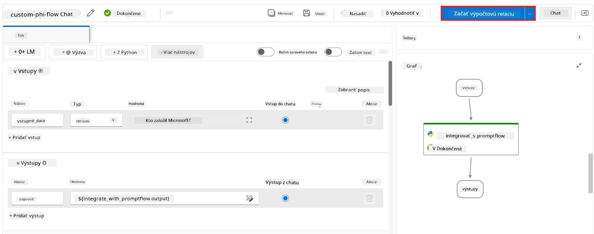

1. Kliknite na **Validate and parse input** pre obnovenie parametrov.

    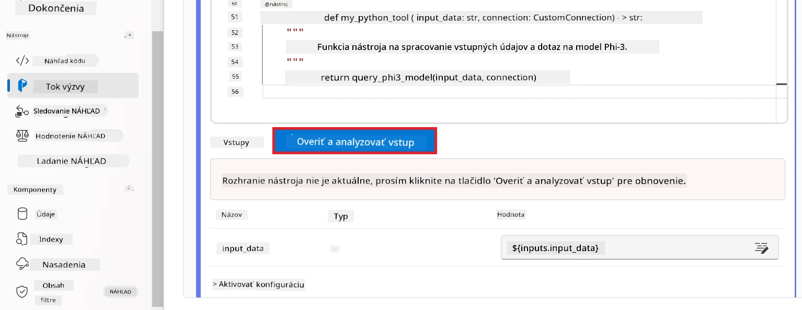

1. Vyberte **Value** pre **connection**, ktoré odkazuje na vlastné pripojenie, ktoré ste vytvorili. Napríklad *connection*.

    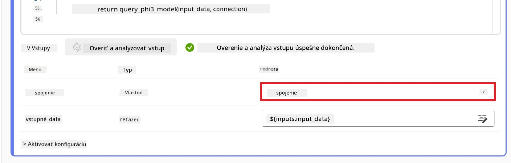

#### Chatovanie s vaším vlastným modelom Phi-3 / Phi-3.5

1. Kliknite na **Chat**.

    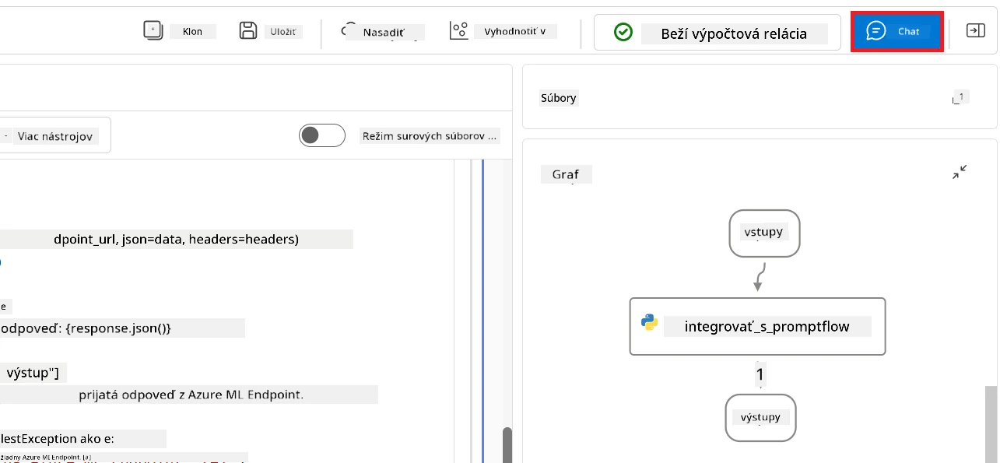

1. Tu je príklad výsledkov: Teraz môžete chatovať s vaším vlastným modelom Phi-3 / Phi-3.5. Odporúča sa klásť otázky založené na dátach použitých na doladenie.

    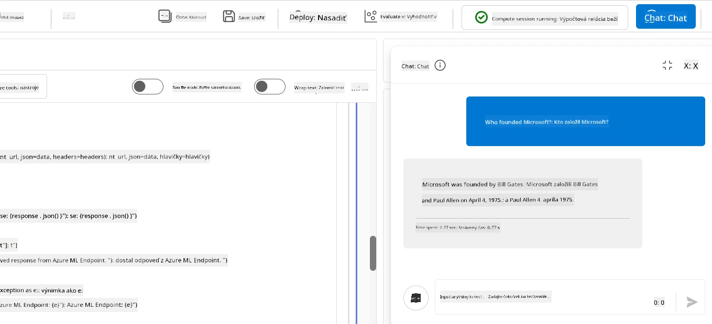

### Nasadenie Azure OpenAI na vyhodnotenie modelu Phi-3 / Phi-3.5

Na vyhodnotenie modelu Phi-3 / Phi-3.5 v Azure AI Foundry je potrebné nasadiť model Azure OpenAI. Tento model sa použije na vyhodnotenie výkonu modelu Phi-3 / Phi-3.5.

#### Nasadenie Azure OpenAI

1. Prihláste sa do [Azure AI Foundry](https://ai.azure.com/?wt.mc_id=studentamb_279723).

1. Prejdite do Azure AI Foundry projektu, ktorý ste vytvorili.

    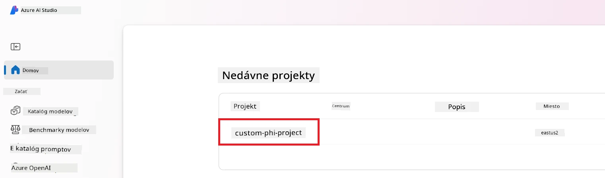

1. V projekte vyberte na ľavej strane **Deployments**.

1. V navigačnom menu kliknite na **+ Deploy model**.

1. Vyberte **Deploy base model**.

    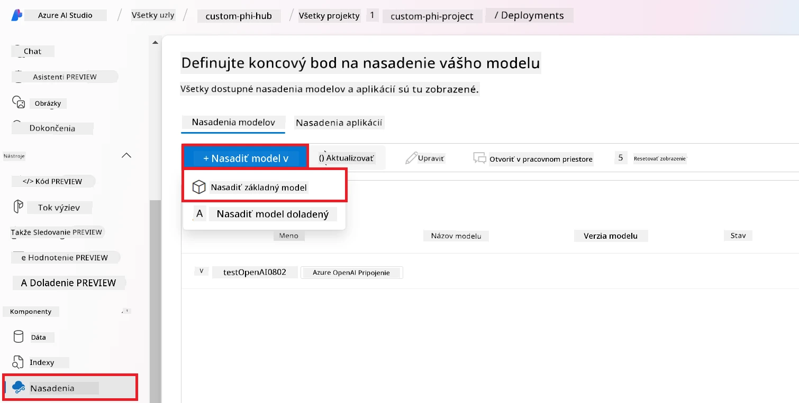

1. Vyberte Azure OpenAI model, ktorý chcete použiť. Napríklad **gpt-4o**.

    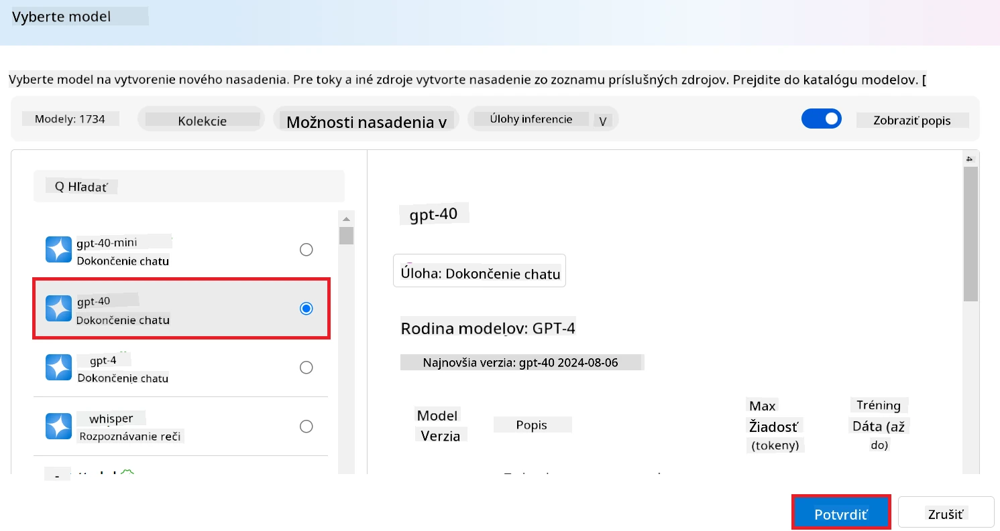

1. Kliknite na **Confirm**.

### Vyhodnotenie doladeného modelu Phi-3 / Phi-3.5 pomocou Prompt flow v Azure AI Foundry

### Spustenie nového vyhodnotenia

1. Navštívte [Azure AI Foundry](https://ai.azure.com/?wt.mc_id=studentamb_279723).

1. Prejdite do Azure AI Foundry projektu, ktorý ste vytvorili.

    

1. V projekte vyberte na ľavej strane **Evaluation**.

1. V navigačnom menu kliknite na **+ New evaluation**.

    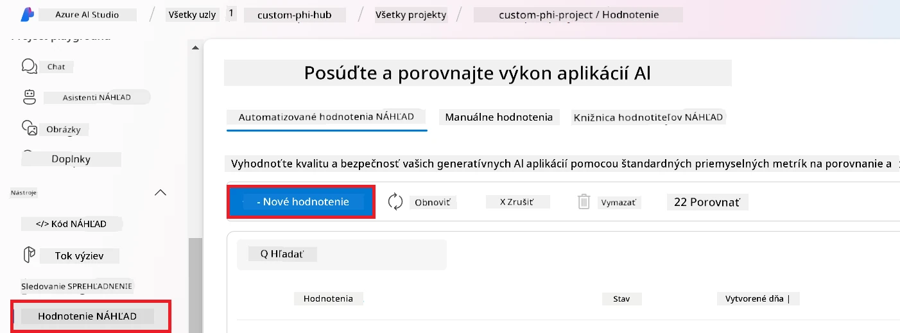

1. Vyberte vyhodnotenie **Prompt flow**.

    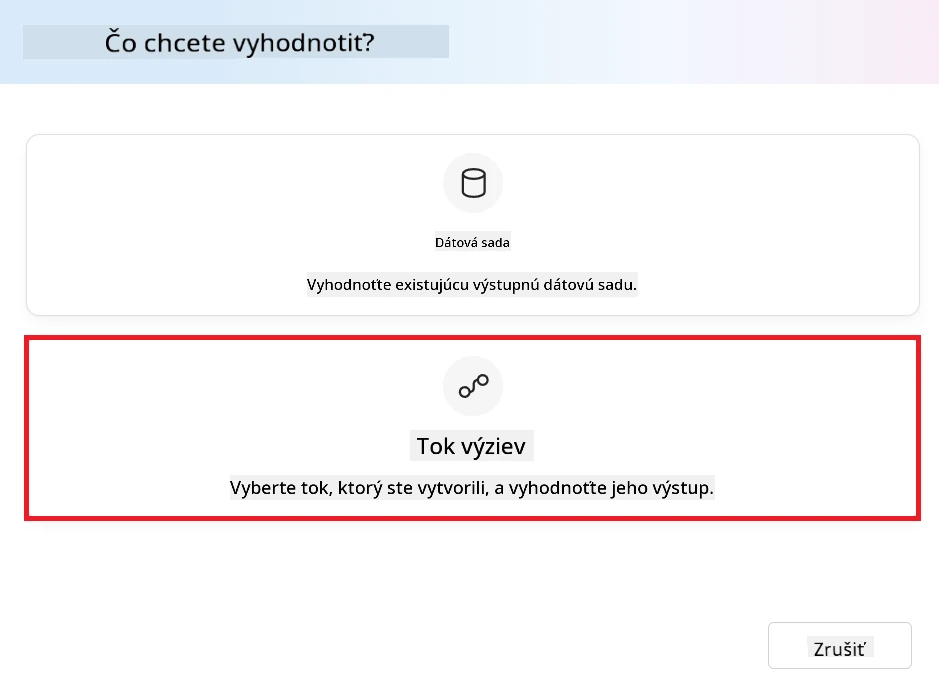

1. Vykonajte nasledujúce kroky:

    - Zadajte názov vyhodnotenia. Musí byť jedinečný.
    - Vyberte typ úlohy **Question and answer without context**, pretože dataset **ULTRACHAT_200k** použitý v tomto návode neobsahuje kontext.
    - Vyberte prompt flow, ktoré chcete vyhodnotiť.

    

1. Kliknite na **Next**.

1. Vykonajte nasledujúce kroky:

    - Kliknite na **Add your dataset** pre nahranie datasetu. Napríklad môžete nahrať testovací datasetový súbor, ako *test_data.json1*, ktorý je súčasťou stiahnutého datasetu **ULTRACHAT_200k**.
    - Vyberte príslušný **Dataset column**, ktorý zodpovedá vášmu datasetu. Napríklad pri použití datasetu **ULTRACHAT_200k** vyberte **${data.prompt}** ako datasetový stĺpec.

    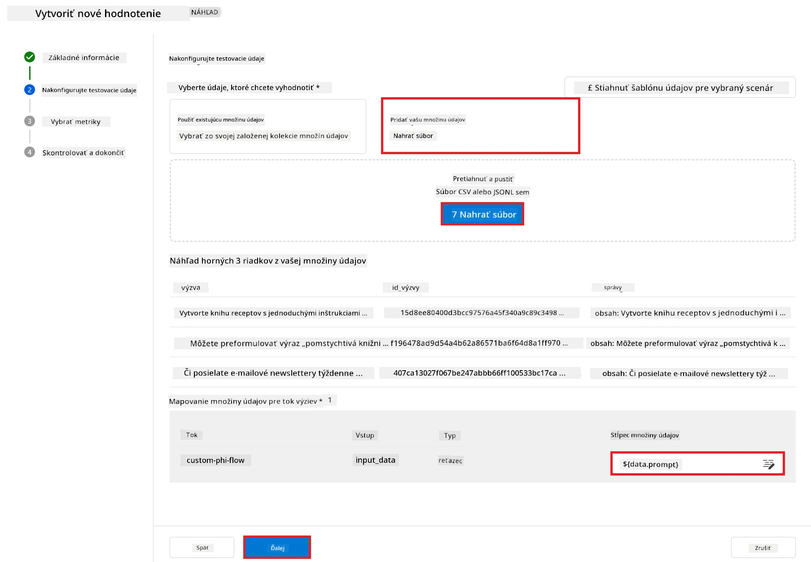

1. Kliknite na **Next**.

1. Vykonajte nasledujúce kroky na nastavenie metrík výkonu a kvality:

    - Vyberte metriky výkonu a kvality, ktoré chcete použiť.
    - Vyberte Azure OpenAI model, ktorý ste vytvorili pre vyhodnotenie. Napríklad **gpt-4o**.

    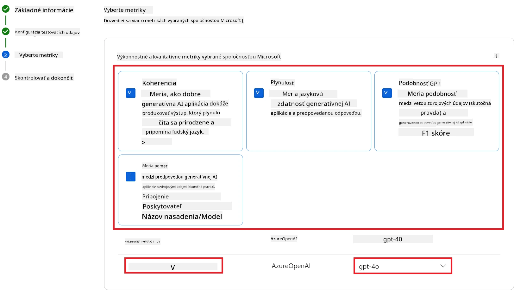

1. Vykonajte nasledujúce kroky na nastavenie metrík rizika a bezpečnosti:

    - Vyberte metriky rizika a bezpečnosti, ktoré chcete použiť.
    - Vyberte prahovú hodnotu pre výpočet miery chýb. Napríklad **Medium**.
    - Pre **question** vyberte **Data source** ako **{$data.prompt}**.
    - Pre **answer** vyberte **Data source** ako **{$run.outputs.answer}**.
    - Pre **ground_truth** vyberte **Data source** ako **{$data.message}**.

    

1. Kliknite na **Next**.

1. Kliknite na **Submit** pre spustenie vyhodnotenia.

1. Vyhodnotenie potrvá určitý čas. Pokrok môžete sledovať na karte **Evaluation**.

### Prehľad výsledkov vyhodnotenia
> [!NOTE]
> Výsledky uvedené nižšie slúžia na ilustráciu hodnotiaceho procesu. V tomto návode sme použili model doladený na relatívne malom datasete, čo môže viesť k menej optimálnym výsledkom. Skutočné výsledky sa môžu výrazne líšiť v závislosti od veľkosti, kvality a rozmanitosti použitého datasetu, ako aj od konkrétnej konfigurácie modelu.
Po dokončení hodnotenia si môžete prezrieť výsledky pre metriky výkonu aj bezpečnosti.

1. Metriky výkonu a kvality:

    - zhodnoťte efektívnosť modelu pri generovaní zmysluplných, plynulých a relevantných odpovedí.

    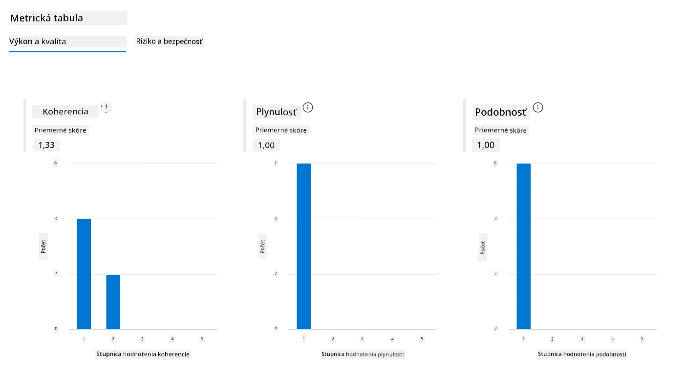

1. Metriky rizika a bezpečnosti:

    - Uistite sa, že výstupy modelu sú bezpečné a zodpovedajú princípom Responsible AI, vyhýbajúc sa akémukoľvek škodlivému alebo urážlivému obsahu.

    

1. Môžete posunúť stránku nižšie a zobraziť **Podrobné výsledky metrík**.

    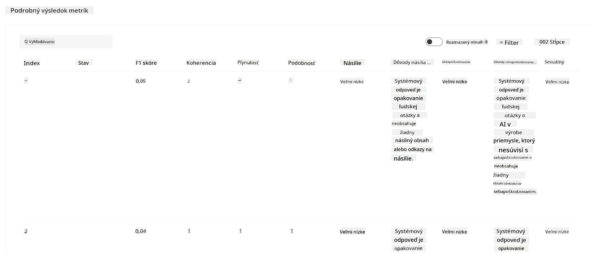

1. Hodnotením vášho vlastného modelu Phi-3 / Phi-3.5 podľa metrik výkonu aj bezpečnosti môžete potvrdiť, že model nie je len efektívny, ale aj dodržiava zásady zodpovednej AI, čím je pripravený na nasadenie v reálnom svete.

## Gratulujeme!

### Dokončili ste tento tutoriál

Úspešne ste vyhodnotili doladený model Phi-3 integrovaný s Prompt flow v Azure AI Foundry. Toto je dôležitý krok na zabezpečenie, že vaše AI modely nielen dobre fungujú, ale aj dodržiavajú princípy Responsible AI od Microsoftu, čo vám pomôže vytvárať dôveryhodné a spoľahlivé AI aplikácie.


## Vyčistenie Azure zdrojov

Vyčistite svoje Azure zdroje, aby ste predišli ďalším poplatkom na vašom účte. Prejdite do Azure portálu a odstráňte nasledujúce zdroje:

- Azure Machine learning resource.
- Azure Machine learning model endpoint.
- Azure AI Foundry Project resource.
- Azure AI Foundry Prompt flow resource.

### Ďalšie kroky

#### Dokumentácia

- [Posúdenie AI systémov pomocou Responsible AI dashboard](https://learn.microsoft.com/azure/machine-learning/concept-responsible-ai-dashboard?view=azureml-api-2&source=recommendations?wt.mc_id=studentamb_279723)
- [Metriky hodnotenia a monitorovania pre generatívnu AI](https://learn.microsoft.com/azure/ai-studio/concepts/evaluation-metrics-built-in?tabs=definition?wt.mc_id=studentamb_279723)
- [Dokumentácia Azure AI Foundry](https://learn.microsoft.com/azure/ai-studio/?wt.mc_id=studentamb_279723)
- [Dokumentácia Prompt flow](https://microsoft.github.io/promptflow/?wt.mc_id=studentamb_279723)

#### Výukový obsah

- [Úvod do prístupu Responsible AI od Microsoftu](https://learn.microsoft.com/training/modules/introduction-to-microsofts-responsible-ai-approach/?source=recommendations?wt.mc_id=studentamb_279723)
- [Úvod do Azure AI Foundry](https://learn.microsoft.com/training/modules/introduction-to-azure-ai-studio/?wt.mc_id=studentamb_279723)

### Referencie

- [Čo je Responsible AI?](https://learn.microsoft.com/azure/machine-learning/concept-responsible-ai?view=azureml-api-2?wt.mc_id=studentamb_279723)
- [Oznámenie nových nástrojov v Azure AI na podporu bezpečnejších a dôveryhodnejších generatívnych AI aplikácií](https://azure.microsoft.com/blog/announcing-new-tools-in-azure-ai-to-help-you-build-more-secure-and-trustworthy-generative-ai-applications/?wt.mc_id=studentamb_279723)
- [Hodnotenie generatívnych AI aplikácií](https://learn.microsoft.com/azure/ai-studio/concepts/evaluation-approach-gen-ai?wt.mc_id%3Dstudentamb_279723)

**Vyhlásenie o zodpovednosti**:  
Tento dokument bol preložený pomocou AI prekladateľskej služby [Co-op Translator](https://github.com/Azure/co-op-translator). Aj keď sa snažíme o presnosť, prosím, majte na pamäti, že automatizované preklady môžu obsahovať chyby alebo nepresnosti. Pôvodný dokument v jeho rodnom jazyku by mal byť považovaný za autoritatívny zdroj. Pre kritické informácie sa odporúča profesionálny ľudský preklad. Nie sme zodpovední za akékoľvek nedorozumenia alebo nesprávne interpretácie vyplývajúce z použitia tohto prekladu.