# Doladte a integrujte vlastné modely Phi-3 s Prompt flow

Tento end-to-end (E2E) príklad vychádza z návodu "[Doladte a integrujte vlastné modely Phi-3 s Prompt Flow: krok za krokom](https://techcommunity.microsoft.com/t5/educator-developer-blog/fine-tune-and-integrate-custom-phi-3-models-with-prompt-flow/ba-p/4178612?WT.mc_id=aiml-137032-kinfeylo)" z Microsoft Tech Community. Predstavuje procesy doladenia, nasadenia a integrácie vlastných modelov Phi-3 s Prompt flow.

## Prehľad

V tomto E2E príklade sa naučíte, ako doladiť model Phi-3 a integrovať ho s Prompt flow. Využitím Azure Machine Learning a Prompt flow si nastavíte pracovný postup na nasadzovanie a využívanie vlastných AI modelov. Tento E2E príklad je rozdelený do troch scenárov:

**Scenár 1: Nastavenie Azure zdrojov a príprava na doladenie**

**Scenár 2: Doladenie modelu Phi-3 a nasadenie v Azure Machine Learning Studio**

**Scenár 3: Integrácia s Prompt flow a chatovanie s vlastným modelom**

Tu je prehľad tohto E2E príkladu.

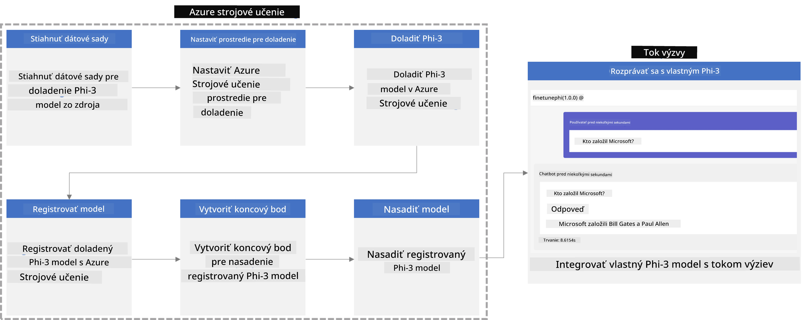

### Obsah

1. **[Scenár 1: Nastavenie Azure zdrojov a príprava na doladenie](../../../../../../md/02.Application/01.TextAndChat/Phi3)**
    - [Vytvorenie pracovného priestoru Azure Machine Learning](../../../../../../md/02.Application/01.TextAndChat/Phi3)
    - [Žiadosť o GPU kvóty v Azure Subscription](../../../../../../md/02.Application/01.TextAndChat/Phi3)
    - [Pridanie priradenia rolí](../../../../../../md/02.Application/01.TextAndChat/Phi3)
    - [Nastavenie projektu](../../../../../../md/02.Application/01.TextAndChat/Phi3)
    - [Príprava datasetu na doladenie](../../../../../../md/02.Application/01.TextAndChat/Phi3)

1. **[Scenár 2: Doladenie modelu Phi-3 a nasadenie v Azure Machine Learning Studio](../../../../../../md/02.Application/01.TextAndChat/Phi3)**
    - [Nastavenie Azure CLI](../../../../../../md/02.Application/01.TextAndChat/Phi3)
    - [Doladenie modelu Phi-3](../../../../../../md/02.Application/01.TextAndChat/Phi3)
    - [Nasadenie doladeného modelu](../../../../../../md/02.Application/01.TextAndChat/Phi3)

1. **[Scenár 3: Integrácia s Prompt flow a chatovanie s vlastným modelom](../../../../../../md/02.Application/01.TextAndChat/Phi3)**
    - [Integrácia vlastného modelu Phi-3 s Prompt flow](../../../../../../md/02.Application/01.TextAndChat/Phi3)
    - [Chatovanie s vlastným modelom](../../../../../../md/02.Application/01.TextAndChat/Phi3)

## Scenár 1: Nastavenie Azure zdrojov a príprava na doladenie

### Vytvorenie pracovného priestoru Azure Machine Learning

1. Do **vyhľadávacieho panela** v hornej časti stránky portálu zadajte *azure machine learning* a z možností, ktoré sa objavia, vyberte **Azure Machine Learning**.

    

1. Z ponuky na navigačnom paneli vyberte **+ Create**.

1. Z ponuky na navigačnom paneli vyberte **New workspace**.

    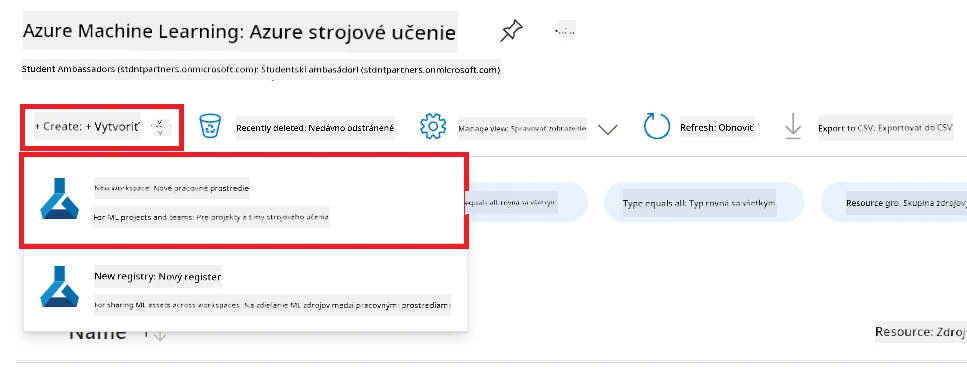

1. Vykonajte nasledovné kroky:

    - Vyberte svoj Azure **Subscription**.
    - Vyberte **Resource group**, ktorú chcete použiť (v prípade potreby vytvorte novú).
    - Zadajte **Názov pracovného priestoru**. Musí byť jedinečný.
    - Vyberte **Región**, ktorý chcete použiť.
    - Vyberte **Storage account**, ktorý chcete použiť (v prípade potreby vytvorte nový).
    - Vyberte **Key vault**, ktorý chcete použiť (v prípade potreby vytvorte nový).
    - Vyberte **Application insights**, ktorý chcete použiť (v prípade potreby vytvorte nový).
    - Vyberte **Container registry**, ktorý chcete použiť (v prípade potreby vytvorte nový).

    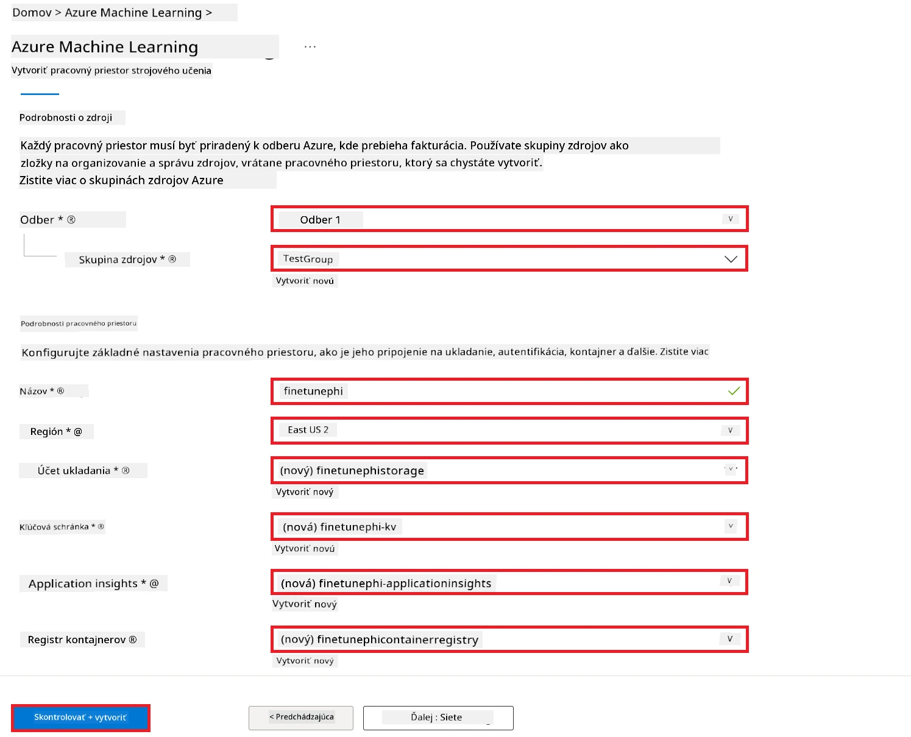

1. Vyberte **Review + Create**.

1. Vyberte **Create**.

### Žiadosť o GPU kvóty v Azure Subscription

V tomto E2E príklade použijete *Standard_NC24ads_A100_v4 GPU* na doladenie, ktorý vyžaduje žiadosť o kvótu, a *Standard_E4s_v3* CPU na nasadenie, ktorý nevyžaduje žiadosť o kvótu.

> [!NOTE]
>
> Len predplatné typu Pay-As-You-Go (štandardný typ predplatného) má nárok na pridelenie GPU; predplatné typu benefit zatiaľ nie je podporované.
>
> Pre používateľov benefitných predplatných (napr. Visual Studio Enterprise Subscription) alebo tých, ktorí chcú rýchlo otestovať proces doladenia a nasadenia, tento návod tiež poskytuje rady pre doladenie s minimálnym datasetom pomocou CPU. Je však dôležité poznamenať, že výsledky doladenia sú významne lepšie pri použití GPU s väčšími datasetmi.

1. Navštívte [Azure ML Studio](https://ml.azure.com/home?wt.mc_id=studentamb_279723).

1. Vykonajte nasledovné kroky, aby ste požiadali o kvótu *Standard NCADSA100v4 Family*:

    - Vyberte **Quota** na ľavom bočnom paneli.
    - Vyberte **Rodinu virtuálnych strojov**, ktorú chcete použiť. Napríklad vyberte **Standard NCADSA100v4 Family Cluster Dedicated vCPUs**, ktorá obsahuje *Standard_NC24ads_A100_v4* GPU.
    - Vyberte **Request quota** na navigačnom paneli.

        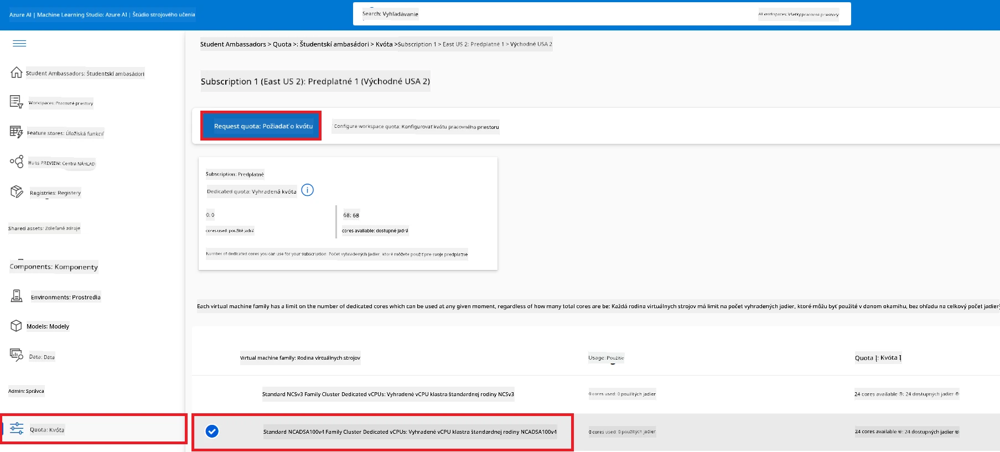

    - Na stránke Request quota zadajte **Nový limit jadier** (New cores limit), ktorý chcete použiť. Napríklad 24.
    - Na stránke Request quota vyberte **Submit** na podanie žiadosti o GPU kvótu.

> [!NOTE]
> Môžete si vybrať vhodný GPU alebo CPU podľa svojich potrieb podľa dokumentu [Sizes for Virtual Machines in Azure](https://learn.microsoft.com/azure/virtual-machines/sizes/overview?tabs=breakdownseries%2Cgeneralsizelist%2Ccomputesizelist%2Cmemorysizelist%2Cstoragesizelist%2Cgpusizelist%2Cfpgasizelist%2Chpcsizelist).

### Pridanie priradenia rolí

Na doladenie a nasadenie modelov je potrebné najprv vytvoriť User Assigned Managed Identity (UAI) a priradiť jej príslušné oprávnenia. Táto UAI sa bude používať na autentifikáciu počas nasadenia.

#### Vytvorenie User Assigned Managed Identity (UAI)

1. Do **vyhľadávacieho panela** v hornej časti stránky portálu zadajte *managed identities* a z možností vyberte **Managed Identities**.

    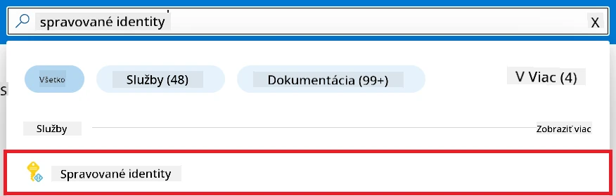

1. Vyberte **+ Create**.

    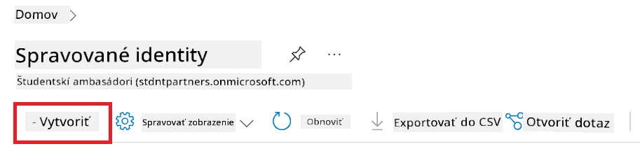

1. Vykonajte nasledovné kroky:

    - Vyberte Azure **Subscription**.
    - Vyberte **Resource group**, ktorú chcete použiť (v prípade potreby vytvorte novú).
    - Vyberte **Región**, ktorý chcete použiť.
    - Zadajte **Názov**. Musí byť jedinečný.

1. Vyberte **Review + create**.

1. Vyberte **+ Create**.

#### Pridanie priradenia roly Contributor do Managed Identity

1. Prejdite do zdroja Managed Identity, ktorý ste vytvorili.

1. Na ľavom bočnom paneli vyberte **Azure role assignments**.

1. Na navigačnom paneli vyberte **+Add role assignment**.

1. Na stránke Add role assignment vykonajte nasledovné úlohy:
    - Vyberte **Scope** na **Resource group**.
    - Vyberte svoj Azure **Subscription**.
    - Vyberte **Resource group**, ktorú chcete použiť.
    - Vyberte rolu **Contributor**.

    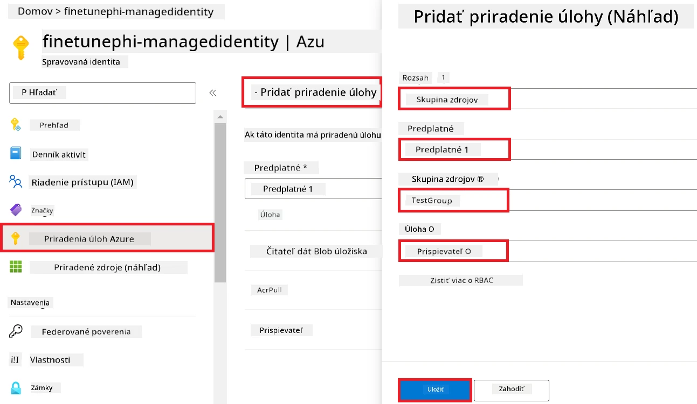

1. Vyberte **Save**.

#### Pridanie priradenia roly Storage Blob Data Reader do Managed Identity

1. Do **vyhľadávacieho panela** v hornej časti stránky portálu zadajte *storage accounts* a z možností vyberte **Storage accounts**.

    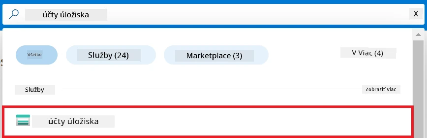

1. Vyberte storage účet, ktorý je priradený k Azure Machine Learning pracovisku, ktoré ste vytvorili. Napríklad, *finetunephistorage*.

1. Vykonajte nasledovné kroky na navigáciu do stránky Add role assignment:

    - Prejdite do Azure Storage konta, ktoré ste vytvorili.
    - Na ľavom bočnom paneli vyberte **Access Control (IAM)**.
    - Na navigačnom paneli vyberte **+ Add**.
    - Vyberte **Add role assignment**.

    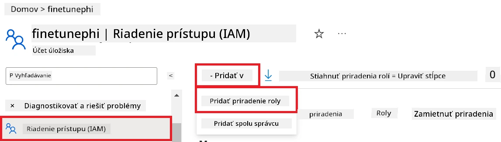

1. Na stránke Add role assignment vykonajte nasledovné úlohy:

    - Na stránke Role zadajte do **vyhľadávacieho panela** *Storage Blob Data Reader* a vyberte **Storage Blob Data Reader** z možností.
    - Na stránke Role vyberte **Next**.
    - Na stránke Members vyberte **Assign access to** možnosť **Managed identity**.
    - Na stránke Members vyberte **+ Select members**.
    - Na stránke Select managed identities vyberte svoj Azure **Subscription**.
    - Na stránke Select managed identities vyberte **Managed identity** ako **Manage Identity**.
    - Na stránke Select managed identities vyberte Manage Identity, ktorú ste vytvorili. Napríklad, *finetunephi-managedidentity*.
    - Na stránke Select managed identities vyberte **Select**.

    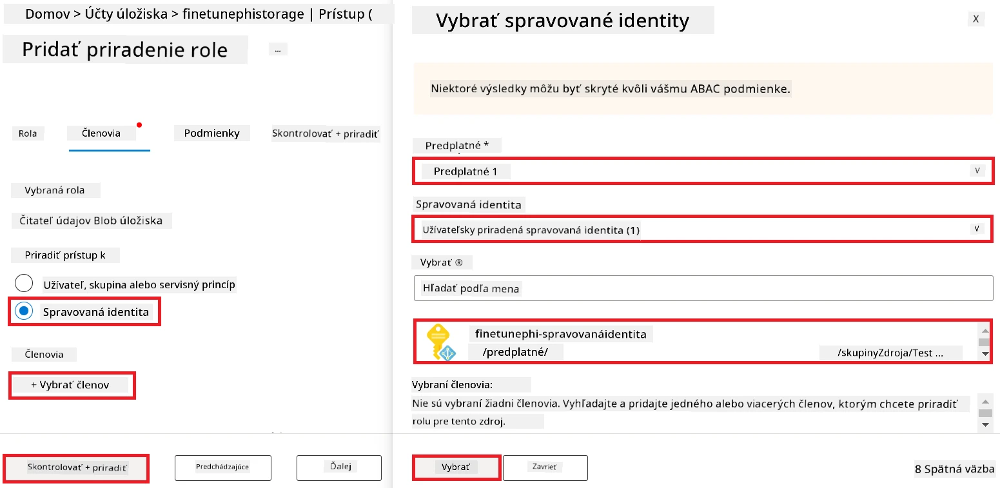

1. Vyberte **Review + assign**.

#### Pridanie priradenia roly AcrPull do Managed Identity

1. Do **vyhľadávacieho panela** v hornej časti stránky portálu zadajte *container registries* a z možností vyberte **Container registries**.

    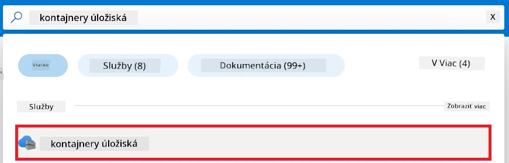

1. Vyberte kontajnerový register, ktorý je priradený k Azure Machine Learning pracovisku. Napríklad, *finetunephicontainerregistries*.

1. Vykonajte nasledovné kroky na navigáciu do stránky Add role assignment:

    - Na ľavom bočnom paneli vyberte **Access Control (IAM)**.
    - Na navigačnom paneli vyberte **+ Add**.
    - Vyberte **Add role assignment**.

1. Na stránke Add role assignment vykonajte nasledovné úlohy:

    - Na stránke Role zadajte do **vyhľadávacieho panela** *AcrPull* a vyberte **AcrPull** z možností.
    - Na stránke Role vyberte **Next**.
    - Na stránke Members vyberte **Assign access to** možnosť **Managed identity**.
    - Na stránke Members vyberte **+ Select members**.
    - Na stránke Select managed identities vyberte svoj Azure **Subscription**.
    - Na stránke Select managed identities vyberte **Managed identity** ako **Manage Identity**.
    - Na stránke Select managed identities vyberte Manage Identity, ktorú ste vytvorili. Napríklad, *finetunephi-managedidentity*.
    - Na stránke Select managed identities vyberte **Select**.
    - Vyberte **Review + assign**.

### Nastavenie projektu

Teraz vytvoríte priečinok, v ktorom budete pracovať, a nastavíte virtuálne prostredie na vývoj programu, ktorý bude komunikovať s používateľmi a využívať uloženú históriu chatu z Azure Cosmos DB na informovanie svojich odpovedí.

#### Vytvorenie priečinka, v ktorom budete pracovať

1. Otvorte terminálové okno a zadajte nasledujúci príkaz na vytvorenie priečinka s názvom *finetune-phi* v predvolenej ceste.

    ```console
    mkdir finetune-phi
    ```

1. Zadajte nasledujúci príkaz v termináli na prechod do priečinka *finetune-phi*, ktorý ste vytvorili.

    ```console
    cd finetune-phi
    ```

#### Vytvorenie virtuálneho prostredia

1. Zadajte nasledujúci príkaz v termináli na vytvorenie virtuálneho prostredia s názvom *.venv*.

    ```console
    python -m venv .venv
    ```

1. Zadajte nasledujúci príkaz v termináli na aktivovanie virtuálneho prostredia.

    ```console
    .venv\Scripts\activate.bat
    ```

> [!NOTE]
>
> Ak to fungovalo, mali by ste vidieť *(.venv)* pred príkazovým riadkom.

#### Inštalácia požadovaných balíčkov

1. Zadajte nasledujúce príkazy v termináli na inštaláciu požadovaných balíčkov.

    ```console
    pip install datasets==2.19.1
    pip install transformers==4.41.1
    pip install azure-ai-ml==1.16.0
    pip install torch==2.3.1
    pip install trl==0.9.4
    pip install promptflow==1.12.0
    ```

#### Vytvorenie súborov projektu
V tomto cvičení vytvoríte základné súbory pre náš projekt. Tieto súbory obsahujú skripty na stiahnutie datasetu, nastavenie prostredia Azure Machine Learning, doladenie modelu Phi-3 a nasadenie doladeného modelu. Tiež vytvoríte súbor *conda.yml* na nastavenie prostredia pre doladenie.

V tomto cvičení budete:

- Vytvoriť súbor *download_dataset.py* na stiahnutie datasetu.
- Vytvoriť súbor *setup_ml.py* na nastavenie prostredia Azure Machine Learning.
- Vytvoriť súbor *fine_tune.py* v priečinku *finetuning_dir* na doladenie modelu Phi-3 pomocou datasetu.
- Vytvoriť súbor *conda.yml* na nastavenie prostredia pre doladenie.
- Vytvoriť súbor *deploy_model.py* na nasadenie doladeného modelu.
- Vytvoriť súbor *integrate_with_promptflow.py* na integráciu doladeného modelu a spustenie modelu pomocou Prompt flow.
- Vytvoriť súbor flow.dag.yml na nastavenie štruktúry workflow pre Prompt flow.
- Vytvoriť súbor *config.py* na zadanie informácií o Azure.

> [!NOTE]
>
> Kompletná štruktúra priečinkov:
>
> ```text
> └── YourUserName
> .    └── finetune-phi
> .        ├── finetuning_dir
> .        │      └── fine_tune.py
> .        ├── conda.yml
> .        ├── config.py
> .        ├── deploy_model.py
> .        ├── download_dataset.py
> .        ├── flow.dag.yml
> .        ├── integrate_with_promptflow.py
> .        └── setup_ml.py
> ```

1. Otvorte **Visual Studio Code**.

1. V menu vyberte **Súbor**.

1. Vyberte **Otvoriť priečinok**.

1. Vyberte priečinok *finetune-phi*, ktorý ste vytvorili, a ktorý sa nachádza na *C:\Users\yourUserName\finetune-phi*.

    

1. V ľavom paneli Visual Studio Code kliknite pravým tlačidlom myši a vyberte **Nový súbor**, aby ste vytvorili nový súbor s názvom *download_dataset.py*.

1. V ľavom paneli Visual Studio Code kliknite pravým tlačidlom myši a vyberte **Nový súbor**, aby ste vytvorili nový súbor s názvom *setup_ml.py*.

1. V ľavom paneli Visual Studio Code kliknite pravým tlačidlom myši a vyberte **Nový súbor**, aby ste vytvorili nový súbor s názvom *deploy_model.py*.

    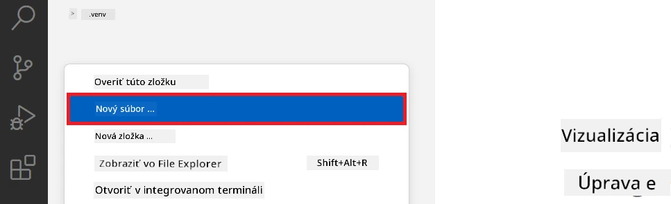

1. V ľavom paneli Visual Studio Code kliknite pravým tlačidlom myši a vyberte **Nový priečinok**, aby ste vytvorili nový priečinok s názvom *finetuning_dir*.

1. V priečinku *finetuning_dir* vytvorte nový súbor s názvom *fine_tune.py*.

#### Vytvorte a nakonfigurujte súbor *conda.yml*

1. V ľavom paneli Visual Studio Code kliknite pravým tlačidlom myši a vyberte **Nový súbor**, aby ste vytvorili nový súbor s názvom *conda.yml*.

1. Pridajte nasledujúci kód do súboru *conda.yml* na nastavenie prostredia pre doladenie modelu Phi-3.

    ```yml
    name: phi-3-training-env
    channels:
      - defaults
      - conda-forge
    dependencies:
      - python=3.10
      - pip
      - numpy<2.0
      - pip:
          - torch==2.4.0
          - torchvision==0.19.0
          - trl==0.8.6
          - transformers==4.41
          - datasets==2.21.0
          - azureml-core==1.57.0
          - azure-storage-blob==12.19.0
          - azure-ai-ml==1.16
          - azure-identity==1.17.1
          - accelerate==0.33.0
          - mlflow==2.15.1
          - azureml-mlflow==1.57.0
    ```

#### Vytvorte a nakonfigurujte súbor *config.py*

1. V ľavom paneli Visual Studio Code kliknite pravým tlačidlom myši a vyberte **Nový súbor**, aby ste vytvorili nový súbor s názvom *config.py*.

1. Pridajte nasledujúci kód do súboru *config.py* a zadajte svoje informácie o Azure.

    ```python
    # Nastavenia Azure
    AZURE_SUBSCRIPTION_ID = "your_subscription_id"
    AZURE_RESOURCE_GROUP_NAME = "your_resource_group_name" # "TestGroup"

    # Nastavenia Azure Machine Learning
    AZURE_ML_WORKSPACE_NAME = "your_workspace_name" # "finetunephi-workspace"

    # Nastavenia Azure Managed Identity
    AZURE_MANAGED_IDENTITY_CLIENT_ID = "your_azure_managed_identity_client_id"
    AZURE_MANAGED_IDENTITY_NAME = "your_azure_managed_identity_name" # "finetunephi-mangedidentity"
    AZURE_MANAGED_IDENTITY_RESOURCE_ID = f"/subscriptions/{AZURE_SUBSCRIPTION_ID}/resourceGroups/{AZURE_RESOURCE_GROUP_NAME}/providers/Microsoft.ManagedIdentity/userAssignedIdentities/{AZURE_MANAGED_IDENTITY_NAME}"

    # Cesty k súborom datasetu
    TRAIN_DATA_PATH = "data/train_data.jsonl"
    TEST_DATA_PATH = "data/test_data.jsonl"

    # Nastavenia doladiteľného modelu
    AZURE_MODEL_NAME = "your_fine_tuned_model_name" # "finetune-phi-model"
    AZURE_ENDPOINT_NAME = "your_fine_tuned_model_endpoint_name" # "finetune-phi-endpoint"
    AZURE_DEPLOYMENT_NAME = "your_fine_tuned_model_deployment_name" # "finetune-phi-deployment"

    AZURE_ML_API_KEY = "your_fine_tuned_model_api_key"
    AZURE_ML_ENDPOINT = "your_fine_tuned_model_endpoint_uri" # "https://{your-endpoint-name}.{your-region}.inference.ml.azure.com/score"
    ```

#### Pridajte premenné prostredia Azure

1. Pre pridanie Azure Subscription ID vykonajte nasledujúce kroky:

    - Do **vyhľadávacieho poľa** hore na portálovej stránke zadajte *subscriptions* a vyberte **Subscriptions** z ponúk, ktoré sa zobrazia.
    - Vyberte Azure Subscription, ktorú aktuálne používate.
    - Skopírujte a vložte svoje Subscription ID do súboru *config.py*.

    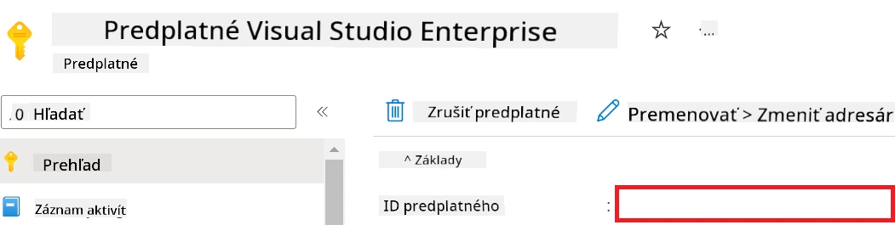

1. Pre pridanie názvu Azure Workspace vykonajte nasledujúce kroky:

    - Prejdite na Azure Machine Learning zdroj, ktorý ste vytvorili.
    - Skopírujte a vložte názov svojho konta do súboru *config.py*.

    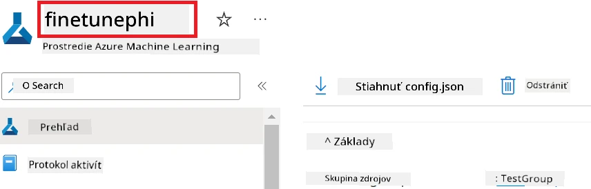

1. Pre pridanie názvu Azure Resource Group vykonajte nasledujúce kroky:

    - Prejdite na Azure Machine Learning zdroj, ktorý ste vytvorili.
    - Skopírujte a vložte názov Azure Resource Group do súboru *config.py*.

    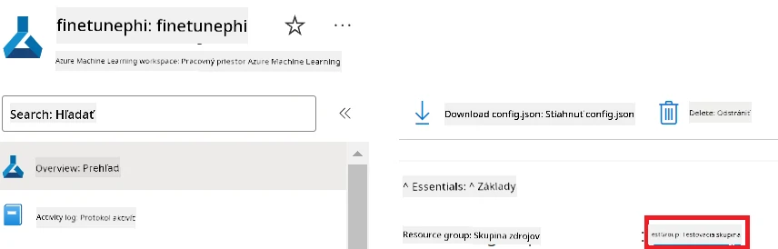

2. Pre pridanie názvu Azure Managed Identity vykonajte nasledujúce kroky:

    - Prejdite na Managed Identities zdroj, ktorý ste vytvorili.
    - Skopírujte a vložte názov Azure Managed Identity do súboru *config.py*.

    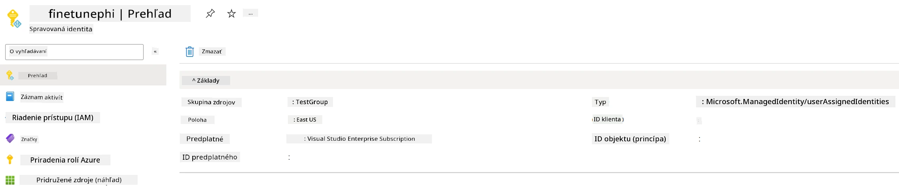

### Pripravte dataset pre doladenie

V tomto cvičení spustíte súbor *download_dataset.py* na stiahnutie datasetu *ULTRACHAT_200k* do svojho lokálneho prostredia. Tento dataset následne použijete na doladenie modelu Phi-3 v Azure Machine Learning.

#### Stiahnite si svoj dataset pomocou *download_dataset.py*

1. Otvorte súbor *download_dataset.py* vo Visual Studio Code.

1. Pridajte do súboru *download_dataset.py* nasledujúci kód.

    ```python
    import json
    import os
    from datasets import load_dataset
    from config import (
        TRAIN_DATA_PATH,
        TEST_DATA_PATH)

    def load_and_split_dataset(dataset_name, config_name, split_ratio):
        """
        Load and split a dataset.
        """
        # Načítajte dataset so zadaným názvom, konfiguráciou a pomerom rozdelenia
        dataset = load_dataset(dataset_name, config_name, split=split_ratio)
        print(f"Original dataset size: {len(dataset)}")
        
        # Rozdeľte dataset na tréningovú a testovaciu množinu (80% trénovanie, 20% test)
        split_dataset = dataset.train_test_split(test_size=0.2)
        print(f"Train dataset size: {len(split_dataset['train'])}")
        print(f"Test dataset size: {len(split_dataset['test'])}")
        
        return split_dataset

    def save_dataset_to_jsonl(dataset, filepath):
        """
        Save a dataset to a JSONL file.
        """
        # Vytvorte priečinok, ak ešte neexistuje
        os.makedirs(os.path.dirname(filepath), exist_ok=True)
        
        # Otvorte súbor v režime zápisu
        with open(filepath, 'w', encoding='utf-8') as f:
            # Prejdite každý záznam v datasete
            for record in dataset:
                # Uložte záznam ako JSON objekt a zapíšte ho do súboru
                json.dump(record, f)
                # Zapíšte znak nového riadku na oddelenie záznamov
                f.write('\n')
        
        print(f"Dataset saved to {filepath}")

    def main():
        """
        Main function to load, split, and save the dataset.
        """
        # Načítajte a rozdeľte dataset ULTRACHAT_200k so špecifickou konfiguráciou a pomerom
        dataset = load_and_split_dataset("HuggingFaceH4/ultrachat_200k", 'default', 'train_sft[:1%]')
        
        # Extrahujte tréningový a testovací dataset z rozdelenia
        train_dataset = dataset['train']
        test_dataset = dataset['test']

        # Uložte tréningový dataset do súboru formátu JSONL
        save_dataset_to_jsonl(train_dataset, TRAIN_DATA_PATH)
        
        # Uložte testovací dataset do samostatného súboru JSONL
        save_dataset_to_jsonl(test_dataset, TEST_DATA_PATH)

    if __name__ == "__main__":
        main()

    ```

> [!TIP]
>
> **Návod na doladenie s minimálnym datasetom pomocou CPU**
>
> Ak chcete použiť CPU na doladenie, tento prístup je ideálny pre tých, ktorí majú benefitové predplatné (napríklad Visual Studio Enterprise Subscription) alebo na rýchle otestovanie procesu doladenia a nasadenia.
>
> Nahraďte `dataset = load_and_split_dataset("HuggingFaceH4/ultrachat_200k", 'default', 'train_sft[:1%]')` výrazom `dataset = load_and_split_dataset("HuggingFaceH4/ultrachat_200k", 'default', 'train_sft[:10]')`
>

1. Zadajte nasledujúci príkaz v termináli na spustenie skriptu a stiahnutie datasetu do svojho lokálneho prostredia.

    ```console
    python download_data.py
    ```

1. Overte, že dataset bol úspešne uložený do vášho lokálneho adresára *finetune-phi/data*.

> [!NOTE]
>
> **Veľkosť datasetu a čas doladenia**
>
> V tomto príklade E2E sa používa iba 1 % datasetu (`train_sft[:1%]`). Toto výrazne zníži množstvo dát, čím sa zrýchli nahrávanie aj proces doladenia. Môžete upraviť percento podľa potreby a nájsť správnu rovnováhu medzi časom tréningu a výkonom modelu. Použitie menšej časti datasetu znižuje čas potrebný na doladenie, čo robí proces zvládnuteľnejším pre príklad E2E.

## Scenár 2: Doladenie modelu Phi-3 a nasadenie v Azure Machine Learning Studio

### Nastavenie Azure CLI

Je potrebné nastaviť Azure CLI na autentifikáciu vášho prostredia. Azure CLI umožňuje spravovať Azure zdroje priamo z príkazového riadku a poskytuje poverenia potrebné pre Azure Machine Learning na prístup k týmto zdrojom. Na začiatok nainštalujte [Azure CLI](https://learn.microsoft.com/cli/azure/install-azure-cli)

1. Otvorte terminálové okno a zadajte nasledujúci príkaz na prihlásenie do svojho Azure účtu.

    ```console
    az login
    ```

1. Vyberte svoj Azure účet.

1. Vyberte predplatné Azure, ktoré chcete použiť.

    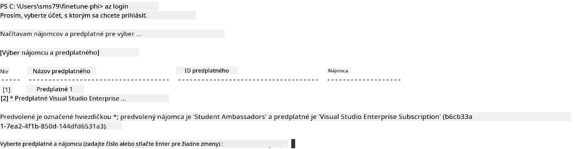

> [!TIP]
>
> Ak máte problémy s prihlásením do Azure, vyskúšajte použiť zariadenie kód. Otvorte terminál a zadajte nasledujúci príkaz na prihlásenie do Azure účtu:
>
> ```console
> az login --use-device-code
> ```
>

### Doladenie modelu Phi-3

V tomto cvičení doladíte model Phi-3 pomocou poskytnutého datasetu. Najskôr definujete proces doladenia v súbore *fine_tune.py*. Potom nakonfigurujete prostredie Azure Machine Learning a spustíte proces doladenia spustením súboru *setup_ml.py*. Tento skript zabezpečí, že doladenie prebehne v prostredí Azure Machine Learning.

Spustením *setup_ml.py* spustíte proces doladenia v prostredí Azure Machine Learning.

#### Pridajte kód do súboru *fine_tune.py*

1. Prejdite do priečinku *finetuning_dir* a otvorte súbor *fine_tune.py* vo Visual Studio Code.

1. Pridajte nasledujúci kód do súboru *fine_tune.py*.

    ```python
    import argparse
    import sys
    import logging
    import os
    from datasets import load_dataset
    import torch
    import mlflow
    from transformers import AutoModelForCausalLM, AutoTokenizer, TrainingArguments
    from trl import SFTTrainer

    # Aby ste sa vyhli chybe INVALID_PARAMETER_VALUE v MLflow, deaktivujte integráciu MLflow
    os.environ["DISABLE_MLFLOW_INTEGRATION"] = "True"

    # Nastavenie logovania
    logging.basicConfig(
        format="%(asctime)s - %(levelname)s - %(name)s - %(message)s",
        datefmt="%Y-%m-%d %H:%M:%S",
        handlers=[logging.StreamHandler(sys.stdout)],
        level=logging.WARNING
    )
    logger = logging.getLogger(__name__)

    def initialize_model_and_tokenizer(model_name, model_kwargs):
        """
        Initialize the model and tokenizer with the given pretrained model name and arguments.
        """
        model = AutoModelForCausalLM.from_pretrained(model_name, **model_kwargs)
        tokenizer = AutoTokenizer.from_pretrained(model_name)
        tokenizer.model_max_length = 2048
        tokenizer.pad_token = tokenizer.unk_token
        tokenizer.pad_token_id = tokenizer.convert_tokens_to_ids(tokenizer.pad_token)
        tokenizer.padding_side = 'right'
        return model, tokenizer

    def apply_chat_template(example, tokenizer):
        """
        Apply a chat template to tokenize messages in the example.
        """
        messages = example["messages"]
        if messages[0]["role"] != "system":
            messages.insert(0, {"role": "system", "content": ""})
        example["text"] = tokenizer.apply_chat_template(
            messages, tokenize=False, add_generation_prompt=False
        )
        return example

    def load_and_preprocess_data(train_filepath, test_filepath, tokenizer):
        """
        Load and preprocess the dataset.
        """
        train_dataset = load_dataset('json', data_files=train_filepath, split='train')
        test_dataset = load_dataset('json', data_files=test_filepath, split='train')
        column_names = list(train_dataset.features)

        train_dataset = train_dataset.map(
            apply_chat_template,
            fn_kwargs={"tokenizer": tokenizer},
            num_proc=10,
            remove_columns=column_names,
            desc="Applying chat template to train dataset",
        )

        test_dataset = test_dataset.map(
            apply_chat_template,
            fn_kwargs={"tokenizer": tokenizer},
            num_proc=10,
            remove_columns=column_names,
            desc="Applying chat template to test dataset",
        )

        return train_dataset, test_dataset

    def train_and_evaluate_model(train_dataset, test_dataset, model, tokenizer, output_dir):
        """
        Train and evaluate the model.
        """
        training_args = TrainingArguments(
            bf16=True,
            do_eval=True,
            output_dir=output_dir,
            eval_strategy="epoch",
            learning_rate=5.0e-06,
            logging_steps=20,
            lr_scheduler_type="cosine",
            num_train_epochs=3,
            overwrite_output_dir=True,
            per_device_eval_batch_size=4,
            per_device_train_batch_size=4,
            remove_unused_columns=True,
            save_steps=500,
            seed=0,
            gradient_checkpointing=True,
            gradient_accumulation_steps=1,
            warmup_ratio=0.2,
        )

        trainer = SFTTrainer(
            model=model,
            args=training_args,
            train_dataset=train_dataset,
            eval_dataset=test_dataset,
            max_seq_length=2048,
            dataset_text_field="text",
            tokenizer=tokenizer,
            packing=True
        )

        train_result = trainer.train()
        trainer.log_metrics("train", train_result.metrics)

        mlflow.transformers.log_model(
            transformers_model={"model": trainer.model, "tokenizer": tokenizer},
            artifact_path=output_dir,
        )

        tokenizer.padding_side = 'left'
        eval_metrics = trainer.evaluate()
        eval_metrics["eval_samples"] = len(test_dataset)
        trainer.log_metrics("eval", eval_metrics)

    def main(train_file, eval_file, model_output_dir):
        """
        Main function to fine-tune the model.
        """
        model_kwargs = {
            "use_cache": False,
            "trust_remote_code": True,
            "torch_dtype": torch.bfloat16,
            "device_map": None,
            "attn_implementation": "eager"
        }

        # pretrained_model_name = "microsoft/Phi-3-mini-4k-instruct"
        pretrained_model_name = "microsoft/Phi-3.5-mini-instruct"

        with mlflow.start_run():
            model, tokenizer = initialize_model_and_tokenizer(pretrained_model_name, model_kwargs)
            train_dataset, test_dataset = load_and_preprocess_data(train_file, eval_file, tokenizer)
            train_and_evaluate_model(train_dataset, test_dataset, model, tokenizer, model_output_dir)

    if __name__ == "__main__":
        parser = argparse.ArgumentParser()
        parser.add_argument("--train-file", type=str, required=True, help="Path to the training data")
        parser.add_argument("--eval-file", type=str, required=True, help="Path to the evaluation data")
        parser.add_argument("--model_output_dir", type=str, required=True, help="Directory to save the fine-tuned model")
        args = parser.parse_args()
        main(args.train_file, args.eval_file, args.model_output_dir)

    ```

1. Uložte a zatvorte súbor *fine_tune.py*.

> [!TIP]
> **Môžete doladiť model Phi-3.5**
>
> V súbore *fine_tune.py* môžete zmeniť `pretrained_model_name` z `"microsoft/Phi-3-mini-4k-instruct"` na akýkoľvek model, ktorý chcete doladiť. Napríklad, ak zmeníte na `"microsoft/Phi-3.5-mini-instruct"`, budete používať model Phi-3.5-mini-instruct pre doladenie. Ak chcete nájsť a použiť preferovaný názov modelu, navštívte [Hugging Face](https://huggingface.co/), vyhľadajte model, o ktorý máte záujem, a skopírujte jeho názov do poľa `pretrained_model_name` vo vašom skripte.
>
> <image type="content" src="../../../../imgs/02/FineTuning-PromptFlow/finetunephi3.5.png" alt-text="Doladiť model Phi-3.5.">
>

#### Pridajte kód do súboru *setup_ml.py*

1. Otvorte súbor *setup_ml.py* vo Visual Studio Code.

1. Pridajte nasledujúci kód do súboru *setup_ml.py*.

    ```python
    import logging
    from azure.ai.ml import MLClient, command, Input
    from azure.ai.ml.entities import Environment, AmlCompute
    from azure.identity import AzureCliCredential
    from config import (
        AZURE_SUBSCRIPTION_ID,
        AZURE_RESOURCE_GROUP_NAME,
        AZURE_ML_WORKSPACE_NAME,
        TRAIN_DATA_PATH,
        TEST_DATA_PATH
    )

    # Konštanty

    # Odkomentujte nasledujúce riadky na použitie inštancie CPU na trénovanie
    # COMPUTE_INSTANCE_TYPE = "Standard_E16s_v3" # cpu
    # COMPUTE_NAME = "cpu-e16s-v3"
    # DOCKER_IMAGE_NAME = "mcr.microsoft.com/azureml/openmpi4.1.0-ubuntu20.04:latest"

    # Odkomentujte nasledujúce riadky na použitie inštancie GPU na trénovanie
    COMPUTE_INSTANCE_TYPE = "Standard_NC24ads_A100_v4"
    COMPUTE_NAME = "gpu-nc24s-a100-v4"
    DOCKER_IMAGE_NAME = "mcr.microsoft.com/azureml/curated/acft-hf-nlp-gpu:59"

    CONDA_FILE = "conda.yml"
    LOCATION = "eastus2" # Nahraďte umiestnením vášho výpočtového clusteru
    FINETUNING_DIR = "./finetuning_dir" # Cesta k skriptu na doladenie
    TRAINING_ENV_NAME = "phi-3-training-environment" # Názov tréningového prostredia
    MODEL_OUTPUT_DIR = "./model_output" # Cesta k adresáru výstupu modelu v Azure ML

    # Nastavenie logovania na sledovanie procesu
    logger = logging.getLogger(__name__)
    logging.basicConfig(
        format="%(asctime)s - %(levelname)s - %(name)s - %(message)s",
        datefmt="%Y-%m-%d %H:%M:%S",
        level=logging.WARNING
    )

    def get_ml_client():
        """
        Initialize the ML Client using Azure CLI credentials.
        """
        credential = AzureCliCredential()
        return MLClient(credential, AZURE_SUBSCRIPTION_ID, AZURE_RESOURCE_GROUP_NAME, AZURE_ML_WORKSPACE_NAME)

    def create_or_get_environment(ml_client):
        """
        Create or update the training environment in Azure ML.
        """
        env = Environment(
            image=DOCKER_IMAGE_NAME,  # Docker image pre prostredie
            conda_file=CONDA_FILE,  # Súbor conda prostredia
            name=TRAINING_ENV_NAME,  # Názov prostredia
        )
        return ml_client.environments.create_or_update(env)

    def create_or_get_compute_cluster(ml_client, compute_name, COMPUTE_INSTANCE_TYPE, location):
        """
        Create or update the compute cluster in Azure ML.
        """
        try:
            compute_cluster = ml_client.compute.get(compute_name)
            logger.info(f"Compute cluster '{compute_name}' already exists. Reusing it for the current run.")
        except Exception:
            logger.info(f"Compute cluster '{compute_name}' does not exist. Creating a new one with size {COMPUTE_INSTANCE_TYPE}.")
            compute_cluster = AmlCompute(
                name=compute_name,
                size=COMPUTE_INSTANCE_TYPE,
                location=location,
                tier="Dedicated",  # Úroveň výpočtového clusteru
                min_instances=0,  # Minimálny počet inštancií
                max_instances=1  # Maximálny počet inštancií
            )
            ml_client.compute.begin_create_or_update(compute_cluster).wait()  # Počkajte na vytvorenie clusteru
        return compute_cluster

    def create_fine_tuning_job(env, compute_name):
        """
        Set up the fine-tuning job in Azure ML.
        """
        return command(
            code=FINETUNING_DIR,  # Cesta k fine_tune.py
            command=(
                "python fine_tune.py "
                "--train-file ${{inputs.train_file}} "
                "--eval-file ${{inputs.eval_file}} "
                "--model_output_dir ${{inputs.model_output}}"
            ),
            environment=env,  # Tréningové prostredie
            compute=compute_name,  # Výpočtový cluster na použitie
            inputs={
                "train_file": Input(type="uri_file", path=TRAIN_DATA_PATH),  # Cesta k súboru tréningových dát
                "eval_file": Input(type="uri_file", path=TEST_DATA_PATH),  # Cesta k súboru evaluačných dát
                "model_output": MODEL_OUTPUT_DIR
            }
        )

    def main():
        """
        Main function to set up and run the fine-tuning job in Azure ML.
        """
        # Inicializovať ML klienta
        ml_client = get_ml_client()

        # Vytvoriť prostredie
        env = create_or_get_environment(ml_client)
        
        # Vytvoriť alebo získať existujúci výpočtový cluster
        create_or_get_compute_cluster(ml_client, COMPUTE_NAME, COMPUTE_INSTANCE_TYPE, LOCATION)

        # Vytvoriť a odoslať job na doladenie
        job = create_fine_tuning_job(env, COMPUTE_NAME)
        returned_job = ml_client.jobs.create_or_update(job)  # Odoslať job
        ml_client.jobs.stream(returned_job.name)  # Streamovať logy jobu
        
        # Zachytiť názov jobu
        job_name = returned_job.name
        print(f"Job name: {job_name}")

    if __name__ == "__main__":
        main()

    ```

1. Nahraďte `COMPUTE_INSTANCE_TYPE`, `COMPUTE_NAME` a `LOCATION` svojimi konkrétnymi údajmi.

    ```python
   # Odkomentujte nasledujúce riadky pre použitie GPU inštancie na trénovanie
    COMPUTE_INSTANCE_TYPE = "Standard_NC24ads_A100_v4"
    COMPUTE_NAME = "gpu-nc24s-a100-v4"
    ...
    LOCATION = "eastus2" # Nahraďte umiestnením vášho výpočtového zhluku
    ```

> [!TIP]
>
> **Návod na doladenie s minimálnym datasetom pomocou CPU**
>
> Ak chcete použiť CPU na doladenie, tento prístup je ideálny pre tých, ktorí majú benefitové predplatné (napríklad Visual Studio Enterprise Subscription) alebo na rýchle otestovanie procesu doladenia a nasadenia.
>
> 1. Otvorte súbor *setup_ml*.
> 1. Nahraďte `COMPUTE_INSTANCE_TYPE`, `COMPUTE_NAME` a `DOCKER_IMAGE_NAME` nasledovne. Ak nemáte prístup k *Standard_E16s_v3*, môžete použiť ekvivalentnú CPU inštanciu alebo požiadať o nový kvót.
> 1. Nahraďte `LOCATION` svojimi konkrétnymi údajmi.
>
>    ```python
>    # Uncomment the following lines to use a CPU instance for training
>    COMPUTE_INSTANCE_TYPE = "Standard_E16s_v3" # cpu
>    COMPUTE_NAME = "cpu-e16s-v3"
>    DOCKER_IMAGE_NAME = "mcr.microsoft.com/azureml/openmpi4.1.0-ubuntu20.04:latest"
>    LOCATION = "eastus2" # Replace with the location of your compute cluster
>    ```
>

1. Zadajte nasledujúci príkaz na spustenie skriptu *setup_ml.py* a začatie procesu doladenia v Azure Machine Learning.

    ```python
    python setup_ml.py
    ```

1. V tomto cvičení ste úspešne doladili model Phi-3 pomocou Azure Machine Learning. Spustením skriptu *setup_ml.py* ste nastavili prostredie Azure Machine Learning a iniciovali proces doladenia definovaný v súbore *fine_tune.py*. Upozorňujeme, že proces doladenia môže trvať dlhší čas. Po zadaní príkazu `python setup_ml.py` je potrebné čakať na dokončenie procesu. Stav doladenia môžete sledovať pomocou odkazu v termináli, ktorý vedie do portálu Azure Machine Learning.

    

### Nasadenie doladeného modelu

Na integráciu doladeného modelu Phi-3 s Prompt Flow je potrebné model nasadiť, aby bol dostupný pre inferenciu v reálnom čase. Tento proces zahŕňa registráciu modelu, vytvorenie online endpointu a nasadenie modelu.

#### Nastavenie názvu modelu, názvu endpointu a názvu nasadenia

1. Otvorte súbor *config.py*.

1. Nahradte `AZURE_MODEL_NAME = "your_fine_tuned_model_name"` požadovaným názvom vášho modelu.

1. Nahradte `AZURE_ENDPOINT_NAME = "your_fine_tuned_model_endpoint_name"` požadovaným názvom vášho endpointu.

1. Nahradte `AZURE_DEPLOYMENT_NAME = "your_fine_tuned_model_deployment_name"` požadovaným názvom vášho nasadenia.

#### Pridajte kód do súboru *deploy_model.py*

Spustením súboru *deploy_model.py* automatizujete celý proces nasadenia. Skript zaregistruje model, vytvorí endpoint a spustí nasadenie na základe nastavení v súbore *config.py*, ktorý obsahuje názov modelu, názov endpointu a názov nasadenia.

1. Otvorte súbor *deploy_model.py* vo Visual Studio Code.

1. Pridajte do súboru *deploy_model.py* nasledujúci kód.

    ```python
    import logging
    from azure.identity import AzureCliCredential
    from azure.ai.ml import MLClient
    from azure.ai.ml.entities import Model, ProbeSettings, ManagedOnlineEndpoint, ManagedOnlineDeployment, IdentityConfiguration, ManagedIdentityConfiguration, OnlineRequestSettings
    from azure.ai.ml.constants import AssetTypes

    # Importy konfigurácie
    from config import (
        AZURE_SUBSCRIPTION_ID,
        AZURE_RESOURCE_GROUP_NAME,
        AZURE_ML_WORKSPACE_NAME,
        AZURE_MANAGED_IDENTITY_RESOURCE_ID,
        AZURE_MANAGED_IDENTITY_CLIENT_ID,
        AZURE_MODEL_NAME,
        AZURE_ENDPOINT_NAME,
        AZURE_DEPLOYMENT_NAME
    )

    # Konštanty
    JOB_NAME = "your-job-name"
    COMPUTE_INSTANCE_TYPE = "Standard_E4s_v3"

    deployment_env_vars = {
        "SUBSCRIPTION_ID": AZURE_SUBSCRIPTION_ID,
        "RESOURCE_GROUP_NAME": AZURE_RESOURCE_GROUP_NAME,
        "UAI_CLIENT_ID": AZURE_MANAGED_IDENTITY_CLIENT_ID,
    }

    # Nastavenie logovania
    logging.basicConfig(
        format="%(asctime)s - %(levelname)s - %(name)s - %(message)s",
        datefmt="%Y-%m-%d %H:%M:%S",
        level=logging.DEBUG
    )
    logger = logging.getLogger(__name__)

    def get_ml_client():
        """Initialize and return the ML Client."""
        credential = AzureCliCredential()
        return MLClient(credential, AZURE_SUBSCRIPTION_ID, AZURE_RESOURCE_GROUP_NAME, AZURE_ML_WORKSPACE_NAME)

    def register_model(ml_client, model_name, job_name):
        """Register a new model."""
        model_path = f"azureml://jobs/{job_name}/outputs/artifacts/paths/model_output"
        logger.info(f"Registering model {model_name} from job {job_name} at path {model_path}.")
        run_model = Model(
            path=model_path,
            name=model_name,
            description="Model created from run.",
            type=AssetTypes.MLFLOW_MODEL,
        )
        model = ml_client.models.create_or_update(run_model)
        logger.info(f"Registered model ID: {model.id}")
        return model

    def delete_existing_endpoint(ml_client, endpoint_name):
        """Delete existing endpoint if it exists."""
        try:
            endpoint_result = ml_client.online_endpoints.get(name=endpoint_name)
            logger.info(f"Deleting existing endpoint {endpoint_name}.")
            ml_client.online_endpoints.begin_delete(name=endpoint_name).result()
            logger.info(f"Deleted existing endpoint {endpoint_name}.")
        except Exception as e:
            logger.info(f"No existing endpoint {endpoint_name} found to delete: {e}")

    def create_or_update_endpoint(ml_client, endpoint_name, description=""):
        """Create or update an endpoint."""
        delete_existing_endpoint(ml_client, endpoint_name)
        logger.info(f"Creating new endpoint {endpoint_name}.")
        endpoint = ManagedOnlineEndpoint(
            name=endpoint_name,
            description=description,
            identity=IdentityConfiguration(
                type="user_assigned",
                user_assigned_identities=[ManagedIdentityConfiguration(resource_id=AZURE_MANAGED_IDENTITY_RESOURCE_ID)]
            )
        )
        endpoint_result = ml_client.online_endpoints.begin_create_or_update(endpoint).result()
        logger.info(f"Created new endpoint {endpoint_name}.")
        return endpoint_result

    def create_or_update_deployment(ml_client, endpoint_name, deployment_name, model):
        """Create or update a deployment."""

        logger.info(f"Creating deployment {deployment_name} for endpoint {endpoint_name}.")
        deployment = ManagedOnlineDeployment(
            name=deployment_name,
            endpoint_name=endpoint_name,
            model=model.id,
            instance_type=COMPUTE_INSTANCE_TYPE,
            instance_count=1,
            environment_variables=deployment_env_vars,
            request_settings=OnlineRequestSettings(
                max_concurrent_requests_per_instance=3,
                request_timeout_ms=180000,
                max_queue_wait_ms=120000
            ),
            liveness_probe=ProbeSettings(
                failure_threshold=30,
                success_threshold=1,
                period=100,
                initial_delay=500,
            ),
            readiness_probe=ProbeSettings(
                failure_threshold=30,
                success_threshold=1,
                period=100,
                initial_delay=500,
            ),
        )
        deployment_result = ml_client.online_deployments.begin_create_or_update(deployment).result()
        logger.info(f"Created deployment {deployment.name} for endpoint {endpoint_name}.")
        return deployment_result

    def set_traffic_to_deployment(ml_client, endpoint_name, deployment_name):
        """Set traffic to the specified deployment."""
        try:
            # Získanie aktuálnych podrobností koncového bodu
            endpoint = ml_client.online_endpoints.get(name=endpoint_name)
            
            # Zaznamenanie aktuálneho prerozdelenia prevádzky na ladenie
            logger.info(f"Current traffic allocation: {endpoint.traffic}")
            
            # Nastavenie prerozdelenia prevádzky pre nasadenie
            endpoint.traffic = {deployment_name: 100}
            
            # Aktualizácia koncového bodu s novým prerozdelením prevádzky
            endpoint_poller = ml_client.online_endpoints.begin_create_or_update(endpoint)
            updated_endpoint = endpoint_poller.result()
            
            # Zaznamenanie aktualizovaného prerozdelenia prevádzky na ladenie
            logger.info(f"Updated traffic allocation: {updated_endpoint.traffic}")
            logger.info(f"Set traffic to deployment {deployment_name} at endpoint {endpoint_name}.")
            return updated_endpoint
        except Exception as e:
            # Zaznamenanie všetkých chýb, ktoré sa vyskytnú počas procesu
            logger.error(f"Failed to set traffic to deployment: {e}")
            raise


    def main():
        ml_client = get_ml_client()

        registered_model = register_model(ml_client, AZURE_MODEL_NAME, JOB_NAME)
        logger.info(f"Registered model ID: {registered_model.id}")

        endpoint = create_or_update_endpoint(ml_client, AZURE_ENDPOINT_NAME, "Endpoint for finetuned Phi-3 model")
        logger.info(f"Endpoint {AZURE_ENDPOINT_NAME} is ready.")

        try:
            deployment = create_or_update_deployment(ml_client, AZURE_ENDPOINT_NAME, AZURE_DEPLOYMENT_NAME, registered_model)
            logger.info(f"Deployment {AZURE_DEPLOYMENT_NAME} is created for endpoint {AZURE_ENDPOINT_NAME}.")

            set_traffic_to_deployment(ml_client, AZURE_ENDPOINT_NAME, AZURE_DEPLOYMENT_NAME)
            logger.info(f"Traffic is set to deployment {AZURE_DEPLOYMENT_NAME} at endpoint {AZURE_ENDPOINT_NAME}.")
        except Exception as e:
            logger.error(f"Failed to create or update deployment: {e}")

    if __name__ == "__main__":
        main()

    ```

1. Na získanie `JOB_NAME` vykonajte nasledujúce kroky:

    - Prejdite na Azure Machine Learning zdroj, ktorý ste vytvorili.
    - Vyberte **Studio web URL** na otvorenie Azure Machine Learning workspace.
    - Z ľavej bočnej ponuky vyberte **Jobs**.
    - Vyberte experimenet pre doladenie, napríklad *finetunephi*.
    - Vyberte job, ktorý ste vytvorili.
- Skopírujte a vložte názov svojej úlohy do `JOB_NAME = "your-job-name"` v súbore *deploy_model.py*.

1. Nahraďte `COMPUTE_INSTANCE_TYPE` vašimi konkrétnymi údajmi.

1. Zadajte nasledujúci príkaz na spustenie skriptu *deploy_model.py* a začatie procesu nasadenia v Azure Machine Learning.

    ```python
    python deploy_model.py
    ```

> [!WARNING]
> Aby ste predišli dodatočným poplatkom na vašom účte, uistite sa, že odstránite vytvorený endpoint v pracovnom priestore Azure Machine Learning.
>

#### Skontrolujte stav nasadenia v pracovnom priestore Azure Machine Learning

1. Navštívte [Azure ML Studio](https://ml.azure.com/home?wt.mc_id=studentamb_279723).

1. Prejdite do pracovného priestoru Azure Machine Learning, ktorý ste vytvorili.

1. Vyberte **Studio web URL** na otvorenie pracovného priestoru Azure Machine Learning.

1. Vyberte **Endpoints** z ľavého bočného menu.

    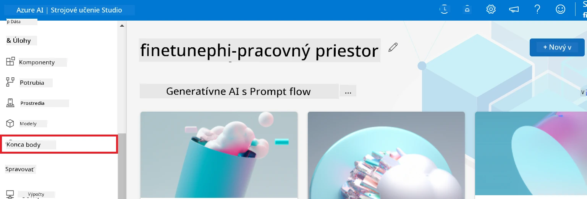

2. Vyberte endpoint, ktorý ste vytvorili.

    

3. Na tejto stránke môžete spravovať endpointy vytvorené počas procesu nasadenia.

## Scenár 3: Integrácia s Prompt flow a chatovanie s vaším vlastným modelom

### Integrujte vlastný Phi-3 model s Prompt flow

Po úspešnom nasadení vášho doladeného modelu ho teraz môžete integrovať s Prompt flow, aby ste mohli svoj model používať v reálnych aplikáciách, čím umožníte rôzne interaktívne úlohy s vaším vlastným modelom Phi-3.

#### Nastavte api kľúč a endpoint uri doladeného modelu Phi-3

1. Prejdite do pracovného priestoru Azure Machine Learning, ktorý ste vytvorili.
1. Vyberte **Endpoints** z ľavého bočného menu.
1. Vyberte endpoint, ktorý ste vytvorili.
1. Vyberte **Consume** v navigačnom menu.
1. Skopírujte a vložte svoj **REST endpoint** do súboru *config.py*, nahradzujúc `AZURE_ML_ENDPOINT = "your_fine_tuned_model_endpoint_uri"` vaším **REST endpointom**.
1. Skopírujte a vložte svoj **Primárny kľúč** do súboru *config.py*, nahradzujúc `AZURE_ML_API_KEY = "your_fine_tuned_model_api_key"` vaším **Primárnym kľúčom**.

    

#### Pridajte kód do súboru *flow.dag.yml*

1. Otvorte súbor *flow.dag.yml* vo Visual Studio Code.

1. Pridajte nasledujúci kód do *flow.dag.yml*.

    ```yml
    inputs:
      input_data:
        type: string
        default: "Who founded Microsoft?"

    outputs:
      answer:
        type: string
        reference: ${integrate_with_promptflow.output}

    nodes:
    - name: integrate_with_promptflow
      type: python
      source:
        type: code
        path: integrate_with_promptflow.py
      inputs:
        input_data: ${inputs.input_data}
    ```

#### Pridajte kód do súboru *integrate_with_promptflow.py*

1. Otvorte súbor *integrate_with_promptflow.py* vo Visual Studio Code.

1. Pridajte nasledujúci kód do *integrate_with_promptflow.py*.

    ```python
    import logging
    import requests
    from promptflow.core import tool
    import asyncio
    import platform
    from config import (
        AZURE_ML_ENDPOINT,
        AZURE_ML_API_KEY
    )

    # Nastavenie protokolovania
    logging.basicConfig(
        format="%(asctime)s - %(levelname)s - %(name)s - %(message)s",
        datefmt="%Y-%m-%d %H:%M:%S",
        level=logging.DEBUG
    )
    logger = logging.getLogger(__name__)

    def query_azml_endpoint(input_data: list, endpoint_url: str, api_key: str) -> str:
        """
        Send a request to the Azure ML endpoint with the given input data.
        """
        headers = {
            "Content-Type": "application/json",
            "Authorization": f"Bearer {api_key}"
        }
        data = {
            "input_data": [input_data],
            "params": {
                "temperature": 0.7,
                "max_new_tokens": 128,
                "do_sample": True,
                "return_full_text": True
            }
        }
        try:
            response = requests.post(endpoint_url, json=data, headers=headers)
            response.raise_for_status()
            result = response.json()[0]
            logger.info("Successfully received response from Azure ML Endpoint.")
            return result
        except requests.exceptions.RequestException as e:
            logger.error(f"Error querying Azure ML Endpoint: {e}")
            raise

    def setup_asyncio_policy():
        """
        Setup asyncio event loop policy for Windows.
        """
        if platform.system() == 'Windows':
            asyncio.set_event_loop_policy(asyncio.WindowsSelectorEventLoopPolicy())
            logger.info("Set Windows asyncio event loop policy.")

    @tool
    def my_python_tool(input_data: str) -> str:
        """
        Tool function to process input data and query the Azure ML endpoint.
        """
        setup_asyncio_policy()
        return query_azml_endpoint(input_data, AZURE_ML_ENDPOINT, AZURE_ML_API_KEY)

    ```

### Chatovanie s vaším vlastným modelom

1. Zadajte nasledujúci príkaz na spustenie skriptu *deploy_model.py* a začatie procesu nasadenia v Azure Machine Learning.

    ```python
    pf flow serve --source ./ --port 8080 --host localhost
    ```

1. Tu je príklad výsledkov: Teraz môžete chatovať s vaším vlastným modelom Phi-3. Odporúča sa klásť otázky založené na údajoch použitých na doladenie.

    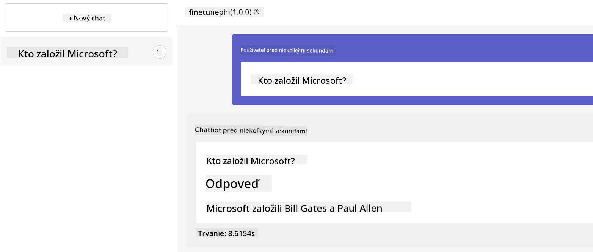

---

<!-- CO-OP TRANSLATOR DISCLAIMER START -->
**Zrieknutie sa zodpovednosti**:  
Tento dokument bol preložený pomocou AI prekladateľskej služby [Co-op Translator](https://github.com/Azure/co-op-translator). Hoci sa snažíme o presnosť, berte prosím na vedomie, že automatizované preklady môžu obsahovať chyby alebo nepresnosti. Pôvodný dokument v jeho rodnom jazyku by sa mal považovať za autoritatívny zdroj. Pre kľúčové informácie odporúčame profesionálny ľudský preklad. Nie sme zodpovední za akékoľvek nedorozumenia alebo nesprávne výklady vyplývajúce z použitia tohto prekladu.
<!-- CO-OP TRANSLATOR DISCLAIMER END -->