<!--
CO_OP_TRANSLATOR_METADATA:
{
  "original_hash": "ecbd9179a21edbaafaf114d47f09f3e3",
  "translation_date": "2025-05-09T18:23:26+00:00",
  "source_file": "md/02.Application/01.TextAndChat/Phi3/E2E_Phi-3-FineTuning_PromptFlow_Integration_AIFoundry.md",
  "language_code": "sk"
}
-->
# Doladiť a integrovať vlastné modely Phi-3 s Prompt flow v Azure AI Foundry

Tento komplexný (E2E) príklad vychádza z návodu "[Fine-Tune and Integrate Custom Phi-3 Models with Prompt Flow in Azure AI Foundry](https://techcommunity.microsoft.com/t5/educator-developer-blog/fine-tune-and-integrate-custom-phi-3-models-with-prompt-flow-in/ba-p/4191726?WT.mc_id=aiml-137032-kinfeylo)" z Microsoft Tech Community. Predstavuje procesy doladenia, nasadenia a integrácie vlastných modelov Phi-3 s Prompt flow v Azure AI Foundry. Na rozdiel od E2E príkladu "[Fine-Tune and Integrate Custom Phi-3 Models with Prompt Flow](./E2E_Phi-3-FineTuning_PromptFlow_Integration.md)", ktorý zahŕňal spúšťanie kódu lokálne, sa tento tutoriál sústreďuje výhradne na doladenie a integráciu vášho modelu priamo v Azure AI / ML Studio.

## Prehľad

V tomto E2E príklade sa naučíte, ako doladiť model Phi-3 a integrovať ho s Prompt flow v Azure AI Foundry. Využitím Azure AI / ML Studia si nastavíte pracovný tok pre nasadenie a používanie vlastných AI modelov. Tento E2E príklad je rozdelený do troch scénarov:

**Scenár 1: Nastavenie Azure zdrojov a príprava na doladenie**

**Scenár 2: Doladenie modelu Phi-3 a nasadenie v Azure Machine Learning Studio**

**Scenár 3: Integrácia s Prompt flow a chatovanie s vaším vlastným modelom v Azure AI Foundry**

Tu je prehľad tohto E2E príkladu.

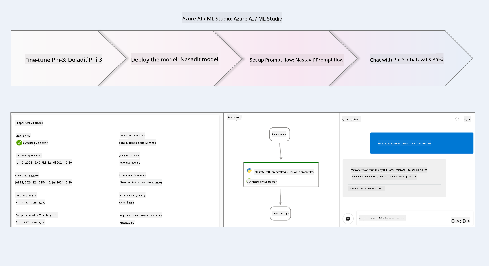

### Obsah

1. **[Scenár 1: Nastavenie Azure zdrojov a príprava na doladenie](../../../../../../md/02.Application/01.TextAndChat/Phi3)**
    - [Vytvorenie Azure Machine Learning Workspace](../../../../../../md/02.Application/01.TextAndChat/Phi3)
    - [Žiadosť o GPU kvóty v Azure Subscription](../../../../../../md/02.Application/01.TextAndChat/Phi3)
    - [Pridanie priradenia roly](../../../../../../md/02.Application/01.TextAndChat/Phi3)
    - [Nastavenie projektu](../../../../../../md/02.Application/01.TextAndChat/Phi3)
    - [Príprava datasetu na doladenie](../../../../../../md/02.Application/01.TextAndChat/Phi3)

1. **[Scenár 2: Doladenie modelu Phi-3 a nasadenie v Azure Machine Learning Studio](../../../../../../md/02.Application/01.TextAndChat/Phi3)**
    - [Doladenie modelu Phi-3](../../../../../../md/02.Application/01.TextAndChat/Phi3)
    - [Nasadenie doladeného modelu Phi-3](../../../../../../md/02.Application/01.TextAndChat/Phi3)

1. **[Scenár 3: Integrácia s Prompt flow a chatovanie s vaším vlastným modelom v Azure AI Foundry](../../../../../../md/02.Application/01.TextAndChat/Phi3)**
    - [Integrácia vlastného modelu Phi-3 s Prompt flow](../../../../../../md/02.Application/01.TextAndChat/Phi3)
    - [Chatovanie s vaším vlastným modelom Phi-3](../../../../../../md/02.Application/01.TextAndChat/Phi3)

## Scenár 1: Nastavenie Azure zdrojov a príprava na doladenie

### Vytvorenie Azure Machine Learning Workspace

1. Do **vyhľadávacieho poľa** v hornej časti portálu zadajte *azure machine learning* a z ponúkaných možností vyberte **Azure Machine Learning**.

    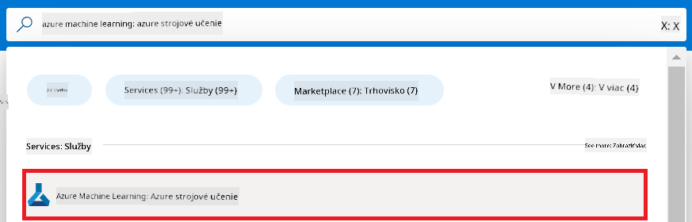

2. V navigačnom menu vyberte **+ Create**.

3. Zvoľte **New workspace**.

    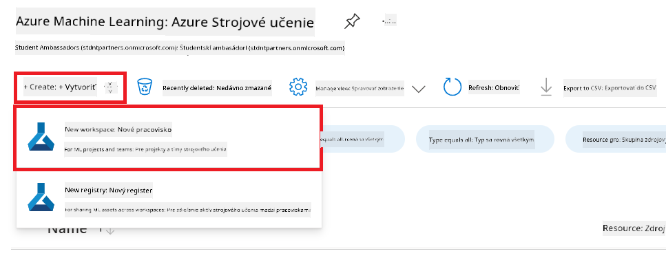

4. Vykonajte nasledovné kroky:

    - Vyberte vašu Azure **Subscription**.
    - Vyberte **Resource group** (vytvorte novú, ak je to potrebné).
    - Zadajte **Workspace Name**. Musí byť jedinečný.
    - Vyberte **Region**, ktorý chcete použiť.
    - Vyberte **Storage account** (vytvorte nový, ak je to potrebné).
    - Vyberte **Key vault** (vytvorte nový, ak je to potrebné).
    - Vyberte **Application insights** (vytvorte nový, ak je to potrebné).
    - Vyberte **Container registry** (vytvorte nový, ak je to potrebné).

    

5. Kliknite na **Review + Create**.

6. Kliknite na **Create**.

### Žiadosť o GPU kvóty v Azure Subscription

V tomto tutoriáli sa naučíte, ako doladiť a nasadiť model Phi-3 s využitím GPU. Na doladenie použijete GPU *Standard_NC24ads_A100_v4*, ktorá vyžaduje žiadosť o kvótu. Na nasadenie použijete GPU *Standard_NC6s_v3*, ktorá taktiež potrebuje žiadosť o kvótu.

> [!NOTE]
>
> Len predplatné typu Pay-As-You-Go (štandardný typ) je oprávnené na pridelenie GPU; benefitné predplatné momentálne nie je podporované.
>

1. Navštívte [Azure ML Studio](https://ml.azure.com/home?wt.mc_id=studentamb_279723).

1. Pre žiadosť o kvótu *Standard NCADSA100v4 Family* vykonajte nasledovné:

    - Vyberte **Quota** v ľavom paneli.
    - Vyberte **Virtual machine family**, napríklad **Standard NCADSA100v4 Family Cluster Dedicated vCPUs**, ktorá obsahuje GPU *Standard_NC24ads_A100_v4*.
    - Kliknite na **Request quota** v menu.

        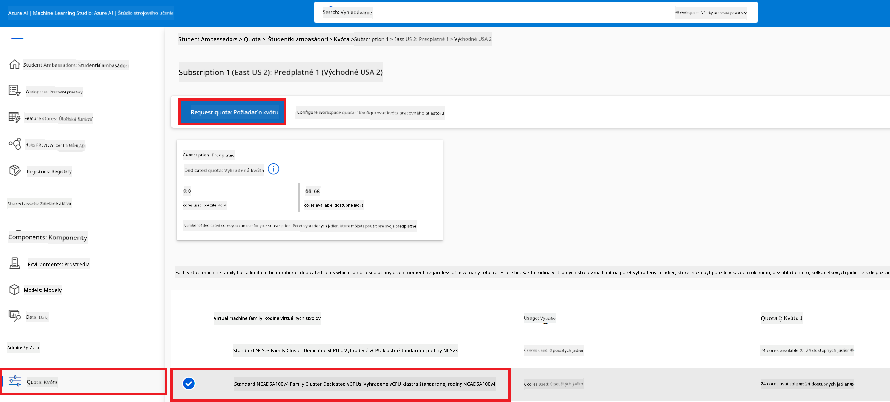

    - Na stránke Request quota zadajte **New cores limit**, napríklad 24.
    - Kliknite na **Submit** pre odoslanie žiadosti o GPU kvótu.

1. Pre žiadosť o kvótu *Standard NCSv3 Family* vykonajte nasledovné:

    - Vyberte **Quota** v ľavom paneli.
    - Vyberte **Virtual machine family**, napríklad **Standard NCSv3 Family Cluster Dedicated vCPUs**, ktorá obsahuje GPU *Standard_NC6s_v3*.
    - Kliknite na **Request quota** v menu.
    - Na stránke Request quota zadajte **New cores limit**, napríklad 24.
    - Kliknite na **Submit** pre odoslanie žiadosti o GPU kvótu.

### Pridanie priradenia roly

Na doladenie a nasadenie modelov musíte najprv vytvoriť User Assigned Managed Identity (UAI) a priradiť jej potrebné oprávnenia. Táto UAI bude použitá na autentifikáciu počas nasadenia.

#### Vytvorenie User Assigned Managed Identity (UAI)

1. Do **vyhľadávacieho poľa** v hornej časti portálu zadajte *managed identities* a vyberte **Managed Identities**.

    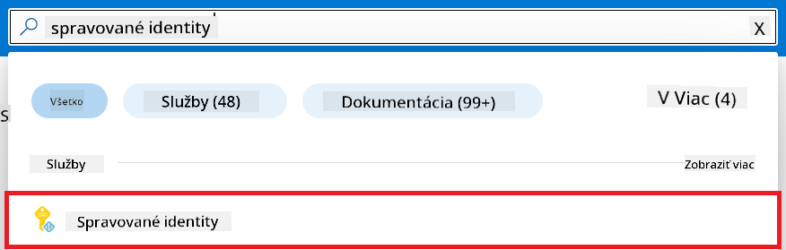

1. Kliknite na **+ Create**.

    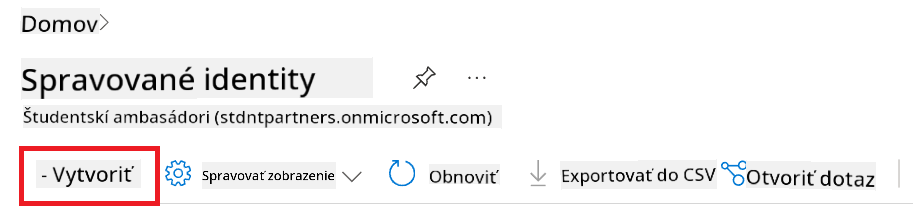

1. Vykonajte nasledovné:

    - Vyberte vašu Azure **Subscription**.
    - Vyberte **Resource group** (vytvorte novú, ak je to potrebné).
    - Vyberte **Region**, ktorý chcete použiť.
    - Zadajte **Name**. Musí byť jedinečný.

    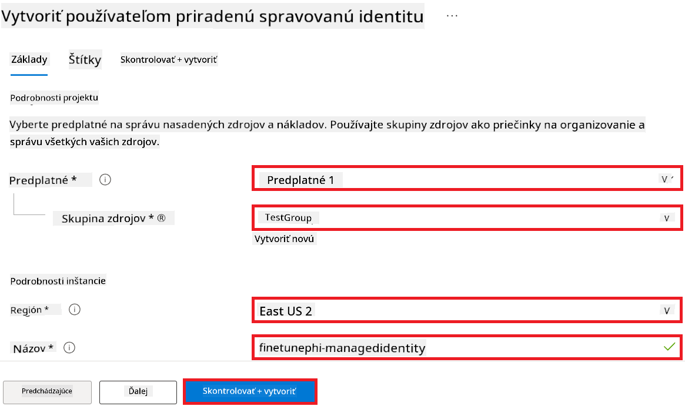

1. Kliknite na **Review + create**.

1. Kliknite na **+ Create**.

#### Pridanie priradenia roly Contributor k Managed Identity

1. Prejdite na zdroj Managed Identity, ktorý ste vytvorili.

1. V ľavom paneli vyberte **Azure role assignments**.

1. Kliknite na **+ Add role assignment**.

1. Na stránke Add role assignment vykonajte nasledovné:

    - Vyberte **Scope** na **Resource group**.
    - Vyberte vašu Azure **Subscription**.
    - Vyberte **Resource group**, ktorú chcete použiť.
    - Vyberte rolu **Contributor**.

    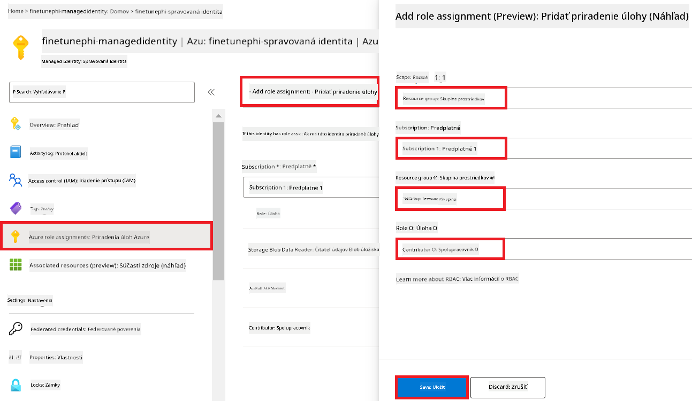

2. Kliknite na **Save**.

#### Pridanie priradenia roly Storage Blob Data Reader k Managed Identity

1. Do **vyhľadávacieho poľa** v hornej časti portálu zadajte *storage accounts* a vyberte **Storage accounts**.

    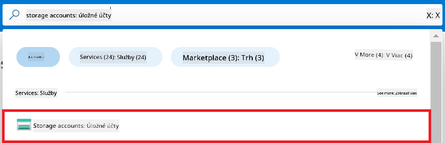

1. Vyberte storage účet, ktorý je prepojený s Azure Machine Learning workspace, napríklad *finetunephistorage*.

1. Prejdite na stránku pridania roly:

    - Otvorte Azure Storage účet, ktorý ste vytvorili.
    - Vyberte **Access Control (IAM)** v ľavom paneli.
    - Kliknite na **+ Add**.
    - Zvoľte **Add role assignment**.

    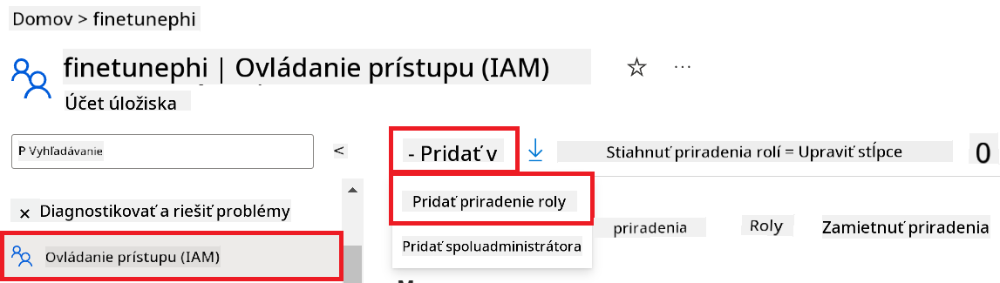

1. Na stránke Add role assignment vykonajte:

    - Do vyhľadávacieho poľa zadajte *Storage Blob Data Reader* a vyberte túto rolu.
    - Kliknite na **Next**.
    - Na stránke Members vyberte **Assign access to** **Managed identity**.
    - Kliknite na **+ Select members**.
    - Vyberte vašu Azure **Subscription**.
    - Vyberte Managed identity, ktorú ste vytvorili, napríklad *finetunephi-managedidentity*.
    - Kliknite na **Select**.

    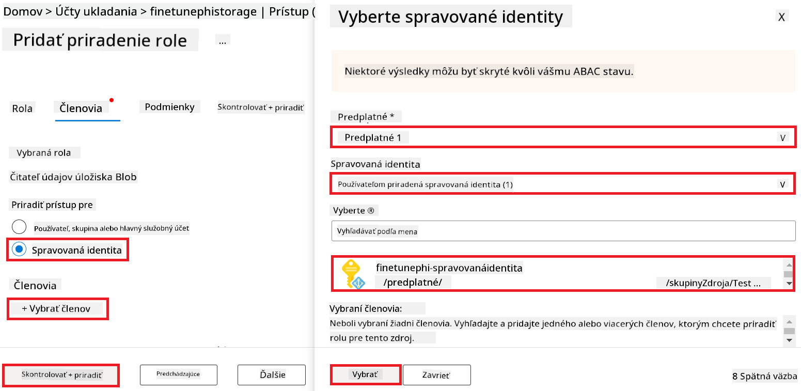

1. Kliknite na **Review + assign**.

#### Pridanie priradenia roly AcrPull k Managed Identity

1. Do **vyhľadávacieho poľa** v hornej časti portálu zadajte *container registries* a vyberte **Container registries**.

    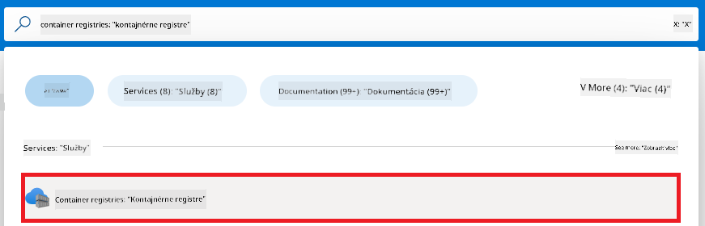

1. Vyberte container registry prepojený s Azure Machine Learning workspace, napríklad *finetunephicontainerregistry*.

1. Prejdite na stránku pridania roly:

    - Vyberte **Access Control (IAM)** v ľavom paneli.
    - Kliknite na **+ Add**.
    - Zvoľte **Add role assignment**.

1. Na stránke Add role assignment vykonajte:

    - Do vyhľadávacieho poľa zadajte *AcrPull* a vyberte túto rolu.
    - Kliknite na **Next**.
    - Na stránke Members vyberte **Assign access to** **Managed identity**.
    - Kliknite na **+ Select members**.
    - Vyberte vašu Azure **Subscription**.
    - Vyberte Managed identity, ktorú ste vytvorili, napríklad *finetunephi-managedidentity*.
    - Kliknite na **Select**.
    - Kliknite na **Review + assign**.

### Nastavenie projektu

Na stiahnutie datasetov potrebných na doladenie si nastavíte lokálne prostredie.

V tomto cvičení:

- Vytvoríte priečinok pre prácu.
- Vytvoríte virtuálne prostredie.
- Nainštalujete potrebné balíky.
- Vytvoríte súbor *download_dataset.py* na stiahnutie datasetu.

#### Vytvorenie priečinka pre prácu

1. Otvorte terminál a zadajte príkaz na vytvorenie priečinka *finetune-phi* v predvolenej ceste.

    ```console
    mkdir finetune-phi
    ```

2. Zadajte príkaz na prechod do priečinka *finetune-phi*.

    ```console
    cd finetune-phi
    ```

#### Vytvorenie virtuálneho prostredia

1. V termináli zadajte príkaz na vytvorenie virtuálneho prostredia s názvom *.venv*.

    ```console
    python -m venv .venv
    ```

2. Aktivujte virtuálne prostredie príkazom.

    ```console
    .venv\Scripts\activate.bat
    ```

> [!NOTE]
> Ak to funguje, pred príkazovým riadkom by ste mali vidieť *(.venv)*.

#### Inštalácia potrebných balíkov

1. V termináli zadajte príkazy na inštaláciu potrebných balíkov.

    ```console
    pip install datasets==2.19.1
    ```

#### Vytvorenie `download_dataset.py`

> [!NOTE]
> Kompletná štruktúra priečinka:
>
> ```text
> └── YourUserName
> .    └── finetune-phi
> .        └── download_dataset.py
> ```

1. Otvorte **Visual Studio Code**.

1. V menu vyberte **File**.

1. Zvoľte **Open Folder**.

1. Vyberte priečinok *finetune-phi*, ktorý ste vytvorili, napríklad na *C:\Users\yourUserName\finetune-phi*.

    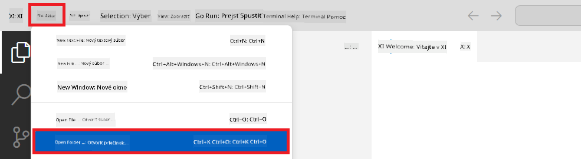

1. V ľavom paneli Visual Studio Code kliknite pravým tlačidlom a vyberte **New File** pre vytvorenie nového súboru s názvom *download_dataset.py*.

    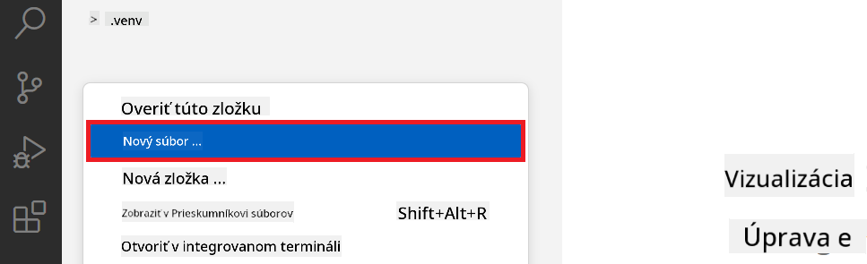

### Príprava datasetu na doladenie

V tomto cvičení spustíte súbor *download_dataset.py*, ktorý stiahne dataset *ultrachat_200k* do vášho lokálneho prostredia. Tento dataset potom použijete na doladenie modelu Phi-3 v Azure Machine Learning.

V tomto cvičení:

- Pridáte kód do súboru *download_dataset.py* na stiahnutie datasetu.
- Spustíte súbor *download_dataset.py* na stiahnutie datasetu do lokálneho prostredia.

#### Stiahnutie datasetu pomocou *download_dataset.py*

1. Otvorte súbor *download_dataset.py* vo Visual Studio Code.

1. Pridajte nasledujúci kód do súboru *download_dataset.py*.

    ```python
    import json
    import os
    from datasets import load_dataset

    def load_and_split_dataset(dataset_name, config_name, split_ratio):
        """
        Load and split a dataset.
        """
        # Load the dataset with the specified name, configuration, and split ratio
        dataset = load_dataset(dataset_name, config_name, split=split_ratio)
        print(f"Original dataset size: {len(dataset)}")
        
        # Split the dataset into train and test sets (80% train, 20% test)
        split_dataset = dataset.train_test_split(test_size=0.2)
        print(f"Train dataset size: {len(split_dataset['train'])}")
        print(f"Test dataset size: {len(split_dataset['test'])}")
        
        return split_dataset

    def save_dataset_to_jsonl(dataset, filepath):
        """
        Save a dataset to a JSONL file.
        """
        # Create the directory if it does not exist
        os.makedirs(os.path.dirname(filepath), exist_ok=True)
        
        # Open the file in write mode
        with open(filepath, 'w', encoding='utf-8') as f:
            # Iterate over each record in the dataset
            for record in dataset:
                # Dump the record as a JSON object and write it to the file
                json.dump(record, f)
                # Write a newline character to separate records
                f.write('\n')
        
        print(f"Dataset saved to {filepath}")

    def main():
        """
        Main function to load, split, and save the dataset.
        """
        # Load and split the ULTRACHAT_200k dataset with a specific configuration and split ratio
        dataset = load_and_split_dataset("HuggingFaceH4/ultrachat_200k", 'default', 'train_sft[:1%]')
        
        # Extract the train and test datasets from the split
        train_dataset = dataset['train']
        test_dataset = dataset['test']

        # Save the train dataset to a JSONL file
        save_dataset_to_jsonl(train_dataset, "data/train_data.jsonl")
        
        # Save the test dataset to a separate JSONL file
        save_dataset_to_jsonl(test_dataset, "data/test_data.jsonl")

    if __name__ == "__main__":
        main()

    ```

1. V termináli spustite skript na stiahnutie datasetu do lokálneho prostredia.

    ```console
    python download_dataset.py
    ```

1. Skontrolujte, či sa dataset úspešne uložil do lokálneho priečinka *finetune-phi/data*.

> [!NOTE]
>
> #### Poznámka k veľkosti datasetu a času doladenia
>
> V tomto tutoriáli používate len 1 % datasetu (`split='train[:1%]'`). To výrazne znižuje množstvo dát, čím sa zrýchľuje nahrávanie aj doladenie. Percento si môžete upraviť podľa potreby, aby ste našli optimálny pomer medzi časom trénovania a výkonom modelu. Použitie menšej časti datasetu skracuje čas doladenia, čo je vhodné pre tutoriály.

## Scenár 2: Doladenie modelu Phi-3 a nasadenie v Azure Machine Learning Studio

### Doladenie modelu Phi-3

V tomto cvičení doladíte model Phi-3 v Azure Machine Learning Studio.

V tomto cvičení:

- Vytvoríte výpočtový cluster pre doladenie.
- Doladíte model Phi-3 v Azure Machine Learning Studio.

#### Vytvorenie výpočtového clusteru pre doladenie
1. Navštívte [Azure ML Studio](https://ml.azure.com/home?wt.mc_id=studentamb_279723).

1. Vyberte **Compute** v ľavom paneli.

1. Vyberte **Compute clusters** v navigačnom menu.

1. Vyberte **+ New**.

    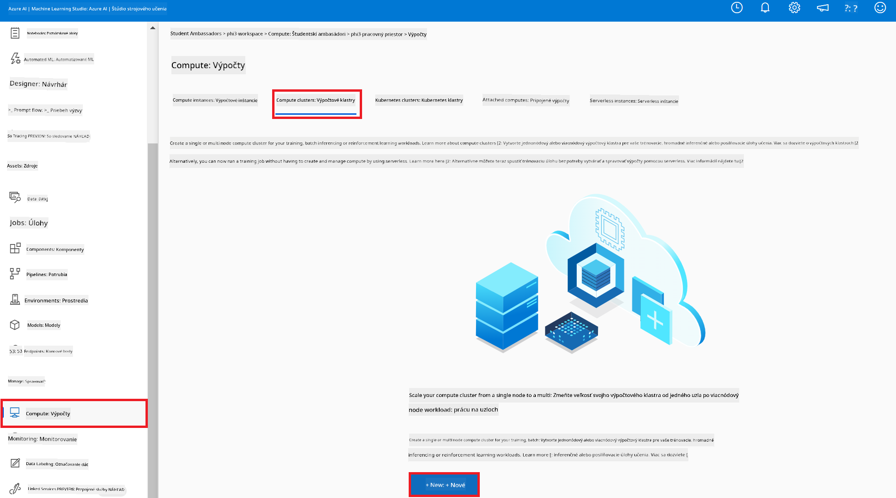

1. Vykonajte nasledovné kroky:

    - Vyberte **Region**, ktorý chcete použiť.
    - Vyberte **Virtual machine tier** na **Dedicated**.
    - Vyberte **Virtual machine type** na **GPU**.
    - Vo filtri **Virtual machine size** vyberte **Select from all options**.
    - Vyberte **Virtual machine size** na **Standard_NC24ads_A100_v4**.

    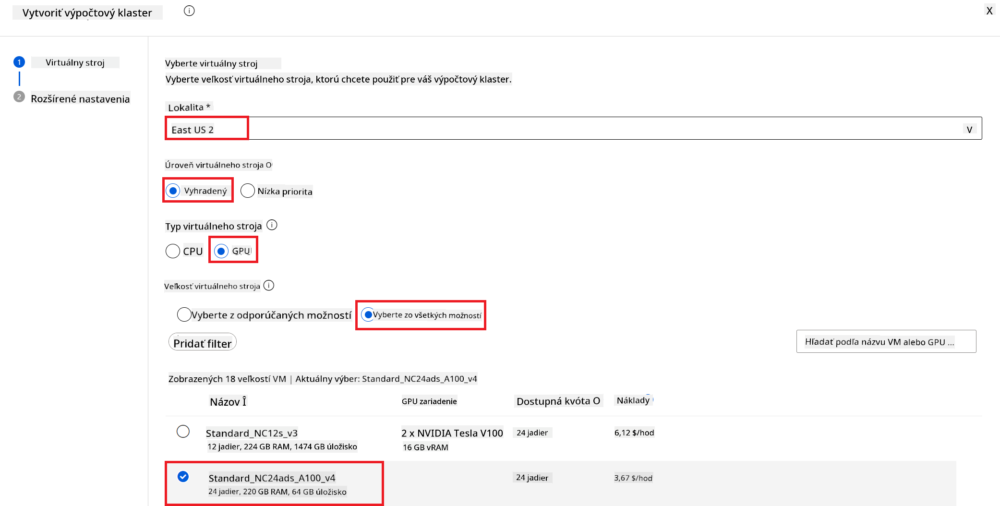

1. Vyberte **Next**.

1. Vykonajte nasledovné kroky:

    - Zadajte **Compute name**. Musí byť jedinečný.
    - Vyberte **Minimum number of nodes** na **0**.
    - Vyberte **Maximum number of nodes** na **1**.
    - Vyberte **Idle seconds before scale down** na **120**.

    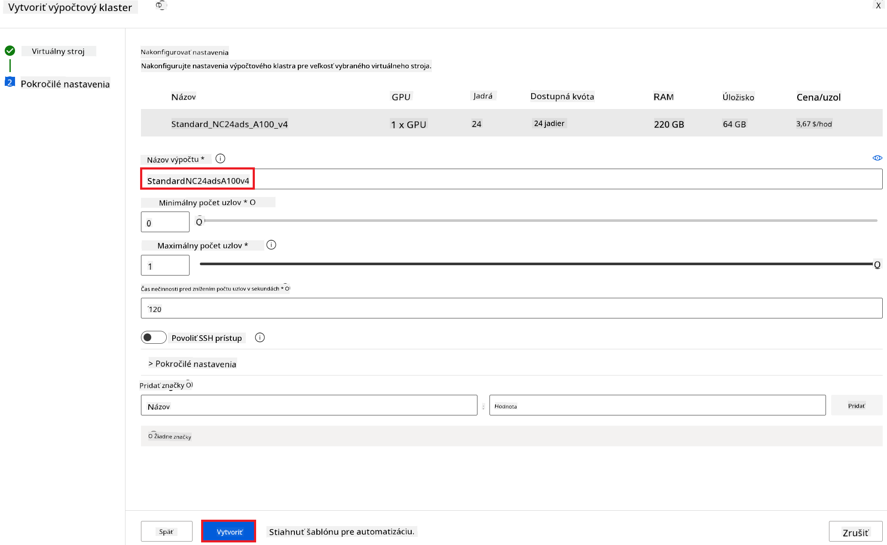

1. Vyberte **Create**.

#### Doladíte model Phi-3

1. Navštívte [Azure ML Studio](https://ml.azure.com/home?wt.mc_id=studentamb_279723).

1. Vyberte Azure Machine Learning workspace, ktorý ste vytvorili.

    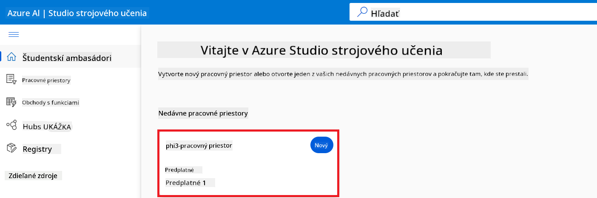

1. Vykonajte nasledovné kroky:

    - Vyberte **Model catalog** v ľavom paneli.
    - Do **search bar** zadajte *phi-3-mini-4k* a vyberte **Phi-3-mini-4k-instruct** z ponúk.

    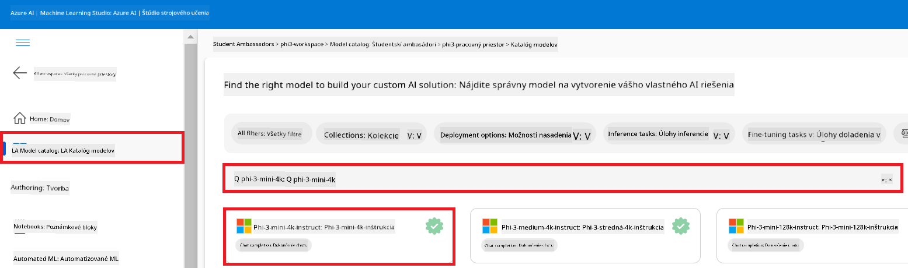

1. Vyberte **Fine-tune** v navigačnom menu.

    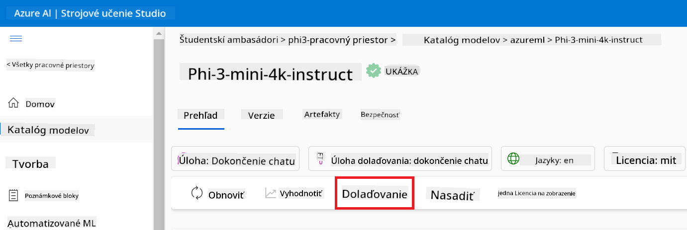

1. Vykonajte nasledovné kroky:

    - Vyberte **Select task type** na **Chat completion**.
    - Vyberte **+ Select data** na nahranie **Traning data**.
    - Vyberte typ nahrávania validačných dát na **Provide different validation data**.
    - Vyberte **+ Select data** na nahranie **Validation data**.

    

    > [!TIP]
    >
    > Môžete vybrať **Advanced settings** na prispôsobenie nastavení ako **learning_rate** a **lr_scheduler_type** pre optimalizáciu doladenia podľa vašich potrieb.

1. Vyberte **Finish**.

1. V tomto cvičení ste úspešne doladili model Phi-3 pomocou Azure Machine Learning. Upozorňujeme, že proces doladenia môže trvať dlhší čas. Po spustení doladenia je potrebné počkať na jeho dokončenie. Stav doladenia môžete sledovať v záložke Jobs na ľavej strane vášho Azure Machine Learning workspace. V ďalšej časti nasadíte doladený model a integrujete ho s Prompt flow.

    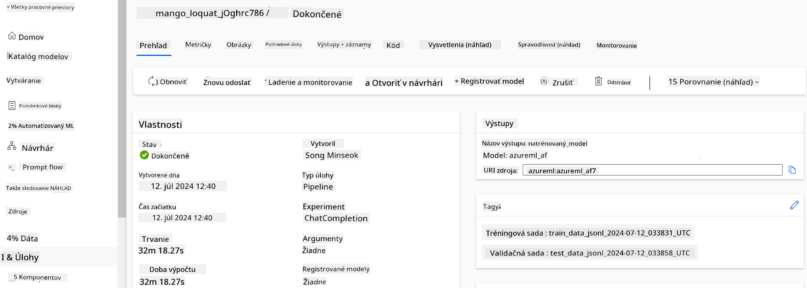

### Nasadenie doladeného modelu Phi-3

Na integráciu doladeného modelu Phi-3 s Prompt flow je potrebné model nasadiť, aby bol dostupný pre online inferenciu. Tento proces zahŕňa registráciu modelu, vytvorenie online endpointu a nasadenie modelu.

V tomto cvičení budete:

- Registrovať doladený model v Azure Machine Learning workspace.
- Vytvoriť online endpoint.
- Nasadiť registrovaný doladený model Phi-3.

#### Registrácia doladeného modelu

1. Navštívte [Azure ML Studio](https://ml.azure.com/home?wt.mc_id=studentamb_279723).

1. Vyberte Azure Machine Learning workspace, ktorý ste vytvorili.

    

1. Vyberte **Models** v ľavom paneli.
1. Vyberte **+ Register**.
1. Vyberte **From a job output**.

    

1. Vyberte job, ktorý ste vytvorili.

    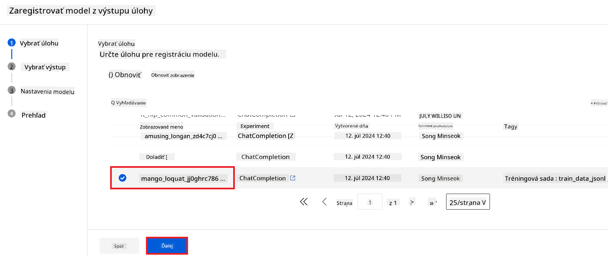

1. Vyberte **Next**.

1. Vyberte **Model type** na **MLflow**.

1. Skontrolujte, že je vybratý **Job output**; malo by byť vybrané automaticky.

    

2. Vyberte **Next**.

3. Vyberte **Register**.

    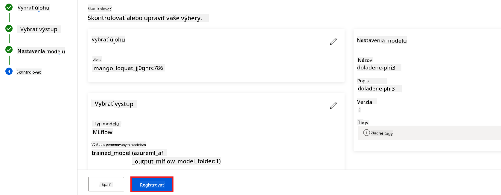

4. Registrovaný model môžete vidieť v menu **Models** v ľavom paneli.

    

#### Nasadenie doladeného modelu

1. Prejdite do Azure Machine Learning workspace, ktorý ste vytvorili.

1. Vyberte **Endpoints** v ľavom paneli.

1. Vyberte **Real-time endpoints** v navigačnom menu.

    

1. Vyberte **Create**.

1. Vyberte registrovaný model, ktorý ste vytvorili.

    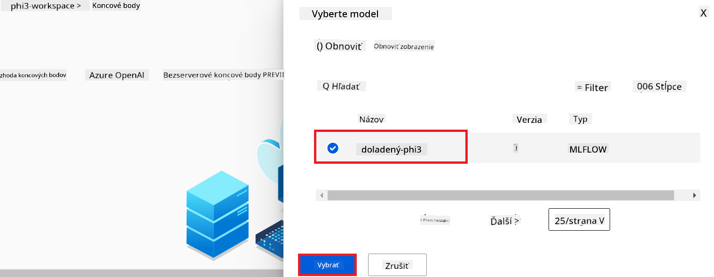

1. Vyberte **Select**.

1. Vykonajte nasledovné kroky:

    - Vyberte **Virtual machine** na *Standard_NC6s_v3*.
    - Vyberte **Instance count**, ktorý chcete použiť, napríklad *1*.
    - Vyberte **Endpoint** na **New** pre vytvorenie nového endpointu.
    - Zadajte **Endpoint name**. Musí byť jedinečný.
    - Zadajte **Deployment name**. Musí byť jedinečný.

    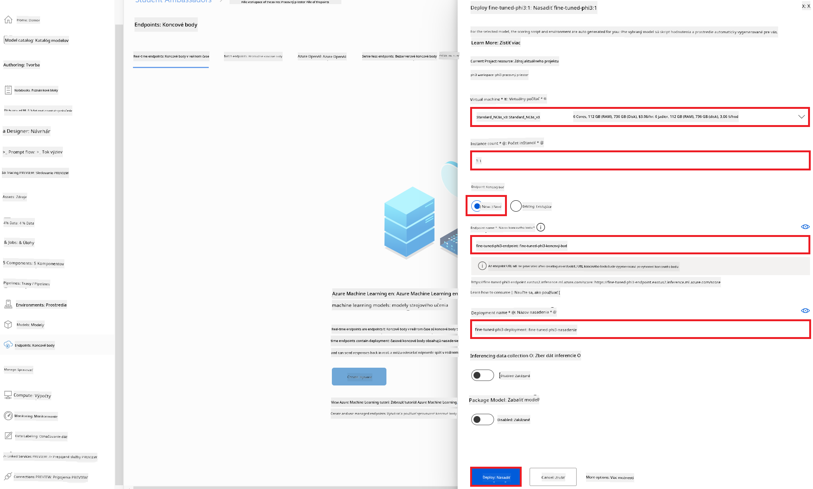

1. Vyberte **Deploy**.

> [!WARNING]
> Aby ste sa vyhli ďalším poplatkom, nezabudnite vymazať vytvorený endpoint v Azure Machine Learning workspace.
>

#### Kontrola stavu nasadenia v Azure Machine Learning Workspace

1. Prejdite do Azure Machine Learning workspace, ktorý ste vytvorili.

1. Vyberte **Endpoints** v ľavom paneli.

1. Vyberte endpoint, ktorý ste vytvorili.

    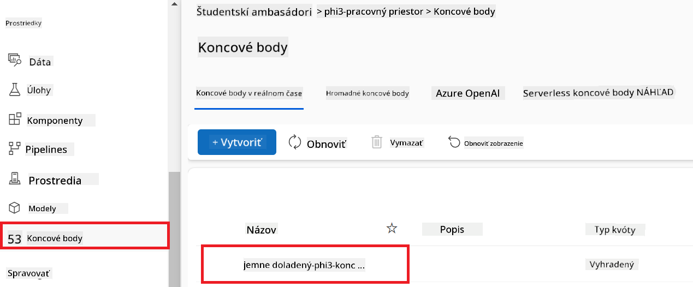

1. Na tejto stránke môžete spravovať endpointy počas procesu nasadenia.

> [!NOTE]
> Po dokončení nasadenia sa uistite, že **Live traffic** je nastavený na **100%**. Ak nie je, vyberte **Update traffic** na úpravu nastavení. Model nemôžete testovať, ak je traffic nastavený na 0%.
>
> 
>

## Scenár 3: Integrácia s Prompt flow a chatovanie s vlastným modelom v Azure AI Foundry

### Integrácia vlastného modelu Phi-3 s Prompt flow

Po úspešnom nasadení doladeného modelu ho môžete integrovať s Prompt Flow a používať ho v reálnych aplikáciách, čo umožňuje rôzne interaktívne úlohy s vaším vlastným modelom Phi-3.

V tomto cvičení budete:

- Vytvoriť Azure AI Foundry Hub.
- Vytvoriť Azure AI Foundry Projekt.
- Vytvoriť Prompt flow.
- Pridať vlastné pripojenie pre doladený model Phi-3.
- Nastaviť Prompt flow na chatovanie s vaším vlastným modelom Phi-3.

> [!NOTE]
> Integráciu s Promptflow môžete vykonať aj cez Azure ML Studio. Rovnaký postup integrácie platí aj pre Azure ML Studio.

#### Vytvorenie Azure AI Foundry Hubu

Pred vytvorením projektu je potrebné vytvoriť Hub. Hub funguje ako Resource Group, ktorá umožňuje organizovať a spravovať viacero projektov v Azure AI Foundry.

1. Navštívte [Azure AI Foundry](https://ai.azure.com/?WT.mc_id=aiml-137032-kinfeylo).

1. Vyberte **All hubs** v ľavom paneli.

1. Vyberte **+ New hub** v navigačnom menu.

    

1. Vykonajte nasledovné kroky:

    - Zadajte **Hub name**. Musí byť jedinečný.
    - Vyberte vašu Azure **Subscription**.
    - Vyberte **Resource group** (vytvorte novú, ak je to potrebné).
    - Vyberte **Location**, ktorú chcete použiť.
    - Vyberte **Connect Azure AI Services** (vytvorte nové, ak je to potrebné).
    - Vyberte **Connect Azure AI Search** na **Skip connecting**.

    

1. Vyberte **Next**.

#### Vytvorenie Azure AI Foundry Projektu

1. V Hube, ktorý ste vytvorili, vyberte **All projects** v ľavom paneli.

1. Vyberte **+ New project** v navigačnom menu.

    

1. Zadajte **Project name**. Musí byť jedinečný.

    

1. Vyberte **Create a project**.

#### Pridanie vlastného pripojenia pre doladený model Phi-3

Pre integráciu vlastného modelu Phi-3 s Prompt flow je potrebné uložiť endpoint a kľúč modelu do vlastného pripojenia. Tento krok zabezpečí prístup k vášmu modelu Phi-3 v Prompt flow.

#### Nastavenie api kľúča a endpoint URI doladeného modelu Phi-3

1. Navštívte [Azure ML Studio](https://ml.azure.com/home?WT.mc_id=aiml-137032-kinfeylo).

1. Prejdite do Azure Machine Learning workspace, ktorý ste vytvorili.

1. Vyberte **Endpoints** v ľavom paneli.

    

1. Vyberte endpoint, ktorý ste vytvorili.

    

1. Vyberte **Consume** v navigačnom menu.

1. Skopírujte váš **REST endpoint** a **Primary key**.


#### Pridajte vlastné pripojenie

1. Navštívte [Azure AI Foundry](https://ai.azure.com/?WT.mc_id=aiml-137032-kinfeylo).

1. Prejdite do projektu Azure AI Foundry, ktorý ste vytvorili.

1. V projekte, ktorý ste vytvorili, vyberte na ľavej strane záložku **Settings**.

1. Vyberte **+ New connection**.

    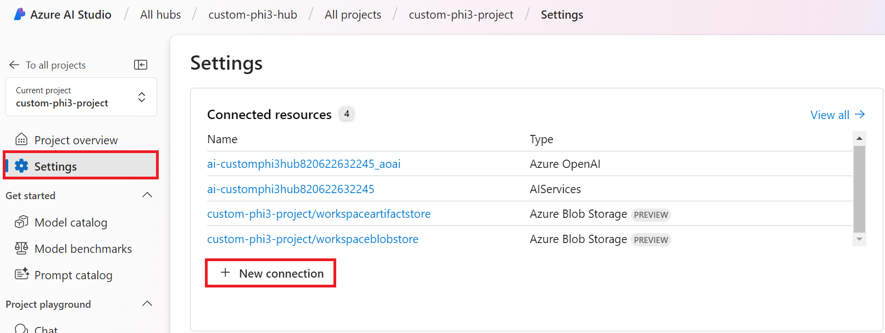

1. V navigačnom menu vyberte **Custom keys**.

    

1. Vykonajte nasledujúce kroky:

    - Vyberte **+ Add key value pairs**.
    - Do poľa pre názov kľúča zadajte **endpoint** a do poľa pre hodnotu vložte endpoint, ktorý ste skopírovali z Azure ML Studio.
    - Opäť vyberte **+ Add key value pairs**.
    - Do poľa pre názov kľúča zadajte **key** a do poľa pre hodnotu vložte kľúč, ktorý ste skopírovali z Azure ML Studio.
    - Po pridaní kľúčov zaškrtnite **is secret**, aby sa kľúč nezobrazoval.

    

1. Vyberte **Add connection**.

#### Vytvorte Prompt flow

Pridali ste vlastné pripojenie v Azure AI Foundry. Teraz vytvoríme Prompt flow podľa nasledujúcich krokov. Následne pripojíte tento Prompt flow k vlastnému pripojeniu, aby ste mohli použiť jemne doladený model v rámci Prompt flow.

1. Prejdite do projektu Azure AI Foundry, ktorý ste vytvorili.

1. Na ľavej strane vyberte **Prompt flow**.

1. V navigačnom menu vyberte **+ Create**.

    

1. V navigačnom menu vyberte **Chat flow**.

    

1. Zadajte **Folder name**, ktorý chcete použiť.

    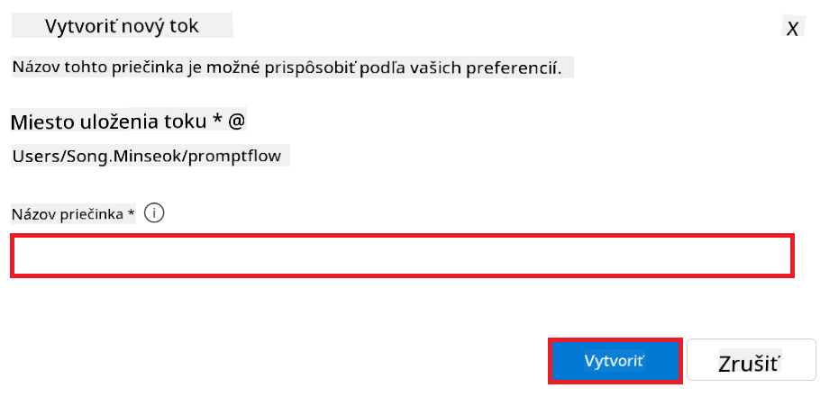

2. Vyberte **Create**.

#### Nastavte Prompt flow na komunikáciu s vaším vlastným modelom Phi-3

Je potrebné integrovať jemne doladený model Phi-3 do Prompt flow. Existujúci Prompt flow však nie je navrhnutý na tento účel, preto ho musíte prerobiť, aby umožňoval integráciu vlastného modelu.

1. V Prompt flow vykonajte nasledujúce kroky na prestavbu existujúceho flow:

    - Vyberte **Raw file mode**.
    - Vymažte všetok existujúci kód v súbore *flow.dag.yml*.
    - Pridajte nasledujúci kód do súboru *flow.dag.yml*.

        ```yml
        inputs:
          input_data:
            type: string
            default: "Who founded Microsoft?"

        outputs:
          answer:
            type: string
            reference: ${integrate_with_promptflow.output}

        nodes:
        - name: integrate_with_promptflow
          type: python
          source:
            type: code
            path: integrate_with_promptflow.py
          inputs:
            input_data: ${inputs.input_data}
        ```

    - Vyberte **Save**.

    

1. Pridajte nasledujúci kód do súboru *integrate_with_promptflow.py*, aby ste použili vlastný model Phi-3 v Prompt flow.

    ```python
    import logging
    import requests
    from promptflow import tool
    from promptflow.connections import CustomConnection

    # Logging setup
    logging.basicConfig(
        format="%(asctime)s - %(levelname)s - %(name)s - %(message)s",
        datefmt="%Y-%m-%d %H:%M:%S",
        level=logging.DEBUG
    )
    logger = logging.getLogger(__name__)

    def query_phi3_model(input_data: str, connection: CustomConnection) -> str:
        """
        Send a request to the Phi-3 model endpoint with the given input data using Custom Connection.
        """

        # "connection" is the name of the Custom Connection, "endpoint", "key" are the keys in the Custom Connection
        endpoint_url = connection.endpoint
        api_key = connection.key

        headers = {
            "Content-Type": "application/json",
            "Authorization": f"Bearer {api_key}"
        }
        data = {
            "input_data": {
                "input_string": [
                    {"role": "user", "content": input_data}
                ],
                "parameters": {
                    "temperature": 0.7,
                    "max_new_tokens": 128
                }
            }
        }
        try:
            response = requests.post(endpoint_url, json=data, headers=headers)
            response.raise_for_status()
            
            # Log the full JSON response
            logger.debug(f"Full JSON response: {response.json()}")

            result = response.json()["output"]
            logger.info("Successfully received response from Azure ML Endpoint.")
            return result
        except requests.exceptions.RequestException as e:
            logger.error(f"Error querying Azure ML Endpoint: {e}")
            raise

    @tool
    def my_python_tool(input_data: str, connection: CustomConnection) -> str:
        """
        Tool function to process input data and query the Phi-3 model.
        """
        return query_phi3_model(input_data, connection)

    ```

    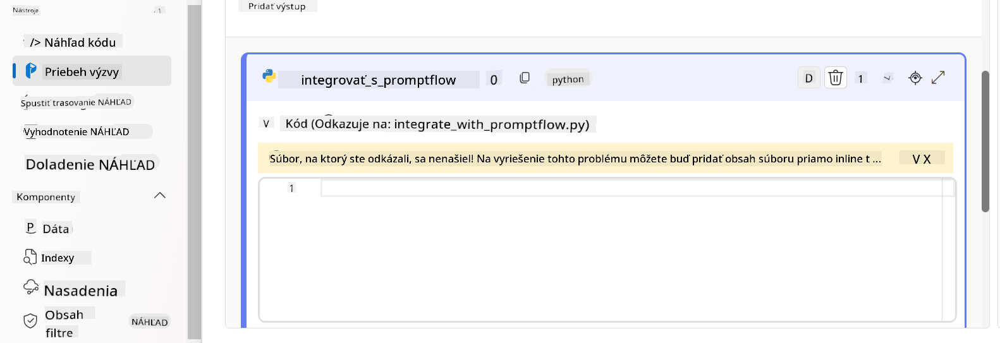

> [!NOTE]
> Podrobnejšie informácie o používaní Prompt flow v Azure AI Foundry nájdete v [Prompt flow in Azure AI Foundry](https://learn.microsoft.com/azure/ai-studio/how-to/prompt-flow).

1. Vyberte **Chat input**, **Chat output** na povolenie komunikácie s vaším modelom.

    

1. Teraz ste pripravení komunikovať s vaším vlastným modelom Phi-3. V ďalšom cvičení sa naučíte, ako spustiť Prompt flow a používať ho na chatovanie s vaším jemne doladeným modelom Phi-3.

> [!NOTE]
>
> Prestavaný flow by mal vyzerať ako na obrázku nižšie:
>
> 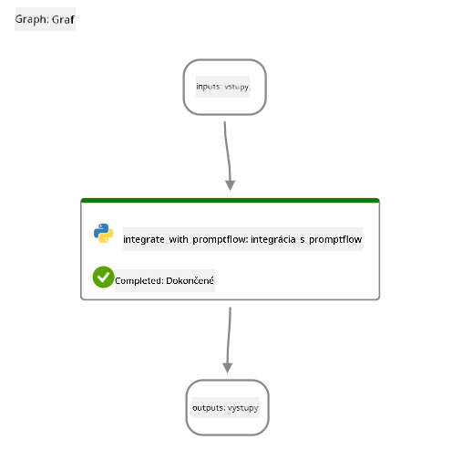
>

### Komunikácia s vaším vlastným modelom Phi-3

Keďže ste jemne doladili a integrovali vlastný model Phi-3 do Prompt flow, ste pripravení začať s ním komunikovať. Toto cvičenie vás prevedie nastavením a spustením chatu s vaším modelom pomocou Prompt flow. Dodržiavaním týchto krokov budete môcť naplno využiť schopnosti vášho jemne doladeného modelu Phi-3 na rôzne úlohy a rozhovory.

- Komunikujte s vaším vlastným modelom Phi-3 pomocou Prompt flow.

#### Spustenie Prompt flow

1. Vyberte **Start compute sessions** na spustenie Prompt flow.

    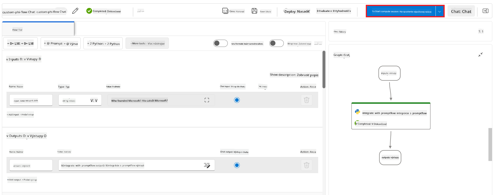

1. Vyberte **Validate and parse input** na obnovenie parametrov.

    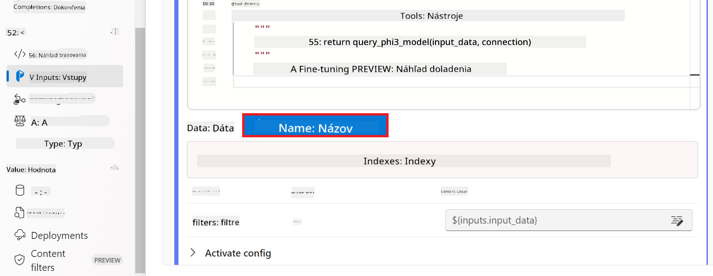

1. Vyberte **Value** pre **connection** z vlastného pripojenia, ktoré ste vytvorili, napríklad *connection*.

    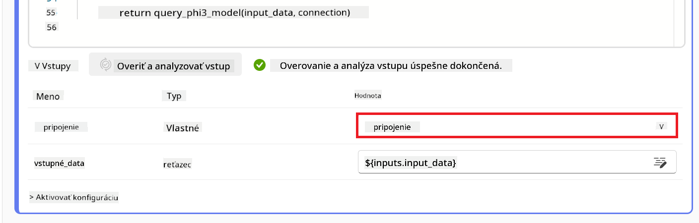

#### Komunikácia s vaším vlastným modelom

1. Vyberte **Chat**.

    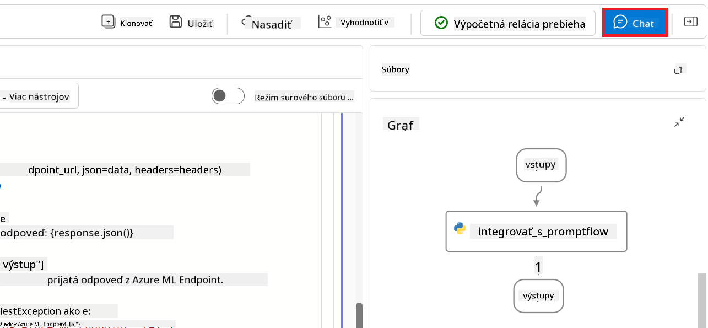

1. Tu je príklad výsledkov: Teraz môžete komunikovať s vaším vlastným modelom Phi-3. Odporúča sa klásť otázky založené na dátach použitých na jemné doladenie.

    

**Vyhlásenie o zodpovednosti**:  
Tento dokument bol preložený pomocou AI prekladateľskej služby [Co-op Translator](https://github.com/Azure/co-op-translator). Aj keď sa snažíme o presnosť, majte prosím na pamäti, že automatizované preklady môžu obsahovať chyby alebo nepresnosti. Originálny dokument v jeho pôvodnom jazyku by mal byť považovaný za autoritatívny zdroj. Pre kritické informácie sa odporúča profesionálny ľudský preklad. Nie sme zodpovední za akékoľvek nedorozumenia alebo nesprávne interpretácie vyplývajúce z použitia tohto prekladu.