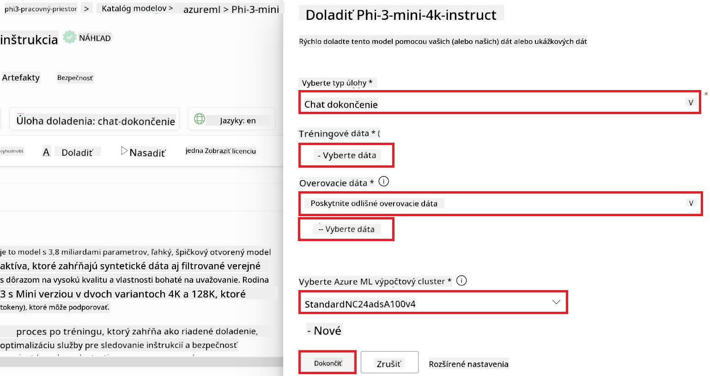
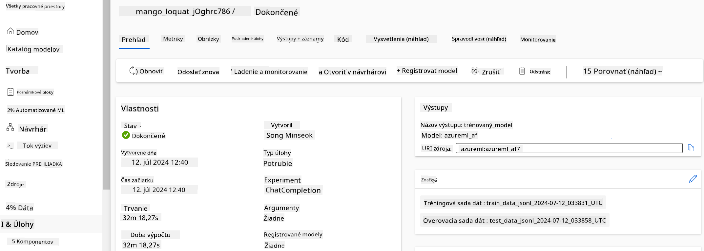
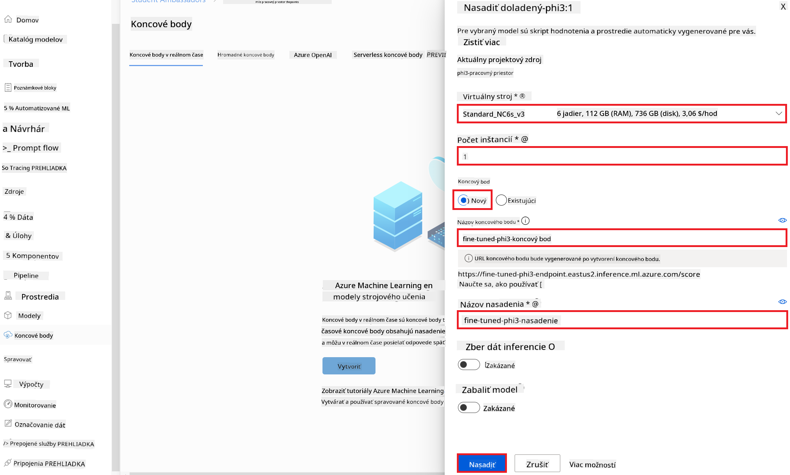
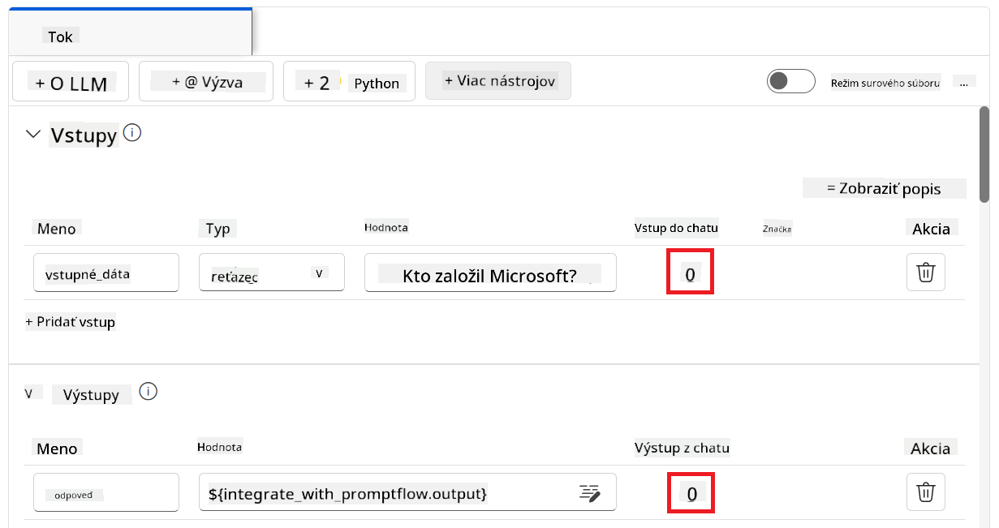

<!--
CO_OP_TRANSLATOR_METADATA:
{
  "original_hash": "0df910a227098303cc392b6ad204c271",
  "translation_date": "2026-01-06T05:06:38+00:00",
  "source_file": "md/02.Application/01.TextAndChat/Phi3/E2E_Phi-3-FineTuning_PromptFlow_Integration_AIFoundry.md",
  "language_code": "sk"
}
-->
# Doladte a integrujte vlastné modely Phi-3 s Prompt flow v Azure AI Foundry

Tento end-to-end (E2E) príklad je založený na návode "[Doladte a integrujte vlastné modely Phi-3 s Prompt Flow v Azure AI Foundry](https://techcommunity.microsoft.com/t5/educator-developer-blog/fine-tune-and-integrate-custom-phi-3-models-with-prompt-flow-in/ba-p/4191726?WT.mc_id=aiml-137032-kinfeylo)" z Microsoft Tech Community. Predstavuje procesy doladenia, nasadenia a integrácie vlastných modelov Phi-3 s Prompt flow v Azure AI Foundry.
Na rozdiel od E2E príkladu, "[Doladte a integrujte vlastné modely Phi-3 s Prompt Flow](./E2E_Phi-3-FineTuning_PromptFlow_Integration.md)", ktorý zahŕňal spustenie kódu lokálne, sa tento tutoriál sústreďuje kompletne na doladenie a integráciu vášho modelu v rámci Azure AI / ML Studia.

## Prehľad

V tomto E2E príklade sa naučíte, ako doladiť model Phi-3 a integrovať ho s Prompt flow v Azure AI Foundry. Využitím Azure AI / ML Studia si vytvoríte pracovný postup pre nasadenie a použitie vlastných AI modelov. Tento E2E príklad je rozdelený do troch scenárov:

**Scenár 1: Nastavenie Azure zdrojov a Príprava na doladenie**

**Scenár 2: Doladenie modelu Phi-3 a Nasadenie v Azure Machine Learning Studiu**

**Scenár 3: Integrácia s Prompt flow a Chatovanie s vlastným modelom v Azure AI Foundry**

Tu je prehľad tohto E2E príkladu.


### Obsah

1. **[Scenár 1: Nastavenie Azure zdrojov a Príprava na doladenie](../../../../../../md/02.Application/01.TextAndChat/Phi3)**
    - [Vytvorte Azure Machine Learning Workspace](../../../../../../md/02.Application/01.TextAndChat/Phi3)
    - [Žiadosť o GPU kvóty v Azure Subscription](../../../../../../md/02.Application/01.TextAndChat/Phi3)
    - [Pridajte priradenie rolí](../../../../../../md/02.Application/01.TextAndChat/Phi3)
    - [Nastavte projekt](../../../../../../md/02.Application/01.TextAndChat/Phi3)
    - [Pripravte dataset pre doladenie](../../../../../../md/02.Application/01.TextAndChat/Phi3)

1. **[Scenár 2: Doladenie modelu Phi-3 a Nasadenie v Azure Machine Learning Studiu](../../../../../../md/02.Application/01.TextAndChat/Phi3)**
    - [Doladte model Phi-3](../../../../../../md/02.Application/01.TextAndChat/Phi3)
    - [Nasadte doladený model Phi-3](../../../../../../md/02.Application/01.TextAndChat/Phi3)

1. **[Scenár 3: Integrácia s Prompt flow a Chatovanie s vlastným modelom v Azure AI Foundry](../../../../../../md/02.Application/01.TextAndChat/Phi3)**
    - [Integrujte vlastný model Phi-3 s Prompt flow](../../../../../../md/02.Application/01.TextAndChat/Phi3)
    - [Chatovanie s vlastným modelom Phi-3](../../../../../../md/02.Application/01.TextAndChat/Phi3)

## Scenár 1: Nastavte Azure zdroje a Pripravte sa na doladenie

### Vytvorte Azure Machine Learning Workspace

1. Do **vyhľadávacieho poľa** v hornej časti portálu napíšte *azure machine learning* a zo zobrazených možností vyberte **Azure Machine Learning**.

    

2. V navigačnom menu vyberte **+ Create**.

3. V navigačnom menu vyberte **New workspace**.

    

4. Vykonajte nasledujúce kroky:

    - Vyberte svoju Azure **Subscription**.
    - Vyberte **Resource group**, ktorú chcete použiť (v prípade potreby vytvorte novú).
    - Zadajte **Workspace Name**. Musí byť jedinečný.
    - Vyberte **Region**, ktorý chcete použiť.
    - Vyberte **Storage account**, ktorý chcete použiť (v prípade potreby vytvorte nový).
    - Vyberte **Key vault**, ktorý chcete použiť (v prípade potreby vytvorte nový).
    - Vyberte **Application insights**, ktorý chcete použiť (v prípade potreby vytvorte nový).
    - Vyberte **Container registry**, ktorý chcete použiť (v prípade potreby vytvorte nový).

    

5. Vyberte **Review + Create**.

6. Vyberte **Create**.

### Žiadosť o GPU kvóty v Azure Subscription

V tomto tutoriále sa naučíte, ako doladiť a nasadiť model Phi-3 pomocou GPU. Pre doladenie použijete GPU *Standard_NC24ads_A100_v4*, ktorý vyžaduje žiadosť o kvótu. Pre nasadenie použijete GPU *Standard_NC6s_v3*, ktorý taktiež vyžaduje žiadosť o kvótu.

> [!NOTE]
>
> Len predplatné Pay-As-You-Go (štandardný typ predplatného) je oprávnené na pridelenie GPU; benefitné predplatné momentálne nie je podporované.
>

1. Navštívte [Azure ML Studio](https://ml.azure.com/home?wt.mc_id=studentamb_279723).

1. Vykonajte nasledujúce kroky pre žiadosť kvóty *Standard NCADSA100v4 Family*:

    - V ľavom paneli vyberte **Quota**.
    - Vyberte **Virtual machine family**, ktorú chcete použiť. Napríklad vyberte **Standard NCADSA100v4 Family Cluster Dedicated vCPUs**, ktorý obsahuje GPU *Standard_NC24ads_A100_v4*.
    - V navigačnom menu vyberte **Request quota**.

        

    - Na stránke Request quota zadajte **New cores limit**, ktorý chcete použiť. Napríklad 24.
    - Na stránke Request quota vyberte **Submit** na podanie žiadosti o kvótu GPU.

1. Vykonajte nasledujúce kroky pre žiadosť kvóty *Standard NCSv3 Family*:

    - V ľavom paneli vyberte **Quota**.
    - Vyberte **Virtual machine family**, ktorú chcete použiť. Napríklad vyberte **Standard NCSv3 Family Cluster Dedicated vCPUs**, ktorý obsahuje GPU *Standard_NC6s_v3*.
    - V navigačnom menu vyberte **Request quota**.
    - Na stránke Request quota zadajte **New cores limit**, ktorý chcete použiť. Napríklad 24.
    - Na stránke Request quota vyberte **Submit** na podanie žiadosti o kvótu GPU.

### Pridajte priradenie rolí

Na doladenie a nasadenie vašich modelov musíte najprv vytvoriť Užívateľskú pridelenú spravovanú identitu (User Assigned Managed Identity - UAI) a priradiť jej príslušné povolenia. Táto UAI sa použije na autentifikáciu počas nasadenia.

#### Vytvorte Užívateľskú pridelenú spravovanú identitu (UAI)

1. Do **vyhľadávacieho poľa** v hornej časti portálu napíšte *managed identities* a zo zobrazených možností vyberte **Managed Identities**.

    

1. Vyberte **+ Create**.

    

1. Vykonajte nasledujúce kroky:

    - Vyberte svoju Azure **Subscription**.
    - Vyberte **Resource group**, ktorú chcete použiť (v prípade potreby vytvorte novú).
    - Vyberte **Region**, ktorý chcete použiť.
    - Zadajte **Name**. Musí byť jedinečný.

    

1. Vyberte **Review + create**.

1. Vyberte **+ Create**.

#### Pridajte priradenie roly Contributor pre Managed Identity

1. Prejdite na zdroj Managed Identity, ktorý ste vytvorili.

1. V ľavom paneli vyberte **Azure role assignments**.

1. V navigačnom menu vyberte **+Add role assignment**.

1. Na stránke Add role assignment vykonajte nasledovné kroky:
    - Vyberte **Scope** na **Resource group**.
    - Vyberte svoju Azure **Subscription**.
    - Vyberte **Resource group**, ktorú chcete použiť.
    - Vyberte rolu **Contributor**.

    

2. Vyberte **Save**.

#### Pridajte priradenie roly Storage Blob Data Reader pre Managed Identity

1. Do **vyhľadávacieho poľa** v hornej časti portálu napíšte *storage accounts* a zo zobrazených možností vyberte **Storage accounts**.

    

1. Vyberte storage account, ktorý je spojený s Azure Machine Learning Workspace, ktorý ste vytvorili. Napríklad *finetunephistorage*.

1. Vykonajte nasledujúce kroky pre navigáciu na stránku Add role assignment:

    - Prejdite do Azure Storage account, ktorý ste vytvorili.
    - V ľavom paneli vyberte **Access Control (IAM)**.
    - V navigačnom menu vyberte **+ Add**.
    - Vyberte **Add role assignment**.

    

1. Na stránke Add role assignment vykonajte nasledovné kroky:

    - V role stránke do **search bar** napíšte *Storage Blob Data Reader* a vyberte **Storage Blob Data Reader** zo zobrazených možností.
    - Na role stránke vyberte **Next**.
    - Na stránke Members vyberte **Assign access to** **Managed identity**.
    - Na stránke Members vyberte **+ Select members**.
    - Na stránke Select managed identities vyberte svoju Azure **Subscription**.
    - Na stránke Select managed identities vyberte **Managed identity** ako **Manage Identity**.
    - Na stránke Select managed identities vyberte Manage Identity, ktorú ste vytvorili. Napríklad *finetunephi-managedidentity*.
    - Na stránke Select managed identities vyberte **Select**.

    

1. Vyberte **Review + assign**.

#### Pridajte priradenie roly AcrPull pre Managed Identity

1. Do **vyhľadávacieho poľa** v hornej časti portálu napíšte *container registries* a zo zobrazených možností vyberte **Container registries**.

    

1. Vyberte container registry, ktorý je spojený s Azure Machine Learning Workspace. Napríklad *finetunephicontainerregistry*.

1. Vykonajte nasledujúce kroky pre navigáciu na stránku Add role assignment:

    - V ľavom paneli vyberte **Access Control (IAM)**.
    - V navigačnom menu vyberte **+ Add**.
    - Vyberte **Add role assignment**.

1. Na stránke Add role assignment vykonajte nasledovné kroky:

    - V role stránke napíšte *AcrPull* do **search bar** a vyberte **AcrPull** zo zobrazených možností.
    - Na role stránke vyberte **Next**.
    - Na stránke Members vyberte **Assign access to** **Managed identity**.
    - Na stránke Members vyberte **+ Select members**.
    - Na stránke Select managed identities vyberte svoju Azure **Subscription**.
    - Na stránke Select managed identities vyberte **Managed identity** ako **Manage Identity**.
    - Na stránke Select managed identities vyberte Manage Identity, ktorú ste vytvorili. Napríklad *finetunephi-managedidentity*.
    - Na stránke Select managed identities vyberte **Select**.
    - Vyberte **Review + assign**.

### Nastavte projekt

Na stiahnutie datasetov potrebných pre doladenie si nastavíte lokálne prostredie.

V tomto cvičení budete

- Vytvárať priečinok pre prácu v ňom.
- Vytvárať virtuálne prostredie.
- Inštalovať požadované balíky.
- Vytvoriť súbor *download_dataset.py* pre stiahnutie datasetu.

#### Vytvorte priečinok pre prácu v ňom

1. Otvorte okno terminálu a zadajte nasledujúci príkaz na vytvorenie priečinka s názvom *finetune-phi* v predvolenej ceste.

    ```console
    mkdir finetune-phi
    ```

2. Zadajte nasledujúci príkaz vo vašom termináli, aby ste prešli do priečinka *finetune-phi*, ktorý ste vytvorili.

    ```console
    cd finetune-phi
    ```

#### Vytvorte virtuálne prostredie

1. Zadajte nasledujúci príkaz vo vašom termináli na vytvorenie virtuálneho prostredia nazvaného *.venv*.

    ```console
    python -m venv .venv
    ```

2. Zadajte nasledujúci príkaz vo vašom termináli na aktiváciu virtuálneho prostredia.

    ```console
    .venv\Scripts\activate.bat
    ```

> [!NOTE]
> Ak to fungovalo, mali by ste vidieť *(.venv)* pred príkazovým riadkom.

#### Nainštalujte požadované balíky

1. Zadajte nasledujúce príkazy vo vašom termináli na inštaláciu požadovaných balíkov.

    ```console
    pip install datasets==2.19.1
    ```

#### Vytvorte `donload_dataset.py`

> [!NOTE]
> Kompletná štruktúra priečinkov:
>
> ```text
> └── YourUserName
> .    └── finetune-phi
> .        └── download_dataset.py
> ```

1. Otvorte **Visual Studio Code**.

1. Vyberte **Súbor** z menu.

1. Vyberte **Otvoriť priečinok**.

1. Vyberte priečinok *finetune-phi*, ktorý ste vytvorili, nachádzajúci sa na *C:\Users\yourUserName\finetune-phi*.

    

1. V ľavom paneli Visual Studio Code kliknite pravým tlačidlom a vyberte **Nový súbor** na vytvorenie nového súboru s názvom *download_dataset.py*.

    

### Pripravte dataset na doladenie

V tomto cvičení spustíte súbor *download_dataset.py*, aby ste si stiahli dataset *ultrachat_200k* do lokálneho prostredia. Tento dataset potom použijete na doladenie modelu Phi-3 v Azure Machine Learning.

V tomto cvičení:

- Pridáte kód do súboru *download_dataset.py* na stiahnutie datasetov.
- Spustíte súbor *download_dataset.py* na stiahnutie datasetov do lokálneho prostredia.

#### Stiahnite si dataset pomocou *download_dataset.py*

1. Otvorte súbor *download_dataset.py* vo Visual Studio Code.

1. Pridajte nasledujúci kód do súboru *download_dataset.py*.

    ```python
    import json
    import os
    from datasets import load_dataset

    def load_and_split_dataset(dataset_name, config_name, split_ratio):
        """
        Load and split a dataset.
        """
        # Načítať dataset s určeným názvom, konfiguráciou a pomerom rozdelenia
        dataset = load_dataset(dataset_name, config_name, split=split_ratio)
        print(f"Original dataset size: {len(dataset)}")
        
        # Rozdeliť dataset na trénovaciu a testovaciu časť (80 % trénovacia, 20 % testovacia)
        split_dataset = dataset.train_test_split(test_size=0.2)
        print(f"Train dataset size: {len(split_dataset['train'])}")
        print(f"Test dataset size: {len(split_dataset['test'])}")
        
        return split_dataset

    def save_dataset_to_jsonl(dataset, filepath):
        """
        Save a dataset to a JSONL file.
        """
        # Vytvoriť adresár, ak neexistuje
        os.makedirs(os.path.dirname(filepath), exist_ok=True)
        
        # Otvoriť súbor v režime zápisu
        with open(filepath, 'w', encoding='utf-8') as f:
            # Prejsť každý záznam v datasete
            for record in dataset:
                # Uložiť záznam ako JSON objekt a zapísať ho do súboru
                json.dump(record, f)
                # Zapísať znak nového riadku na oddelenie záznamov
                f.write('\n')
        
        print(f"Dataset saved to {filepath}")

    def main():
        """
        Main function to load, split, and save the dataset.
        """
        # Načítať a rozdeliť dataset ULTRACHAT_200k s konkrétnou konfiguráciou a pomerom rozdelenia
        dataset = load_and_split_dataset("HuggingFaceH4/ultrachat_200k", 'default', 'train_sft[:1%]')
        
        # Extrahovať trénovaciu a testovaciu množinu z rozdelenia
        train_dataset = dataset['train']
        test_dataset = dataset['test']

        # Uložiť trénovaciu množinu do JSONL súboru
        save_dataset_to_jsonl(train_dataset, "data/train_data.jsonl")
        
        # Uložiť testovaciu množinu do samostatného JSONL súboru
        save_dataset_to_jsonl(test_dataset, "data/test_data.jsonl")

    if __name__ == "__main__":
        main()

    ```

1. Zadajte nasledujúci príkaz vo vašom termináli na spustenie skriptu a stiahnutie datasetu do lokálneho prostredia.

    ```console
    python download_dataset.py
    ```

1. Overte, či boli datasety úspešne uložené do vášho lokálneho priečinka *finetune-phi/data*.

> [!NOTE]
>
> #### Poznámka k veľkosti datasetu a času doladenia
>
> V tomto návode používate iba 1 % datasetu (`split='train[:1%]'`), čo výrazne znižuje množstvo dát a zrýchľuje procesy nahrávania aj doladenia. Môžete upraviť percento, aby ste našli správnu rovnováhu medzi časom tréningu a výkonom modelu. Použitie menšej časti datasetu znižuje čas potrebný na doladenie, čím je tento proces zvládnuteľnejší pre návod.

## Scenár 2: Doladenie modelu Phi-3 a nasadenie v Azure Machine Learning Studio

### Doladenie modelu Phi-3

V tomto cvičení doladíte model Phi-3 v Azure Machine Learning Studio.

V tomto cvičení:

- Vytvoríte výpočtový klaster pre doladenie.
- Doladíte model Phi-3 v Azure Machine Learning Studio.

#### Vytvorenie výpočtového klastru pre doladenie

1. Navštívte [Azure ML Studio](https://ml.azure.com/home?wt.mc_id=studentamb_279723).

1. Vyberte **Výpočty** z ľavého bočného panela.

1. Vyberte **Výpočtové klastre** z navigačného menu.

1. Vyberte **+ Nový**.

    

1. Vykonajte nasledujúce kroky:

    - Vyberte **Región**, ktorý chcete použiť.
    - Nastavte **Úroveň virtuálneho stroja** na **Vyhradené**.
    - Nastavte **Typ virtuálneho stroja** na **GPU**.
    - Filter pre **Veľkosť virtuálneho stroja** nastavte na **Vybrať zo všetkých možností**.
    - Vyberte veľkosť virtuálneho stroja **Standard_NC24ads_A100_v4**.

    

1. Vyberte **Ďalej**.

1. Vykonajte nasledujúce kroky:

    - Zadajte **Názov výpočtu**, musí byť jedinečný.
    - Nastavte **Minimálny počet uzlov** na **0**.
    - Nastavte **Maximálny počet uzlov** na **1**.
    - Nastavte **Čas nečinnosti pred znížením kapacity** na **120 sekúnd**.

    

1. Vyberte **Vytvoriť**.

#### Doladenie modelu Phi-3

1. Navštívte [Azure ML Studio](https://ml.azure.com/home?wt.mc_id=studentamb_279723).

1. Vyberte Azure Machine Learning workspace, ktorý ste vytvorili.

    

1. Vykonajte nasledujúce kroky:

    - Vyberte **Katalóg modelov** z ľavého bočného panela.
    - Do **vyhľadávacieho poľa** zadajte *phi-3-mini-4k* a zo zobrazených možností vyberte **Phi-3-mini-4k-instruct**.

    

1. Vyberte **Doladiť** z navigačného menu.

    

1. Vykonajte nasledujúce kroky:

    - Nastavte **Vybrať typ úlohy** na **Chat completion**.
    - Vyberte **+ Vybrať dáta** na nahranie **Tréningových dát**.
    - Typ nahrania validačných dát nastavte na **Poskytnúť iné validačné dáta**.
    - Vyberte **+ Vybrať dáta** na nahranie **Validačných dát**.

    

> [!TIP]
>
> Môžete vybrať **Rozšírené nastavenia**, aby ste si prispôsobili konfigurácie ako **learning_rate** a **lr_scheduler_type** pre optimalizáciu procesu doladenia podľa vašich špecifických potrieb.

1. Vyberte **Dokončiť**.

1. V tomto cvičení ste úspešne doladili model Phi-3 pomocou Azure Machine Learning. Upozorňujeme, že proces doladenia môže trvať značný čas. Po spustení doladenia je potrebné počkať na jeho dokončenie. Stav doladenia môžete sledovať na karte Jobs v ľavom menu vášho Azure Machine Learning Workspace. V nasledujúcej sérii nasadíte doladený model a integrovať ho s Prompt flow.

    

### Nasadenie doladeného modelu Phi-3

Na integráciu doladeného modelu Phi-3 s Prompt flow je potrebné nasadiť model, aby bol dostupný pre inferenciu v reálnom čase. Tento proces zahŕňa registráciu modelu, vytvorenie online endpointu a samotné nasadenie modelu.

V tomto cvičení:

- Zaregistrujete doladený model v Azure Machine Learning workspace.
- Vytvoríte online endpoint.
- Nasadíte registrovaný doladený model Phi-3.

#### Registrácia doladeného modelu

1. Navštívte [Azure ML Studio](https://ml.azure.com/home?wt.mc_id=studentamb_279723).

1. Vyberte Azure Machine Learning workspace, ktorý ste vytvorili.

    

1. Vyberte **Modely** z ľavého bočného panela.
1. Vyberte **+ Registrovať**.
1. Vyberte **Z výstupu úlohy**.

    

1. Vyberte úlohu, ktorú ste vytvorili.

    

1. Vyberte **Ďalej**.

1. Nastavte **Typ modelu** na **MLflow**.

1. Uistite sa, že je vybratý **Výstup úlohy**; mal by byť vybraný automaticky.

    

2. Vyberte **Ďalej**.

3. Vyberte **Registrovať**.

    

4. Registrovaný model si môžete pozrieť v menu **Modely** na ľavom paneli.

    

#### Nasadenie doladeného modelu

1. Prejdite do Azure Machine Learning workspace, ktorý ste vytvorili.

1. Vyberte **Endpointy** z ľavého bočného panela.

1. Vyberte **Endpointy v reálnom čase** z navigačného menu.

    

1. Vyberte **Vytvoriť**.

1. Vyberte registrovaný model, ktorý ste vytvorili.

    

1. Vyberte **Vybrať**.

1. Vykonajte nasledujúce kroky:

    - Vyberte **Virtuálny stroj** na *Standard_NC6s_v3*.
    - Nastavte počet inštancií, ktorý chcete použiť, napríklad *1*.
    - Nastavte **Endpoint** na **Nový** pre vytvorenie endpointu.
    - Zadajte názov **Endpointu**; musí byť jedinečný.
    - Zadajte názov **Nasadenia**; musí byť jedinečný.

    

1. Vyberte **Nasadiť**.

> [!WARNING]
> Aby ste predišli ďalším poplatkom na vašom účte, nezabudnite odstrániť vytvorený endpoint v Azure Machine Learning workspace.
>

#### Skontrolujte stav nasadenia v Azure Machine Learning Workspace

1. Prejdite do Azure Machine Learning workspace, ktorý ste vytvorili.

1. Vyberte **Endpointy** z ľavého bočného panela.

1. Vyberte endpoint, ktorý ste vytvorili.

    

1. Na tejto stránke môžete spravovať endpointy počas procesu nasadenia.

> [!NOTE]
> Po dokončení nasadenia sa uistite, že **Živá prevádzka** je nastavená na **100 %**. Ak nie je, vyberte **Aktualizovať prevádzku** na úpravu nastavení prevádzky. Upozorňujeme, že model nemôžete testovať, ak je prevádzka nastavená na 0 %.
>
> 
>

## Scenár 3: Integrácia s Prompt flow a chatovanie s vaším vlastným modelom v Azure AI Foundry

### Integrácia vlastného modelu Phi-3 s Prompt flow

Po úspešnom nasadení doladeného modelu ho teraz môžete integrovať s Prompt flow, aby ste mohli model používať v aplikáciách v reálnom čase, čo umožní realizáciu rôznych interaktívnych úloh s vaším vlastným modelom Phi-3.

V tomto cvičení:

- Vytvoríte Azure AI Foundry Hub.
- Vytvoríte Azure AI Foundry Projekt.
- Vytvoríte Prompt flow.
- Pridáte vlastné pripojenie pre doladený model Phi-3.
- Nastavíte Prompt flow na chatovanie s vaším vlastným modelom Phi-3.

> [!NOTE]
> Integráciu s Promptflow môžete tiež vykonať prostredníctvom Azure ML Studia. Rovnaký integračný proces platí pre Azure ML Studio.

#### Vytvorenie Azure AI Foundry Hubu

Je potrebné vytvoriť Hub pred vytvorením Projektu. Hub funguje ako skupina zdrojov, umožňujúca organizovať a spravovať viacero Projektov v Azure AI Foundry.

1. Navštívte [Azure AI Foundry](https://ai.azure.com/?WT.mc_id=aiml-137032-kinfeylo).

1. Vyberte **Všetky huby** z ľavého bočného panela.

1. Vyberte **+ Nový hub** z navigačného menu.


1. Vykonajte nasledujúce úlohy:

    - Zadajte **Názov centra**. Musí to byť jedinečná hodnota.
    - Vyberte svoj Azure **Predplatné**.
    - Vyberte **Skupinu prostriedkov**, ktorú chcete použiť (v prípade potreby vytvorte novú).
    - Vyberte **Umiestnenie**, ktoré chcete použiť.
    - Vyberte **Pripojiť služby Azure AI**, ktoré chcete použiť (v prípade potreby vytvorte nové).
    - Vyberte **Pripojiť Azure AI Search** a zvoľte **Preskočiť pripojenie**.


1. Vyberte **Ďalej**.

#### Vytvoriť projekt Azure AI Foundry

1. V centre, ktoré ste vytvorili, vyberte **Všetky projekty** z ponuky na ľavej strane.

1. Vyberte **+ Nový projekt** z navigačného menu.


1. Zadajte **Názov projektu**. Musí to byť jedinečná hodnota.


1. Vyberte **Vytvoriť projekt**.

#### Pridať vlastné pripojenie pre doladený model Phi-3

Ak chcete integrovať svoj vlastný model Phi-3 s Prompt flow, musíte uložiť endpoint a kľúč modelu do vlastného pripojenia. Toto nastavenie zabezpečí prístup k vášmu modelu Phi-3 v Prompt flow.

#### Nastaviť api kľúč a endpoint uri doladeného modelu Phi-3

1. Navštívte [Azure ML Studio](https://ml.azure.com/home?WT.mc_id=aiml-137032-kinfeylo).

1. Prejdite do pracovného priestoru Azure Machine learning, ktorý ste vytvorili.

1. Z ľavej strany vyberte **Endpoints**.


1. Vyberte endpoint, ktorý ste vytvorili.


1. Vyberte **Consume** z navigačného menu.

1. Skopírujte svoj **REST endpoint** a **Primárny kľúč**.


#### Pridať vlastné pripojenie

1. Navštívte [Azure AI Foundry](https://ai.azure.com/?WT.mc_id=aiml-137032-kinfeylo).

1. Prejdite do projektu Azure AI Foundry, ktorý ste vytvorili.

1. V projekte, ktorý ste vytvorili, vyberte **Nastavenia** z ľavej ponuky.

1. Vyberte **+ Nové pripojenie**.


1. Vyberte **Vlastné kľúče** z navigačného menu.


1. Vykonajte tieto kroky:

    - Vyberte **+ Pridať pár kľúč-hodnota**.
    - Pre názov kľúča zadajte **endpoint** a vložte endpoint, ktorý ste skopírovali z Azure ML Studio, do poľa hodnota.
    - Opäť vyberte **+ Pridať pár kľúč-hodnota**.
    - Pre názov kľúča zadajte **key** a vložte kľúč, ktorý ste skopírovali z Azure ML Studio, do poľa hodnota.
    - Po pridaní kľúčov vyberte **je tajné**, aby sa kľúč nezverejnil.


1. Vyberte **Pridať pripojenie**.

#### Vytvoriť Prompt flow

Pridali ste vlastné pripojenie v Azure AI Foundry. Teraz vytvoríme Prompt flow pomocou nasledujúcich krokov. Následne prepojíte tento Prompt flow s vlastným pripojením, aby ste mohli použiť doladený model v Prompt flow.

1. Prejdite do projektu Azure AI Foundry, ktorý ste vytvorili.

1. Vyberte **Prompt flow** z ľavej ponuky.

1. Vyberte **+ Vytvoriť** z navigačného menu.


1. Vyberte **Chat flow** z navigačného menu.


1. Zadajte **Názov priečinka**, ktorý chcete použiť.


2. Vyberte **Vytvoriť**.

#### Nastaviť Prompt flow na chat s vlastným modelom Phi-3

Je potrebné integrovať doladený model Phi-3 do Prompt flow. Existujúci Prompt flow neposkytuje túto funkciu, preto ho treba prerobiť, aby umožnil integráciu vlastného modelu.

1. V Prompt flow vykonajte nasledujúce kroky na prestavbu existujúceho toku:

    - Vyberte **Režim surového súboru**.
    - Vymažte všetok existujúci kód v súbore *flow.dag.yml*.
    - Pridajte tento kód do súboru *flow.dag.yml*.

        ```yml
        inputs:
          input_data:
            type: string
            default: "Who founded Microsoft?"

        outputs:
          answer:
            type: string
            reference: ${integrate_with_promptflow.output}

        nodes:
        - name: integrate_with_promptflow
          type: python
          source:
            type: code
            path: integrate_with_promptflow.py
          inputs:
            input_data: ${inputs.input_data}
        ```

    - Vyberte **Uložiť**.


1. Pridajte nasledujúci kód do súboru *integrate_with_promptflow.py* na použitie vlastného modelu Phi-3 v Prompt flow.

    ```python
    import logging
    import requests
    from promptflow import tool
    from promptflow.connections import CustomConnection

    # Nastavenie protokolovania
    logging.basicConfig(
        format="%(asctime)s - %(levelname)s - %(name)s - %(message)s",
        datefmt="%Y-%m-%d %H:%M:%S",
        level=logging.DEBUG
    )
    logger = logging.getLogger(__name__)

    def query_phi3_model(input_data: str, connection: CustomConnection) -> str:
        """
        Send a request to the Phi-3 model endpoint with the given input data using Custom Connection.
        """

        # "connection" je názov vlastného pripojenia, "endpoint", "key" sú kľúče vo vlastnom pripojení
        endpoint_url = connection.endpoint
        api_key = connection.key

        headers = {
            "Content-Type": "application/json",
            "Authorization": f"Bearer {api_key}"
        }
        data = {
            "input_data": {
                "input_string": [
                    {"role": "user", "content": input_data}
                ],
                "parameters": {
                    "temperature": 0.7,
                    "max_new_tokens": 128
                }
            }
        }
        try:
            response = requests.post(endpoint_url, json=data, headers=headers)
            response.raise_for_status()
            
            # Zaznamenať celú JSON odpoveď
            logger.debug(f"Full JSON response: {response.json()}")

            result = response.json()["output"]
            logger.info("Successfully received response from Azure ML Endpoint.")
            return result
        except requests.exceptions.RequestException as e:
            logger.error(f"Error querying Azure ML Endpoint: {e}")
            raise

    @tool
    def my_python_tool(input_data: str, connection: CustomConnection) -> str:
        """
        Tool function to process input data and query the Phi-3 model.
        """
        return query_phi3_model(input_data, connection)

    ```


> [!NOTE]
> Pre podrobnejšie informácie o používaní Prompt flow v Azure AI Foundry môžete navštíviť [Prompt flow v Azure AI Foundry](https://learn.microsoft.com/azure/ai-studio/how-to/prompt-flow).

1. Vyberte **Vstup chatu**, **Výstup chatu** na povolenie rozhovoru s vaším modelom.



1. Teraz ste pripravení chatovať s vlastným modelom Phi-3. V nasledujúcom cvičení sa naučíte, ako spustiť Prompt flow a používať ho na chat s vaším doladeným modelom Phi-3.

> [!NOTE]
>
> Prestavaný tok by mal vyzerať ako na obrázku nižšie:
>
> 
>

### Chatovať s vlastným modelom Phi-3

Keďže ste doladili a integrovali svoj vlastný model Phi-3 s Prompt flow, ste pripravení začať s ním komunikovať. Toto cvičenie vás prevedie nastavením a spustením chatu s modelom pomocou Prompt flow. Nasledujúcimi krokmi budete môcť plne využiť možnosti svojho doladeného modelu Phi-3 pre rôzne úlohy a konverzácie.

- Chatovať s vlastným modelom Phi-3 pomocou Prompt flow.

#### Spustiť Prompt flow

1. Vyberte **Spustiť výpočtové relácie** na spustenie Prompt flow.


1. Vyberte **Overiť a analyzovať vstup** na obnovenie parametrov.


1. Vyberte **Hodnotu** **connection** vo vlastnom pripojení, ktoré ste vytvorili. Napríklad *connection*.


#### Chatovať s vlastným modelom

1. Vyberte **Chat**.


1. Tu je príklad výsledkov: Teraz môžete chatovať s vlastným modelom Phi-3. Odporúča sa klásť otázky na základe dát použitých pri doladení.


---

<!-- CO-OP TRANSLATOR DISCLAIMER START -->
**Vyhlásenie o zodpovednosti**:
Tento dokument bol preložený pomocou AI prekladateľskej služby [Co-op Translator](https://github.com/Azure/co-op-translator). Hoci sa snažíme o presnosť, majte prosím na pamäti, že automatické preklady môžu obsahovať chyby alebo nepresnosti. Originálny dokument v jeho pôvodnom jazyku by mal byť považovaný za autoritatívny zdroj. Pre dôležité informácie sa odporúča profesionálny ľudský preklad. Nie sme zodpovední za žiadne nedorozumenia alebo nesprávne interpretácie vzniknuté použitím tohto prekladu.
<!-- CO-OP TRANSLATOR DISCLAIMER END -->