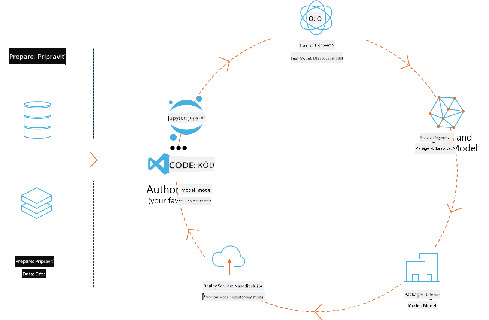
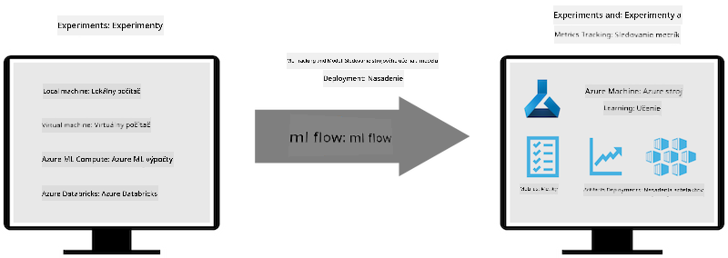
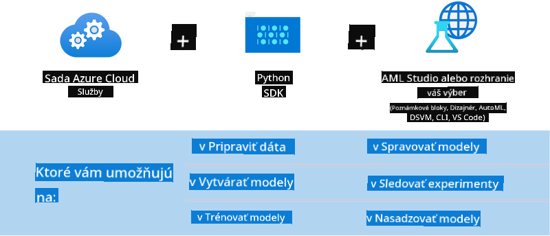

<!--
CO_OP_TRANSLATOR_METADATA:
{
  "original_hash": "f61c383bbf0c3dac97e43f833c258731",
  "translation_date": "2025-05-09T18:40:26+00:00",
  "source_file": "md/02.Application/01.TextAndChat/Phi3/E2E_Phi-3-MLflow.md",
  "language_code": "sk"
}
-->
# MLflow

[MLflow](https://mlflow.org/) je open-source platforma navrhnutá na riadenie celého životného cyklu strojového učenia.



MLFlow sa používa na správu životného cyklu ML, vrátane experimentovania, reprodukovateľnosti, nasadenia a centrálneho registra modelov. MLflow momentálne ponúka štyri komponenty.

- **MLflow Tracking:** Zaznamenávanie a vyhľadávanie experimentov, kódu, konfigurácie dát a výsledkov.
- **MLflow Projects:** Zabalenie dátovej vedy kódu do formátu, ktorý umožňuje reprodukovať behy na akejkoľvek platforme.
- **Mlflow Models:** Nasadenie modelov strojového učenia v rôznych prostrediach na servovanie.
- **Model Registry:** Ukladanie, anotovanie a správa modelov v centrálnej databáze.

Obsahuje funkcie na sledovanie experimentov, zabalenie kódu do reprodukovateľných behov a zdieľanie a nasadenie modelov. MLFlow je integrovaný v Databricks a podporuje rôzne knižnice ML, vďaka čomu je nezávislý na konkrétnej knižnici. Môže sa používať s akoukoľvek knižnicou strojového učenia a v ľubovoľnom programovacom jazyku, keďže poskytuje REST API a CLI pre pohodlie.



Kľúčové vlastnosti MLFlow zahŕňajú:

- **Sledovanie experimentov:** Zaznamenávanie a porovnávanie parametrov a výsledkov.
- **Správa modelov:** Nasadenie modelov na rôzne platformy servovania a inferencie.
- **Model Registry:** Spolupráca na správe životného cyklu MLflow modelov vrátane verziovania a anotácií.
- **Projekty:** Zabalenie ML kódu na zdieľanie alebo produkčné použitie.

MLFlow tiež podporuje MLOps cyklus, ktorý zahŕňa prípravu dát, registráciu a správu modelov, balenie modelov na spustenie, nasadenie služieb a monitorovanie modelov. Jeho cieľom je zjednodušiť prechod od prototypu k produkčnému workflow, najmä v cloudových a edge prostrediach.

## E2E Scenár - Vytvorenie wrappera a použitie Phi-3 ako MLFlow modelu

V tomto E2E príklade ukážeme dva rôzne prístupy k vytvoreniu wrappera okolo malého jazykového modelu Phi-3 (SLM) a jeho následné spustenie ako MLFlow modelu buď lokálne, alebo v cloude, napríklad v Azure Machine Learning workspace.



| Projekt | Popis | Umiestnenie |
| ------------ | ----------- | -------- |
| Transformer Pipeline | Transformer Pipeline je najjednoduchšia možnosť vytvoriť wrapper, ak chcete použiť HuggingFace model s experimentálnou podporou transformerov MLFlow. | [**TransformerPipeline.ipynb**](../../../../../../code/06.E2E/E2E_Phi-3-MLflow_TransformerPipeline.ipynb) |
| Custom Python Wrapper | V čase písania transformer pipeline nepodporovala generovanie MLFlow wrappera pre HuggingFace modely v ONNX formáte, dokonca ani s experimentálnym balíkom optimum Python. V takýchto prípadoch si môžete vytvoriť vlastný Python wrapper pre MLFlow model. | [**CustomPythonWrapper.ipynb**](../../../../../../code/06.E2E/E2E_Phi-3-MLflow_CustomPythonWrapper.ipynb) |

## Projekt: Transformer Pipeline

1. Budete potrebovať príslušné Python balíky z MLFlow a HuggingFace:

    ``` Python
    import mlflow
    import transformers
    ```

2. Ďalej by ste mali inicializovať transformer pipeline odkazom na cieľový Phi-3 model v HuggingFace registri. Ako je vidieť z modelovej karty _Phi-3-mini-4k-instruct_, jeho úloha je typu „Text Generation“:

    ``` Python
    pipeline = transformers.pipeline(
        task = "text-generation",
        model = "microsoft/Phi-3-mini-4k-instruct"
    )
    ```

3. Teraz môžete uložiť transformer pipeline modelu Phi-3 vo formáte MLFlow a zadať ďalšie detaily ako cieľová cesta artefaktov, špecifické nastavenia modelu a typ inference API:

    ``` Python
    model_info = mlflow.transformers.log_model(
        transformers_model = pipeline,
        artifact_path = "phi3-mlflow-model",
        model_config = model_config,
        task = "llm/v1/chat"
    )
    ```

## Projekt: Custom Python Wrapper

1. Tu môžeme využiť Microsoft API [ONNX Runtime generate()](https://github.com/microsoft/onnxruntime-genai) pre inferenciu ONNX modelu a kódovanie / dekódovanie tokenov. Pre cieľový výpočtový výkon vyberte balík _onnxruntime_genai_, v príklade nižšie je to CPU:

    ``` Python
    import mlflow
    from mlflow.models import infer_signature
    import onnxruntime_genai as og
    ```

1. Naša vlastná trieda implementuje dve metódy: _load_context()_ na inicializáciu **ONNX modelu** Phi-3 Mini 4K Instruct, **parametrov generátora** a **tokenizéra**; a _predict()_ na generovanie výstupných tokenov pre zadaný prompt:

    ``` Python
    class Phi3Model(mlflow.pyfunc.PythonModel):
        def load_context(self, context):
            # Retrieving model from the artifacts
            model_path = context.artifacts["phi3-mini-onnx"]
            model_options = {
                 "max_length": 300,
                 "temperature": 0.2,         
            }
        
            # Defining the model
            self.phi3_model = og.Model(model_path)
            self.params = og.GeneratorParams(self.phi3_model)
            self.params.set_search_options(**model_options)
            
            # Defining the tokenizer
            self.tokenizer = og.Tokenizer(self.phi3_model)
    
        def predict(self, context, model_input):
            # Retrieving prompt from the input
            prompt = model_input["prompt"][0]
            self.params.input_ids = self.tokenizer.encode(prompt)
    
            # Generating the model's response
            response = self.phi3_model.generate(self.params)
    
            return self.tokenizer.decode(response[0][len(self.params.input_ids):])
    ```

1. Teraz môžete použiť funkciu _mlflow.pyfunc.log_model()_ na vygenerovanie vlastného Python wrappera (vo formáte pickle) pre Phi-3 model spolu s originálnym ONNX modelom a potrebnými závislosťami:

    ``` Python
    model_info = mlflow.pyfunc.log_model(
        artifact_path = artifact_path,
        python_model = Phi3Model(),
        artifacts = {
            "phi3-mini-onnx": "cpu_and_mobile/cpu-int4-rtn-block-32-acc-level-4",
        },
        input_example = input_example,
        signature = infer_signature(input_example, ["Run"]),
        extra_pip_requirements = ["torch", "onnxruntime_genai", "numpy"],
    )
    ```

## Signatúry vygenerovaných MLFlow modelov

1. V kroku 3 projektu Transformer Pipeline vyššie sme nastavili úlohu MLFlow modelu na „_llm/v1/chat_“. Takýto parameter vygeneruje API wrapper modelu kompatibilný s OpenAI Chat API, ako je uvedené nižšie:

    ``` Python
    {inputs: 
      ['messages': Array({content: string (required), name: string (optional), role: string (required)}) (required), 'temperature': double (optional), 'max_tokens': long (optional), 'stop': Array(string) (optional), 'n': long (optional), 'stream': boolean (optional)],
    outputs: 
      ['id': string (required), 'object': string (required), 'created': long (required), 'model': string (required), 'choices': Array({finish_reason: string (required), index: long (required), message: {content: string (required), name: string (optional), role: string (required)} (required)}) (required), 'usage': {completion_tokens: long (required), prompt_tokens: long (required), total_tokens: long (required)} (required)],
    params: 
      None}
    ```

1. Výsledkom je, že môžete odoslať prompt v nasledujúcom formáte:

    ``` Python
    messages = [{"role": "user", "content": "What is the capital of Spain?"}]
    ```

1. Potom použite post-processing kompatibilný s OpenAI API, napríklad _response[0][‘choices’][0][‘message’][‘content’]_, na skrášlenie výstupu do takejto podoby:

    ``` JSON
    Question: What is the capital of Spain?
    
    Answer: The capital of Spain is Madrid. It is the largest city in Spain and serves as the political, economic, and cultural center of the country. Madrid is located in the center of the Iberian Peninsula and is known for its rich history, art, and architecture, including the Royal Palace, the Prado Museum, and the Plaza Mayor.
    
    Usage: {'prompt_tokens': 11, 'completion_tokens': 73, 'total_tokens': 84}
    ```

1. V kroku 3 projektu Custom Python Wrapper vyššie umožňujeme balíku MLFlow vygenerovať signatúru modelu z daného vstupného príkladu. Signatúra nášho MLFlow wrappera bude vyzerať takto:

    ``` Python
    {inputs: 
      ['prompt': string (required)],
    outputs: 
      [string (required)],
    params: 
      None}
    ```

1. Takže náš prompt musí obsahovať kľúč slovníka "prompt", podobne ako tu:

    ``` Python
    {"prompt": "<|system|>You are a stand-up comedian.<|end|><|user|>Tell me a joke about atom<|end|><|assistant|>",}
    ```

1. Výstup modelu bude následne poskytnutý vo formáte reťazca:

    ``` JSON
    Alright, here's a little atom-related joke for you!
    
    Why don't electrons ever play hide and seek with protons?
    
    Because good luck finding them when they're always "sharing" their electrons!
    
    Remember, this is all in good fun, and we're just having a little atomic-level humor!
    ```

**Vyhlásenie o zodpovednosti**:  
Tento dokument bol preložený pomocou AI prekladateľskej služby [Co-op Translator](https://github.com/Azure/co-op-translator). Hoci sa snažíme o presnosť, berte prosím na vedomie, že automatické preklady môžu obsahovať chyby alebo nepresnosti. Pôvodný dokument v jeho rodnom jazyku by mal byť považovaný za autoritatívny zdroj. Pre kritické informácie sa odporúča profesionálny ľudský preklad. Nie sme zodpovední za akékoľvek nedorozumenia alebo nesprávne interpretácie vyplývajúce z použitia tohto prekladu.